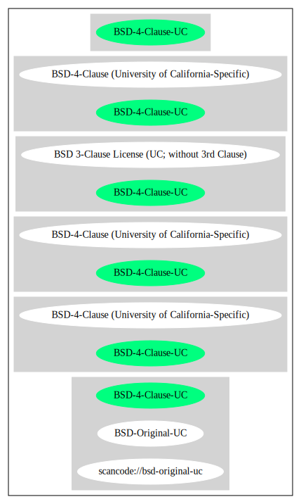

BSD-4-Clause (University of California-Specific) (BSD-4-Clause-UC)
==================================================================

[TABLE]

**Other Names:**

-   `scancode://bsd-original-uc`

-   `BSD-Original-UC`

Comments on (easy) usability
----------------------------

-   **↑**“Google Classification is NOTICE” (source: [Google OSS
    Policy](https://opensource.google.com/docs/thirdparty/licenses/ "Google OSS Policy"))

-   **↑**“Rating is: Bronze” (source: [BlueOak License
    List](https://blueoakcouncil.org/list "BlueOak License List"))

-   **↓**“Advertisement clause (3.) is complicated and prone to
    conflicts” (source: Override)

General Comments
----------------

-   “Per SPDX.org, this is the same license as the BSD-4-Clause, but
    with a copyright notice for the Regents of the University of
    California. Captures the retroactive deletion of the third
    (advertising) clause of the Original BSD license for BSD-licensed
    code developed by UC Berkeley and its contributors (see
    ftp://ftp.cs.berkeley.edu/pub/4bsd/README.Impt.License.Change) ”
    (source:
    [Scancode](https://github.com/nexB/scancode-toolkit/blob/develop/src/licensedcode/data/licenses/bsd-original-uc.yml "Scancode"))

URLs
----

-   **Homepage:**
    ftp://ftp.cs.berkeley.edu/pub/4bsd/README.Impt.License.Change

-   **SPDX:** http://spdx.org/licenses/BSD-4-Clause-UC.json

-   **SPDX:** https://spdx.org/licenses/BSD-4-Clause-UC.html

-   http://www.freebsd.org/copyright/license.html

-   http://www.fsf.org/licensing/essays/bsd.html

-   http://www.gnu.org/philosophy/bsd.html

OSADL Rule
----------

    USE CASE Source code delivery
    	YOU MUST Forward Copyright notices
    	YOU MUST Forward License text
    	YOU MUST Forward Warranty disclaimer
    	IF Advertisement
    		YOU MUST Credit In Advertisement Verbatim "This product includes software developed by the University of California, Berkeley and its contributors."
    	YOU MUST NOT Promote
    USE CASE Binary delivery
    	YOU MUST Provide Copyright notices In Documentation OR Distribution material
    	YOU MUST Provide License text In Documentation OR Distribution material
    	YOU MUST Provide Warranty disclaimer In Documentation OR Distribution material
    	IF Advertisement
    		YOU MUST Credit In Advertisement Verbatim "This product includes software developed by the University of California, Berkeley and its contributors."
    	YOU MUST NOT Promote

(source: OSADL License Checklist)

Text
----

    Redistribution and use in source and binary forms, with or without modification,
    are permitted provided that the following conditions are met:

       1. Redistributions of source code must retain the above copyright notice,
          this list of conditions and the following disclaimer.

       2. Redistributions in binary form must reproduce the above copyright notice,
          this list of conditions and the following disclaimer in the documentation
          and/or other materials provided with the distribution.

       3. <deleted>

       4. Neither the name of the University nor the names of its contributors may
          be used to endorse or promote products derived from this software without
          specific prior written permission.

    THIS SOFTWARE IS PROVIDED BY THE REGENTS AND CONTRIBUTORS ``AS IS'' AND ANY
    EXPRESS OR IMPLIED WARRANTIES, INCLUDING, BUT NOT LIMITED TO, THE IMPLIED
    WARRANTIES OF MERCHANTABILITY AND FITNESS FOR A PARTICULAR PURPOSE ARE
    DISCLAIMED. IN NO EVENT SHALL THE REGENTS OR CONTRIBUTORS BE LIABLE FOR ANY
    DIRECT, INDIRECT, INCIDENTAL, SPECIAL, EXEMPLARY, OR CONSEQUENTIAL DAMAGES
    (INCLUDING, BUT NOT LIMITED TO, PROCUREMENT OF SUBSTITUTE GOODS OR SERVICES;
    LOSS OF USE, DATA, OR PROFITS; OR BUSINESS INTERRUPTION) HOWEVER CAUSED AND ON
    ANY THEORY OF LIABILITY, WHETHER IN CONTRACT, STRICT LIABILITY, OR TORT
    (INCLUDING NEGLIGENCE OR OTHERWISE) ARISING IN ANY WAY OUT OF THE USE OF THIS
    SOFTWARE, EVEN IF ADVISED OF THE POSSIBILITY OF SUCH DAMAGE.

    On on July 22 1999, per notice reproduced below, the advertising clause (clause
    3) of this license was officially rescinded by the Director of the Office of
    Technology Licensing of the University of California.

    This applies only to BSD Unix files copyrighted by the Regents of the University
    of California under this license.

    From: ftp://ftp.cs.berkeley.edu/pub/4bsd/README.Impt.License.Change :

    "July 22, 1999

    To All Licensees, Distributors of Any Version of BSD:

    As you know, certain of the Berkeley Software Distribution ("BSD") source
    code files require that further distributions of products containing all or
    portions of the software, acknowledge within their advertising materials
    that such products contain software developed by UC Berkeley and its
    contributors.

    Specifically, the provision reads:

    "     * 3. All advertising materials mentioning features or use of this software
          *    must display the following acknowledgement:
          *    This product includes software developed by the University of
          *    California, Berkeley and its contributors."

    Effective immediately, licensees and distributors are no longer required to
    include the acknowledgement within advertising materials.  Accordingly, the
    foregoing paragraph of those BSD Unix files containing it is hereby deleted
    in its entirety.

    William Hoskins
    Director, Office of Technology Licensing
    University of California, Berkeley"

    Note also that in many variants of this original BSD license, both occurrences
    of the phrase "REGENTS AND CONTRIBUTORS" is replaced in the disclaimer section
    by "COPYRIGHT HOLDERS AND CONTRIBUTORS".

------------------------------------------------------------------------

Raw Data
--------

    {
        "__impliedNames": [
            "BSD-4-Clause-UC",
            "BSD-4-Clause (University of California-Specific)",
            "scancode://bsd-original-uc",
            "BSD-Original-UC"
        ],
        "__impliedId": "BSD-4-Clause-UC",
        "__impliedRatingState": [
            [
                "Override",
                {
                    "tag": "RatingState",
                    "contents": [
                        false,
                        true,
                        true,
                        true
                    ]
                }
            ]
        ],
        "__impliedComments": [
            [
                "Scancode",
                [
                    "Per SPDX.org, this is the same license as the BSD-4-Clause, but with a\ncopyright notice for the Regents of the University of California. Captures\nthe retroactive deletion of the third (advertising) clause of the Original\nBSD license for BSD-licensed code developed by UC Berkeley and its\ncontributors (see\nftp://ftp.cs.berkeley.edu/pub/4bsd/README.Impt.License.Change)\n"
                ]
            ]
        ],
        "facts": {
            "SPDX": {
                "isSPDXLicenseDeprecated": false,
                "spdxFullName": "BSD-4-Clause (University of California-Specific)",
                "spdxDetailsURL": "http://spdx.org/licenses/BSD-4-Clause-UC.json",
                "_sourceURL": "https://spdx.org/licenses/BSD-4-Clause-UC.html",
                "spdxLicIsOSIApproved": false,
                "spdxSeeAlso": [
                    "http://www.freebsd.org/copyright/license.html"
                ],
                "_implications": {
                    "__impliedNames": [
                        "BSD-4-Clause-UC",
                        "BSD-4-Clause (University of California-Specific)"
                    ],
                    "__impliedId": "BSD-4-Clause-UC",
                    "__isOsiApproved": false,
                    "__impliedURLs": [
                        [
                            "SPDX",
                            "http://spdx.org/licenses/BSD-4-Clause-UC.json"
                        ],
                        [
                            null,
                            "http://www.freebsd.org/copyright/license.html"
                        ]
                    ]
                },
                "spdxLicenseId": "BSD-4-Clause-UC"
            },
            "OSADL License Checklist": {
                "_sourceURL": "https://www.osadl.org/fileadmin/checklists/unreflicenses/BSD-4-Clause-UC.txt",
                "spdxId": "BSD-4-Clause-UC",
                "osadlRule": "USE CASE Source code delivery\n\tYOU MUST Forward Copyright notices\n\tYOU MUST Forward License text\n\tYOU MUST Forward Warranty disclaimer\n\tIF Advertisement\r\n\t\tYOU MUST Credit In Advertisement Verbatim \"This product includes software developed by the University of California, Berkeley and its contributors.\"\n\tYOU MUST NOT Promote\nUSE CASE Binary delivery\n\tYOU MUST Provide Copyright notices In Documentation OR Distribution material\n\tYOU MUST Provide License text In Documentation OR Distribution material\n\tYOU MUST Provide Warranty disclaimer In Documentation OR Distribution material\n\tIF Advertisement\r\n\t\tYOU MUST Credit In Advertisement Verbatim \"This product includes software developed by the University of California, Berkeley and its contributors.\"\n\tYOU MUST NOT Promote\n",
                "_implications": {
                    "__impliedNames": [
                        "BSD-4-Clause-UC"
                    ]
                }
            },
            "Scancode": {
                "otherUrls": [
                    "http://www.freebsd.org/copyright/license.html",
                    "http://www.fsf.org/licensing/essays/bsd.html",
                    "http://www.gnu.org/philosophy/bsd.html"
                ],
                "homepageUrl": "ftp://ftp.cs.berkeley.edu/pub/4bsd/README.Impt.License.Change",
                "shortName": "BSD-Original-UC",
                "textUrls": null,
                "text": "Redistribution and use in source and binary forms, with or without modification,\nare permitted provided that the following conditions are met:\n\n   1. Redistributions of source code must retain the above copyright notice,\n      this list of conditions and the following disclaimer.\n\n   2. Redistributions in binary form must reproduce the above copyright notice,\n      this list of conditions and the following disclaimer in the documentation\n      and/or other materials provided with the distribution.\n\n   3. <deleted>\n\n   4. Neither the name of the University nor the names of its contributors may\n      be used to endorse or promote products derived from this software without\n      specific prior written permission.\n\nTHIS SOFTWARE IS PROVIDED BY THE REGENTS AND CONTRIBUTORS ``AS IS'' AND ANY\nEXPRESS OR IMPLIED WARRANTIES, INCLUDING, BUT NOT LIMITED TO, THE IMPLIED\nWARRANTIES OF MERCHANTABILITY AND FITNESS FOR A PARTICULAR PURPOSE ARE\nDISCLAIMED. IN NO EVENT SHALL THE REGENTS OR CONTRIBUTORS BE LIABLE FOR ANY\nDIRECT, INDIRECT, INCIDENTAL, SPECIAL, EXEMPLARY, OR CONSEQUENTIAL DAMAGES\n(INCLUDING, BUT NOT LIMITED TO, PROCUREMENT OF SUBSTITUTE GOODS OR SERVICES;\nLOSS OF USE, DATA, OR PROFITS; OR BUSINESS INTERRUPTION) HOWEVER CAUSED AND ON\nANY THEORY OF LIABILITY, WHETHER IN CONTRACT, STRICT LIABILITY, OR TORT\n(INCLUDING NEGLIGENCE OR OTHERWISE) ARISING IN ANY WAY OUT OF THE USE OF THIS\nSOFTWARE, EVEN IF ADVISED OF THE POSSIBILITY OF SUCH DAMAGE.\n\nOn on July 22 1999, per notice reproduced below, the advertising clause (clause\n3) of this license was officially rescinded by the Director of the Office of\nTechnology Licensing of the University of California.\n\nThis applies only to BSD Unix files copyrighted by the Regents of the University\nof California under this license.\n\nFrom: ftp://ftp.cs.berkeley.edu/pub/4bsd/README.Impt.License.Change :\n\n\"July 22, 1999\n\nTo All Licensees, Distributors of Any Version of BSD:\n\nAs you know, certain of the Berkeley Software Distribution (\"BSD\") source\ncode files require that further distributions of products containing all or\nportions of the software, acknowledge within their advertising materials\nthat such products contain software developed by UC Berkeley and its\ncontributors.\n\nSpecifically, the provision reads:\n\n\"     * 3. All advertising materials mentioning features or use of this software\n      *    must display the following acknowledgement:\n      *    This product includes software developed by the University of\n      *    California, Berkeley and its contributors.\"\n\nEffective immediately, licensees and distributors are no longer required to\ninclude the acknowledgement within advertising materials.  Accordingly, the\nforegoing paragraph of those BSD Unix files containing it is hereby deleted\nin its entirety.\n\nWilliam Hoskins\nDirector, Office of Technology Licensing\nUniversity of California, Berkeley\"\n\nNote also that in many variants of this original BSD license, both occurrences\nof the phrase \"REGENTS AND CONTRIBUTORS\" is replaced in the disclaimer section\nby \"COPYRIGHT HOLDERS AND CONTRIBUTORS\".",
                "category": "Permissive",
                "osiUrl": null,
                "owner": "Regents of the University of California",
                "_sourceURL": "https://github.com/nexB/scancode-toolkit/blob/develop/src/licensedcode/data/licenses/bsd-original-uc.yml",
                "key": "bsd-original-uc",
                "name": "BSD-Original-UC",
                "spdxId": "BSD-4-Clause-UC",
                "notes": "Per SPDX.org, this is the same license as the BSD-4-Clause, but with a\ncopyright notice for the Regents of the University of California. Captures\nthe retroactive deletion of the third (advertising) clause of the Original\nBSD license for BSD-licensed code developed by UC Berkeley and its\ncontributors (see\nftp://ftp.cs.berkeley.edu/pub/4bsd/README.Impt.License.Change)\n",
                "_implications": {
                    "__impliedNames": [
                        "scancode://bsd-original-uc",
                        "BSD-Original-UC",
                        "BSD-4-Clause-UC"
                    ],
                    "__impliedId": "BSD-4-Clause-UC",
                    "__impliedComments": [
                        [
                            "Scancode",
                            [
                                "Per SPDX.org, this is the same license as the BSD-4-Clause, but with a\ncopyright notice for the Regents of the University of California. Captures\nthe retroactive deletion of the third (advertising) clause of the Original\nBSD license for BSD-licensed code developed by UC Berkeley and its\ncontributors (see\nftp://ftp.cs.berkeley.edu/pub/4bsd/README.Impt.License.Change)\n"
                            ]
                        ]
                    ],
                    "__impliedCopyleft": [
                        [
                            "Scancode",
                            "NoCopyleft"
                        ]
                    ],
                    "__calculatedCopyleft": "NoCopyleft",
                    "__impliedText": "Redistribution and use in source and binary forms, with or without modification,\nare permitted provided that the following conditions are met:\n\n   1. Redistributions of source code must retain the above copyright notice,\n      this list of conditions and the following disclaimer.\n\n   2. Redistributions in binary form must reproduce the above copyright notice,\n      this list of conditions and the following disclaimer in the documentation\n      and/or other materials provided with the distribution.\n\n   3. <deleted>\n\n   4. Neither the name of the University nor the names of its contributors may\n      be used to endorse or promote products derived from this software without\n      specific prior written permission.\n\nTHIS SOFTWARE IS PROVIDED BY THE REGENTS AND CONTRIBUTORS ``AS IS'' AND ANY\nEXPRESS OR IMPLIED WARRANTIES, INCLUDING, BUT NOT LIMITED TO, THE IMPLIED\nWARRANTIES OF MERCHANTABILITY AND FITNESS FOR A PARTICULAR PURPOSE ARE\nDISCLAIMED. IN NO EVENT SHALL THE REGENTS OR CONTRIBUTORS BE LIABLE FOR ANY\nDIRECT, INDIRECT, INCIDENTAL, SPECIAL, EXEMPLARY, OR CONSEQUENTIAL DAMAGES\n(INCLUDING, BUT NOT LIMITED TO, PROCUREMENT OF SUBSTITUTE GOODS OR SERVICES;\nLOSS OF USE, DATA, OR PROFITS; OR BUSINESS INTERRUPTION) HOWEVER CAUSED AND ON\nANY THEORY OF LIABILITY, WHETHER IN CONTRACT, STRICT LIABILITY, OR TORT\n(INCLUDING NEGLIGENCE OR OTHERWISE) ARISING IN ANY WAY OUT OF THE USE OF THIS\nSOFTWARE, EVEN IF ADVISED OF THE POSSIBILITY OF SUCH DAMAGE.\n\nOn on July 22 1999, per notice reproduced below, the advertising clause (clause\n3) of this license was officially rescinded by the Director of the Office of\nTechnology Licensing of the University of California.\n\nThis applies only to BSD Unix files copyrighted by the Regents of the University\nof California under this license.\n\nFrom: ftp://ftp.cs.berkeley.edu/pub/4bsd/README.Impt.License.Change :\n\n\"July 22, 1999\n\nTo All Licensees, Distributors of Any Version of BSD:\n\nAs you know, certain of the Berkeley Software Distribution (\"BSD\") source\ncode files require that further distributions of products containing all or\nportions of the software, acknowledge within their advertising materials\nthat such products contain software developed by UC Berkeley and its\ncontributors.\n\nSpecifically, the provision reads:\n\n\"     * 3. All advertising materials mentioning features or use of this software\n      *    must display the following acknowledgement:\n      *    This product includes software developed by the University of\n      *    California, Berkeley and its contributors.\"\n\nEffective immediately, licensees and distributors are no longer required to\ninclude the acknowledgement within advertising materials.  Accordingly, the\nforegoing paragraph of those BSD Unix files containing it is hereby deleted\nin its entirety.\n\nWilliam Hoskins\nDirector, Office of Technology Licensing\nUniversity of California, Berkeley\"\n\nNote also that in many variants of this original BSD license, both occurrences\nof the phrase \"REGENTS AND CONTRIBUTORS\" is replaced in the disclaimer section\nby \"COPYRIGHT HOLDERS AND CONTRIBUTORS\".",
                    "__impliedURLs": [
                        [
                            "Homepage",
                            "ftp://ftp.cs.berkeley.edu/pub/4bsd/README.Impt.License.Change"
                        ],
                        [
                            null,
                            "http://www.freebsd.org/copyright/license.html"
                        ],
                        [
                            null,
                            "http://www.fsf.org/licensing/essays/bsd.html"
                        ],
                        [
                            null,
                            "http://www.gnu.org/philosophy/bsd.html"
                        ]
                    ]
                }
            },
            "Override": {
                "oNonCommecrial": null,
                "implications": {
                    "__impliedNames": [
                        "BSD-4-Clause-UC"
                    ],
                    "__impliedId": "BSD-4-Clause-UC",
                    "__impliedRatingState": [
                        [
                            "Override",
                            {
                                "tag": "RatingState",
                                "contents": [
                                    false,
                                    true,
                                    true,
                                    true
                                ]
                            }
                        ]
                    ],
                    "__impliedJudgement": [
                        [
                            "Override",
                            {
                                "tag": "NegativeJudgement",
                                "contents": "Advertisement clause (3.) is complicated and prone to conflicts"
                            }
                        ]
                    ]
                },
                "oName": "BSD-4-Clause-UC",
                "oOtherLicenseIds": [],
                "oDescription": null,
                "oJudgement": {
                    "tag": "NegativeJudgement",
                    "contents": "Advertisement clause (3.) is complicated and prone to conflicts"
                },
                "oCompatibilities": null,
                "oRatingState": {
                    "tag": "RatingState",
                    "contents": [
                        false,
                        true,
                        true,
                        true
                    ]
                }
            },
            "BlueOak License List": {
                "BlueOakRating": "Bronze",
                "url": "https://spdx.org/licenses/BSD-4-Clause-UC.html",
                "isPermissive": true,
                "_sourceURL": "https://blueoakcouncil.org/list",
                "name": "BSD-4-Clause (University of California-Specific)",
                "id": "BSD-4-Clause-UC",
                "_implications": {
                    "__impliedNames": [
                        "BSD-4-Clause-UC",
                        "BSD-4-Clause (University of California-Specific)"
                    ],
                    "__impliedJudgement": [
                        [
                            "BlueOak License List",
                            {
                                "tag": "PositiveJudgement",
                                "contents": "Rating is: Bronze"
                            }
                        ]
                    ],
                    "__impliedCopyleft": [
                        [
                            "BlueOak License List",
                            "NoCopyleft"
                        ]
                    ],
                    "__calculatedCopyleft": "NoCopyleft",
                    "__impliedURLs": [
                        [
                            "SPDX",
                            "https://spdx.org/licenses/BSD-4-Clause-UC.html"
                        ]
                    ]
                }
            },
            "finos/OSLC-handbook": {
                "terms": [
                    {
                        "termUseCases": [
                            "UB",
                            "MB",
                            "US",
                            "MS"
                        ],
                        "termSeeAlso": null,
                        "termDescription": "Provide copy of license",
                        "termComplianceNotes": "For binary distributions, this information must be provided in “the documentation and/or other materials provided with the distribution”",
                        "termType": "condition"
                    },
                    {
                        "termUseCases": [
                            "UB",
                            "MB",
                            "US",
                            "MS"
                        ],
                        "termSeeAlso": null,
                        "termDescription": "Provide copyright notice",
                        "termComplianceNotes": "For binary distributions, this information must be provided in “the documentation and/or other materials provided with the distribution”",
                        "termType": "condition"
                    }
                ],
                "_sourceURL": "https://github.com/finos/OSLC-handbook/blob/master/src/BSD-4-Clause-UC.yaml",
                "name": "BSD-4-Clause (University of California-Specific)",
                "nameFromFilename": "BSD-4-Clause-UC",
                "notes": "The advertising clause was rescinded by the University of California in 1999 for all material under BSD-4-Clause with University of California copyright notice. Thus, you do not need to comply with the advertising/acknowledgment requirement, which makes the license essentially BSD-3-Clause.",
                "_implications": {
                    "__impliedNames": [
                        "BSD-4-Clause-UC",
                        "BSD-4-Clause (University of California-Specific)"
                    ]
                },
                "licenseId": [
                    "BSD-4-Clause-UC",
                    "BSD-4-Clause (University of California-Specific)"
                ]
            },
            "Google OSS Policy": {
                "rating": "NOTICE",
                "_sourceURL": "https://opensource.google.com/docs/thirdparty/licenses/",
                "id": "BSD-4-Clause-UC",
                "_implications": {
                    "__impliedNames": [
                        "BSD-4-Clause-UC"
                    ],
                    "__impliedJudgement": [
                        [
                            "Google OSS Policy",
                            {
                                "tag": "PositiveJudgement",
                                "contents": "Google Classification is NOTICE"
                            }
                        ]
                    ],
                    "__impliedCopyleft": [
                        [
                            "Google OSS Policy",
                            "NoCopyleft"
                        ]
                    ],
                    "__calculatedCopyleft": "NoCopyleft"
                }
            }
        },
        "__impliedJudgement": [
            [
                "BlueOak License List",
                {
                    "tag": "PositiveJudgement",
                    "contents": "Rating is: Bronze"
                }
            ],
            [
                "Google OSS Policy",
                {
                    "tag": "PositiveJudgement",
                    "contents": "Google Classification is NOTICE"
                }
            ],
            [
                "Override",
                {
                    "tag": "NegativeJudgement",
                    "contents": "Advertisement clause (3.) is complicated and prone to conflicts"
                }
            ]
        ],
        "__impliedCopyleft": [
            [
                "BlueOak License List",
                "NoCopyleft"
            ],
            [
                "Google OSS Policy",
                "NoCopyleft"
            ],
            [
                "Scancode",
                "NoCopyleft"
            ]
        ],
        "__calculatedCopyleft": "NoCopyleft",
        "__isOsiApproved": false,
        "__impliedText": "Redistribution and use in source and binary forms, with or without modification,\nare permitted provided that the following conditions are met:\n\n   1. Redistributions of source code must retain the above copyright notice,\n      this list of conditions and the following disclaimer.\n\n   2. Redistributions in binary form must reproduce the above copyright notice,\n      this list of conditions and the following disclaimer in the documentation\n      and/or other materials provided with the distribution.\n\n   3. <deleted>\n\n   4. Neither the name of the University nor the names of its contributors may\n      be used to endorse or promote products derived from this software without\n      specific prior written permission.\n\nTHIS SOFTWARE IS PROVIDED BY THE REGENTS AND CONTRIBUTORS ``AS IS'' AND ANY\nEXPRESS OR IMPLIED WARRANTIES, INCLUDING, BUT NOT LIMITED TO, THE IMPLIED\nWARRANTIES OF MERCHANTABILITY AND FITNESS FOR A PARTICULAR PURPOSE ARE\nDISCLAIMED. IN NO EVENT SHALL THE REGENTS OR CONTRIBUTORS BE LIABLE FOR ANY\nDIRECT, INDIRECT, INCIDENTAL, SPECIAL, EXEMPLARY, OR CONSEQUENTIAL DAMAGES\n(INCLUDING, BUT NOT LIMITED TO, PROCUREMENT OF SUBSTITUTE GOODS OR SERVICES;\nLOSS OF USE, DATA, OR PROFITS; OR BUSINESS INTERRUPTION) HOWEVER CAUSED AND ON\nANY THEORY OF LIABILITY, WHETHER IN CONTRACT, STRICT LIABILITY, OR TORT\n(INCLUDING NEGLIGENCE OR OTHERWISE) ARISING IN ANY WAY OUT OF THE USE OF THIS\nSOFTWARE, EVEN IF ADVISED OF THE POSSIBILITY OF SUCH DAMAGE.\n\nOn on July 22 1999, per notice reproduced below, the advertising clause (clause\n3) of this license was officially rescinded by the Director of the Office of\nTechnology Licensing of the University of California.\n\nThis applies only to BSD Unix files copyrighted by the Regents of the University\nof California under this license.\n\nFrom: ftp://ftp.cs.berkeley.edu/pub/4bsd/README.Impt.License.Change :\n\n\"July 22, 1999\n\nTo All Licensees, Distributors of Any Version of BSD:\n\nAs you know, certain of the Berkeley Software Distribution (\"BSD\") source\ncode files require that further distributions of products containing all or\nportions of the software, acknowledge within their advertising materials\nthat such products contain software developed by UC Berkeley and its\ncontributors.\n\nSpecifically, the provision reads:\n\n\"     * 3. All advertising materials mentioning features or use of this software\n      *    must display the following acknowledgement:\n      *    This product includes software developed by the University of\n      *    California, Berkeley and its contributors.\"\n\nEffective immediately, licensees and distributors are no longer required to\ninclude the acknowledgement within advertising materials.  Accordingly, the\nforegoing paragraph of those BSD Unix files containing it is hereby deleted\nin its entirety.\n\nWilliam Hoskins\nDirector, Office of Technology Licensing\nUniversity of California, Berkeley\"\n\nNote also that in many variants of this original BSD license, both occurrences\nof the phrase \"REGENTS AND CONTRIBUTORS\" is replaced in the disclaimer section\nby \"COPYRIGHT HOLDERS AND CONTRIBUTORS\".",
        "__impliedURLs": [
            [
                "SPDX",
                "http://spdx.org/licenses/BSD-4-Clause-UC.json"
            ],
            [
                null,
                "http://www.freebsd.org/copyright/license.html"
            ],
            [
                "SPDX",
                "https://spdx.org/licenses/BSD-4-Clause-UC.html"
            ],
            [
                "Homepage",
                "ftp://ftp.cs.berkeley.edu/pub/4bsd/README.Impt.License.Change"
            ],
            [
                null,
                "http://www.fsf.org/licensing/essays/bsd.html"
            ],
            [
                null,
                "http://www.gnu.org/philosophy/bsd.html"
            ]
        ]
    }

------------------------------------------------------------------------

Dot Cluster Graph
-----------------

