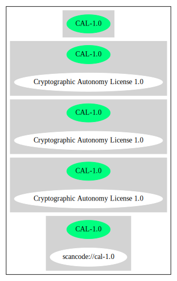

Cryptographic Autonomy License 1.0 (CAL-1.0)
============================================

[TABLE]

Comments on (easy) usability
----------------------------

-   **↑**“Is OSI Approved” (source:
    [SPDX](https://spdx.org/licenses/CAL-1.0.html "SPDX"))

General Comments
----------------

URLs
----

-   **SPDX:** http://spdx.org/licenses/CAL-1.0.json

-   http://cryptographicautonomylicense.com/license-text.html

-   https://opensource.org/licenses/CAL-1.0

-   https://spdx.org/licenses/CAL-1.0.html

------------------------------------------------------------------------

Raw Data
--------

    {
        "__impliedNames": [
            "CAL-1.0",
            "Cryptographic Autonomy License 1.0"
        ],
        "__impliedId": "CAL-1.0",
        "__impliedAmbiguousNames": [
            "Cryptographic Autonomy License"
        ],
        "facts": {
            "SPDX": {
                "isSPDXLicenseDeprecated": false,
                "spdxFullName": "Cryptographic Autonomy License 1.0",
                "spdxDetailsURL": "http://spdx.org/licenses/CAL-1.0.json",
                "_sourceURL": "https://spdx.org/licenses/CAL-1.0.html",
                "spdxLicIsOSIApproved": true,
                "spdxSeeAlso": [
                    "http://cryptographicautonomylicense.com/license-text.html",
                    "https://opensource.org/licenses/CAL-1.0"
                ],
                "_implications": {
                    "__impliedNames": [
                        "CAL-1.0",
                        "Cryptographic Autonomy License 1.0"
                    ],
                    "__impliedId": "CAL-1.0",
                    "__impliedJudgement": [
                        [
                            "SPDX",
                            {
                                "tag": "PositiveJudgement",
                                "contents": "Is OSI Approved"
                            }
                        ]
                    ],
                    "__isOsiApproved": true,
                    "__impliedURLs": [
                        [
                            "SPDX",
                            "http://spdx.org/licenses/CAL-1.0.json"
                        ],
                        [
                            null,
                            "http://cryptographicautonomylicense.com/license-text.html"
                        ],
                        [
                            null,
                            "https://opensource.org/licenses/CAL-1.0"
                        ]
                    ]
                },
                "spdxLicenseId": "CAL-1.0"
            },
            "BlueOak License List": {
                "url": "https://spdx.org/licenses/CAL-1.0.html",
                "familyName": "Cryptographic Autonomy License",
                "_sourceURL": "https://blueoakcouncil.org/copyleft",
                "name": "Cryptographic Autonomy License 1.0",
                "id": "CAL-1.0",
                "_implications": {
                    "__impliedNames": [
                        "CAL-1.0",
                        "Cryptographic Autonomy License 1.0"
                    ],
                    "__impliedAmbiguousNames": [
                        "Cryptographic Autonomy License"
                    ],
                    "__impliedCopyleft": [
                        [
                            "BlueOak License List",
                            "MaximalCopyleft"
                        ]
                    ],
                    "__calculatedCopyleft": "MaximalCopyleft",
                    "__impliedURLs": [
                        [
                            null,
                            "https://spdx.org/licenses/CAL-1.0.html"
                        ]
                    ]
                },
                "CopyleftKind": "MaximalCopyleft"
            }
        },
        "__impliedJudgement": [
            [
                "SPDX",
                {
                    "tag": "PositiveJudgement",
                    "contents": "Is OSI Approved"
                }
            ]
        ],
        "__impliedCopyleft": [
            [
                "BlueOak License List",
                "MaximalCopyleft"
            ]
        ],
        "__calculatedCopyleft": "MaximalCopyleft",
        "__isOsiApproved": true,
        "__impliedURLs": [
            [
                "SPDX",
                "http://spdx.org/licenses/CAL-1.0.json"
            ],
            [
                null,
                "http://cryptographicautonomylicense.com/license-text.html"
            ],
            [
                null,
                "https://opensource.org/licenses/CAL-1.0"
            ],
            [
                null,
                "https://spdx.org/licenses/CAL-1.0.html"
            ]
        ]
    }

------------------------------------------------------------------------

Dot Cluster Graph
-----------------

