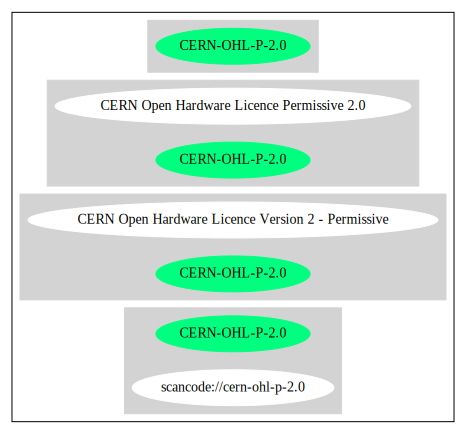

CERN Open Hardware Licence Version 2 - Permissive (CERN-OHL-P-2.0)
==================================================================

[TABLE]

Comments on (easy) usability
----------------------------

General Comments
----------------

URLs
----

-   **SPDX:** http://spdx.org/licenses/CERN-OHL-P-2.0.json

-   https://www.ohwr.org/project/cernohl/wikis/Documents/CERN-OHL-version-2

------------------------------------------------------------------------

Raw Data
--------

-   SPDX

&nbsp;

    {
        "__impliedNames": [
            "CERN-OHL-P-2.0",
            "CERN Open Hardware Licence Version 2 - Permissive"
        ],
        "__impliedId": "CERN-OHL-P-2.0",
        "facts": {
            "SPDX": {
                "isSPDXLicenseDeprecated": false,
                "spdxFullName": "CERN Open Hardware Licence Version 2 - Permissive",
                "spdxDetailsURL": "http://spdx.org/licenses/CERN-OHL-P-2.0.json",
                "_sourceURL": "https://spdx.org/licenses/CERN-OHL-P-2.0.html",
                "spdxLicIsOSIApproved": false,
                "spdxSeeAlso": [
                    "https://www.ohwr.org/project/cernohl/wikis/Documents/CERN-OHL-version-2"
                ],
                "_implications": {
                    "__impliedNames": [
                        "CERN-OHL-P-2.0",
                        "CERN Open Hardware Licence Version 2 - Permissive"
                    ],
                    "__impliedId": "CERN-OHL-P-2.0",
                    "__isOsiApproved": false,
                    "__impliedURLs": [
                        [
                            "SPDX",
                            "http://spdx.org/licenses/CERN-OHL-P-2.0.json"
                        ],
                        [
                            null,
                            "https://www.ohwr.org/project/cernohl/wikis/Documents/CERN-OHL-version-2"
                        ]
                    ]
                },
                "spdxLicenseId": "CERN-OHL-P-2.0"
            }
        },
        "__isOsiApproved": false,
        "__impliedURLs": [
            [
                "SPDX",
                "http://spdx.org/licenses/CERN-OHL-P-2.0.json"
            ],
            [
                null,
                "https://www.ohwr.org/project/cernohl/wikis/Documents/CERN-OHL-version-2"
            ]
        ]
    }

------------------------------------------------------------------------

Dot Cluster Graph
-----------------

