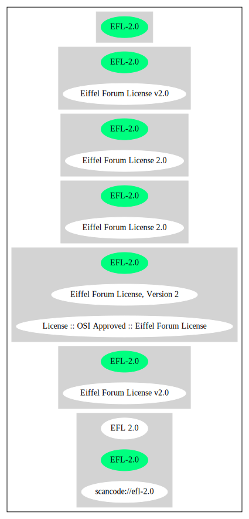

Eiffel Forum License v2.0 (EFL-2.0)
===================================

[TABLE]

**Other Names:**

-   `scancode://efl-2.0`

-   `EFL 2.0`

-   `Eiffel Forum License, Version 2`

-   `License :: OSI Approved :: Eiffel Forum License`

-   `Eiffel Forum License 2.0`

Comments on (easy) usability
----------------------------

-   **↑**“Is OSI Approved” (source:
    [SPDX](https://spdx.org/licenses/EFL-2.0.html "SPDX"))

-   **↓**“Rating is: Lead” (source: [BlueOak License
    List](https://blueoakcouncil.org/list "BlueOak License List"))

General Comments
----------------

-   “Per SPDX.org, this license is OSI certified” (source:
    [Scancode](https://github.com/nexB/scancode-toolkit/blob/develop/src/licensedcode/data/licenses/efl-2.0.yml "Scancode"))

URLs
----

-   **Homepage:** http://www.eiffel-nice.org/license/

-   **OSI Page:** http://www.opensource.org/licenses/ver2\_eiffel.php

-   **OSI Page:** https://opensource.org/licenses/EFL-2.0

-   **SPDX:** http://spdx.org/licenses/EFL-2.0.json

-   **SPDX:** https://spdx.org/licenses/EFL-2.0.html

-   http://www.eiffel-nice.org/license/eiffel-forum-license-2.html

-   http://amalasoft.com/downloads/ael/ds/LICENSE.txt

-   http://en.wikipedia.org/wiki/Eiffel\_Forum\_License

OSADL Rule
----------

    USE CASE Source code delivery OR Binary delivery
    	YOU MUST Forward Copyright notices
    	YOU MUST Forward License text

(source: OSADL License Checklist)

Text
----

    Eiffel Forum License, version 2

       1. Permission is hereby granted to use, copy, modify and/or
          distribute this package, provided that:
              * copyright notices are retained unchanged,
              * any distribution of this package, whether modified or not,
          includes this license text.
       2. Permission is hereby also granted to distribute binary programs
          which depend on this package. If the binary program depends on a
          modified version of this package, you are encouraged to publicly
          release the modified version of this package.

    ***********************

    THIS PACKAGE IS PROVIDED "AS IS" AND WITHOUT WARRANTY. ANY EXPRESS OR
    IMPLIED WARRANTIES, INCLUDING, BUT NOT LIMITED TO, THE IMPLIED
    WARRANTIES OF MERCHANTABILITY AND FITNESS FOR A PARTICULAR PURPOSE ARE
    DISCLAIMED. IN NO EVENT SHALL THE AUTHORS BE LIABLE TO ANY PARTY FOR ANY
    DIRECT, INDIRECT, INCIDENTAL, SPECIAL, EXEMPLARY, OR CONSEQUENTIAL
    DAMAGES ARISING IN ANY WAY OUT OF THE USE OF THIS PACKAGE.

    ***********************

------------------------------------------------------------------------

Raw Data
--------

-   [SPDX](https://spdx.org/licenses/EFL-2.0.html "SPDX")

-   [BlueOak License
    List](https://blueoakcouncil.org/list "BlueOak License List")

-   [OpenChainPolicyTemplate](https://github.com/OpenChain-Project/curriculum/raw/ddf1e879341adbd9b297cd67c5d5c16b2076540b/policy-template/Open%20Source%20Policy%20Template%20for%20OpenChain%20Specification%201.2.ods "OpenChainPolicyTemplate")

-   [Scancode](https://github.com/nexB/scancode-toolkit/blob/develop/src/licensedcode/data/licenses/efl-2.0.yml "Scancode")

-   [OSADL License
    Checklist](https://www.osadl.org/fileadmin/checklists/unreflicenses/EFL-2.0.txt "OSADL License Checklist")

-   [OpenSourceInitiative](https://opensource.org/licenses/ "OpenSourceInitiative")

-   [Open Knowledge
    International](https://github.com/okfn/licenses/blob/master/licenses.csv "Open Knowledge International")

&nbsp;

    {
        "__impliedNames": [
            "EFL-2.0",
            "Eiffel Forum License v2.0",
            "scancode://efl-2.0",
            "EFL 2.0",
            "Eiffel Forum License, Version 2",
            "License :: OSI Approved :: Eiffel Forum License",
            "Eiffel Forum License 2.0"
        ],
        "__impliedId": "EFL-2.0",
        "__impliedComments": [
            [
                "Scancode",
                [
                    "Per SPDX.org, this license is OSI certified"
                ]
            ]
        ],
        "facts": {
            "Open Knowledge International": {
                "is_generic": null,
                "status": "active",
                "domain_software": true,
                "url": "https://opensource.org/licenses/EFL-2.0",
                "maintainer": "",
                "od_conformance": "not reviewed",
                "_sourceURL": "https://github.com/okfn/licenses/blob/master/licenses.csv",
                "domain_data": false,
                "osd_conformance": "approved",
                "id": "EFL-2.0",
                "title": "Eiffel Forum License 2.0",
                "_implications": {
                    "__impliedNames": [
                        "EFL-2.0",
                        "Eiffel Forum License 2.0"
                    ],
                    "__impliedId": "EFL-2.0",
                    "__impliedURLs": [
                        [
                            null,
                            "https://opensource.org/licenses/EFL-2.0"
                        ]
                    ]
                },
                "domain_content": false
            },
            "SPDX": {
                "isSPDXLicenseDeprecated": false,
                "spdxFullName": "Eiffel Forum License v2.0",
                "spdxDetailsURL": "http://spdx.org/licenses/EFL-2.0.json",
                "_sourceURL": "https://spdx.org/licenses/EFL-2.0.html",
                "spdxLicIsOSIApproved": true,
                "spdxSeeAlso": [
                    "http://www.eiffel-nice.org/license/eiffel-forum-license-2.html",
                    "https://opensource.org/licenses/EFL-2.0"
                ],
                "_implications": {
                    "__impliedNames": [
                        "EFL-2.0",
                        "Eiffel Forum License v2.0"
                    ],
                    "__impliedId": "EFL-2.0",
                    "__impliedJudgement": [
                        [
                            "SPDX",
                            {
                                "tag": "PositiveJudgement",
                                "contents": "Is OSI Approved"
                            }
                        ]
                    ],
                    "__isOsiApproved": true,
                    "__impliedURLs": [
                        [
                            "SPDX",
                            "http://spdx.org/licenses/EFL-2.0.json"
                        ],
                        [
                            null,
                            "http://www.eiffel-nice.org/license/eiffel-forum-license-2.html"
                        ],
                        [
                            null,
                            "https://opensource.org/licenses/EFL-2.0"
                        ]
                    ]
                },
                "spdxLicenseId": "EFL-2.0"
            },
            "OSADL License Checklist": {
                "_sourceURL": "https://www.osadl.org/fileadmin/checklists/unreflicenses/EFL-2.0.txt",
                "spdxId": "EFL-2.0",
                "osadlRule": "USE CASE Source code delivery OR Binary delivery\n\tYOU MUST Forward Copyright notices\n\tYOU MUST Forward License text\n",
                "_implications": {
                    "__impliedNames": [
                        "EFL-2.0"
                    ]
                }
            },
            "Scancode": {
                "otherUrls": [
                    "http://amalasoft.com/downloads/ael/ds/LICENSE.txt",
                    "http://en.wikipedia.org/wiki/Eiffel_Forum_License",
                    "http://opensource.org/licenses/EFL-2.0",
                    "http://www.eiffel-nice.org/license/eiffel-forum-license-2.html",
                    "https://opensource.org/licenses/EFL-2.0"
                ],
                "homepageUrl": "http://www.eiffel-nice.org/license/",
                "shortName": "EFL 2.0",
                "textUrls": null,
                "text": "Eiffel Forum License, version 2\n\n   1. Permission is hereby granted to use, copy, modify and/or\n      distribute this package, provided that:\n          * copyright notices are retained unchanged,\n          * any distribution of this package, whether modified or not,\n      includes this license text.\n   2. Permission is hereby also granted to distribute binary programs\n      which depend on this package. If the binary program depends on a\n      modified version of this package, you are encouraged to publicly\n      release the modified version of this package.\n\n***********************\n\nTHIS PACKAGE IS PROVIDED \"AS IS\" AND WITHOUT WARRANTY. ANY EXPRESS OR\nIMPLIED WARRANTIES, INCLUDING, BUT NOT LIMITED TO, THE IMPLIED\nWARRANTIES OF MERCHANTABILITY AND FITNESS FOR A PARTICULAR PURPOSE ARE\nDISCLAIMED. IN NO EVENT SHALL THE AUTHORS BE LIABLE TO ANY PARTY FOR ANY\nDIRECT, INDIRECT, INCIDENTAL, SPECIAL, EXEMPLARY, OR CONSEQUENTIAL\nDAMAGES ARISING IN ANY WAY OUT OF THE USE OF THIS PACKAGE.\n\n***********************",
                "category": "Permissive",
                "osiUrl": "http://www.opensource.org/licenses/ver2_eiffel.php",
                "owner": "Eiffel NICE",
                "_sourceURL": "https://github.com/nexB/scancode-toolkit/blob/develop/src/licensedcode/data/licenses/efl-2.0.yml",
                "key": "efl-2.0",
                "name": "Eiffel Forum License 2.0",
                "spdxId": "EFL-2.0",
                "notes": "Per SPDX.org, this license is OSI certified",
                "_implications": {
                    "__impliedNames": [
                        "scancode://efl-2.0",
                        "EFL 2.0",
                        "EFL-2.0"
                    ],
                    "__impliedId": "EFL-2.0",
                    "__impliedComments": [
                        [
                            "Scancode",
                            [
                                "Per SPDX.org, this license is OSI certified"
                            ]
                        ]
                    ],
                    "__impliedCopyleft": [
                        [
                            "Scancode",
                            "NoCopyleft"
                        ]
                    ],
                    "__calculatedCopyleft": "NoCopyleft",
                    "__impliedText": "Eiffel Forum License, version 2\n\n   1. Permission is hereby granted to use, copy, modify and/or\n      distribute this package, provided that:\n          * copyright notices are retained unchanged,\n          * any distribution of this package, whether modified or not,\n      includes this license text.\n   2. Permission is hereby also granted to distribute binary programs\n      which depend on this package. If the binary program depends on a\n      modified version of this package, you are encouraged to publicly\n      release the modified version of this package.\n\n***********************\n\nTHIS PACKAGE IS PROVIDED \"AS IS\" AND WITHOUT WARRANTY. ANY EXPRESS OR\nIMPLIED WARRANTIES, INCLUDING, BUT NOT LIMITED TO, THE IMPLIED\nWARRANTIES OF MERCHANTABILITY AND FITNESS FOR A PARTICULAR PURPOSE ARE\nDISCLAIMED. IN NO EVENT SHALL THE AUTHORS BE LIABLE TO ANY PARTY FOR ANY\nDIRECT, INDIRECT, INCIDENTAL, SPECIAL, EXEMPLARY, OR CONSEQUENTIAL\nDAMAGES ARISING IN ANY WAY OUT OF THE USE OF THIS PACKAGE.\n\n***********************",
                    "__impliedURLs": [
                        [
                            "Homepage",
                            "http://www.eiffel-nice.org/license/"
                        ],
                        [
                            "OSI Page",
                            "http://www.opensource.org/licenses/ver2_eiffel.php"
                        ],
                        [
                            null,
                            "http://amalasoft.com/downloads/ael/ds/LICENSE.txt"
                        ],
                        [
                            null,
                            "http://en.wikipedia.org/wiki/Eiffel_Forum_License"
                        ],
                        [
                            null,
                            "http://opensource.org/licenses/EFL-2.0"
                        ],
                        [
                            null,
                            "http://www.eiffel-nice.org/license/eiffel-forum-license-2.html"
                        ],
                        [
                            null,
                            "https://opensource.org/licenses/EFL-2.0"
                        ]
                    ]
                }
            },
            "OpenChainPolicyTemplate": {
                "isSaaSDeemed": "no",
                "licenseType": "permissive",
                "freedomOrDeath": "no",
                "typeCopyleft": "no",
                "_sourceURL": "https://github.com/OpenChain-Project/curriculum/raw/ddf1e879341adbd9b297cd67c5d5c16b2076540b/policy-template/Open%20Source%20Policy%20Template%20for%20OpenChain%20Specification%201.2.ods",
                "name": "Eiffel Forum License V2.0",
                "commercialUse": true,
                "spdxId": "EFL-2.0",
                "_implications": {
                    "__impliedNames": [
                        "EFL-2.0"
                    ]
                }
            },
            "BlueOak License List": {
                "BlueOakRating": "Lead",
                "url": "https://spdx.org/licenses/EFL-2.0.html",
                "isPermissive": true,
                "_sourceURL": "https://blueoakcouncil.org/list",
                "name": "Eiffel Forum License v2.0",
                "id": "EFL-2.0",
                "_implications": {
                    "__impliedNames": [
                        "EFL-2.0",
                        "Eiffel Forum License v2.0"
                    ],
                    "__impliedJudgement": [
                        [
                            "BlueOak License List",
                            {
                                "tag": "NegativeJudgement",
                                "contents": "Rating is: Lead"
                            }
                        ]
                    ],
                    "__impliedCopyleft": [
                        [
                            "BlueOak License List",
                            "NoCopyleft"
                        ]
                    ],
                    "__calculatedCopyleft": "NoCopyleft",
                    "__impliedURLs": [
                        [
                            "SPDX",
                            "https://spdx.org/licenses/EFL-2.0.html"
                        ]
                    ]
                }
            },
            "OpenSourceInitiative": {
                "text": [
                    {
                        "url": "https://opensource.org/licenses/EFL-2.0",
                        "title": "HTML",
                        "media_type": "text/html"
                    }
                ],
                "identifiers": [
                    {
                        "identifier": "EFL-2.0",
                        "scheme": "DEP5"
                    },
                    {
                        "identifier": "EFL-2.0",
                        "scheme": "SPDX"
                    },
                    {
                        "identifier": "License :: OSI Approved :: Eiffel Forum License",
                        "scheme": "Trove"
                    }
                ],
                "superseded_by": null,
                "_sourceURL": "https://opensource.org/licenses/",
                "name": "Eiffel Forum License, Version 2",
                "other_names": [],
                "keywords": [
                    "osi-approved",
                    "discouraged",
                    "redundant"
                ],
                "id": "EFL-2.0",
                "links": [
                    {
                        "note": "OSI Page",
                        "url": "https://opensource.org/licenses/EFL-2.0"
                    }
                ],
                "_implications": {
                    "__impliedNames": [
                        "EFL-2.0",
                        "Eiffel Forum License, Version 2",
                        "EFL-2.0",
                        "EFL-2.0",
                        "License :: OSI Approved :: Eiffel Forum License"
                    ],
                    "__impliedURLs": [
                        [
                            "OSI Page",
                            "https://opensource.org/licenses/EFL-2.0"
                        ]
                    ]
                }
            }
        },
        "__impliedJudgement": [
            [
                "BlueOak License List",
                {
                    "tag": "NegativeJudgement",
                    "contents": "Rating is: Lead"
                }
            ],
            [
                "SPDX",
                {
                    "tag": "PositiveJudgement",
                    "contents": "Is OSI Approved"
                }
            ]
        ],
        "__impliedCopyleft": [
            [
                "BlueOak License List",
                "NoCopyleft"
            ],
            [
                "Scancode",
                "NoCopyleft"
            ]
        ],
        "__calculatedCopyleft": "NoCopyleft",
        "__isOsiApproved": true,
        "__impliedText": "Eiffel Forum License, version 2\n\n   1. Permission is hereby granted to use, copy, modify and/or\n      distribute this package, provided that:\n          * copyright notices are retained unchanged,\n          * any distribution of this package, whether modified or not,\n      includes this license text.\n   2. Permission is hereby also granted to distribute binary programs\n      which depend on this package. If the binary program depends on a\n      modified version of this package, you are encouraged to publicly\n      release the modified version of this package.\n\n***********************\n\nTHIS PACKAGE IS PROVIDED \"AS IS\" AND WITHOUT WARRANTY. ANY EXPRESS OR\nIMPLIED WARRANTIES, INCLUDING, BUT NOT LIMITED TO, THE IMPLIED\nWARRANTIES OF MERCHANTABILITY AND FITNESS FOR A PARTICULAR PURPOSE ARE\nDISCLAIMED. IN NO EVENT SHALL THE AUTHORS BE LIABLE TO ANY PARTY FOR ANY\nDIRECT, INDIRECT, INCIDENTAL, SPECIAL, EXEMPLARY, OR CONSEQUENTIAL\nDAMAGES ARISING IN ANY WAY OUT OF THE USE OF THIS PACKAGE.\n\n***********************",
        "__impliedURLs": [
            [
                "SPDX",
                "http://spdx.org/licenses/EFL-2.0.json"
            ],
            [
                null,
                "http://www.eiffel-nice.org/license/eiffel-forum-license-2.html"
            ],
            [
                null,
                "https://opensource.org/licenses/EFL-2.0"
            ],
            [
                "SPDX",
                "https://spdx.org/licenses/EFL-2.0.html"
            ],
            [
                "Homepage",
                "http://www.eiffel-nice.org/license/"
            ],
            [
                "OSI Page",
                "http://www.opensource.org/licenses/ver2_eiffel.php"
            ],
            [
                null,
                "http://amalasoft.com/downloads/ael/ds/LICENSE.txt"
            ],
            [
                null,
                "http://en.wikipedia.org/wiki/Eiffel_Forum_License"
            ],
            [
                null,
                "http://opensource.org/licenses/EFL-2.0"
            ],
            [
                "OSI Page",
                "https://opensource.org/licenses/EFL-2.0"
            ]
        ]
    }

------------------------------------------------------------------------

Dot Cluster Graph
-----------------

