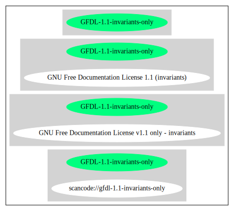

GNU Free Documentation License v1.1 only - invariants (GFDL-1.1-invariants-only)
================================================================================

[TABLE]

Comments on (easy) usability
----------------------------

General Comments
----------------

URLs
----

-   **SPDX:** http://spdx.org/licenses/GFDL-1.1-invariants-only.json

-   https://www.gnu.org/licenses/old-licenses/fdl-1.1.txt

------------------------------------------------------------------------

Raw Data
--------

-   [SPDX](https://spdx.org/licenses/GFDL-1.1-invariants-only.html "SPDX")

&nbsp;

    {
        "__impliedNames": [
            "GFDL-1.1-invariants-only",
            "GNU Free Documentation License v1.1 only - invariants"
        ],
        "__impliedId": "GFDL-1.1-invariants-only",
        "facts": {
            "SPDX": {
                "isSPDXLicenseDeprecated": false,
                "spdxFullName": "GNU Free Documentation License v1.1 only - invariants",
                "spdxDetailsURL": "http://spdx.org/licenses/GFDL-1.1-invariants-only.json",
                "_sourceURL": "https://spdx.org/licenses/GFDL-1.1-invariants-only.html",
                "spdxLicIsOSIApproved": false,
                "spdxSeeAlso": [
                    "https://www.gnu.org/licenses/old-licenses/fdl-1.1.txt"
                ],
                "_implications": {
                    "__impliedNames": [
                        "GFDL-1.1-invariants-only",
                        "GNU Free Documentation License v1.1 only - invariants"
                    ],
                    "__impliedId": "GFDL-1.1-invariants-only",
                    "__isOsiApproved": false,
                    "__impliedURLs": [
                        [
                            "SPDX",
                            "http://spdx.org/licenses/GFDL-1.1-invariants-only.json"
                        ],
                        [
                            null,
                            "https://www.gnu.org/licenses/old-licenses/fdl-1.1.txt"
                        ]
                    ]
                },
                "spdxLicenseId": "GFDL-1.1-invariants-only"
            }
        },
        "__isOsiApproved": false,
        "__impliedURLs": [
            [
                "SPDX",
                "http://spdx.org/licenses/GFDL-1.1-invariants-only.json"
            ],
            [
                null,
                "https://www.gnu.org/licenses/old-licenses/fdl-1.1.txt"
            ]
        ]
    }

------------------------------------------------------------------------

Dot Cluster Graph
-----------------

