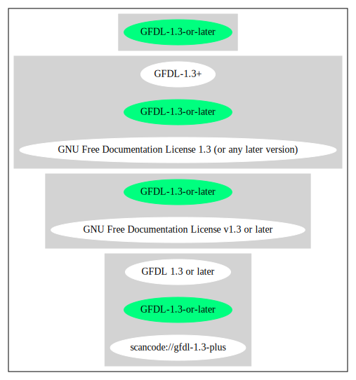

GNU Free Documentation License v1.3 or later (GFDL-1.3-or-later)
================================================================

[TABLE]

**Other Names:**

-   `scancode://gfdl-1.3-plus`

-   `GFDL 1.3 or later`

Comments on (easy) usability
----------------------------

-   **↓**Exception: Data licensed under the FDL with no invariant
    sections are considered DFSG-free as of GR 2006-001:
    http://www.debian.org/vote/2006/vote\_001\#outcome (source: [Debian
    Free Software
    Guidelines](https://wiki.debian.org/DFSGLicenses "Debian Free Software Guidelines"))

URLs
----

-   **Homepage:** http://www.gnu.org/licenses/fdl-1.3.txt

-   **SPDX:** http://spdx.org/licenses/GFDL-1.3-or-later.json

------------------------------------------------------------------------

Raw Data
--------

    {
        "__impliedNames": [
            "GFDL-1.3-or-later",
            "GNU Free Documentation License v1.3 or later",
            "scancode://gfdl-1.3-plus",
            "GFDL 1.3 or later"
        ],
        "__impliedId": "GFDL-1.3-or-later",
        "__impliedAmbiguousNames": [
            "GNU Free Documentation License (GFDL)"
        ],
        "facts": {
            "SPDX": {
                "isSPDXLicenseDeprecated": false,
                "spdxFullName": "GNU Free Documentation License v1.3 or later",
                "spdxDetailsURL": "http://spdx.org/licenses/GFDL-1.3-or-later.json",
                "_sourceURL": "https://spdx.org/licenses/GFDL-1.3-or-later.html",
                "spdxLicIsOSIApproved": false,
                "spdxSeeAlso": [
                    "https://www.gnu.org/licenses/fdl-1.3.txt"
                ],
                "_implications": {
                    "__impliedNames": [
                        "GFDL-1.3-or-later",
                        "GNU Free Documentation License v1.3 or later"
                    ],
                    "__impliedId": "GFDL-1.3-or-later",
                    "__isOsiApproved": false,
                    "__impliedURLs": [
                        [
                            "SPDX",
                            "http://spdx.org/licenses/GFDL-1.3-or-later.json"
                        ],
                        [
                            null,
                            "https://www.gnu.org/licenses/fdl-1.3.txt"
                        ]
                    ]
                },
                "spdxLicenseId": "GFDL-1.3-or-later"
            },
            "Scancode": {
                "otherUrls": [
                    "https://www.gnu.org/licenses/fdl-1.3.txt"
                ],
                "homepageUrl": "http://www.gnu.org/licenses/fdl-1.3.txt",
                "shortName": "GFDL 1.3 or later",
                "textUrls": null,
                "text": null,
                "category": "Copyleft Limited",
                "osiUrl": null,
                "owner": "Free Software Foundation (FSF)",
                "_sourceURL": "https://github.com/nexB/scancode-toolkit/blob/develop/src/licensedcode/data/licenses/gfdl-1.3-plus.yml",
                "key": "gfdl-1.3-plus",
                "name": "GNU Free Documentation License v1.3 or later",
                "spdxId": "GFDL-1.3-or-later",
                "_implications": {
                    "__impliedNames": [
                        "scancode://gfdl-1.3-plus",
                        "GFDL 1.3 or later",
                        "GFDL-1.3-or-later"
                    ],
                    "__impliedId": "GFDL-1.3-or-later",
                    "__impliedCopyleft": [
                        [
                            "Scancode",
                            "WeakCopyleft"
                        ]
                    ],
                    "__calculatedCopyleft": "WeakCopyleft",
                    "__impliedURLs": [
                        [
                            "Homepage",
                            "http://www.gnu.org/licenses/fdl-1.3.txt"
                        ],
                        [
                            null,
                            "https://www.gnu.org/licenses/fdl-1.3.txt"
                        ]
                    ]
                }
            },
            "Debian Free Software Guidelines": {
                "LicenseName": "GNU Free Documentation License (GFDL)",
                "State": "DFSGInCompatible",
                "_sourceURL": "https://wiki.debian.org/DFSGLicenses",
                "_implications": {
                    "__impliedNames": [
                        "GFDL-1.3-or-later"
                    ],
                    "__impliedAmbiguousNames": [
                        "GNU Free Documentation License (GFDL)"
                    ],
                    "__impliedJudgement": [
                        [
                            "Debian Free Software Guidelines",
                            {
                                "tag": "NegativeJudgement",
                                "contents": "Exception: Data licensed under the FDL with no invariant sections are considered DFSG-free as of GR 2006-001: http://www.debian.org/vote/2006/vote_001#outcome"
                            }
                        ]
                    ]
                },
                "Comment": "Exception: Data licensed under the FDL with no invariant sections are considered DFSG-free as of GR 2006-001: http://www.debian.org/vote/2006/vote_001#outcome",
                "LicenseId": "GFDL-1.3-or-later"
            }
        },
        "__impliedJudgement": [
            [
                "Debian Free Software Guidelines",
                {
                    "tag": "NegativeJudgement",
                    "contents": "Exception: Data licensed under the FDL with no invariant sections are considered DFSG-free as of GR 2006-001: http://www.debian.org/vote/2006/vote_001#outcome"
                }
            ]
        ],
        "__impliedCopyleft": [
            [
                "Scancode",
                "WeakCopyleft"
            ]
        ],
        "__calculatedCopyleft": "WeakCopyleft",
        "__isOsiApproved": false,
        "__impliedURLs": [
            [
                "SPDX",
                "http://spdx.org/licenses/GFDL-1.3-or-later.json"
            ],
            [
                null,
                "https://www.gnu.org/licenses/fdl-1.3.txt"
            ],
            [
                "Homepage",
                "http://www.gnu.org/licenses/fdl-1.3.txt"
            ]
        ]
    }

------------------------------------------------------------------------

Dot Cluster Graph
-----------------

