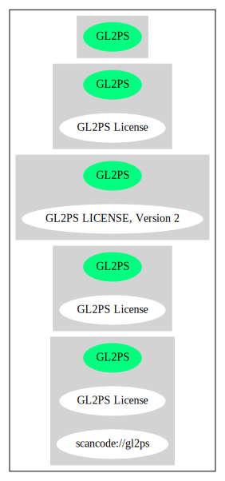

GL2PS License (GL2PS)
=====================

[TABLE]

**Other Names:**

-   `scancode://gl2ps`

Comments on (easy) usability
----------------------------

URLs
----

-   **Homepage:** http://www.geuz.org/gl2ps/COPYING.GL2PS

-   **SPDX:** http://spdx.org/licenses/GL2PS.json

Text
----

    GL2PS LICENSE Version 2, November 2003

    Copyright (C) 2003, Christophe Geuzaine

    Permission to use, copy, and distribute this software and its documentation
    for any purpose with or without fee is hereby granted, provided that the
    copyright notice appear in all copies and that both that copyright notice and 
    his permission notice appear in supporting documentation.

    Permission to modify and distribute modified versions of this software is
    granted, provided that:

    1) the modifications are licensed under the same terms as this software;

    2) you make available the source code of any modifications that you distribute,
    either on the same media as you distribute any executable or other form of this
    software, or via a mechanism generally accepted in the software development
    community for the electronic transfer of data.

    This software is provided "as is" without express or implied warranty.

------------------------------------------------------------------------

Raw Data
--------

    {
        "__impliedNames": [
            "GL2PS",
            "GL2PS License",
            "scancode://gl2ps"
        ],
        "__impliedId": "GL2PS",
        "facts": {
            "SPDX": {
                "isSPDXLicenseDeprecated": false,
                "spdxFullName": "GL2PS License",
                "spdxDetailsURL": "http://spdx.org/licenses/GL2PS.json",
                "_sourceURL": "https://spdx.org/licenses/GL2PS.html",
                "spdxLicIsOSIApproved": false,
                "spdxSeeAlso": [
                    "http://www.geuz.org/gl2ps/COPYING.GL2PS"
                ],
                "_implications": {
                    "__impliedNames": [
                        "GL2PS",
                        "GL2PS License"
                    ],
                    "__impliedId": "GL2PS",
                    "__isOsiApproved": false,
                    "__impliedURLs": [
                        [
                            "SPDX",
                            "http://spdx.org/licenses/GL2PS.json"
                        ],
                        [
                            null,
                            "http://www.geuz.org/gl2ps/COPYING.GL2PS"
                        ]
                    ]
                },
                "spdxLicenseId": "GL2PS"
            },
            "Scancode": {
                "otherUrls": null,
                "homepageUrl": "http://www.geuz.org/gl2ps/COPYING.GL2PS",
                "shortName": "GL2PS License",
                "textUrls": null,
                "text": "GL2PS LICENSE Version 2, November 2003\n\nCopyright (C) 2003, Christophe Geuzaine\n\nPermission to use, copy, and distribute this software and its documentation\nfor any purpose with or without fee is hereby granted, provided that the\ncopyright notice appear in all copies and that both that copyright notice and \nhis permission notice appear in supporting documentation.\n\nPermission to modify and distribute modified versions of this software is\ngranted, provided that:\n\n1) the modifications are licensed under the same terms as this software;\n\n2) you make available the source code of any modifications that you distribute,\neither on the same media as you distribute any executable or other form of this\nsoftware, or via a mechanism generally accepted in the software development\ncommunity for the electronic transfer of data.\n\nThis software is provided \"as is\" without express or implied warranty.",
                "category": "Copyleft Limited",
                "osiUrl": null,
                "owner": "Christophe Geuzaine",
                "_sourceURL": "https://github.com/nexB/scancode-toolkit/blob/develop/src/licensedcode/data/licenses/gl2ps.yml",
                "key": "gl2ps",
                "name": "GL2PS License",
                "spdxId": "GL2PS",
                "_implications": {
                    "__impliedNames": [
                        "scancode://gl2ps",
                        "GL2PS License",
                        "GL2PS"
                    ],
                    "__impliedId": "GL2PS",
                    "__impliedCopyleft": [
                        [
                            "Scancode",
                            "WeakCopyleft"
                        ]
                    ],
                    "__calculatedCopyleft": "WeakCopyleft",
                    "__impliedText": "GL2PS LICENSE Version 2, November 2003\n\nCopyright (C) 2003, Christophe Geuzaine\n\nPermission to use, copy, and distribute this software and its documentation\nfor any purpose with or without fee is hereby granted, provided that the\ncopyright notice appear in all copies and that both that copyright notice and \nhis permission notice appear in supporting documentation.\n\nPermission to modify and distribute modified versions of this software is\ngranted, provided that:\n\n1) the modifications are licensed under the same terms as this software;\n\n2) you make available the source code of any modifications that you distribute,\neither on the same media as you distribute any executable or other form of this\nsoftware, or via a mechanism generally accepted in the software development\ncommunity for the electronic transfer of data.\n\nThis software is provided \"as is\" without express or implied warranty.",
                    "__impliedURLs": [
                        [
                            "Homepage",
                            "http://www.geuz.org/gl2ps/COPYING.GL2PS"
                        ]
                    ]
                }
            }
        },
        "__impliedCopyleft": [
            [
                "Scancode",
                "WeakCopyleft"
            ]
        ],
        "__calculatedCopyleft": "WeakCopyleft",
        "__isOsiApproved": false,
        "__impliedText": "GL2PS LICENSE Version 2, November 2003\n\nCopyright (C) 2003, Christophe Geuzaine\n\nPermission to use, copy, and distribute this software and its documentation\nfor any purpose with or without fee is hereby granted, provided that the\ncopyright notice appear in all copies and that both that copyright notice and \nhis permission notice appear in supporting documentation.\n\nPermission to modify and distribute modified versions of this software is\ngranted, provided that:\n\n1) the modifications are licensed under the same terms as this software;\n\n2) you make available the source code of any modifications that you distribute,\neither on the same media as you distribute any executable or other form of this\nsoftware, or via a mechanism generally accepted in the software development\ncommunity for the electronic transfer of data.\n\nThis software is provided \"as is\" without express or implied warranty.",
        "__impliedURLs": [
            [
                "SPDX",
                "http://spdx.org/licenses/GL2PS.json"
            ],
            [
                null,
                "http://www.geuz.org/gl2ps/COPYING.GL2PS"
            ],
            [
                "Homepage",
                "http://www.geuz.org/gl2ps/COPYING.GL2PS"
            ]
        ]
    }

------------------------------------------------------------------------

Dot Cluster Graph
-----------------

