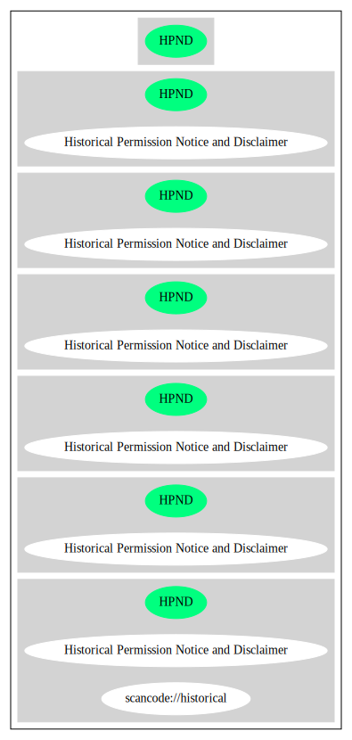

Historical Permission Notice and Disclaimer (HPND)
==================================================

[TABLE]

**Other Names:**

-   `scancode://historical`

Comments on (easy) usability
----------------------------

-   **↑**“Is OSI Approved” (source:
    [SPDX](https://spdx.org/licenses/HPND.html "SPDX"))

-   **↓**“Rating is: Lead” (source: [BlueOak License
    List](https://blueoakcouncil.org/list "BlueOak License List"))

General Comments
----------------

-   “Per SPDX.org, this license is OSI certified. This license has been
    voluntarily deprecated by its author. ” (source:
    [Scancode](https://github.com/nexB/scancode-toolkit/blob/develop/src/licensedcode/data/licenses/historical.yml "Scancode"))

URLs
----

-   **Homepage:** http://www.opensource.org/licenses/historical.php

-   **OSI Page:** https://opensource.org/licenses/HPND

-   **SPDX:** http://spdx.org/licenses/HPND.json

-   **SPDX:** https://spdx.org/licenses/HPND.html

-   http://www.opensource.org/licenses/HPND

OSADL Rule
----------

    USE CASE Source code delivery OR Binary delivery
    	YOU MUST Forward Copyright notices
    	YOU MUST Forward Copyright notices In Documentation
    	YOU MUST Forward License text In Documentation
    	YOU MUST NOT Promote

(source: OSADL License Checklist)

Text
----

    Permission to use, copy, modify and distribute this software and its
    documentation for any purpose and without fee is hereby granted,
    provided that the above copyright notice appear in all copies, and
    that both that copyright notice and this permission notice
    appear in supporting documentation, and that the name of copyright
    holder or related entities not be used in advertising or publicity
    pertaining to distribution of the software without specific, written
    prior permission. Copyright holder makes no representations about
    the suitability of this software for any purpose. It is provided "as is"
    without express or implied warranty.

    Copyright holder DISCLAIMS ALL WARRANTIES WITH REGARD TO THIS
    SOFTWARE, INCLUDING ALL IMPLIED WARRANTIES OF MERCHANTABILITY AND
    FITNESS. IN NO EVENT SHALL copyright holder BE LIABLE FOR ANY
    SPECIAL, INDIRECT OR CONSEQUENTIAL DAMAGES OR ANY DAMAGES WHATSOEVER
    RESULTING FROM LOSS OF USE, DATA OR PROFITS, WHETHER IN AN ACTION OF
    CONTRACT, NEGLIGENCE OR OTHER TORTIOUS ACTION, ARISING OUT OF OR IN
    CONNECTION WITH THE USE OR PERFORMANCE OF THIS SOFTWARE.

------------------------------------------------------------------------

Raw Data
--------

-   SPDX

-   BlueOak License List

-   OpenChainPolicyTemplate

-   Scancode

-   OSADL License Checklist

-   OpenSourceInitiative

-   Open Knowledge International

&nbsp;

    {
        "__impliedNames": [
            "HPND",
            "Historical Permission Notice and Disclaimer",
            "scancode://historical"
        ],
        "__impliedId": "HPND",
        "__impliedComments": [
            [
                "Scancode",
                [
                    "Per SPDX.org, this license is OSI certified. This license has been\nvoluntarily deprecated by its author.\n"
                ]
            ]
        ],
        "facts": {
            "Open Knowledge International": {
                "is_generic": null,
                "status": "active",
                "domain_software": true,
                "url": "https://opensource.org/licenses/HPND",
                "maintainer": "",
                "od_conformance": "not reviewed",
                "_sourceURL": "https://github.com/okfn/licenses/blob/master/licenses.csv",
                "domain_data": false,
                "osd_conformance": "approved",
                "id": "HPND",
                "title": "Historical Permission Notice and Disclaimer",
                "_implications": {
                    "__impliedNames": [
                        "HPND",
                        "Historical Permission Notice and Disclaimer"
                    ],
                    "__impliedId": "HPND",
                    "__impliedURLs": [
                        [
                            null,
                            "https://opensource.org/licenses/HPND"
                        ]
                    ]
                },
                "domain_content": false
            },
            "SPDX": {
                "isSPDXLicenseDeprecated": false,
                "spdxFullName": "Historical Permission Notice and Disclaimer",
                "spdxDetailsURL": "http://spdx.org/licenses/HPND.json",
                "_sourceURL": "https://spdx.org/licenses/HPND.html",
                "spdxLicIsOSIApproved": true,
                "spdxSeeAlso": [
                    "https://opensource.org/licenses/HPND"
                ],
                "_implications": {
                    "__impliedNames": [
                        "HPND",
                        "Historical Permission Notice and Disclaimer"
                    ],
                    "__impliedId": "HPND",
                    "__impliedJudgement": [
                        [
                            "SPDX",
                            {
                                "tag": "PositiveJudgement",
                                "contents": "Is OSI Approved"
                            }
                        ]
                    ],
                    "__isOsiApproved": true,
                    "__impliedURLs": [
                        [
                            "SPDX",
                            "http://spdx.org/licenses/HPND.json"
                        ],
                        [
                            null,
                            "https://opensource.org/licenses/HPND"
                        ]
                    ]
                },
                "spdxLicenseId": "HPND"
            },
            "OSADL License Checklist": {
                "_sourceURL": "https://www.osadl.org/fileadmin/checklists/unreflicenses/HPND.txt",
                "spdxId": "HPND",
                "osadlRule": "USE CASE Source code delivery OR Binary delivery\r\n\tYOU MUST Forward Copyright notices\n\tYOU MUST Forward Copyright notices In Documentation\n\tYOU MUST Forward License text In Documentation\n\tYOU MUST NOT Promote\n",
                "_implications": {
                    "__impliedNames": [
                        "HPND"
                    ]
                }
            },
            "Scancode": {
                "otherUrls": [
                    "http://www.opensource.org/licenses/HPND",
                    "https://opensource.org/licenses/HPND"
                ],
                "homepageUrl": "http://www.opensource.org/licenses/historical.php",
                "shortName": "Historical Permission Notice and Disclaimer",
                "textUrls": null,
                "text": "Permission to use, copy, modify and distribute this software and its\ndocumentation for any purpose and without fee is hereby granted,\nprovided that the above copyright notice appear in all copies, and\nthat both that copyright notice and this permission notice\nappear in supporting documentation, and that the name of copyright\nholder or related entities not be used in advertising or publicity\npertaining to distribution of the software without specific, written\nprior permission. Copyright holder makes no representations about\nthe suitability of this software for any purpose. It is provided \"as is\"\nwithout express or implied warranty.\n\nCopyright holder DISCLAIMS ALL WARRANTIES WITH REGARD TO THIS\nSOFTWARE, INCLUDING ALL IMPLIED WARRANTIES OF MERCHANTABILITY AND\nFITNESS. IN NO EVENT SHALL copyright holder BE LIABLE FOR ANY\nSPECIAL, INDIRECT OR CONSEQUENTIAL DAMAGES OR ANY DAMAGES WHATSOEVER\nRESULTING FROM LOSS OF USE, DATA OR PROFITS, WHETHER IN AN ACTION OF\nCONTRACT, NEGLIGENCE OR OTHER TORTIOUS ACTION, ARISING OUT OF OR IN\nCONNECTION WITH THE USE OR PERFORMANCE OF THIS SOFTWARE.",
                "category": "Permissive",
                "osiUrl": "http://www.opensource.org/licenses/historical.php",
                "owner": "OSI - Open Source Initiative",
                "_sourceURL": "https://github.com/nexB/scancode-toolkit/blob/develop/src/licensedcode/data/licenses/historical.yml",
                "key": "historical",
                "name": "Historical Permission Notice and Disclaimer",
                "spdxId": "HPND",
                "notes": "Per SPDX.org, this license is OSI certified. This license has been\nvoluntarily deprecated by its author.\n",
                "_implications": {
                    "__impliedNames": [
                        "scancode://historical",
                        "Historical Permission Notice and Disclaimer",
                        "HPND"
                    ],
                    "__impliedId": "HPND",
                    "__impliedComments": [
                        [
                            "Scancode",
                            [
                                "Per SPDX.org, this license is OSI certified. This license has been\nvoluntarily deprecated by its author.\n"
                            ]
                        ]
                    ],
                    "__impliedCopyleft": [
                        [
                            "Scancode",
                            "NoCopyleft"
                        ]
                    ],
                    "__calculatedCopyleft": "NoCopyleft",
                    "__impliedText": "Permission to use, copy, modify and distribute this software and its\ndocumentation for any purpose and without fee is hereby granted,\nprovided that the above copyright notice appear in all copies, and\nthat both that copyright notice and this permission notice\nappear in supporting documentation, and that the name of copyright\nholder or related entities not be used in advertising or publicity\npertaining to distribution of the software without specific, written\nprior permission. Copyright holder makes no representations about\nthe suitability of this software for any purpose. It is provided \"as is\"\nwithout express or implied warranty.\n\nCopyright holder DISCLAIMS ALL WARRANTIES WITH REGARD TO THIS\nSOFTWARE, INCLUDING ALL IMPLIED WARRANTIES OF MERCHANTABILITY AND\nFITNESS. IN NO EVENT SHALL copyright holder BE LIABLE FOR ANY\nSPECIAL, INDIRECT OR CONSEQUENTIAL DAMAGES OR ANY DAMAGES WHATSOEVER\nRESULTING FROM LOSS OF USE, DATA OR PROFITS, WHETHER IN AN ACTION OF\nCONTRACT, NEGLIGENCE OR OTHER TORTIOUS ACTION, ARISING OUT OF OR IN\nCONNECTION WITH THE USE OR PERFORMANCE OF THIS SOFTWARE.",
                    "__impliedURLs": [
                        [
                            "Homepage",
                            "http://www.opensource.org/licenses/historical.php"
                        ],
                        [
                            "OSI Page",
                            "http://www.opensource.org/licenses/historical.php"
                        ],
                        [
                            null,
                            "http://www.opensource.org/licenses/HPND"
                        ],
                        [
                            null,
                            "https://opensource.org/licenses/HPND"
                        ]
                    ]
                }
            },
            "OpenChainPolicyTemplate": {
                "isSaaSDeemed": "no",
                "licenseType": "permissive",
                "freedomOrDeath": "no",
                "typeCopyleft": "no",
                "_sourceURL": "https://github.com/OpenChain-Project/curriculum/raw/ddf1e879341adbd9b297cd67c5d5c16b2076540b/policy-template/Open%20Source%20Policy%20Template%20for%20OpenChain%20Specification%201.2.ods",
                "name": "Historical Permission Notice and Disclaimer",
                "commercialUse": true,
                "spdxId": "HPND",
                "_implications": {
                    "__impliedNames": [
                        "HPND"
                    ]
                }
            },
            "BlueOak License List": {
                "BlueOakRating": "Lead",
                "url": "https://spdx.org/licenses/HPND.html",
                "isPermissive": true,
                "_sourceURL": "https://blueoakcouncil.org/list",
                "name": "Historical Permission Notice and Disclaimer",
                "id": "HPND",
                "_implications": {
                    "__impliedNames": [
                        "HPND",
                        "Historical Permission Notice and Disclaimer"
                    ],
                    "__impliedJudgement": [
                        [
                            "BlueOak License List",
                            {
                                "tag": "NegativeJudgement",
                                "contents": "Rating is: Lead"
                            }
                        ]
                    ],
                    "__impliedCopyleft": [
                        [
                            "BlueOak License List",
                            "NoCopyleft"
                        ]
                    ],
                    "__calculatedCopyleft": "NoCopyleft",
                    "__impliedURLs": [
                        [
                            "SPDX",
                            "https://spdx.org/licenses/HPND.html"
                        ]
                    ]
                }
            },
            "OpenSourceInitiative": {
                "text": [
                    {
                        "url": "https://opensource.org/licenses/HPND",
                        "title": "HTML",
                        "media_type": "text/html"
                    }
                ],
                "identifiers": [
                    {
                        "identifier": "HPND",
                        "scheme": "SPDX"
                    }
                ],
                "superseded_by": null,
                "_sourceURL": "https://opensource.org/licenses/",
                "name": "Historical Permission Notice and Disclaimer",
                "other_names": [],
                "keywords": [
                    "osi-approved",
                    "discouraged",
                    "redundant"
                ],
                "id": "HPND",
                "links": [
                    {
                        "note": "OSI Page",
                        "url": "https://opensource.org/licenses/HPND"
                    }
                ],
                "_implications": {
                    "__impliedNames": [
                        "HPND",
                        "Historical Permission Notice and Disclaimer",
                        "HPND"
                    ],
                    "__impliedURLs": [
                        [
                            "OSI Page",
                            "https://opensource.org/licenses/HPND"
                        ]
                    ]
                }
            }
        },
        "__impliedJudgement": [
            [
                "BlueOak License List",
                {
                    "tag": "NegativeJudgement",
                    "contents": "Rating is: Lead"
                }
            ],
            [
                "SPDX",
                {
                    "tag": "PositiveJudgement",
                    "contents": "Is OSI Approved"
                }
            ]
        ],
        "__impliedCopyleft": [
            [
                "BlueOak License List",
                "NoCopyleft"
            ],
            [
                "Scancode",
                "NoCopyleft"
            ]
        ],
        "__calculatedCopyleft": "NoCopyleft",
        "__isOsiApproved": true,
        "__impliedText": "Permission to use, copy, modify and distribute this software and its\ndocumentation for any purpose and without fee is hereby granted,\nprovided that the above copyright notice appear in all copies, and\nthat both that copyright notice and this permission notice\nappear in supporting documentation, and that the name of copyright\nholder or related entities not be used in advertising or publicity\npertaining to distribution of the software without specific, written\nprior permission. Copyright holder makes no representations about\nthe suitability of this software for any purpose. It is provided \"as is\"\nwithout express or implied warranty.\n\nCopyright holder DISCLAIMS ALL WARRANTIES WITH REGARD TO THIS\nSOFTWARE, INCLUDING ALL IMPLIED WARRANTIES OF MERCHANTABILITY AND\nFITNESS. IN NO EVENT SHALL copyright holder BE LIABLE FOR ANY\nSPECIAL, INDIRECT OR CONSEQUENTIAL DAMAGES OR ANY DAMAGES WHATSOEVER\nRESULTING FROM LOSS OF USE, DATA OR PROFITS, WHETHER IN AN ACTION OF\nCONTRACT, NEGLIGENCE OR OTHER TORTIOUS ACTION, ARISING OUT OF OR IN\nCONNECTION WITH THE USE OR PERFORMANCE OF THIS SOFTWARE.",
        "__impliedURLs": [
            [
                "SPDX",
                "http://spdx.org/licenses/HPND.json"
            ],
            [
                null,
                "https://opensource.org/licenses/HPND"
            ],
            [
                "SPDX",
                "https://spdx.org/licenses/HPND.html"
            ],
            [
                "Homepage",
                "http://www.opensource.org/licenses/historical.php"
            ],
            [
                "OSI Page",
                "http://www.opensource.org/licenses/historical.php"
            ],
            [
                null,
                "http://www.opensource.org/licenses/HPND"
            ],
            [
                "OSI Page",
                "https://opensource.org/licenses/HPND"
            ]
        ]
    }

------------------------------------------------------------------------

Dot Cluster Graph
-----------------

