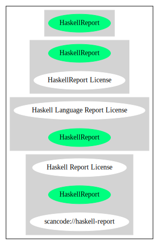

Haskell Language Report License (HaskellReport)
===============================================

[TABLE]

**Other Names:**

-   `scancode://haskell-report`

-   `Haskell Report License`

Comments on (easy) usability
----------------------------

General Comments
----------------

URLs
----

-   **Homepage:**
    https://fedoraproject.org/wiki/Licensing/Haskell\_Language\_Report\_License

-   **SPDX:** http://spdx.org/licenses/HaskellReport.json

Text
----

    The authors intend this Report to belong to the entire Haskell community, and
    so we grant permission to copy and distribute it for any purpose, provided that
    it is reproduced in its entirety, including this Notice.  Modified versions of
    this Report may also be copied and distributed for any purpose, provided that
    the modified version is clearly presented as such, and that it does not claim
    to be a definition of the Haskell 2010 Language.

------------------------------------------------------------------------

Raw Data
--------

### Facts

-   [SPDX](https://spdx.org/licenses/HaskellReport.html "SPDX")

-   [Scancode](https://github.com/nexB/scancode-toolkit/blob/develop/src/licensedcode/data/licenses/haskell-report.yml "Scancode")

### Raw JSON

    {
        "__impliedNames": [
            "HaskellReport",
            "Haskell Language Report License",
            "scancode://haskell-report",
            "Haskell Report License"
        ],
        "__impliedId": "HaskellReport",
        "facts": {
            "SPDX": {
                "isSPDXLicenseDeprecated": false,
                "spdxFullName": "Haskell Language Report License",
                "spdxDetailsURL": "http://spdx.org/licenses/HaskellReport.json",
                "_sourceURL": "https://spdx.org/licenses/HaskellReport.html",
                "spdxLicIsOSIApproved": false,
                "spdxSeeAlso": [
                    "https://fedoraproject.org/wiki/Licensing/Haskell_Language_Report_License"
                ],
                "_implications": {
                    "__impliedNames": [
                        "HaskellReport",
                        "Haskell Language Report License"
                    ],
                    "__impliedId": "HaskellReport",
                    "__isOsiApproved": false,
                    "__impliedURLs": [
                        [
                            "SPDX",
                            "http://spdx.org/licenses/HaskellReport.json"
                        ],
                        [
                            null,
                            "https://fedoraproject.org/wiki/Licensing/Haskell_Language_Report_License"
                        ]
                    ]
                },
                "spdxLicenseId": "HaskellReport"
            },
            "Scancode": {
                "otherUrls": null,
                "homepageUrl": "https://fedoraproject.org/wiki/Licensing/Haskell_Language_Report_License",
                "shortName": "Haskell Report License",
                "textUrls": null,
                "text": "The authors intend this Report to belong to the entire Haskell community, and\nso we grant permission to copy and distribute it for any purpose, provided that\nit is reproduced in its entirety, including this Notice.  Modified versions of\nthis Report may also be copied and distributed for any purpose, provided that\nthe modified version is clearly presented as such, and that it does not claim\nto be a definition of the Haskell 2010 Language.",
                "category": "Permissive",
                "osiUrl": null,
                "owner": "Simon Marlow",
                "_sourceURL": "https://github.com/nexB/scancode-toolkit/blob/develop/src/licensedcode/data/licenses/haskell-report.yml",
                "key": "haskell-report",
                "name": "Haskell Language Report License",
                "spdxId": "HaskellReport",
                "notes": null,
                "_implications": {
                    "__impliedNames": [
                        "scancode://haskell-report",
                        "Haskell Report License",
                        "HaskellReport"
                    ],
                    "__impliedId": "HaskellReport",
                    "__impliedCopyleft": [
                        [
                            "Scancode",
                            "NoCopyleft"
                        ]
                    ],
                    "__calculatedCopyleft": "NoCopyleft",
                    "__impliedText": "The authors intend this Report to belong to the entire Haskell community, and\nso we grant permission to copy and distribute it for any purpose, provided that\nit is reproduced in its entirety, including this Notice.  Modified versions of\nthis Report may also be copied and distributed for any purpose, provided that\nthe modified version is clearly presented as such, and that it does not claim\nto be a definition of the Haskell 2010 Language.",
                    "__impliedURLs": [
                        [
                            "Homepage",
                            "https://fedoraproject.org/wiki/Licensing/Haskell_Language_Report_License"
                        ]
                    ]
                }
            }
        },
        "__impliedCopyleft": [
            [
                "Scancode",
                "NoCopyleft"
            ]
        ],
        "__calculatedCopyleft": "NoCopyleft",
        "__isOsiApproved": false,
        "__impliedText": "The authors intend this Report to belong to the entire Haskell community, and\nso we grant permission to copy and distribute it for any purpose, provided that\nit is reproduced in its entirety, including this Notice.  Modified versions of\nthis Report may also be copied and distributed for any purpose, provided that\nthe modified version is clearly presented as such, and that it does not claim\nto be a definition of the Haskell 2010 Language.",
        "__impliedURLs": [
            [
                "SPDX",
                "http://spdx.org/licenses/HaskellReport.json"
            ],
            [
                null,
                "https://fedoraproject.org/wiki/Licensing/Haskell_Language_Report_License"
            ],
            [
                "Homepage",
                "https://fedoraproject.org/wiki/Licensing/Haskell_Language_Report_License"
            ]
        ]
    }

------------------------------------------------------------------------

Dot Cluster Graph
-----------------

