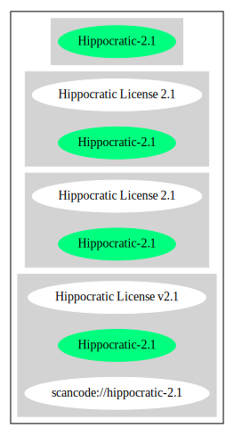

Hippocratic License 2.1 (Hippocratic-2.1)
=========================================

[TABLE]

Comments on (easy) usability
----------------------------

General Comments
----------------

URLs
----

-   **SPDX:** http://spdx.org/licenses/Hippocratic-2.1.json

-   https://firstdonoharm.dev/version/2/1/license.html

-   https://github.com/EthicalSource/hippocratic-license/blob/58c0e646d64ff6fbee275bfe2b9492f914e3ab2a/LICENSE.txt

------------------------------------------------------------------------

Raw Data
--------

### Facts

-   [SPDX](https://spdx.org/licenses/Hippocratic-2.1.html "SPDX")

### Raw JSON

    {
        "__impliedNames": [
            "Hippocratic-2.1",
            "Hippocratic License 2.1"
        ],
        "__impliedId": "Hippocratic-2.1",
        "facts": {
            "SPDX": {
                "isSPDXLicenseDeprecated": false,
                "spdxFullName": "Hippocratic License 2.1",
                "spdxDetailsURL": "http://spdx.org/licenses/Hippocratic-2.1.json",
                "_sourceURL": "https://spdx.org/licenses/Hippocratic-2.1.html",
                "spdxLicIsOSIApproved": false,
                "spdxSeeAlso": [
                    "https://firstdonoharm.dev/version/2/1/license.html",
                    "https://github.com/EthicalSource/hippocratic-license/blob/58c0e646d64ff6fbee275bfe2b9492f914e3ab2a/LICENSE.txt"
                ],
                "_implications": {
                    "__impliedNames": [
                        "Hippocratic-2.1",
                        "Hippocratic License 2.1"
                    ],
                    "__impliedId": "Hippocratic-2.1",
                    "__isOsiApproved": false,
                    "__impliedURLs": [
                        [
                            "SPDX",
                            "http://spdx.org/licenses/Hippocratic-2.1.json"
                        ],
                        [
                            null,
                            "https://firstdonoharm.dev/version/2/1/license.html"
                        ],
                        [
                            null,
                            "https://github.com/EthicalSource/hippocratic-license/blob/58c0e646d64ff6fbee275bfe2b9492f914e3ab2a/LICENSE.txt"
                        ]
                    ]
                },
                "spdxLicenseId": "Hippocratic-2.1"
            }
        },
        "__isOsiApproved": false,
        "__impliedURLs": [
            [
                "SPDX",
                "http://spdx.org/licenses/Hippocratic-2.1.json"
            ],
            [
                null,
                "https://firstdonoharm.dev/version/2/1/license.html"
            ],
            [
                null,
                "https://github.com/EthicalSource/hippocratic-license/blob/58c0e646d64ff6fbee275bfe2b9492f914e3ab2a/LICENSE.txt"
            ]
        ]
    }

------------------------------------------------------------------------

Dot Cluster Graph
-----------------

