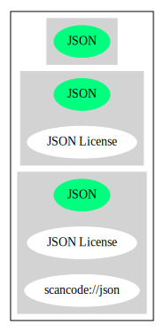

JSON License (JSON)
===================

[TABLE]

**Other Names:**

-   `scancode://json`

Comments on (easy) usability
----------------------------

-   **↑**“Google Classification is NOTICE” (source: [Google OSS
    Policy](https://opensource.google.com/docs/thirdparty/licenses/ "Google OSS Policy"))

-   **↓**“Infamous for the clause The Software shall be used for Good,
    not Evil.” (source: [Debian Free Software
    Guidelines](https://wiki.debian.org/DFSGLicenses "Debian Free Software Guidelines"))

General Comments
----------------

URLs
----

-   **Homepage:** http://www.json.org/license.html

-   **SPDX:** http://spdx.org/licenses/JSON.json

-   http://www.gnu.org/licenses/license-list.html\#JSON

Text
----

    Permission is hereby granted, free of charge, to any person obtaining a
    copy of this software and associated documentation files (the
    "Software"), to deal in the Software without restriction, including
    without limitation the rights to use, copy, modify, merge, publish,
    distribute, sublicense, and/or sell copies of the Software, and to
    permit persons to whom the Software is furnished to do so, subject to
    the following conditions:

    The above copyright notice and this permission notice shall be included
    in all copies or substantial portions of the Software.

    The Software shall be used for Good, not Evil.

    THE SOFTWARE IS PROVIDED "AS IS", WITHOUT WARRANTY OF ANY KIND, EXPRESS
    OR IMPLIED, INCLUDING BUT NOT LIMITED TO THE WARRANTIES OF
    MERCHANTABILITY, FITNESS FOR A PARTICULAR PURPOSE AND NONINFRINGEMENT.
    IN NO EVENT SHALL THE AUTHORS OR COPYRIGHT HOLDERS BE LIABLE FOR ANY
    CLAIM, DAMAGES OR OTHER LIABILITY, WHETHER IN AN ACTION OF CONTRACT,
    TORT OR OTHERWISE, ARISING FROM, OUT OF OR IN CONNECTION WITH THE
    SOFTWARE OR THE USE OR OTHER DEALINGS IN THE SOFTWARE.

------------------------------------------------------------------------

Raw Data
--------

-   SPDX

-   Scancode

-   Google OSS Policy

-   Debian Free Software Guidelines

&nbsp;

    {
        "__impliedNames": [
            "JSON",
            "JSON License",
            "scancode://json"
        ],
        "__impliedId": "JSON",
        "__impliedAmbiguousNames": [
            "JSON evil license"
        ],
        "facts": {
            "SPDX": {
                "isSPDXLicenseDeprecated": false,
                "spdxFullName": "JSON License",
                "spdxDetailsURL": "http://spdx.org/licenses/JSON.json",
                "_sourceURL": "https://spdx.org/licenses/JSON.html",
                "spdxLicIsOSIApproved": false,
                "spdxSeeAlso": [
                    "http://www.json.org/license.html"
                ],
                "_implications": {
                    "__impliedNames": [
                        "JSON",
                        "JSON License"
                    ],
                    "__impliedId": "JSON",
                    "__isOsiApproved": false,
                    "__impliedURLs": [
                        [
                            "SPDX",
                            "http://spdx.org/licenses/JSON.json"
                        ],
                        [
                            null,
                            "http://www.json.org/license.html"
                        ]
                    ]
                },
                "spdxLicenseId": "JSON"
            },
            "Scancode": {
                "otherUrls": [
                    "http://www.gnu.org/licenses/license-list.html#JSON"
                ],
                "homepageUrl": "http://www.json.org/license.html",
                "shortName": "JSON License",
                "textUrls": null,
                "text": "Permission is hereby granted, free of charge, to any person obtaining a\ncopy of this software and associated documentation files (the\n\"Software\"), to deal in the Software without restriction, including\nwithout limitation the rights to use, copy, modify, merge, publish,\ndistribute, sublicense, and/or sell copies of the Software, and to\npermit persons to whom the Software is furnished to do so, subject to\nthe following conditions:\n\nThe above copyright notice and this permission notice shall be included\nin all copies or substantial portions of the Software.\n\nThe Software shall be used for Good, not Evil.\n\nTHE SOFTWARE IS PROVIDED \"AS IS\", WITHOUT WARRANTY OF ANY KIND, EXPRESS\nOR IMPLIED, INCLUDING BUT NOT LIMITED TO THE WARRANTIES OF\nMERCHANTABILITY, FITNESS FOR A PARTICULAR PURPOSE AND NONINFRINGEMENT.\nIN NO EVENT SHALL THE AUTHORS OR COPYRIGHT HOLDERS BE LIABLE FOR ANY\nCLAIM, DAMAGES OR OTHER LIABILITY, WHETHER IN AN ACTION OF CONTRACT,\nTORT OR OTHERWISE, ARISING FROM, OUT OF OR IN CONNECTION WITH THE\nSOFTWARE OR THE USE OR OTHER DEALINGS IN THE SOFTWARE.\n",
                "category": "Permissive",
                "osiUrl": null,
                "owner": "JSON.org",
                "_sourceURL": "https://github.com/nexB/scancode-toolkit/blob/develop/src/licensedcode/data/licenses/json.yml",
                "key": "json",
                "name": "JSON License",
                "spdxId": "JSON",
                "notes": null,
                "_implications": {
                    "__impliedNames": [
                        "scancode://json",
                        "JSON License",
                        "JSON"
                    ],
                    "__impliedId": "JSON",
                    "__impliedCopyleft": [
                        [
                            "Scancode",
                            "NoCopyleft"
                        ]
                    ],
                    "__calculatedCopyleft": "NoCopyleft",
                    "__impliedText": "Permission is hereby granted, free of charge, to any person obtaining a\ncopy of this software and associated documentation files (the\n\"Software\"), to deal in the Software without restriction, including\nwithout limitation the rights to use, copy, modify, merge, publish,\ndistribute, sublicense, and/or sell copies of the Software, and to\npermit persons to whom the Software is furnished to do so, subject to\nthe following conditions:\n\nThe above copyright notice and this permission notice shall be included\nin all copies or substantial portions of the Software.\n\nThe Software shall be used for Good, not Evil.\n\nTHE SOFTWARE IS PROVIDED \"AS IS\", WITHOUT WARRANTY OF ANY KIND, EXPRESS\nOR IMPLIED, INCLUDING BUT NOT LIMITED TO THE WARRANTIES OF\nMERCHANTABILITY, FITNESS FOR A PARTICULAR PURPOSE AND NONINFRINGEMENT.\nIN NO EVENT SHALL THE AUTHORS OR COPYRIGHT HOLDERS BE LIABLE FOR ANY\nCLAIM, DAMAGES OR OTHER LIABILITY, WHETHER IN AN ACTION OF CONTRACT,\nTORT OR OTHERWISE, ARISING FROM, OUT OF OR IN CONNECTION WITH THE\nSOFTWARE OR THE USE OR OTHER DEALINGS IN THE SOFTWARE.\n",
                    "__impliedURLs": [
                        [
                            "Homepage",
                            "http://www.json.org/license.html"
                        ],
                        [
                            null,
                            "http://www.gnu.org/licenses/license-list.html#JSON"
                        ]
                    ]
                }
            },
            "Debian Free Software Guidelines": {
                "LicenseName": "JSON evil license",
                "State": "DFSGInCompatible",
                "_sourceURL": "https://wiki.debian.org/DFSGLicenses",
                "_implications": {
                    "__impliedNames": [
                        "JSON"
                    ],
                    "__impliedAmbiguousNames": [
                        "JSON evil license"
                    ],
                    "__impliedJudgement": [
                        [
                            "Debian Free Software Guidelines",
                            {
                                "tag": "NegativeJudgement",
                                "contents": "Infamous for the clause The Software shall be used for Good, not Evil."
                            }
                        ]
                    ]
                },
                "Comment": "Infamous for the clause The Software shall be used for Good, not Evil.",
                "LicenseId": "JSON"
            },
            "Google OSS Policy": {
                "rating": "NOTICE",
                "_sourceURL": "https://opensource.google.com/docs/thirdparty/licenses/",
                "id": "JSON",
                "_implications": {
                    "__impliedNames": [
                        "JSON"
                    ],
                    "__impliedJudgement": [
                        [
                            "Google OSS Policy",
                            {
                                "tag": "PositiveJudgement",
                                "contents": "Google Classification is NOTICE"
                            }
                        ]
                    ],
                    "__impliedCopyleft": [
                        [
                            "Google OSS Policy",
                            "NoCopyleft"
                        ]
                    ],
                    "__calculatedCopyleft": "NoCopyleft"
                }
            }
        },
        "__impliedJudgement": [
            [
                "Debian Free Software Guidelines",
                {
                    "tag": "NegativeJudgement",
                    "contents": "Infamous for the clause The Software shall be used for Good, not Evil."
                }
            ],
            [
                "Google OSS Policy",
                {
                    "tag": "PositiveJudgement",
                    "contents": "Google Classification is NOTICE"
                }
            ]
        ],
        "__impliedCopyleft": [
            [
                "Google OSS Policy",
                "NoCopyleft"
            ],
            [
                "Scancode",
                "NoCopyleft"
            ]
        ],
        "__calculatedCopyleft": "NoCopyleft",
        "__isOsiApproved": false,
        "__impliedText": "Permission is hereby granted, free of charge, to any person obtaining a\ncopy of this software and associated documentation files (the\n\"Software\"), to deal in the Software without restriction, including\nwithout limitation the rights to use, copy, modify, merge, publish,\ndistribute, sublicense, and/or sell copies of the Software, and to\npermit persons to whom the Software is furnished to do so, subject to\nthe following conditions:\n\nThe above copyright notice and this permission notice shall be included\nin all copies or substantial portions of the Software.\n\nThe Software shall be used for Good, not Evil.\n\nTHE SOFTWARE IS PROVIDED \"AS IS\", WITHOUT WARRANTY OF ANY KIND, EXPRESS\nOR IMPLIED, INCLUDING BUT NOT LIMITED TO THE WARRANTIES OF\nMERCHANTABILITY, FITNESS FOR A PARTICULAR PURPOSE AND NONINFRINGEMENT.\nIN NO EVENT SHALL THE AUTHORS OR COPYRIGHT HOLDERS BE LIABLE FOR ANY\nCLAIM, DAMAGES OR OTHER LIABILITY, WHETHER IN AN ACTION OF CONTRACT,\nTORT OR OTHERWISE, ARISING FROM, OUT OF OR IN CONNECTION WITH THE\nSOFTWARE OR THE USE OR OTHER DEALINGS IN THE SOFTWARE.\n",
        "__impliedURLs": [
            [
                "SPDX",
                "http://spdx.org/licenses/JSON.json"
            ],
            [
                null,
                "http://www.json.org/license.html"
            ],
            [
                "Homepage",
                "http://www.json.org/license.html"
            ],
            [
                null,
                "http://www.gnu.org/licenses/license-list.html#JSON"
            ]
        ]
    }

------------------------------------------------------------------------

Dot Cluster Graph
-----------------

