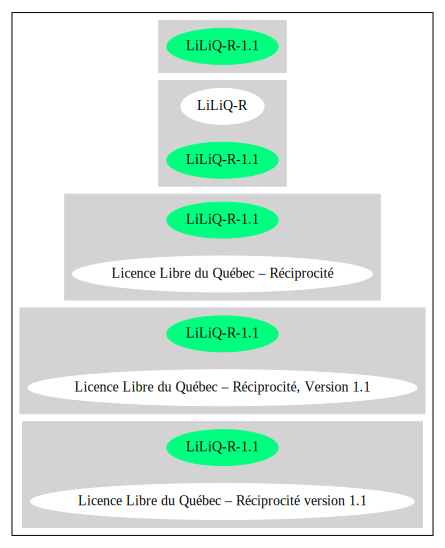

Licence Libre du Québec – Réciprocité version 1.1 (LiLiQ-R-1.1)
===============================================================

[TABLE]

**Other Names:**

-   `scancode://liliq-r-1.1`

-   `Licence Libre du Québec – Réciprocité, Version 1.1`

Comments on (easy) usability
----------------------------

-   **↑**“Is OSI Approved” (source:
    [SPDX](https://spdx.org/licenses/LiLiQ-R-1.1.html "SPDX"))

URLs
----

-   **Homepage:** https://opensource.org/licenses/LiLiQ-R-1.1

-   **SPDX:** http://spdx.org/licenses/LiLiQ-R-1.1.json

-   https://www.forge.gouv.qc.ca/participez/licence-logicielle/licence-libre-du-quebec-liliq-en-francais/licence-libre-du-quebec-reciprocite-liliq-r-v1-1/

Text
----

    Licence Libre du Québec – Réciprocité (LiLiQ-R)
    Version 1.1

    1. Préambule 
    Cette licence s'applique à tout logiciel distribué dont le titulaire du droit d'auteur précise qu'il est sujet aux termes de la Licence Libre du Québec – Réciprocité (LiLiQ-R) (ci-après appelée la « licence »).

    2. Définitions 
    Dans la présente licence, à moins que le contexte n'indique un sens différent, on entend par:

    « concédant » : le titulaire du droit d'auteur sur le logiciel, ou toute personne dûment autorisée par ce dernier à accorder la présente licence; 
    « contributeur » : le titulaire du droit d'auteur ou toute personne autorisée par ce dernier à soumettre au concédant une contribution. Un contributeur dont sa contribution est incorporée au logiciel est considéré comme un concédant en regard de sa contribution; 
    « contribution » : tout logiciel original, ou partie de logiciel original soumis et destiné à être incorporé dans le logiciel; 
    « distribution » : le fait de délivrer une copie du logiciel; 
    « licencié » : toute personne qui possède une copie du logiciel et qui exerce les droits concédés par la licence; 
    « logiciel » : une œuvre protégée par le droit d'auteur, telle qu'un programme d'ordinateur et sa documentation, pour laquelle le titulaire du droit d'auteur a précisé qu'elle est sujette aux termes de la présente licence; 
    « logiciel dérivé » : tout logiciel original réalisé par un licencié, autre que le logiciel ou un logiciel modifié, qui produit ou reproduit la totalité ou une partie importante du logiciel; 
    « logiciel modifié » : toute modification par un licencié de l'un des fichiers source du logiciel ou encore tout nouveau fichier source qui incorpore le logiciel ou une partie importante de ce dernier.

    3. Licence de droit d'auteur 
    Sous réserve des termes de la licence, le concédant accorde au licencié une licence non exclusive et libre de redevances lui permettant d’exercer les droits suivants sur le logiciel :

    1 Produire ou reproduire la totalité ou une partie importante; 
    2 Exécuter ou représenter la totalité ou une partie importante en public; 
    3 Publier la totalité ou une partie importante.

    Cette licence est accordée sans limite territoriale et sans limite de temps.

    L'exercice complet de ces droits est sujet à la distribution par le concédant du code source du logiciel, lequel doit être sous une forme permettant d'y apporter des modifications. Le concédant peut aussi distribuer le logiciel accompagné d'une offre de distribuer le code source du logiciel, sans frais supplémentaires, autres que ceux raisonnables afin de permettre la livraison du code source. Cette offre doit être valide pendant une durée raisonnable.

    4. Distribution 
    Le licencié peut distribuer des copies du logiciel, d'un logiciel modifié ou dérivé, sous réserve de respecter les conditions suivantes :

    1 Le logiciel doit être accompagné d'un exemplaire de cette licence; 
    2 Si le logiciel a été modifié, le licencié doit en faire la mention, de préférence dans chacun des fichiers modifiés dont la nature permet une telle mention; 
    3 Les étiquettes ou mentions faisant état des droits d'auteur, des marques de commerce, des garanties ou de la paternité concernant le logiciel ne doivent pas être modifiées ou supprimées, à moins que ces étiquettes ou mentions ne soient inapplicables à un logiciel modifié ou dérivé donné.

    4.1. Réciprocité 
    Chaque fois que le licencié distribue le logiciel, le concédant offre au récipiendaire une concession sur le logiciel selon les termes de la présente licence. Le licencié doit offrir une concession selon les termes de la présente licence pour tout logiciel modifié qu'il distribue.

    Chaque fois que le licencié distribue le logiciel ou un logiciel modifié, ce dernier doit assumer l'obligation d'en distribuer le code source, de la manière prévue au troisième alinéa de l'article 3.

    4.2. Compatibilité 
    Dans la mesure où le licencié souhaite distribuer un logiciel modifié combiné à un logiciel assujetti à une licence compatible, mais dont il ne serait pas possible d'en respecter les termes, le concédant offre, en plus de la présente concession, une concession selon les termes de cette licence compatible.

    Un licencié qui est titulaire exclusif du droit d'auteur sur le logiciel assujetti à une licence compatible ne peut pas se prévaloir de cette offre. Il en est de même pour toute autre personne dûment autorisée à sous-licencier par le titulaire exclusif du droit d'auteur sur le logiciel assujetti à une licence compatible.

    Est considérée comme une licence compatible toute licence libre approuvée ou certifiée par la Free Software Foundation ou l'Open Source Initiative, dont le niveau de réciprocité est comparable ou supérieur à celui de la présente licence, sans toutefois être moindre, notamment :

    1 Common Development and Distribution License (CDDL-1.0) 
    2 Common Public License Version 1.0 (CPL-1.0) 
    3 Contrat de licence de logiciel libre CeCILL, version 2.1 (CECILL-2.1) 
    4 Contrat de licence de logiciel libre CeCILL-C (CECILL-C) 
    5 Eclipse Public License - v 1.0 (EPL-1.0) 
    6 European Union Public License, version 1.1 (EUPL v. 1.1) 
    7 Licence Libre du Québec – Réciprocité forte version 1.1 (LiLiQ-R+ 1.1) 
    8 GNU General Public License Version 2 (GNU GPLv2) 
    9 GNU General Public License Version 3 (GNU GPLv3) 
    10 GNU Lesser General Public License Version 2.1 (GNU LGPLv2.1) 
    11 GNU Lesser General Public License Version 3 (GNU LGPLv3) 
    12 Mozilla Public License Version 2.0 (MPL-2.0)

    5. Contributions 
    Sous réserve d'une entente distincte, toute contribution soumise par un contributeur au concédant pour inclusion dans le logiciel sera soumise aux termes de cette licence.

    6. Marques de commerce 
    La licence n'accorde aucune permission particulière qui permettrait d'utiliser les marques de commerce du concédant, autre que celle requise permettant d'identifier la provenance du logiciel.

    7. Garanties 
    Sauf mention contraire, le concédant distribue le logiciel sans aucune garantie, aux risques et périls de l'acquéreur de la copie du logiciel, et ce, sans assurer que le logiciel puisse répondre à un besoin particulier ou puisse donner un résultat quelconque.

    Sans lier le concédant d'une quelconque manière, rien n'empêche un licencié d'offrir ou d'exclure des garanties ou du support.

    8. Responsabilité 
    Le licencié est responsable de tout préjudice résultant de l'exercice des droits accordés par la licence.

    Le concédant ne saurait être tenu responsable du préjudice subi par le licencié ou par des tiers, pour quelque cause que ce soit en lien avec la licence et les droits qui y sont accordés.

    9. Résiliation 
    La présente licence est résiliée de plein droit dès que les droits qui y sont accordés ne sont pas exercés conformément aux termes qui y sont stipulés.

    Toutefois, si le défaut est corrigé dans un délai de 30 jours de sa prise de connaissance par la personne en défaut, et qu'il s'agit du premier défaut, la licence est accordée de nouveau.

    Pour tout défaut subséquent, le consentement exprès du concédant est nécessaire afin que la licence soit accordée de nouveau.

    10. Version de la licence 
    Le Centre de services partagés du Québec, ses ayants cause ou toute personne qu'il désigne, peuvent diffuser des versions révisées ou modifiées de cette licence. Chaque version recevra un numéro unique. Si un logiciel est déjà soumis aux termes d'une version spécifique, c'est seulement cette version qui liera les parties à la licence.

    Le concédant peut aussi choisir de concéder la licence sous la version actuelle ou toute version ultérieure, auquel cas le licencié peut choisir sous quelle version la licence lui est accordée.

    11. Divers 
    Dans la mesure où le concédant est un ministère, un organisme public ou une personne morale de droit public, créés en vertu d'une loi de l'Assemblée nationale du Québec, la licence est régie par le droit applicable au Québec et en cas de contestation, les tribunaux du Québec seront seuls compétents.

    La présente licence peut être distribuée sans conditions particulières. Toutefois, une version modifiée doit être distribuée sous un nom différent. Toute référence au Centre de services partagés du Québec, et, le cas échéant, ses ayant droit, doit être retirée, autre que celle permettant d'identifier la provenance de la licence.

------------------------------------------------------------------------

Raw Data
--------

    {
        "__impliedNames": [
            "LiLiQ-R-1.1",
            "Licence Libre du Québec – Réciprocité version 1.1",
            "scancode://liliq-r-1.1",
            "Licence Libre du Québec – Réciprocité, Version 1.1"
        ],
        "__impliedId": "LiLiQ-R-1.1",
        "facts": {
            "SPDX": {
                "isSPDXLicenseDeprecated": false,
                "spdxFullName": "Licence Libre du Québec – Réciprocité version 1.1",
                "spdxDetailsURL": "http://spdx.org/licenses/LiLiQ-R-1.1.json",
                "_sourceURL": "https://spdx.org/licenses/LiLiQ-R-1.1.html",
                "spdxLicIsOSIApproved": true,
                "spdxSeeAlso": [
                    "https://www.forge.gouv.qc.ca/participez/licence-logicielle/licence-libre-du-quebec-liliq-en-francais/licence-libre-du-quebec-reciprocite-liliq-r-v1-1/",
                    "http://opensource.org/licenses/LiLiQ-R-1.1"
                ],
                "_implications": {
                    "__impliedNames": [
                        "LiLiQ-R-1.1",
                        "Licence Libre du Québec – Réciprocité version 1.1"
                    ],
                    "__impliedId": "LiLiQ-R-1.1",
                    "__impliedJudgement": [
                        [
                            "SPDX",
                            {
                                "tag": "PositiveJudgement",
                                "contents": "Is OSI Approved"
                            }
                        ]
                    ],
                    "__isOsiApproved": true,
                    "__impliedURLs": [
                        [
                            "SPDX",
                            "http://spdx.org/licenses/LiLiQ-R-1.1.json"
                        ],
                        [
                            null,
                            "https://www.forge.gouv.qc.ca/participez/licence-logicielle/licence-libre-du-quebec-liliq-en-francais/licence-libre-du-quebec-reciprocite-liliq-r-v1-1/"
                        ],
                        [
                            null,
                            "http://opensource.org/licenses/LiLiQ-R-1.1"
                        ]
                    ]
                },
                "spdxLicenseId": "LiLiQ-R-1.1"
            },
            "Scancode": {
                "otherUrls": null,
                "homepageUrl": "https://opensource.org/licenses/LiLiQ-R-1.1",
                "shortName": "LiLiQ-R-1.1",
                "textUrls": null,
                "text": "Licence Libre du Québec – Réciprocité (LiLiQ-R)\nVersion 1.1\n\n1. Préambule \nCette licence s'applique à tout logiciel distribué dont le titulaire du droit d'auteur précise qu'il est sujet aux termes de la Licence Libre du Québec – Réciprocité (LiLiQ-R) (ci-après appelée la « licence »).\n\n2. Définitions \nDans la présente licence, à moins que le contexte n'indique un sens différent, on entend par:\n\n« concédant » : le titulaire du droit d'auteur sur le logiciel, ou toute personne dûment autorisée par ce dernier à accorder la présente licence; \n« contributeur » : le titulaire du droit d'auteur ou toute personne autorisée par ce dernier à soumettre au concédant une contribution. Un contributeur dont sa contribution est incorporée au logiciel est considéré comme un concédant en regard de sa contribution; \n« contribution » : tout logiciel original, ou partie de logiciel original soumis et destiné à être incorporé dans le logiciel; \n« distribution » : le fait de délivrer une copie du logiciel; \n« licencié » : toute personne qui possède une copie du logiciel et qui exerce les droits concédés par la licence; \n« logiciel » : une œuvre protégée par le droit d'auteur, telle qu'un programme d'ordinateur et sa documentation, pour laquelle le titulaire du droit d'auteur a précisé qu'elle est sujette aux termes de la présente licence; \n« logiciel dérivé » : tout logiciel original réalisé par un licencié, autre que le logiciel ou un logiciel modifié, qui produit ou reproduit la totalité ou une partie importante du logiciel; \n« logiciel modifié » : toute modification par un licencié de l'un des fichiers source du logiciel ou encore tout nouveau fichier source qui incorpore le logiciel ou une partie importante de ce dernier.\n\n3. Licence de droit d'auteur \nSous réserve des termes de la licence, le concédant accorde au licencié une licence non exclusive et libre de redevances lui permettant d’exercer les droits suivants sur le logiciel :\n\n1 Produire ou reproduire la totalité ou une partie importante; \n2 Exécuter ou représenter la totalité ou une partie importante en public; \n3 Publier la totalité ou une partie importante.\n\nCette licence est accordée sans limite territoriale et sans limite de temps.\n\nL'exercice complet de ces droits est sujet à la distribution par le concédant du code source du logiciel, lequel doit être sous une forme permettant d'y apporter des modifications. Le concédant peut aussi distribuer le logiciel accompagné d'une offre de distribuer le code source du logiciel, sans frais supplémentaires, autres que ceux raisonnables afin de permettre la livraison du code source. Cette offre doit être valide pendant une durée raisonnable.\n\n4. Distribution \nLe licencié peut distribuer des copies du logiciel, d'un logiciel modifié ou dérivé, sous réserve de respecter les conditions suivantes :\n\n1 Le logiciel doit être accompagné d'un exemplaire de cette licence; \n2 Si le logiciel a été modifié, le licencié doit en faire la mention, de préférence dans chacun des fichiers modifiés dont la nature permet une telle mention; \n3 Les étiquettes ou mentions faisant état des droits d'auteur, des marques de commerce, des garanties ou de la paternité concernant le logiciel ne doivent pas être modifiées ou supprimées, à moins que ces étiquettes ou mentions ne soient inapplicables à un logiciel modifié ou dérivé donné.\n\n4.1. Réciprocité \nChaque fois que le licencié distribue le logiciel, le concédant offre au récipiendaire une concession sur le logiciel selon les termes de la présente licence. Le licencié doit offrir une concession selon les termes de la présente licence pour tout logiciel modifié qu'il distribue.\n\nChaque fois que le licencié distribue le logiciel ou un logiciel modifié, ce dernier doit assumer l'obligation d'en distribuer le code source, de la manière prévue au troisième alinéa de l'article 3.\n\n4.2. Compatibilité \nDans la mesure où le licencié souhaite distribuer un logiciel modifié combiné à un logiciel assujetti à une licence compatible, mais dont il ne serait pas possible d'en respecter les termes, le concédant offre, en plus de la présente concession, une concession selon les termes de cette licence compatible.\n\nUn licencié qui est titulaire exclusif du droit d'auteur sur le logiciel assujetti à une licence compatible ne peut pas se prévaloir de cette offre. Il en est de même pour toute autre personne dûment autorisée à sous-licencier par le titulaire exclusif du droit d'auteur sur le logiciel assujetti à une licence compatible.\n\nEst considérée comme une licence compatible toute licence libre approuvée ou certifiée par la Free Software Foundation ou l'Open Source Initiative, dont le niveau de réciprocité est comparable ou supérieur à celui de la présente licence, sans toutefois être moindre, notamment :\n\n1 Common Development and Distribution License (CDDL-1.0) \n2 Common Public License Version 1.0 (CPL-1.0) \n3 Contrat de licence de logiciel libre CeCILL, version 2.1 (CECILL-2.1) \n4 Contrat de licence de logiciel libre CeCILL-C (CECILL-C) \n5 Eclipse Public License - v 1.0 (EPL-1.0) \n6 European Union Public License, version 1.1 (EUPL v. 1.1) \n7 Licence Libre du Québec – Réciprocité forte version 1.1 (LiLiQ-R+ 1.1) \n8 GNU General Public License Version 2 (GNU GPLv2) \n9 GNU General Public License Version 3 (GNU GPLv3) \n10 GNU Lesser General Public License Version 2.1 (GNU LGPLv2.1) \n11 GNU Lesser General Public License Version 3 (GNU LGPLv3) \n12 Mozilla Public License Version 2.0 (MPL-2.0)\n\n5. Contributions \nSous réserve d'une entente distincte, toute contribution soumise par un contributeur au concédant pour inclusion dans le logiciel sera soumise aux termes de cette licence.\n\n6. Marques de commerce \nLa licence n'accorde aucune permission particulière qui permettrait d'utiliser les marques de commerce du concédant, autre que celle requise permettant d'identifier la provenance du logiciel.\n\n7. Garanties \nSauf mention contraire, le concédant distribue le logiciel sans aucune garantie, aux risques et périls de l'acquéreur de la copie du logiciel, et ce, sans assurer que le logiciel puisse répondre à un besoin particulier ou puisse donner un résultat quelconque.\n\nSans lier le concédant d'une quelconque manière, rien n'empêche un licencié d'offrir ou d'exclure des garanties ou du support.\n\n8. Responsabilité \nLe licencié est responsable de tout préjudice résultant de l'exercice des droits accordés par la licence.\n\nLe concédant ne saurait être tenu responsable du préjudice subi par le licencié ou par des tiers, pour quelque cause que ce soit en lien avec la licence et les droits qui y sont accordés.\n\n9. Résiliation \nLa présente licence est résiliée de plein droit dès que les droits qui y sont accordés ne sont pas exercés conformément aux termes qui y sont stipulés.\n\nToutefois, si le défaut est corrigé dans un délai de 30 jours de sa prise de connaissance par la personne en défaut, et qu'il s'agit du premier défaut, la licence est accordée de nouveau.\n\nPour tout défaut subséquent, le consentement exprès du concédant est nécessaire afin que la licence soit accordée de nouveau.\n\n10. Version de la licence \nLe Centre de services partagés du Québec, ses ayants cause ou toute personne qu'il désigne, peuvent diffuser des versions révisées ou modifiées de cette licence. Chaque version recevra un numéro unique. Si un logiciel est déjà soumis aux termes d'une version spécifique, c'est seulement cette version qui liera les parties à la licence.\n\nLe concédant peut aussi choisir de concéder la licence sous la version actuelle ou toute version ultérieure, auquel cas le licencié peut choisir sous quelle version la licence lui est accordée.\n\n11. Divers \nDans la mesure où le concédant est un ministère, un organisme public ou une personne morale de droit public, créés en vertu d'une loi de l'Assemblée nationale du Québec, la licence est régie par le droit applicable au Québec et en cas de contestation, les tribunaux du Québec seront seuls compétents.\n\nLa présente licence peut être distribuée sans conditions particulières. Toutefois, une version modifiée doit être distribuée sous un nom différent. Toute référence au Centre de services partagés du Québec, et, le cas échéant, ses ayant droit, doit être retirée, autre que celle permettant d'identifier la provenance de la licence.",
                "category": "Copyleft Limited",
                "osiUrl": "https://opensource.org/licenses/LiLiQ-R-1.1",
                "owner": "Quebec",
                "_sourceURL": "https://github.com/nexB/scancode-toolkit/blob/develop/src/licensedcode/data/licenses/liliq-r-1.1.yml",
                "key": "liliq-r-1.1",
                "name": "Licence Libre du Québec – Réciprocité version 1.",
                "spdxId": "LiLiQ-R-1.1",
                "notes": null,
                "_implications": {
                    "__impliedNames": [
                        "scancode://liliq-r-1.1",
                        "LiLiQ-R-1.1",
                        "LiLiQ-R-1.1"
                    ],
                    "__impliedId": "LiLiQ-R-1.1",
                    "__impliedCopyleft": [
                        [
                            "Scancode",
                            "WeakCopyleft"
                        ]
                    ],
                    "__calculatedCopyleft": "WeakCopyleft",
                    "__impliedText": "Licence Libre du Québec – Réciprocité (LiLiQ-R)\nVersion 1.1\n\n1. Préambule \nCette licence s'applique à tout logiciel distribué dont le titulaire du droit d'auteur précise qu'il est sujet aux termes de la Licence Libre du Québec – Réciprocité (LiLiQ-R) (ci-après appelée la « licence »).\n\n2. Définitions \nDans la présente licence, à moins que le contexte n'indique un sens différent, on entend par:\n\n« concédant » : le titulaire du droit d'auteur sur le logiciel, ou toute personne dûment autorisée par ce dernier à accorder la présente licence; \n« contributeur » : le titulaire du droit d'auteur ou toute personne autorisée par ce dernier à soumettre au concédant une contribution. Un contributeur dont sa contribution est incorporée au logiciel est considéré comme un concédant en regard de sa contribution; \n« contribution » : tout logiciel original, ou partie de logiciel original soumis et destiné à être incorporé dans le logiciel; \n« distribution » : le fait de délivrer une copie du logiciel; \n« licencié » : toute personne qui possède une copie du logiciel et qui exerce les droits concédés par la licence; \n« logiciel » : une œuvre protégée par le droit d'auteur, telle qu'un programme d'ordinateur et sa documentation, pour laquelle le titulaire du droit d'auteur a précisé qu'elle est sujette aux termes de la présente licence; \n« logiciel dérivé » : tout logiciel original réalisé par un licencié, autre que le logiciel ou un logiciel modifié, qui produit ou reproduit la totalité ou une partie importante du logiciel; \n« logiciel modifié » : toute modification par un licencié de l'un des fichiers source du logiciel ou encore tout nouveau fichier source qui incorpore le logiciel ou une partie importante de ce dernier.\n\n3. Licence de droit d'auteur \nSous réserve des termes de la licence, le concédant accorde au licencié une licence non exclusive et libre de redevances lui permettant d’exercer les droits suivants sur le logiciel :\n\n1 Produire ou reproduire la totalité ou une partie importante; \n2 Exécuter ou représenter la totalité ou une partie importante en public; \n3 Publier la totalité ou une partie importante.\n\nCette licence est accordée sans limite territoriale et sans limite de temps.\n\nL'exercice complet de ces droits est sujet à la distribution par le concédant du code source du logiciel, lequel doit être sous une forme permettant d'y apporter des modifications. Le concédant peut aussi distribuer le logiciel accompagné d'une offre de distribuer le code source du logiciel, sans frais supplémentaires, autres que ceux raisonnables afin de permettre la livraison du code source. Cette offre doit être valide pendant une durée raisonnable.\n\n4. Distribution \nLe licencié peut distribuer des copies du logiciel, d'un logiciel modifié ou dérivé, sous réserve de respecter les conditions suivantes :\n\n1 Le logiciel doit être accompagné d'un exemplaire de cette licence; \n2 Si le logiciel a été modifié, le licencié doit en faire la mention, de préférence dans chacun des fichiers modifiés dont la nature permet une telle mention; \n3 Les étiquettes ou mentions faisant état des droits d'auteur, des marques de commerce, des garanties ou de la paternité concernant le logiciel ne doivent pas être modifiées ou supprimées, à moins que ces étiquettes ou mentions ne soient inapplicables à un logiciel modifié ou dérivé donné.\n\n4.1. Réciprocité \nChaque fois que le licencié distribue le logiciel, le concédant offre au récipiendaire une concession sur le logiciel selon les termes de la présente licence. Le licencié doit offrir une concession selon les termes de la présente licence pour tout logiciel modifié qu'il distribue.\n\nChaque fois que le licencié distribue le logiciel ou un logiciel modifié, ce dernier doit assumer l'obligation d'en distribuer le code source, de la manière prévue au troisième alinéa de l'article 3.\n\n4.2. Compatibilité \nDans la mesure où le licencié souhaite distribuer un logiciel modifié combiné à un logiciel assujetti à une licence compatible, mais dont il ne serait pas possible d'en respecter les termes, le concédant offre, en plus de la présente concession, une concession selon les termes de cette licence compatible.\n\nUn licencié qui est titulaire exclusif du droit d'auteur sur le logiciel assujetti à une licence compatible ne peut pas se prévaloir de cette offre. Il en est de même pour toute autre personne dûment autorisée à sous-licencier par le titulaire exclusif du droit d'auteur sur le logiciel assujetti à une licence compatible.\n\nEst considérée comme une licence compatible toute licence libre approuvée ou certifiée par la Free Software Foundation ou l'Open Source Initiative, dont le niveau de réciprocité est comparable ou supérieur à celui de la présente licence, sans toutefois être moindre, notamment :\n\n1 Common Development and Distribution License (CDDL-1.0) \n2 Common Public License Version 1.0 (CPL-1.0) \n3 Contrat de licence de logiciel libre CeCILL, version 2.1 (CECILL-2.1) \n4 Contrat de licence de logiciel libre CeCILL-C (CECILL-C) \n5 Eclipse Public License - v 1.0 (EPL-1.0) \n6 European Union Public License, version 1.1 (EUPL v. 1.1) \n7 Licence Libre du Québec – Réciprocité forte version 1.1 (LiLiQ-R+ 1.1) \n8 GNU General Public License Version 2 (GNU GPLv2) \n9 GNU General Public License Version 3 (GNU GPLv3) \n10 GNU Lesser General Public License Version 2.1 (GNU LGPLv2.1) \n11 GNU Lesser General Public License Version 3 (GNU LGPLv3) \n12 Mozilla Public License Version 2.0 (MPL-2.0)\n\n5. Contributions \nSous réserve d'une entente distincte, toute contribution soumise par un contributeur au concédant pour inclusion dans le logiciel sera soumise aux termes de cette licence.\n\n6. Marques de commerce \nLa licence n'accorde aucune permission particulière qui permettrait d'utiliser les marques de commerce du concédant, autre que celle requise permettant d'identifier la provenance du logiciel.\n\n7. Garanties \nSauf mention contraire, le concédant distribue le logiciel sans aucune garantie, aux risques et périls de l'acquéreur de la copie du logiciel, et ce, sans assurer que le logiciel puisse répondre à un besoin particulier ou puisse donner un résultat quelconque.\n\nSans lier le concédant d'une quelconque manière, rien n'empêche un licencié d'offrir ou d'exclure des garanties ou du support.\n\n8. Responsabilité \nLe licencié est responsable de tout préjudice résultant de l'exercice des droits accordés par la licence.\n\nLe concédant ne saurait être tenu responsable du préjudice subi par le licencié ou par des tiers, pour quelque cause que ce soit en lien avec la licence et les droits qui y sont accordés.\n\n9. Résiliation \nLa présente licence est résiliée de plein droit dès que les droits qui y sont accordés ne sont pas exercés conformément aux termes qui y sont stipulés.\n\nToutefois, si le défaut est corrigé dans un délai de 30 jours de sa prise de connaissance par la personne en défaut, et qu'il s'agit du premier défaut, la licence est accordée de nouveau.\n\nPour tout défaut subséquent, le consentement exprès du concédant est nécessaire afin que la licence soit accordée de nouveau.\n\n10. Version de la licence \nLe Centre de services partagés du Québec, ses ayants cause ou toute personne qu'il désigne, peuvent diffuser des versions révisées ou modifiées de cette licence. Chaque version recevra un numéro unique. Si un logiciel est déjà soumis aux termes d'une version spécifique, c'est seulement cette version qui liera les parties à la licence.\n\nLe concédant peut aussi choisir de concéder la licence sous la version actuelle ou toute version ultérieure, auquel cas le licencié peut choisir sous quelle version la licence lui est accordée.\n\n11. Divers \nDans la mesure où le concédant est un ministère, un organisme public ou une personne morale de droit public, créés en vertu d'une loi de l'Assemblée nationale du Québec, la licence est régie par le droit applicable au Québec et en cas de contestation, les tribunaux du Québec seront seuls compétents.\n\nLa présente licence peut être distribuée sans conditions particulières. Toutefois, une version modifiée doit être distribuée sous un nom différent. Toute référence au Centre de services partagés du Québec, et, le cas échéant, ses ayant droit, doit être retirée, autre que celle permettant d'identifier la provenance de la licence.",
                    "__impliedURLs": [
                        [
                            "Homepage",
                            "https://opensource.org/licenses/LiLiQ-R-1.1"
                        ],
                        [
                            "OSI Page",
                            "https://opensource.org/licenses/LiLiQ-R-1.1"
                        ]
                    ]
                }
            },
            "OpenSourceInitiative": {
                "text": [
                    {
                        "url": "https://opensource.org/licenses/LiLiQ-R-1.1",
                        "title": "HTML",
                        "media_type": "text/html"
                    }
                ],
                "identifiers": [],
                "superseded_by": null,
                "_sourceURL": "https://opensource.org/licenses/",
                "name": "Licence Libre du Québec – Réciprocité, Version 1.1",
                "other_names": [],
                "keywords": [
                    "international",
                    "osi-approved",
                    "copyleft"
                ],
                "id": "LiLiQ-R-1.1",
                "links": [
                    {
                        "note": "OSI Page",
                        "url": "https://opensource.org/licenses/LiLiQ-R-1.1"
                    }
                ],
                "_implications": {
                    "__impliedNames": [
                        "LiLiQ-R-1.1",
                        "Licence Libre du Québec – Réciprocité, Version 1.1"
                    ],
                    "__impliedURLs": [
                        [
                            "OSI Page",
                            "https://opensource.org/licenses/LiLiQ-R-1.1"
                        ]
                    ]
                }
            }
        },
        "__impliedJudgement": [
            [
                "SPDX",
                {
                    "tag": "PositiveJudgement",
                    "contents": "Is OSI Approved"
                }
            ]
        ],
        "__impliedCopyleft": [
            [
                "Scancode",
                "WeakCopyleft"
            ]
        ],
        "__calculatedCopyleft": "WeakCopyleft",
        "__isOsiApproved": true,
        "__impliedText": "Licence Libre du Québec – Réciprocité (LiLiQ-R)\nVersion 1.1\n\n1. Préambule \nCette licence s'applique à tout logiciel distribué dont le titulaire du droit d'auteur précise qu'il est sujet aux termes de la Licence Libre du Québec – Réciprocité (LiLiQ-R) (ci-après appelée la « licence »).\n\n2. Définitions \nDans la présente licence, à moins que le contexte n'indique un sens différent, on entend par:\n\n« concédant » : le titulaire du droit d'auteur sur le logiciel, ou toute personne dûment autorisée par ce dernier à accorder la présente licence; \n« contributeur » : le titulaire du droit d'auteur ou toute personne autorisée par ce dernier à soumettre au concédant une contribution. Un contributeur dont sa contribution est incorporée au logiciel est considéré comme un concédant en regard de sa contribution; \n« contribution » : tout logiciel original, ou partie de logiciel original soumis et destiné à être incorporé dans le logiciel; \n« distribution » : le fait de délivrer une copie du logiciel; \n« licencié » : toute personne qui possède une copie du logiciel et qui exerce les droits concédés par la licence; \n« logiciel » : une œuvre protégée par le droit d'auteur, telle qu'un programme d'ordinateur et sa documentation, pour laquelle le titulaire du droit d'auteur a précisé qu'elle est sujette aux termes de la présente licence; \n« logiciel dérivé » : tout logiciel original réalisé par un licencié, autre que le logiciel ou un logiciel modifié, qui produit ou reproduit la totalité ou une partie importante du logiciel; \n« logiciel modifié » : toute modification par un licencié de l'un des fichiers source du logiciel ou encore tout nouveau fichier source qui incorpore le logiciel ou une partie importante de ce dernier.\n\n3. Licence de droit d'auteur \nSous réserve des termes de la licence, le concédant accorde au licencié une licence non exclusive et libre de redevances lui permettant d’exercer les droits suivants sur le logiciel :\n\n1 Produire ou reproduire la totalité ou une partie importante; \n2 Exécuter ou représenter la totalité ou une partie importante en public; \n3 Publier la totalité ou une partie importante.\n\nCette licence est accordée sans limite territoriale et sans limite de temps.\n\nL'exercice complet de ces droits est sujet à la distribution par le concédant du code source du logiciel, lequel doit être sous une forme permettant d'y apporter des modifications. Le concédant peut aussi distribuer le logiciel accompagné d'une offre de distribuer le code source du logiciel, sans frais supplémentaires, autres que ceux raisonnables afin de permettre la livraison du code source. Cette offre doit être valide pendant une durée raisonnable.\n\n4. Distribution \nLe licencié peut distribuer des copies du logiciel, d'un logiciel modifié ou dérivé, sous réserve de respecter les conditions suivantes :\n\n1 Le logiciel doit être accompagné d'un exemplaire de cette licence; \n2 Si le logiciel a été modifié, le licencié doit en faire la mention, de préférence dans chacun des fichiers modifiés dont la nature permet une telle mention; \n3 Les étiquettes ou mentions faisant état des droits d'auteur, des marques de commerce, des garanties ou de la paternité concernant le logiciel ne doivent pas être modifiées ou supprimées, à moins que ces étiquettes ou mentions ne soient inapplicables à un logiciel modifié ou dérivé donné.\n\n4.1. Réciprocité \nChaque fois que le licencié distribue le logiciel, le concédant offre au récipiendaire une concession sur le logiciel selon les termes de la présente licence. Le licencié doit offrir une concession selon les termes de la présente licence pour tout logiciel modifié qu'il distribue.\n\nChaque fois que le licencié distribue le logiciel ou un logiciel modifié, ce dernier doit assumer l'obligation d'en distribuer le code source, de la manière prévue au troisième alinéa de l'article 3.\n\n4.2. Compatibilité \nDans la mesure où le licencié souhaite distribuer un logiciel modifié combiné à un logiciel assujetti à une licence compatible, mais dont il ne serait pas possible d'en respecter les termes, le concédant offre, en plus de la présente concession, une concession selon les termes de cette licence compatible.\n\nUn licencié qui est titulaire exclusif du droit d'auteur sur le logiciel assujetti à une licence compatible ne peut pas se prévaloir de cette offre. Il en est de même pour toute autre personne dûment autorisée à sous-licencier par le titulaire exclusif du droit d'auteur sur le logiciel assujetti à une licence compatible.\n\nEst considérée comme une licence compatible toute licence libre approuvée ou certifiée par la Free Software Foundation ou l'Open Source Initiative, dont le niveau de réciprocité est comparable ou supérieur à celui de la présente licence, sans toutefois être moindre, notamment :\n\n1 Common Development and Distribution License (CDDL-1.0) \n2 Common Public License Version 1.0 (CPL-1.0) \n3 Contrat de licence de logiciel libre CeCILL, version 2.1 (CECILL-2.1) \n4 Contrat de licence de logiciel libre CeCILL-C (CECILL-C) \n5 Eclipse Public License - v 1.0 (EPL-1.0) \n6 European Union Public License, version 1.1 (EUPL v. 1.1) \n7 Licence Libre du Québec – Réciprocité forte version 1.1 (LiLiQ-R+ 1.1) \n8 GNU General Public License Version 2 (GNU GPLv2) \n9 GNU General Public License Version 3 (GNU GPLv3) \n10 GNU Lesser General Public License Version 2.1 (GNU LGPLv2.1) \n11 GNU Lesser General Public License Version 3 (GNU LGPLv3) \n12 Mozilla Public License Version 2.0 (MPL-2.0)\n\n5. Contributions \nSous réserve d'une entente distincte, toute contribution soumise par un contributeur au concédant pour inclusion dans le logiciel sera soumise aux termes de cette licence.\n\n6. Marques de commerce \nLa licence n'accorde aucune permission particulière qui permettrait d'utiliser les marques de commerce du concédant, autre que celle requise permettant d'identifier la provenance du logiciel.\n\n7. Garanties \nSauf mention contraire, le concédant distribue le logiciel sans aucune garantie, aux risques et périls de l'acquéreur de la copie du logiciel, et ce, sans assurer que le logiciel puisse répondre à un besoin particulier ou puisse donner un résultat quelconque.\n\nSans lier le concédant d'une quelconque manière, rien n'empêche un licencié d'offrir ou d'exclure des garanties ou du support.\n\n8. Responsabilité \nLe licencié est responsable de tout préjudice résultant de l'exercice des droits accordés par la licence.\n\nLe concédant ne saurait être tenu responsable du préjudice subi par le licencié ou par des tiers, pour quelque cause que ce soit en lien avec la licence et les droits qui y sont accordés.\n\n9. Résiliation \nLa présente licence est résiliée de plein droit dès que les droits qui y sont accordés ne sont pas exercés conformément aux termes qui y sont stipulés.\n\nToutefois, si le défaut est corrigé dans un délai de 30 jours de sa prise de connaissance par la personne en défaut, et qu'il s'agit du premier défaut, la licence est accordée de nouveau.\n\nPour tout défaut subséquent, le consentement exprès du concédant est nécessaire afin que la licence soit accordée de nouveau.\n\n10. Version de la licence \nLe Centre de services partagés du Québec, ses ayants cause ou toute personne qu'il désigne, peuvent diffuser des versions révisées ou modifiées de cette licence. Chaque version recevra un numéro unique. Si un logiciel est déjà soumis aux termes d'une version spécifique, c'est seulement cette version qui liera les parties à la licence.\n\nLe concédant peut aussi choisir de concéder la licence sous la version actuelle ou toute version ultérieure, auquel cas le licencié peut choisir sous quelle version la licence lui est accordée.\n\n11. Divers \nDans la mesure où le concédant est un ministère, un organisme public ou une personne morale de droit public, créés en vertu d'une loi de l'Assemblée nationale du Québec, la licence est régie par le droit applicable au Québec et en cas de contestation, les tribunaux du Québec seront seuls compétents.\n\nLa présente licence peut être distribuée sans conditions particulières. Toutefois, une version modifiée doit être distribuée sous un nom différent. Toute référence au Centre de services partagés du Québec, et, le cas échéant, ses ayant droit, doit être retirée, autre que celle permettant d'identifier la provenance de la licence.",
        "__impliedURLs": [
            [
                "SPDX",
                "http://spdx.org/licenses/LiLiQ-R-1.1.json"
            ],
            [
                null,
                "https://www.forge.gouv.qc.ca/participez/licence-logicielle/licence-libre-du-quebec-liliq-en-francais/licence-libre-du-quebec-reciprocite-liliq-r-v1-1/"
            ],
            [
                null,
                "http://opensource.org/licenses/LiLiQ-R-1.1"
            ],
            [
                "Homepage",
                "https://opensource.org/licenses/LiLiQ-R-1.1"
            ],
            [
                "OSI Page",
                "https://opensource.org/licenses/LiLiQ-R-1.1"
            ]
        ]
    }

------------------------------------------------------------------------

Dot Cluster Graph
-----------------

