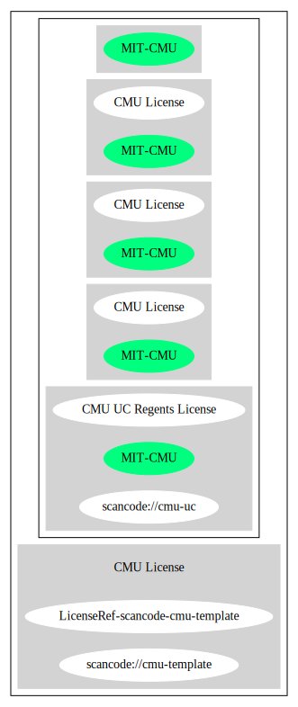

CMU License (MIT-CMU)
=====================

[TABLE]

**Other Names:**

-   `scancode://cmu-uc`

-   `CMU UC Regents License`

-   `scancode://cmu-template`

Comments on (easy) usability
----------------------------

-   **↑**“Rating is: Bronze” (source: [BlueOak License
    List](https://blueoakcouncil.org/list "BlueOak License List"))

General Comments
----------------

URLs
----

-   **Homepage:**
    https://fedoraproject.org/wiki/Licensing:MIT?rd=Licensing/MIT\#CMU\_Style

-   **Homepage:** http://copyfree.org/licenses/cmu/license.txt

-   **SPDX:** http://spdx.org/licenses/MIT-CMU.json

-   **SPDX:** https://spdx.org/licenses/MIT-CMU.html

-   https://github.com/python-pillow/Pillow/blob/fffb426092c8db24a5f4b6df243a8a3c01fb63cd/LICENSE

OSADL Rule
----------

    USE CASE Source code delivery OR Binary delivery
    	YOU MUST Forward Copyright notices
    	YOU MUST Provide Copyright notice In Documentation
    	YOU MUST Provide License text In Documentation
    	YOU MUST NOT Promote

(source: OSADL License Checklist)

Text
----

    Permission to use, copy, modify and distribute this software and its
    documentation for any purpose and without fee is hereby granted, provided that
    the above copyright notice appears in all copies and that both that copyright
    notice and this permission notice appear in supporting documentation, and that
    the name of CMU and The Regents of the University of California not be used in
    advertising or publicity pertaining to distribution of the software without
    specific written permission.

    CMU AND THE REGENTS OF THE UNIVERSITY OF CALIFORNIA DISCLAIM ALL WARRANTIES WITH
    REGARD TO THIS SOFTWARE, INCLUDING ALL IMPLIED WARRANTIES OF MERCHANTABILITY AND
    FITNESS. IN NO EVENT SHALL CMU OR THE REGENTS OF THE UNIVERSITY OF CALIFORNIA BE
    LIABLE FOR ANY SPECIAL, INDIRECT OR CONSEQUENTIAL DAMAGES OR ANY DAMAGES
    WHATSOEVER RESULTING FROM THE LOSS OF USE, DATA OR PROFITS, WHETHER IN AN ACTION
    OF CONTRACT, NEGLIGENCE OR OTHER TORTIOUS ACTION, ARISING OUT OF OR IN
    CONNECTION WITH THE USE OR PERFORMANCE OF THIS SOFTWARE.

------------------------------------------------------------------------

Raw Data
--------

    {
        "__impliedNames": [
            "MIT-CMU",
            "CMU License",
            "scancode://cmu-uc",
            "CMU UC Regents License",
            "scancode://cmu-template"
        ],
        "__impliedId": "MIT-CMU",
        "facts": {
            "SPDX": {
                "isSPDXLicenseDeprecated": false,
                "spdxFullName": "CMU License",
                "spdxDetailsURL": "http://spdx.org/licenses/MIT-CMU.json",
                "_sourceURL": "https://spdx.org/licenses/MIT-CMU.html",
                "spdxLicIsOSIApproved": false,
                "spdxSeeAlso": [
                    "https://fedoraproject.org/wiki/Licensing:MIT?rd=Licensing/MIT#CMU_Style",
                    "https://github.com/python-pillow/Pillow/blob/fffb426092c8db24a5f4b6df243a8a3c01fb63cd/LICENSE"
                ],
                "_implications": {
                    "__impliedNames": [
                        "MIT-CMU",
                        "CMU License"
                    ],
                    "__impliedId": "MIT-CMU",
                    "__isOsiApproved": false,
                    "__impliedURLs": [
                        [
                            "SPDX",
                            "http://spdx.org/licenses/MIT-CMU.json"
                        ],
                        [
                            null,
                            "https://fedoraproject.org/wiki/Licensing:MIT?rd=Licensing/MIT#CMU_Style"
                        ],
                        [
                            null,
                            "https://github.com/python-pillow/Pillow/blob/fffb426092c8db24a5f4b6df243a8a3c01fb63cd/LICENSE"
                        ]
                    ]
                },
                "spdxLicenseId": "MIT-CMU"
            },
            "OSADL License Checklist": {
                "_sourceURL": "https://www.osadl.org/fileadmin/checklists/unreflicenses/MIT-CMU.txt",
                "spdxId": "MIT-CMU",
                "osadlRule": "USE CASE Source code delivery OR Binary delivery\r\n\tYOU MUST Forward Copyright notices\n\tYOU MUST Provide Copyright notice In Documentation\n\tYOU MUST Provide License text In Documentation\n\tYOU MUST NOT Promote\n",
                "_implications": {
                    "__impliedNames": [
                        "MIT-CMU"
                    ]
                }
            },
            "Scancode": {
                "otherUrls": [
                    "https://github.com/python-pillow/Pillow/blob/fffb426092c8db24a5f4b6df243a8a3c01fb63cd/LICENSE"
                ],
                "homepageUrl": "https://fedoraproject.org/wiki/Licensing:MIT?rd=Licensing/MIT#CMU_Style",
                "shortName": "CMU UC Regents License",
                "textUrls": null,
                "text": "Permission to use, copy, modify and distribute this software and its\ndocumentation for any purpose and without fee is hereby granted, provided that\nthe above copyright notice appears in all copies and that both that copyright\nnotice and this permission notice appear in supporting documentation, and that\nthe name of CMU and The Regents of the University of California not be used in\nadvertising or publicity pertaining to distribution of the software without\nspecific written permission.\n\nCMU AND THE REGENTS OF THE UNIVERSITY OF CALIFORNIA DISCLAIM ALL WARRANTIES WITH\nREGARD TO THIS SOFTWARE, INCLUDING ALL IMPLIED WARRANTIES OF MERCHANTABILITY AND\nFITNESS. IN NO EVENT SHALL CMU OR THE REGENTS OF THE UNIVERSITY OF CALIFORNIA BE\nLIABLE FOR ANY SPECIAL, INDIRECT OR CONSEQUENTIAL DAMAGES OR ANY DAMAGES\nWHATSOEVER RESULTING FROM THE LOSS OF USE, DATA OR PROFITS, WHETHER IN AN ACTION\nOF CONTRACT, NEGLIGENCE OR OTHER TORTIOUS ACTION, ARISING OUT OF OR IN\nCONNECTION WITH THE USE OR PERFORMANCE OF THIS SOFTWARE.\n",
                "category": "Permissive",
                "osiUrl": null,
                "owner": "Carnegie Mellon University",
                "_sourceURL": "https://github.com/nexB/scancode-toolkit/blob/develop/src/licensedcode/data/licenses/cmu-uc.yml",
                "key": "cmu-uc",
                "name": "Carnegie Mellon UC Regents License",
                "spdxId": "MIT-CMU",
                "notes": null,
                "_implications": {
                    "__impliedNames": [
                        "scancode://cmu-uc",
                        "CMU UC Regents License",
                        "MIT-CMU"
                    ],
                    "__impliedId": "MIT-CMU",
                    "__impliedCopyleft": [
                        [
                            "Scancode",
                            "NoCopyleft"
                        ]
                    ],
                    "__calculatedCopyleft": "NoCopyleft",
                    "__impliedText": "Permission to use, copy, modify and distribute this software and its\ndocumentation for any purpose and without fee is hereby granted, provided that\nthe above copyright notice appears in all copies and that both that copyright\nnotice and this permission notice appear in supporting documentation, and that\nthe name of CMU and The Regents of the University of California not be used in\nadvertising or publicity pertaining to distribution of the software without\nspecific written permission.\n\nCMU AND THE REGENTS OF THE UNIVERSITY OF CALIFORNIA DISCLAIM ALL WARRANTIES WITH\nREGARD TO THIS SOFTWARE, INCLUDING ALL IMPLIED WARRANTIES OF MERCHANTABILITY AND\nFITNESS. IN NO EVENT SHALL CMU OR THE REGENTS OF THE UNIVERSITY OF CALIFORNIA BE\nLIABLE FOR ANY SPECIAL, INDIRECT OR CONSEQUENTIAL DAMAGES OR ANY DAMAGES\nWHATSOEVER RESULTING FROM THE LOSS OF USE, DATA OR PROFITS, WHETHER IN AN ACTION\nOF CONTRACT, NEGLIGENCE OR OTHER TORTIOUS ACTION, ARISING OUT OF OR IN\nCONNECTION WITH THE USE OR PERFORMANCE OF THIS SOFTWARE.\n",
                    "__impliedURLs": [
                        [
                            "Homepage",
                            "https://fedoraproject.org/wiki/Licensing:MIT?rd=Licensing/MIT#CMU_Style"
                        ],
                        [
                            null,
                            "https://github.com/python-pillow/Pillow/blob/fffb426092c8db24a5f4b6df243a8a3c01fb63cd/LICENSE"
                        ]
                    ]
                }
            },
            "Cavil": {
                "implications": {
                    "__impliedNames": [
                        "MIT-CMU",
                        "MIT-CMU"
                    ],
                    "__impliedId": "MIT-CMU"
                },
                "shortname": "MIT-CMU",
                "riskInt": 5,
                "trademarkInt": 0,
                "opinionInt": 0,
                "otherNames": [
                    "MIT-CMU"
                ],
                "patentInt": 0
            },
            "BlueOak License List": {
                "BlueOakRating": "Bronze",
                "url": "https://spdx.org/licenses/MIT-CMU.html",
                "isPermissive": true,
                "_sourceURL": "https://blueoakcouncil.org/list",
                "name": "CMU License",
                "id": "MIT-CMU",
                "_implications": {
                    "__impliedNames": [
                        "MIT-CMU",
                        "CMU License"
                    ],
                    "__impliedJudgement": [
                        [
                            "BlueOak License List",
                            {
                                "tag": "PositiveJudgement",
                                "contents": "Rating is: Bronze"
                            }
                        ]
                    ],
                    "__impliedCopyleft": [
                        [
                            "BlueOak License List",
                            "NoCopyleft"
                        ]
                    ],
                    "__calculatedCopyleft": "NoCopyleft",
                    "__impliedURLs": [
                        [
                            "SPDX",
                            "https://spdx.org/licenses/MIT-CMU.html"
                        ]
                    ]
                }
            },
            "finos-osr/OSLC-handbook": {
                "terms": [
                    {
                        "termUseCases": [
                            "UB",
                            "MB",
                            "US",
                            "MS"
                        ],
                        "termSeeAlso": null,
                        "termDescription": "Provide copy of license",
                        "termComplianceNotes": "For binary distributions, provide this information \"in supporting documentation\"",
                        "termType": "condition"
                    },
                    {
                        "termUseCases": [
                            "UB",
                            "MB",
                            "US",
                            "MS"
                        ],
                        "termSeeAlso": null,
                        "termDescription": "Provide copyright notice",
                        "termComplianceNotes": "For binary distributions, provide this information \"in supporting documentation\"",
                        "termType": "condition"
                    }
                ],
                "_sourceURL": "https://github.com/finos-osr/OSLC-handbook/blob/master/src/MIT-CMU.yaml",
                "name": "CMU License",
                "nameFromFilename": "MIT-CMU",
                "notes": null,
                "_implications": {
                    "__impliedNames": [
                        "MIT-CMU",
                        "CMU License"
                    ]
                },
                "licenseId": [
                    "MIT-CMU",
                    "CMU License"
                ]
            }
        },
        "__impliedJudgement": [
            [
                "BlueOak License List",
                {
                    "tag": "PositiveJudgement",
                    "contents": "Rating is: Bronze"
                }
            ]
        ],
        "__impliedCopyleft": [
            [
                "BlueOak License List",
                "NoCopyleft"
            ],
            [
                "Scancode",
                "NoCopyleft"
            ]
        ],
        "__calculatedCopyleft": "NoCopyleft",
        "__isOsiApproved": false,
        "__impliedText": "Permission to use, copy, modify and distribute this software and its\ndocumentation for any purpose and without fee is hereby granted, provided that\nthe above copyright notice appears in all copies and that both that copyright\nnotice and this permission notice appear in supporting documentation, and that\nthe name of CMU and The Regents of the University of California not be used in\nadvertising or publicity pertaining to distribution of the software without\nspecific written permission.\n\nCMU AND THE REGENTS OF THE UNIVERSITY OF CALIFORNIA DISCLAIM ALL WARRANTIES WITH\nREGARD TO THIS SOFTWARE, INCLUDING ALL IMPLIED WARRANTIES OF MERCHANTABILITY AND\nFITNESS. IN NO EVENT SHALL CMU OR THE REGENTS OF THE UNIVERSITY OF CALIFORNIA BE\nLIABLE FOR ANY SPECIAL, INDIRECT OR CONSEQUENTIAL DAMAGES OR ANY DAMAGES\nWHATSOEVER RESULTING FROM THE LOSS OF USE, DATA OR PROFITS, WHETHER IN AN ACTION\nOF CONTRACT, NEGLIGENCE OR OTHER TORTIOUS ACTION, ARISING OUT OF OR IN\nCONNECTION WITH THE USE OR PERFORMANCE OF THIS SOFTWARE.\n",
        "__impliedURLs": [
            [
                "SPDX",
                "http://spdx.org/licenses/MIT-CMU.json"
            ],
            [
                null,
                "https://fedoraproject.org/wiki/Licensing:MIT?rd=Licensing/MIT#CMU_Style"
            ],
            [
                null,
                "https://github.com/python-pillow/Pillow/blob/fffb426092c8db24a5f4b6df243a8a3c01fb63cd/LICENSE"
            ],
            [
                "SPDX",
                "https://spdx.org/licenses/MIT-CMU.html"
            ],
            [
                "Homepage",
                "https://fedoraproject.org/wiki/Licensing:MIT?rd=Licensing/MIT#CMU_Style"
            ],
            [
                "Homepage",
                "http://copyfree.org/licenses/cmu/license.txt"
            ]
        ]
    }

------------------------------------------------------------------------

Dot Cluster Graph
-----------------

