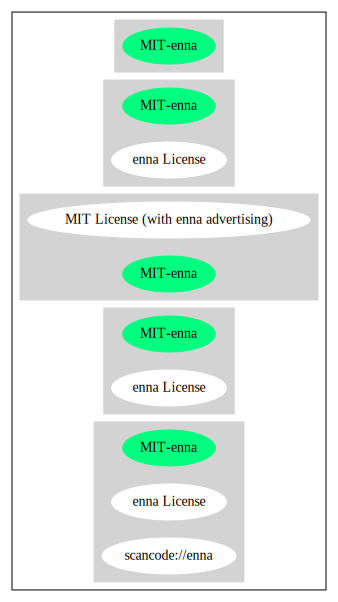

enna License (MIT-enna)
=======================

[TABLE]

**Other Names:**

-   `scancode://enna`

Comments on (easy) usability
----------------------------

-   **↑**“Rating is: Bronze” (source: [BlueOak License
    List](https://blueoakcouncil.org/list "BlueOak License List"))

General Comments
----------------

URLs
----

-   **Homepage:** https://fedoraproject.org/wiki/Licensing/MIT\#enna

-   **SPDX:** http://spdx.org/licenses/MIT-enna.json

-   **SPDX:** https://spdx.org/licenses/MIT-enna.html

Text
----

    Permission is hereby granted, free of charge, to any person obtaining a copy of
    this software and associated documentation files (the "Software"), to deal in
    the Software without restriction, including without limitation the rights to
    use, copy, modify, merge, publish, distribute, sublicense, and/or sell copies of
    the Software, and to permit persons to whom the Software is furnished to do so,
    subject to the following conditions:

    The above copyright notice and this permission notice shall be included in all
    copies of the Software and its Copyright notices. In addition publicly
    documented acknowledgment must be given that this software has been used if no
    source code of this software is made available publicly. This includes
    acknowledgments in either Copyright notices, Manuals, Publicity and Marketing
    documents or any documentation provided with any product containing this
    software. This License does not apply to any software that links to the
    libraries provided by this software (statically or dynamically), but only to the
    software provided.

    Please see the COPYING.PLAIN for a plain-english explanation of this notice and
    it's intent.

    THE SOFTWARE IS PROVIDED "AS IS", WITHOUT WARRANTY OF ANY KIND, EXPRESS OR
    IMPLIED, INCLUDING BUT NOT LIMITED TO THE WARRANTIES OF MERCHANTABILITY, FITNESS
    FOR A PARTICULAR PURPOSE AND NONINFRINGEMENT. IN NO EVENT SHALL THE AUTHORS BE
    LIABLE FOR ANY CLAIM, DAMAGES OR OTHER LIABILITY, WHETHER IN AN ACTION OF
    CONTRACT, TORT OR OTHERWISE, ARISING FROM, OUT OF OR IN CONNECTION WITH THE
    SOFTWARE OR THE USE OR OTHER DEALINGS IN THE SOFTWARE.

------------------------------------------------------------------------

Raw Data
--------

### Facts

-   [SPDX](https://spdx.org/licenses/MIT-enna.html "SPDX")

-   [BlueOak License
    List](https://blueoakcouncil.org/list "BlueOak License List")

-   [Scancode](https://github.com/nexB/scancode-toolkit/blob/develop/src/licensedcode/data/licenses/enna.yml "Scancode")

### Raw JSON

    {
        "__impliedNames": [
            "MIT-enna",
            "enna License",
            "scancode://enna"
        ],
        "__impliedId": "MIT-enna",
        "facts": {
            "SPDX": {
                "isSPDXLicenseDeprecated": false,
                "spdxFullName": "enna License",
                "spdxDetailsURL": "http://spdx.org/licenses/MIT-enna.json",
                "_sourceURL": "https://spdx.org/licenses/MIT-enna.html",
                "spdxLicIsOSIApproved": false,
                "spdxSeeAlso": [
                    "https://fedoraproject.org/wiki/Licensing/MIT#enna"
                ],
                "_implications": {
                    "__impliedNames": [
                        "MIT-enna",
                        "enna License"
                    ],
                    "__impliedId": "MIT-enna",
                    "__isOsiApproved": false,
                    "__impliedURLs": [
                        [
                            "SPDX",
                            "http://spdx.org/licenses/MIT-enna.json"
                        ],
                        [
                            null,
                            "https://fedoraproject.org/wiki/Licensing/MIT#enna"
                        ]
                    ]
                },
                "spdxLicenseId": "MIT-enna"
            },
            "Scancode": {
                "otherUrls": null,
                "homepageUrl": "https://fedoraproject.org/wiki/Licensing/MIT#enna",
                "shortName": "enna License",
                "textUrls": null,
                "text": "Permission is hereby granted, free of charge, to any person obtaining a copy of\nthis software and associated documentation files (the \"Software\"), to deal in\nthe Software without restriction, including without limitation the rights to\nuse, copy, modify, merge, publish, distribute, sublicense, and/or sell copies of\nthe Software, and to permit persons to whom the Software is furnished to do so,\nsubject to the following conditions:\n\nThe above copyright notice and this permission notice shall be included in all\ncopies of the Software and its Copyright notices. In addition publicly\ndocumented acknowledgment must be given that this software has been used if no\nsource code of this software is made available publicly. This includes\nacknowledgments in either Copyright notices, Manuals, Publicity and Marketing\ndocuments or any documentation provided with any product containing this\nsoftware. This License does not apply to any software that links to the\nlibraries provided by this software (statically or dynamically), but only to the\nsoftware provided.\n\nPlease see the COPYING.PLAIN for a plain-english explanation of this notice and\nit's intent.\n\nTHE SOFTWARE IS PROVIDED \"AS IS\", WITHOUT WARRANTY OF ANY KIND, EXPRESS OR\nIMPLIED, INCLUDING BUT NOT LIMITED TO THE WARRANTIES OF MERCHANTABILITY, FITNESS\nFOR A PARTICULAR PURPOSE AND NONINFRINGEMENT. IN NO EVENT SHALL THE AUTHORS BE\nLIABLE FOR ANY CLAIM, DAMAGES OR OTHER LIABILITY, WHETHER IN AN ACTION OF\nCONTRACT, TORT OR OTHERWISE, ARISING FROM, OUT OF OR IN CONNECTION WITH THE\nSOFTWARE OR THE USE OR OTHER DEALINGS IN THE SOFTWARE.",
                "category": "Permissive",
                "osiUrl": null,
                "owner": "Enlightenment",
                "_sourceURL": "https://github.com/nexB/scancode-toolkit/blob/develop/src/licensedcode/data/licenses/enna.yml",
                "key": "enna",
                "name": "enna License",
                "spdxId": "MIT-enna",
                "notes": null,
                "_implications": {
                    "__impliedNames": [
                        "scancode://enna",
                        "enna License",
                        "MIT-enna"
                    ],
                    "__impliedId": "MIT-enna",
                    "__impliedCopyleft": [
                        [
                            "Scancode",
                            "NoCopyleft"
                        ]
                    ],
                    "__calculatedCopyleft": "NoCopyleft",
                    "__impliedText": "Permission is hereby granted, free of charge, to any person obtaining a copy of\nthis software and associated documentation files (the \"Software\"), to deal in\nthe Software without restriction, including without limitation the rights to\nuse, copy, modify, merge, publish, distribute, sublicense, and/or sell copies of\nthe Software, and to permit persons to whom the Software is furnished to do so,\nsubject to the following conditions:\n\nThe above copyright notice and this permission notice shall be included in all\ncopies of the Software and its Copyright notices. In addition publicly\ndocumented acknowledgment must be given that this software has been used if no\nsource code of this software is made available publicly. This includes\nacknowledgments in either Copyright notices, Manuals, Publicity and Marketing\ndocuments or any documentation provided with any product containing this\nsoftware. This License does not apply to any software that links to the\nlibraries provided by this software (statically or dynamically), but only to the\nsoftware provided.\n\nPlease see the COPYING.PLAIN for a plain-english explanation of this notice and\nit's intent.\n\nTHE SOFTWARE IS PROVIDED \"AS IS\", WITHOUT WARRANTY OF ANY KIND, EXPRESS OR\nIMPLIED, INCLUDING BUT NOT LIMITED TO THE WARRANTIES OF MERCHANTABILITY, FITNESS\nFOR A PARTICULAR PURPOSE AND NONINFRINGEMENT. IN NO EVENT SHALL THE AUTHORS BE\nLIABLE FOR ANY CLAIM, DAMAGES OR OTHER LIABILITY, WHETHER IN AN ACTION OF\nCONTRACT, TORT OR OTHERWISE, ARISING FROM, OUT OF OR IN CONNECTION WITH THE\nSOFTWARE OR THE USE OR OTHER DEALINGS IN THE SOFTWARE.",
                    "__impliedURLs": [
                        [
                            "Homepage",
                            "https://fedoraproject.org/wiki/Licensing/MIT#enna"
                        ]
                    ]
                }
            },
            "BlueOak License List": {
                "BlueOakRating": "Bronze",
                "url": "https://spdx.org/licenses/MIT-enna.html",
                "isPermissive": true,
                "_sourceURL": "https://blueoakcouncil.org/list",
                "name": "enna License",
                "id": "MIT-enna",
                "_implications": {
                    "__impliedNames": [
                        "MIT-enna",
                        "enna License"
                    ],
                    "__impliedJudgement": [
                        [
                            "BlueOak License List",
                            {
                                "tag": "PositiveJudgement",
                                "contents": "Rating is: Bronze"
                            }
                        ]
                    ],
                    "__impliedCopyleft": [
                        [
                            "BlueOak License List",
                            "NoCopyleft"
                        ]
                    ],
                    "__calculatedCopyleft": "NoCopyleft",
                    "__impliedURLs": [
                        [
                            "SPDX",
                            "https://spdx.org/licenses/MIT-enna.html"
                        ]
                    ]
                }
            }
        },
        "__impliedJudgement": [
            [
                "BlueOak License List",
                {
                    "tag": "PositiveJudgement",
                    "contents": "Rating is: Bronze"
                }
            ]
        ],
        "__impliedCopyleft": [
            [
                "BlueOak License List",
                "NoCopyleft"
            ],
            [
                "Scancode",
                "NoCopyleft"
            ]
        ],
        "__calculatedCopyleft": "NoCopyleft",
        "__isOsiApproved": false,
        "__impliedText": "Permission is hereby granted, free of charge, to any person obtaining a copy of\nthis software and associated documentation files (the \"Software\"), to deal in\nthe Software without restriction, including without limitation the rights to\nuse, copy, modify, merge, publish, distribute, sublicense, and/or sell copies of\nthe Software, and to permit persons to whom the Software is furnished to do so,\nsubject to the following conditions:\n\nThe above copyright notice and this permission notice shall be included in all\ncopies of the Software and its Copyright notices. In addition publicly\ndocumented acknowledgment must be given that this software has been used if no\nsource code of this software is made available publicly. This includes\nacknowledgments in either Copyright notices, Manuals, Publicity and Marketing\ndocuments or any documentation provided with any product containing this\nsoftware. This License does not apply to any software that links to the\nlibraries provided by this software (statically or dynamically), but only to the\nsoftware provided.\n\nPlease see the COPYING.PLAIN for a plain-english explanation of this notice and\nit's intent.\n\nTHE SOFTWARE IS PROVIDED \"AS IS\", WITHOUT WARRANTY OF ANY KIND, EXPRESS OR\nIMPLIED, INCLUDING BUT NOT LIMITED TO THE WARRANTIES OF MERCHANTABILITY, FITNESS\nFOR A PARTICULAR PURPOSE AND NONINFRINGEMENT. IN NO EVENT SHALL THE AUTHORS BE\nLIABLE FOR ANY CLAIM, DAMAGES OR OTHER LIABILITY, WHETHER IN AN ACTION OF\nCONTRACT, TORT OR OTHERWISE, ARISING FROM, OUT OF OR IN CONNECTION WITH THE\nSOFTWARE OR THE USE OR OTHER DEALINGS IN THE SOFTWARE.",
        "__impliedURLs": [
            [
                "SPDX",
                "http://spdx.org/licenses/MIT-enna.json"
            ],
            [
                null,
                "https://fedoraproject.org/wiki/Licensing/MIT#enna"
            ],
            [
                "SPDX",
                "https://spdx.org/licenses/MIT-enna.html"
            ],
            [
                "Homepage",
                "https://fedoraproject.org/wiki/Licensing/MIT#enna"
            ]
        ]
    }

------------------------------------------------------------------------

Dot Cluster Graph
-----------------

