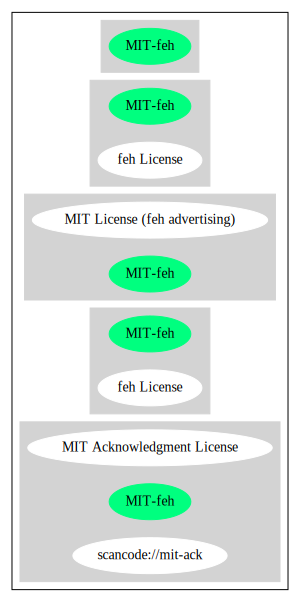

feh License (MIT-feh)
=====================

[TABLE]

**Other Names:**

-   `scancode://mit-ack`

-   `MIT Acknowledgment License`

Comments on (easy) usability
----------------------------

-   **↑**“Rating is: Bronze” (source: [BlueOak License
    List](https://blueoakcouncil.org/list "BlueOak License List"))

URLs
----

-   **Homepage:**
    https://fedoraproject.org/wiki/Licensing:MIT?rd=Licensing/MIT\#feh

-   **SPDX:** http://spdx.org/licenses/MIT-feh.json

-   **SPDX:** https://spdx.org/licenses/MIT-feh.html

-   https://fedoraproject.org/wiki/Licensing/MIT\#feh

Text
----

    Permission is hereby granted, free of charge, to any person obtaining a copy of this
    software and associated documentation files (the "Software"), to deal in the Software
    without restriction, including without limitation the rights to use, copy, modify,
    merge, publish, distribute, sublicense, and/or sell copies of the Software, and to
    permit persons to whom the Software is furnished to do so, subject to the following
    conditions:

    The above copyright notice and this permission notice shall be included in all copies
    of the Software and its documentation and acknowledgment shall be given in the
    documentation and software packages that this Software was used.

    THE SOFTWARE IS PROVIDED "AS IS", WITHOUT WARRANTY OF ANY KIND, EXPRESS OR IMPLIED,
    INCLUDING BUT NOT LIMITED TO THE WARRANTIES OF MERCHANTABILITY, FITNESS FOR A
    PARTICULAR PURPOSE AND NONINFRINGEMENT. IN NO EVENT SHALL THE AUTHORS BE LIABLE FOR
    ANY CLAIM, DAMAGES OR OTHER LIABILITY, WHETHER IN AN ACTION OF CONTRACT, TORT OR
    OTHERWISE, ARISING FROM, OUT OF OR IN CONNECTION WITH THE SOFTWARE OR THE USE OR
    OTHER DEALINGS IN THE SOFTWARE.

------------------------------------------------------------------------

Raw Data
--------

    {
        "__impliedNames": [
            "MIT-feh",
            "feh License",
            "scancode://mit-ack",
            "MIT Acknowledgment License"
        ],
        "__impliedId": "MIT-feh",
        "facts": {
            "SPDX": {
                "isSPDXLicenseDeprecated": false,
                "spdxFullName": "feh License",
                "spdxDetailsURL": "http://spdx.org/licenses/MIT-feh.json",
                "_sourceURL": "https://spdx.org/licenses/MIT-feh.html",
                "spdxLicIsOSIApproved": false,
                "spdxSeeAlso": [
                    "https://fedoraproject.org/wiki/Licensing/MIT#feh"
                ],
                "_implications": {
                    "__impliedNames": [
                        "MIT-feh",
                        "feh License"
                    ],
                    "__impliedId": "MIT-feh",
                    "__isOsiApproved": false,
                    "__impliedURLs": [
                        [
                            "SPDX",
                            "http://spdx.org/licenses/MIT-feh.json"
                        ],
                        [
                            null,
                            "https://fedoraproject.org/wiki/Licensing/MIT#feh"
                        ]
                    ]
                },
                "spdxLicenseId": "MIT-feh"
            },
            "Scancode": {
                "otherUrls": [
                    "https://fedoraproject.org/wiki/Licensing/MIT#feh"
                ],
                "homepageUrl": "https://fedoraproject.org/wiki/Licensing:MIT?rd=Licensing/MIT#feh",
                "shortName": "MIT Acknowledgment License",
                "textUrls": null,
                "text": "Permission is hereby granted, free of charge, to any person obtaining a copy of this\nsoftware and associated documentation files (the \"Software\"), to deal in the Software\nwithout restriction, including without limitation the rights to use, copy, modify,\nmerge, publish, distribute, sublicense, and/or sell copies of the Software, and to\npermit persons to whom the Software is furnished to do so, subject to the following\nconditions:\n\nThe above copyright notice and this permission notice shall be included in all copies\nof the Software and its documentation and acknowledgment shall be given in the\ndocumentation and software packages that this Software was used.\n\nTHE SOFTWARE IS PROVIDED \"AS IS\", WITHOUT WARRANTY OF ANY KIND, EXPRESS OR IMPLIED,\nINCLUDING BUT NOT LIMITED TO THE WARRANTIES OF MERCHANTABILITY, FITNESS FOR A\nPARTICULAR PURPOSE AND NONINFRINGEMENT. IN NO EVENT SHALL THE AUTHORS BE LIABLE FOR\nANY CLAIM, DAMAGES OR OTHER LIABILITY, WHETHER IN AN ACTION OF CONTRACT, TORT OR\nOTHERWISE, ARISING FROM, OUT OF OR IN CONNECTION WITH THE SOFTWARE OR THE USE OR\nOTHER DEALINGS IN THE SOFTWARE.",
                "category": "Permissive",
                "osiUrl": null,
                "owner": "Unspecified",
                "_sourceURL": "https://github.com/nexB/scancode-toolkit/blob/develop/src/licensedcode/data/licenses/mit-ack.yml",
                "key": "mit-ack",
                "name": "MIT Acknowledgment License",
                "spdxId": "MIT-feh",
                "notes": null,
                "_implications": {
                    "__impliedNames": [
                        "scancode://mit-ack",
                        "MIT Acknowledgment License",
                        "MIT-feh"
                    ],
                    "__impliedId": "MIT-feh",
                    "__impliedCopyleft": [
                        [
                            "Scancode",
                            "NoCopyleft"
                        ]
                    ],
                    "__calculatedCopyleft": "NoCopyleft",
                    "__impliedText": "Permission is hereby granted, free of charge, to any person obtaining a copy of this\nsoftware and associated documentation files (the \"Software\"), to deal in the Software\nwithout restriction, including without limitation the rights to use, copy, modify,\nmerge, publish, distribute, sublicense, and/or sell copies of the Software, and to\npermit persons to whom the Software is furnished to do so, subject to the following\nconditions:\n\nThe above copyright notice and this permission notice shall be included in all copies\nof the Software and its documentation and acknowledgment shall be given in the\ndocumentation and software packages that this Software was used.\n\nTHE SOFTWARE IS PROVIDED \"AS IS\", WITHOUT WARRANTY OF ANY KIND, EXPRESS OR IMPLIED,\nINCLUDING BUT NOT LIMITED TO THE WARRANTIES OF MERCHANTABILITY, FITNESS FOR A\nPARTICULAR PURPOSE AND NONINFRINGEMENT. IN NO EVENT SHALL THE AUTHORS BE LIABLE FOR\nANY CLAIM, DAMAGES OR OTHER LIABILITY, WHETHER IN AN ACTION OF CONTRACT, TORT OR\nOTHERWISE, ARISING FROM, OUT OF OR IN CONNECTION WITH THE SOFTWARE OR THE USE OR\nOTHER DEALINGS IN THE SOFTWARE.",
                    "__impliedURLs": [
                        [
                            "Homepage",
                            "https://fedoraproject.org/wiki/Licensing:MIT?rd=Licensing/MIT#feh"
                        ],
                        [
                            null,
                            "https://fedoraproject.org/wiki/Licensing/MIT#feh"
                        ]
                    ]
                }
            },
            "BlueOak License List": {
                "BlueOakRating": "Bronze",
                "url": "https://spdx.org/licenses/MIT-feh.html",
                "isPermissive": true,
                "_sourceURL": "https://blueoakcouncil.org/list",
                "name": "feh License",
                "id": "MIT-feh",
                "_implications": {
                    "__impliedNames": [
                        "MIT-feh"
                    ],
                    "__impliedJudgement": [
                        [
                            "BlueOak License List",
                            {
                                "tag": "PositiveJudgement",
                                "contents": "Rating is: Bronze"
                            }
                        ]
                    ],
                    "__impliedCopyleft": [
                        [
                            "BlueOak License List",
                            "NoCopyleft"
                        ]
                    ],
                    "__calculatedCopyleft": "NoCopyleft",
                    "__impliedURLs": [
                        [
                            "SPDX",
                            "https://spdx.org/licenses/MIT-feh.html"
                        ]
                    ]
                }
            }
        },
        "__impliedJudgement": [
            [
                "BlueOak License List",
                {
                    "tag": "PositiveJudgement",
                    "contents": "Rating is: Bronze"
                }
            ]
        ],
        "__impliedCopyleft": [
            [
                "BlueOak License List",
                "NoCopyleft"
            ],
            [
                "Scancode",
                "NoCopyleft"
            ]
        ],
        "__calculatedCopyleft": "NoCopyleft",
        "__isOsiApproved": false,
        "__impliedText": "Permission is hereby granted, free of charge, to any person obtaining a copy of this\nsoftware and associated documentation files (the \"Software\"), to deal in the Software\nwithout restriction, including without limitation the rights to use, copy, modify,\nmerge, publish, distribute, sublicense, and/or sell copies of the Software, and to\npermit persons to whom the Software is furnished to do so, subject to the following\nconditions:\n\nThe above copyright notice and this permission notice shall be included in all copies\nof the Software and its documentation and acknowledgment shall be given in the\ndocumentation and software packages that this Software was used.\n\nTHE SOFTWARE IS PROVIDED \"AS IS\", WITHOUT WARRANTY OF ANY KIND, EXPRESS OR IMPLIED,\nINCLUDING BUT NOT LIMITED TO THE WARRANTIES OF MERCHANTABILITY, FITNESS FOR A\nPARTICULAR PURPOSE AND NONINFRINGEMENT. IN NO EVENT SHALL THE AUTHORS BE LIABLE FOR\nANY CLAIM, DAMAGES OR OTHER LIABILITY, WHETHER IN AN ACTION OF CONTRACT, TORT OR\nOTHERWISE, ARISING FROM, OUT OF OR IN CONNECTION WITH THE SOFTWARE OR THE USE OR\nOTHER DEALINGS IN THE SOFTWARE.",
        "__impliedURLs": [
            [
                "SPDX",
                "http://spdx.org/licenses/MIT-feh.json"
            ],
            [
                null,
                "https://fedoraproject.org/wiki/Licensing/MIT#feh"
            ],
            [
                "SPDX",
                "https://spdx.org/licenses/MIT-feh.html"
            ],
            [
                "Homepage",
                "https://fedoraproject.org/wiki/Licensing:MIT?rd=Licensing/MIT#feh"
            ]
        ]
    }

------------------------------------------------------------------------

Dot Cluster Graph
-----------------

