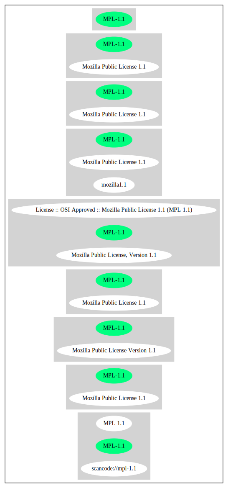

Mozilla Public License 1.1 (MPL-1.1)
====================================

[TABLE]

**Other Names:**

-   `scancode://mpl-1.1`

-   `MPL 1.1`

-   `Mozilla Public License, Version 1.1`

-   `License :: OSI Approved :: Mozilla Public License 1.1 (MPL 1.1)`

Comments on (easy) usability
----------------------------

-   **↑**“Is OSI Approved” (source:
    [SPDX](https://spdx.org/licenses/MPL-1.1.html "SPDX"))

-   **↑**“This license is compatible with the
    DebianFreeSoftwareGuidelines (DFSG-free)” (source: [Debian Free
    Software
    Guidelines](https://wiki.debian.org/DFSGLicenses "Debian Free Software Guidelines"))

-   “Google Classification is RECIPROCAL” (source: [Google OSS
    Policy](https://opensource.google.com/docs/thirdparty/licenses/ "Google OSS Policy"))

General Comments
----------------

-   “Weak copyleft licenses require sharing changes and additions to the
    licensed software when you give copies to others.” (source: [BlueOak
    License
    List](https://blueoakcouncil.org/copyleft "BlueOak License List"))

-   “Per SPDX.org, this license is OSI certified.” (source:
    [Scancode](https://github.com/nexB/scancode-toolkit/blob/develop/src/licensedcode/data/licenses/mpl-1.1.yml "Scancode"))

URLs
----

-   **Homepage:** http://www.mozilla.org/MPL/MPL-1.1.html

-   **OSI Page:** http://opensource.org/licenses/mozilla1.1.php

-   **OSI Page:** https://opensource.org/licenses/MPL-1.1

-   **SPDX:** http://spdx.org/licenses/MPL-1.1.json

-   https://spdx.org/licenses/MPL-1.1.html

-   http://www.opensource.org/licenses/MPL-1.1

OSADL Rule
----------

    USE CASE Source code delivery
    	YOU MUST Provide Standard license notice (Exhibit A)
    	YOU MUST Provide License text
    	IF Documentation
    		YOU MUST Provide License text
    	IF Patent holder OR Trademark holder OR Third-party patents OR Third-party trademarks
    		YOU MUST Provide File "LEGAL"
    			ATTRIBUTE Crediting Patent holder AND Trademark holder AND Third-party patents AND Third-party trademarks
    			IF ATTRIBUTE Dynamic
    				YOU MUST Update File "LEGAL"
    				YOU MUST Disseminate Patent notice AND Trademark notice
    	IF Software modification
    		YOU MUST Grant License
    			ATTRIBUTE Original license
    		YOU MUST Provide Modification report
    			ATTRIBUTE Documentation of Software modifications
    			ATTRIBUTE Modification date
    		YOU MUST Provide Modification notice
    			ATTRIBUTE Highlighted
    			ATTRIBUTE Crediting Initial developer
    			ATTRIBUTE Included In Source code
    	YOU MUST NOT Restrict Granted rights
    	USE CASE Service offerings
    		YOU MUST Indemnify Other contributors
    USE CASE Binary delivery
    	YOU MUST Include Notice
    		YOU MUST Reference Source code
    		ATTRIBUTE Highlighted
    		ATTRIBUTE Included in Binary delivery OR Documentation
    	IF Patent holder OR Trademark holder OR Third-party patents OR Third-party trademarks
    		YOU MUST Provide File "LEGAL"
    			ATTRIBUTE Crediting Patent holder AND Trademark holder AND Third-party patents AND Third-party trademarks
    			IF ATTRIBUTE Dynamic
    				YOU MUST Update File "LEGAL"
    				YOU MUST Disseminate Patent notice AND Trademark notice
    	IF Software modification
    		YOU MUST Include Retrieval information of Source code in Notice
    		YOU MUST Provide Source code
    		EITHER	
    			ATTRIBUTE Same medium
    		OR
    			ATTRIBUTE Via Internet
    				ATTRIBUTE Duration 12 months
    				EXCEPT IF Software modification Was Updated
    					ATTRIBUTE Duration 6 months
    		YOU MUST Provide Standard license notice (Exhibit A)
    		YOU MUST Provide License text
    		YOU MUST Grant License
    			ATTRIBUTE Original license
    		YOU MUST Provide Modification report
    			ATTRIBUTE Documentation of Software modifications
    			ATTRIBUTE Modification date
    		YOU MUST Provide Modification notice
    			ATTRIBUTE Highlighted
    			ATTRIBUTE Crediting Initial developer
    			ATTRIBUTE Included In Source code
    			IF Binary delivery Includes Copyright notice OR Documentation Includes Copyright notice
    				ATTRIBUTE Included in Binary delivery OR Documentation
    	USE CASE License change
    		YOU MUST Use Compatible license
    		YOU MUST Indemnify Other Contributors
    	YOU MUST NOT Restrict Granted rights
    	USE CASE Service offerings
    		YOU MUST Indemnify Other contributors
    COMPATIBILITY BSD-2-Clause
    COMPATIBILITY BSD-2-Clause-Patent
    COMPATIBILITY BSD-3-Clause
    COMPATIBILITY bzip2-1.0.5
    COMPATIBILITY bzip2-1.0.6
    COMPATIBILITY CC0-1.0
    COMPATIBILITY curl
    COMPATIBILITY EFL-2.0
    COMPATIBILITY IBM-pibs
    COMPATIBILITY ICU
    COMPATIBILITY ISC
    COMPATIBILITY Libpng
    COMPATIBILITY MIT
    COMPATIBILITY NTP
    COMPATIBILITY UPL-1.0
    COMPATIBILITY WTFPL
    COMPATIBILITY X11
    COMPATIBILITY Zlib
    PATENT HINTS Yes
    COPYLEFT CLAUSE Yes

(source: OSADL License Checklist)

Text
----

    MOZILLA PUBLIC LICENSE
    Version 1.1

    1. Definitions.

     1.0.1. "Commercial Use" means distribution or otherwise making the Covered Code available to a third party.

     1.1. "Contributor" means each entity that creates or contributes to the creation of Modifications.

     1.2. "Contributor Version" means the combination of the Original Code, prior Modifications used by a Contributor, and the Modifications made by that particular Contributor.

     1.3. "Covered Code" means the Original Code or Modifications or the combination of the Original Code and Modifications, in each case including portions thereof.

     1.4. "Electronic Distribution Mechanism" means a mechanism generally accepted in the software development community for the electronic transfer of data.

     1.5. "Executable" means Covered Code in any form other than Source Code.

     1.6. "Initial Developer" means the individual or entity identified as the Initial Developer in the Source Code notice required by Exhibit A.

     1.7. "Larger Work" means a work which combines Covered Code or portions thereof with code not governed by the terms of this License.

     1.8. "License" means this document.

     1.8.1. "Licensable" means having the right to grant, to the maximum extent possible, whether at the time of the initial grant or subsequently acquired, any and all of the rights conveyed herein.

     1.9. "Modifications" means any addition to or deletion from the substance or structure of either the Original Code or any previous Modifications. When Covered Code is released as a series of files, a Modification is: A. Any addition to or deletion from the contents of a file containing Original Code or previous Modifications.

     B. Any new file that contains any part of the Original Code or previous Modifications.

     1.10. "Original Code" means Source Code of computer software code which is described in the Source Code notice required by Exhibit A as Original Code, and which, at the time of its release under this License is not already Covered Code governed by this License.

     1.10.1. "Patent Claims" means any patent claim(s), now owned or hereafter acquired, including without limitation, method, process, and apparatus claims, in any patent Licensable by grantor.

     1.11. "Source Code" means the preferred form of the Covered Code for making modifications to it, including all modules it contains, plus any associated interface definition files, scripts used to control compilation and installation of an Executable, or source code differential comparisons against either the Original Code or another well known, available Covered Code of the Contributor's choice. The Source Code can be in a compressed or archival form, provided the appropriate decompression or de-archiving software is widely available for no charge.

     1.12. "You" (or "Your") means an individual or a legal entity exercising rights under, and complying with all of the terms of, this License or a future version of this License issued under Section 6.1. For legal entities, "You" includes any entity which controls, is controlled by, or is under common control with You. For purposes of this definition, "control" means (a) the power, direct or indirect, to cause the direction or management of such entity, whether by contract or otherwise, or (b) ownership of more than fifty percent (50%) of the outstanding shares or beneficial ownership of such entity.

    2. Source Code License.

     2.1. The Initial Developer Grant. The Initial Developer hereby grants You a world-wide, royalty-free, non-exclusive license, subject to third party intellectual property claims: (a) under intellectual property rights (other than patent or trademark) Licensable by Initial Developer to use, reproduce, modify, display, perform, sublicense and distribute the Original Code (or portions thereof) with or without Modifications, and/or as part of a Larger Work; and

     (b) under Patents Claims infringed by the making, using or selling of Original Code, to make, have made, use, practice, sell, and offer for sale, and/or otherwise dispose of the Original Code (or portions thereof).

     (c) the licenses granted in this Section 2.1(a) and (b) are effective on the date Initial Developer first distributes Original Code under the terms of this License.

     (d) Notwithstanding Section 2.1(b) above, no patent license is granted: 1) for code that You delete from the Original Code; 2) separate from the Original Code; or 3) for infringements caused by: i) the modification of the Original Code or ii) the combination of the Original Code with other software or devices.

     2.2. Contributor Grant. Subject to third party intellectual property claims, each Contributor hereby grants You a world-wide, royalty-free, non-exclusive license

     (a) under intellectual property rights (other than patent or trademark) Licensable by Contributor, to use, reproduce, modify, display, perform, sublicense and distribute the Modifications created by such Contributor (or portions thereof) either on an unmodified basis, with other Modifications, as Covered Code and/or as part of a Larger Work; and

     (b) under Patent Claims infringed by the making, using, or selling of Modifications made by that Contributor either alone and/or in combination with its Contributor Version (or portions of such combination), to make, use, sell, offer for sale, have made, and/or otherwise dispose of: 1) Modifications made by that Contributor (or portions thereof); and 2) the combination of Modifications made by that Contributor with its Contributor Version (or portions of such combination).

     (c) the licenses granted in Sections 2.2(a) and 2.2(b) are effective on the date Contributor first makes Commercial Use of the Covered Code.

     (d) Notwithstanding Section 2.2(b) above, no patent license is granted: 1) for any code that Contributor has deleted from the Contributor Version; 2) separate from the Contributor Version; 3) for infringements caused by: i) third party modifications of Contributor Version or ii) the combination of Modifications made by that Contributor with other software (except as part of the Contributor Version) or other devices; or 4) under Patent Claims infringed by Covered Code in the absence of Modifications made by that Contributor.

    3. Distribution Obligations.

     3.1. Application of License. The Modifications which You create or to which You contribute are governed by the terms of this License, including without limitation Section 2.2. The Source Code version of Covered Code may be distributed only under the terms of this License or a future version of this License released under Section 6.1, and You must include a copy of this License with every copy of the Source Code You distribute. You may not offer or impose any terms on any Source Code version that alters or restricts the applicable version of this License or the recipients' rights hereunder. However, You may include an additional document offering the additional rights described in Section 3.5.

     3.2. Availability of Source Code. Any Modification which You create or to which You contribute must be made available in Source Code form under the terms of this License either on the same media as an Executable version or via an accepted Electronic Distribution Mechanism to anyone to whom you made an Executable version available; and if made available via Electronic Distribution Mechanism, must remain available for at least twelve (12) months after the date it initially became available, or at least six (6) months after a subsequent version of that particular Modification has been made available to such recipients. You are responsible for ensuring that the Source Code version remains available even if the Electronic Distribution Mechanism is maintained by a third party.

     3.3. Description of Modifications. You must cause all Covered Code to which You contribute to contain a file documenting the changes You made to create that Covered Code and the date of any change. You must include a prominent statement that the Modification is derived, directly or indirectly, from Original Code provided by the Initial Developer and including the name of the Initial Developer in (a) the Source Code, and (b) in any notice in an Executable version or related documentation in which You describe the origin or ownership of the Covered Code.

     3.4. Intellectual Property Matters (a) Third Party Claims. If Contributor has knowledge that a license under a third party's intellectual property rights is required to exercise the rights granted by such Contributor under Sections 2.1 or 2.2, Contributor must include a text file with the Source Code distribution titled "LEGAL" which describes the claim and the party making the claim in sufficient detail that a recipient will know whom to contact. If Contributor obtains such knowledge after the Modification is made available as described in Section 3.2, Contributor shall promptly modify the LEGAL file in all copies Contributor makes available thereafter and shall take other steps (such as notifying appropriate mailing lists or newsgroups) reasonably calculated to inform those who received the Covered Code that new knowledge has been obtained.

     (b) Contributor APIs. If Contributor's Modifications include an application programming interface and Contributor has knowledge of patent licenses which are reasonably necessary to implement that API, Contributor must also include this information in the LEGAL file.

     (c) Representations. Contributor represents that, except as disclosed pursuant to Section 3.4(a) above, Contributor believes that Contributor's Modifications are Contributor's original creation(s) and/or Contributor has sufficient rights to grant the rights conveyed by this License.

     3.5. Required Notices. You must duplicate the notice in Exhibit A in each file of the Source Code. If it is not possible to put such notice in a particular Source Code file due to its structure, then You must include such notice in a location (such as a relevant directory) where a user would be likely to look for such a notice. If You created one or more Modification(s) You may add your name as a Contributor to the notice described in Exhibit A. You must also duplicate this License in any documentation for the Source Code where You describe recipients' rights or ownership rights relating to Covered Code. You may choose to offer, and to charge a fee for, warranty, support, indemnity or liability obligations to one or more recipients of Covered Code. However, You may do so only on Your own behalf, and not on behalf of the Initial Developer or any Contributor. You must make it absolutely clear than any such warranty, support, indemnity or liability obligation is offered by You alone, and You hereby agree to indemnify the Initial Developer and every Contributor for any liability incurred by the Initial Developer or such Contributor as a result of warranty, support, indemnity or liability terms You offer.

     3.6. Distribution of Executable Versions. You may distribute Covered Code in Executable form only if the requirements of Section 3.1-3.5 have been met for that Covered Code, and if You include a notice stating that the Source Code version of the Covered Code is available under the terms of this License, including a description of how and where You have fulfilled the obligations of Section 3.2. The notice must be conspicuously included in any notice in an Executable version, related documentation or collateral in which You describe recipients' rights relating to the Covered Code. You may distribute the Executable version of Covered Code or ownership rights under a license of Your choice, which may contain terms different from this License, provided that You are in compliance with the terms of this License and that the license for the Executable version does not attempt to limit or alter the recipient's rights in the Source Code version from the rights set forth in this License. If You distribute the Executable version under a different license You must make it absolutely clear that any terms which differ from this License are offered by You alone, not by the Initial Developer or any Contributor. You hereby agree to indemnify the Initial Developer and every Contributor for any liability incurred by the Initial Developer or such Contributor as a result of any such terms You offer.

     3.7. Larger Works. You may create a Larger Work by combining Covered Code with other code not governed by the terms of this License and distribute the Larger Work as a single product. In such a case, You must make sure the requirements of this License are fulfilled for the Covered Code.

    4. Inability to Comply Due to Statute or Regulation.

     If it is impossible for You to comply with any of the terms of this License with respect to some or all of the Covered Code due to statute, judicial order, or regulation then You must: (a) comply with the terms of this License to the maximum extent possible; and (b) describe the limitations and the code they affect. Such description must be included in the LEGAL file described in Section 3.4 and must be included with all distributions of the Source Code. Except to the extent prohibited by statute or regulation, such description must be sufficiently detailed for a recipient of ordinary skill to be able to understand it.

    5. Application of this License.

     This License applies to code to which the Initial Developer has attached the notice in Exhibit A and to related Covered Code.

    6. Versions of the License.

     6.1. New Versions. Netscape Communications Corporation ("Netscape") may publish revised and/or new versions of the License from time to time. Each version will be given a distinguishing version number.

     6.2. Effect of New Versions. Once Covered Code has been published under a particular version of the License, You may always continue to use it under the terms of that version. You may also choose to use such Covered Code under the terms of any subsequent version of the License published by Netscape. No one other than Netscape has the right to modify the terms applicable to Covered Code created under this License.

     6.3. Derivative Works. If You create or use a modified version of this License (which you may only do in order to apply it to code which is not already Covered Code governed by this License), You must (a) rename Your license so that the phrases "Mozilla", "MOZILLAPL", "MOZPL", "Netscape", "MPL", "NPL" or any confusingly similar phrase do not appear in your license (except to note that your license differs from this License) and (b) otherwise make it clear that Your version of the license contains terms which differ from the Mozilla Public License and Netscape Public License. (Filling in the name of the Initial Developer, Original Code or Contributor in the notice described in Exhibit A shall not of themselves be deemed to be modifications of this License.)

    7. DISCLAIMER OF WARRANTY.

     COVERED CODE IS PROVIDED UNDER THIS LICENSE ON AN "AS IS" BASIS, WITHOUT WARRANTY OF ANY KIND, EITHER EXPRESSED OR IMPLIED, INCLUDING, WITHOUT LIMITATION, WARRANTIES THAT THE COVERED CODE IS FREE OF DEFECTS, MERCHANTABLE, FIT FOR A PARTICULAR PURPOSE OR NON-INFRINGING. THE ENTIRE RISK AS TO THE QUALITY AND PERFORMANCE OF THE COVERED CODE IS WITH YOU. SHOULD ANY COVERED CODE PROVE DEFECTIVE IN ANY RESPECT, YOU (NOT THE INITIAL DEVELOPER OR ANY OTHER CONTRIBUTOR) ASSUME THE COST OF ANY NECESSARY SERVICING, REPAIR OR CORRECTION. THIS DISCLAIMER OF WARRANTY CONSTITUTES AN ESSENTIAL PART OF THIS LICENSE. NO USE OF ANY COVERED CODE IS AUTHORIZED HEREUNDER EXCEPT UNDER THIS DISCLAIMER.

    8. TERMINATION.

     8.1. This License and the rights granted hereunder will terminate automatically if You fail to comply with terms herein and fail to cure such breach within 30 days of becoming aware of the breach. All sublicenses to the Covered Code which are properly granted shall survive any termination of this License. Provisions which, by their nature, must remain in effect beyond the termination of this License shall survive.

     8.2. If You initiate litigation by asserting a patent infringement claim (excluding declatory judgment actions) against Initial Developer or a Contributor (the Initial Developer or Contributor against whom You file such action is referred to as "Participant") alleging that:

     (a) such Participant's Contributor Version directly or indirectly infringes any patent, then any and all rights granted by such Participant to You under Sections 2.1 and/or 2.2 of this License shall, upon 60 days notice from Participant terminate prospectively, unless if within 60 days after receipt of notice You either: (i) agree in writing to pay Participant a mutually agreeable reasonable royalty for Your past and future use of Modifications made by such Participant, or (ii) withdraw Your litigation claim with respect to the Contributor Version against such Participant. If within 60 days of notice, a reasonable royalty and payment arrangement are not mutually agreed upon in writing by the parties or the litigation claim is not withdrawn, the rights granted by Participant to You under Sections 2.1 and/or 2.2 automatically terminate at the expiration of the 60 day notice period specified above.

     (b) any software, hardware, or device, other than such Participant's Contributor Version, directly or indirectly infringes any patent, then any rights granted to You by such Participant under Sections 2.1(b) and 2.2(b) are revoked effective as of the date You first made, used, sold, distributed, or had made, Modifications made by that Participant.

     8.3. If You assert a patent infringement claim against Participant alleging that such Participant's Contributor Version directly or indirectly infringes any patent where such claim is resolved (such as by license or settlement) prior to the initiation of patent infringement litigation, then the reasonable value of the licenses granted by such Participant under Sections 2.1 or 2.2 shall be taken into account in determining the amount or value of any payment or license.

     8.4. In the event of termination under Sections 8.1 or 8.2 above, all end user license agreements (excluding distributors and resellers) which have been validly granted by You or any distributor hereunder prior to termination shall survive termination.

    9. LIMITATION OF LIABILITY.

     UNDER NO CIRCUMSTANCES AND UNDER NO LEGAL THEORY, WHETHER TORT (INCLUDING NEGLIGENCE), CONTRACT, OR OTHERWISE, SHALL YOU, THE INITIAL DEVELOPER, ANY OTHER CONTRIBUTOR, OR ANY DISTRIBUTOR OF COVERED CODE, OR ANY SUPPLIER OF ANY OF SUCH PARTIES, BE LIABLE TO ANY PERSON FOR ANY INDIRECT, SPECIAL, INCIDENTAL, OR CONSEQUENTIAL DAMAGES OF ANY CHARACTER INCLUDING, WITHOUT LIMITATION, DAMAGES FOR LOSS OF GOODWILL, WORK STOPPAGE, COMPUTER FAILURE OR MALFUNCTION, OR ANY AND ALL OTHER COMMERCIAL DAMAGES OR LOSSES, EVEN IF SUCH PARTY SHALL HAVE BEEN INFORMED OF THE POSSIBILITY OF SUCH DAMAGES. THIS LIMITATION OF LIABILITY SHALL NOT APPLY TO LIABILITY FOR DEATH OR PERSONAL INJURY RESULTING FROM SUCH PARTY'S NEGLIGENCE TO THE EXTENT APPLICABLE LAW PROHIBITS SUCH LIMITATION. SOME JURISDICTIONS DO NOT ALLOW THE EXCLUSION OR LIMITATION OF INCIDENTAL OR CONSEQUENTIAL DAMAGES, SO THIS EXCLUSION AND LIMITATION MAY NOT APPLY TO YOU.

    10. U.S. GOVERNMENT END USERS.

     The Covered Code is a "commercial item," as that term is defined in 48 C.F.R. 2.101 (Oct. 1995), consisting of "commercial computer software" and "commercial computer software documentation," as such terms are used in 48 C.F.R. 12.212 (Sept. 1995). Consistent with 48 C.F.R. 12.212 and 48 C.F.R. 227.7202-1 through 227.7202-4 (June 1995), all U.S. Government End Users acquire Covered Code with only those rights set forth herein.

    11. MISCELLANEOUS.

     This License represents the complete agreement concerning subject matter hereof. If any provision of this License is held to be unenforceable, such provision shall be reformed only to the extent necessary to make it enforceable. This License shall be governed by California law provisions (except to the extent applicable law, if any, provides otherwise), excluding its conflict-of-law provisions. With respect to disputes in which at least one party is a citizen of, or an entity chartered or registered to do business in the United States of America, any litigation relating to this License shall be subject to the jurisdiction of the Federal Courts of the Northern District of California, with venue lying in Santa Clara County, California, with the losing party responsible for costs, including without limitation, court costs and reasonable attorneys' fees and expenses. The application of the United Nations Convention on Contracts for the International Sale of Goods is expressly excluded. Any law or regulation which provides that the language of a contract shall be construed against the drafter shall not apply to this License.

    12. RESPONSIBILITY FOR CLAIMS.

     As between Initial Developer and the Contributors, each party is responsible for claims and damages arising, directly or indirectly, out of its utilization of rights under this License and You agree to work with Initial Developer and Contributors to distribute such responsibility on an equitable basis. Nothing herein is intended or shall be deemed to constitute any admission of liability.

    13. MULTIPLE-LICENSED CODE.

     Initial Developer may designate portions of the Covered Code as "Multiple-Licensed". "Multiple-Licensed" means that the Initial Developer permits you to utilize portions of the Covered Code under Your choice of the NPL or the alternative licenses, if any, specified by the Initial Developer in the file described in Exhibit A.

    EXHIBIT A -Mozilla Public License.

     ``The contents of this file are subject to the Mozilla Public License Version 1.1 (the "License"); you may not use this file except in compliance with the License. You may obtain a copy of the License at http://www.mozilla.org/MPL/

     Software distributed under the License is distributed on an "AS IS" basis, WITHOUT WARRANTY OF ANY KIND, either express or implied. See the License for the specific language governing rights and limitations under the License.

     The Original Code is  .

     The Initial Developer of the Original Code is  . Portions created by   are Copyright (C)    . All Rights Reserved.

     Contributor(s):  .

     Alternatively, the contents of this file may be used under the terms of the   license (the "[   ] License"), in which case the provisions of [ ] License are applicable instead of those above. If you wish to allow use of your version of this file only under the terms of the [ ] License and not to allow others to use your version of this file under the MPL, indicate your decision by deleting the provisions above and replace them with the notice and other provisions required by the [   ] License. If you do not delete the provisions above, a recipient may use your version of this file under either the MPL or the [   ] License."

     [NOTE: The text of this Exhibit A may differ slightly from the text of the notices in the Source Code files of the Original Code. You should use the text of this Exhibit A rather than the text found in the Original Code Source Code for Your Modifications.]

------------------------------------------------------------------------

Raw Data
--------

### Facts

-   [SPDX](https://spdx.org/licenses/MPL-1.1.html "SPDX")

-   [BlueOak License
    List](https://blueoakcouncil.org/copyleft "BlueOak License List")

-   [OpenChainPolicyTemplate](https://github.com/OpenChain-Project/curriculum/raw/ddf1e879341adbd9b297cd67c5d5c16b2076540b/policy-template/Open%20Source%20Policy%20Template%20for%20OpenChain%20Specification%201.2.ods "OpenChainPolicyTemplate")

-   [Scancode](https://github.com/nexB/scancode-toolkit/blob/develop/src/licensedcode/data/licenses/mpl-1.1.yml "Scancode")

-   [OSADL License
    Checklist](https://www.osadl.org/fileadmin/checklists/unreflicenses/MPL-1.1.txt "OSADL License Checklist")

-   [OpenSourceInitiative](https://opensource.org/licenses/ "OpenSourceInitiative")

-   [finos/OSLC-handbook](https://github.com/finos/OSLC-handbook/blob/master/src/MPL-1.1.yaml "finos/OSLC-handbook")

-   [Google OSS
    Policy](https://opensource.google.com/docs/thirdparty/licenses/ "Google OSS Policy")

-   [Open Knowledge
    International](https://github.com/okfn/licenses/blob/master/licenses.csv "Open Knowledge International")

-   [Debian Free Software
    Guidelines](https://wiki.debian.org/DFSGLicenses "Debian Free Software Guidelines")

### Raw JSON

    {
        "__impliedNames": [
            "MPL-1.1",
            "Mozilla Public License 1.1",
            "scancode://mpl-1.1",
            "MPL 1.1",
            "Mozilla Public License, Version 1.1",
            "License :: OSI Approved :: Mozilla Public License 1.1 (MPL 1.1)"
        ],
        "__impliedId": "MPL-1.1",
        "__impliedAmbiguousNames": [
            "Mozilla Public License",
            "Mozilla Public License (MPL)"
        ],
        "__impliedComments": [
            [
                "BlueOak License List",
                [
                    "Weak copyleft licenses require sharing changes and additions to the licensed software when you give copies to others."
                ]
            ],
            [
                "Scancode",
                [
                    "Per SPDX.org, this license is OSI certified."
                ]
            ]
        ],
        "__hasPatentHint": true,
        "facts": {
            "Open Knowledge International": {
                "is_generic": null,
                "legacy_ids": "[u'mozilla1.1']",
                "status": "retired",
                "domain_software": true,
                "url": "https://opensource.org/licenses/MPL-1.1",
                "maintainer": "Mozilla Foundation",
                "od_conformance": "not reviewed",
                "_sourceURL": "https://github.com/okfn/licenses/blob/master/licenses.csv",
                "domain_data": false,
                "osd_conformance": "approved",
                "id": "MPL-1.1",
                "title": "Mozilla Public License 1.1",
                "_implications": {
                    "__impliedNames": [
                        "MPL-1.1",
                        "Mozilla Public License 1.1"
                    ],
                    "__impliedId": "MPL-1.1",
                    "__impliedURLs": [
                        [
                            null,
                            "https://opensource.org/licenses/MPL-1.1"
                        ]
                    ]
                },
                "domain_content": false
            },
            "SPDX": {
                "isSPDXLicenseDeprecated": false,
                "spdxFullName": "Mozilla Public License 1.1",
                "spdxDetailsURL": "http://spdx.org/licenses/MPL-1.1.json",
                "_sourceURL": "https://spdx.org/licenses/MPL-1.1.html",
                "spdxLicIsOSIApproved": true,
                "spdxSeeAlso": [
                    "http://www.mozilla.org/MPL/MPL-1.1.html",
                    "https://opensource.org/licenses/MPL-1.1"
                ],
                "_implications": {
                    "__impliedNames": [
                        "MPL-1.1",
                        "Mozilla Public License 1.1"
                    ],
                    "__impliedId": "MPL-1.1",
                    "__impliedJudgement": [
                        [
                            "SPDX",
                            {
                                "tag": "PositiveJudgement",
                                "contents": "Is OSI Approved"
                            }
                        ]
                    ],
                    "__isOsiApproved": true,
                    "__impliedURLs": [
                        [
                            "SPDX",
                            "http://spdx.org/licenses/MPL-1.1.json"
                        ],
                        [
                            null,
                            "http://www.mozilla.org/MPL/MPL-1.1.html"
                        ],
                        [
                            null,
                            "https://opensource.org/licenses/MPL-1.1"
                        ]
                    ]
                },
                "spdxLicenseId": "MPL-1.1"
            },
            "OSADL License Checklist": {
                "_sourceURL": "https://www.osadl.org/fileadmin/checklists/unreflicenses/MPL-1.1.txt",
                "spdxId": "MPL-1.1",
                "osadlRule": "USE CASE Source code delivery\r\n\tYOU MUST Provide Standard license notice (Exhibit A)\n\tYOU MUST Provide License text\n\tIF Documentation\n\t\tYOU MUST Provide License text\n\tIF Patent holder OR Trademark holder OR Third-party patents OR Third-party trademarks\n\t\tYOU MUST Provide File \"LEGAL\"\n\t\t\tATTRIBUTE Crediting Patent holder AND Trademark holder AND Third-party patents AND Third-party trademarks\n\t\t\tIF ATTRIBUTE Dynamic\n\t\t\t\tYOU MUST Update File \"LEGAL\"\n\t\t\t\tYOU MUST Disseminate Patent notice AND Trademark notice\n\tIF Software modification\n\t\tYOU MUST Grant License\n\t\t\tATTRIBUTE Original license\n\t\tYOU MUST Provide Modification report\n\t\t\tATTRIBUTE Documentation of Software modifications\n\t\t\tATTRIBUTE Modification date\n\t\tYOU MUST Provide Modification notice\n\t\t\tATTRIBUTE Highlighted\n\t\t\tATTRIBUTE Crediting Initial developer\n\t\t\tATTRIBUTE Included In Source code\n\tYOU MUST NOT Restrict Granted rights\n\tUSE CASE Service offerings\n\t\tYOU MUST Indemnify Other contributors\nUSE CASE Binary delivery\n\tYOU MUST Include Notice\n\t\tYOU MUST Reference Source code\n\t\tATTRIBUTE Highlighted\n\t\tATTRIBUTE Included in Binary delivery OR Documentation\n\tIF Patent holder OR Trademark holder OR Third-party patents OR Third-party trademarks\n\t\tYOU MUST Provide File \"LEGAL\"\n\t\t\tATTRIBUTE Crediting Patent holder AND Trademark holder AND Third-party patents AND Third-party trademarks\n\t\t\tIF ATTRIBUTE Dynamic\n\t\t\t\tYOU MUST Update File \"LEGAL\"\n\t\t\t\tYOU MUST Disseminate Patent notice AND Trademark notice\n\tIF Software modification\n\t\tYOU MUST Include Retrieval information of Source code in Notice\n\t\tYOU MUST Provide Source code\n\t\tEITHER\t\r\n\t\t\tATTRIBUTE Same medium\n\t\tOR\r\n\t\t\tATTRIBUTE Via Internet\n\t\t\t\tATTRIBUTE Duration 12 months\n\t\t\t\tEXCEPT IF Software modification Was Updated\n\t\t\t\t\tATTRIBUTE Duration 6 months\n\t\tYOU MUST Provide Standard license notice (Exhibit A)\n\t\tYOU MUST Provide License text\n\t\tYOU MUST Grant License\n\t\t\tATTRIBUTE Original license\n\t\tYOU MUST Provide Modification report\n\t\t\tATTRIBUTE Documentation of Software modifications\n\t\t\tATTRIBUTE Modification date\n\t\tYOU MUST Provide Modification notice\n\t\t\tATTRIBUTE Highlighted\n\t\t\tATTRIBUTE Crediting Initial developer\n\t\t\tATTRIBUTE Included In Source code\n\t\t\tIF Binary delivery Includes Copyright notice OR Documentation Includes Copyright notice\n\t\t\t\tATTRIBUTE Included in Binary delivery OR Documentation\n\tUSE CASE License change\n\t\tYOU MUST Use Compatible license\n\t\tYOU MUST Indemnify Other Contributors\n\tYOU MUST NOT Restrict Granted rights\n\tUSE CASE Service offerings\n\t\tYOU MUST Indemnify Other contributors\nCOMPATIBILITY BSD-2-Clause\r\nCOMPATIBILITY BSD-2-Clause-Patent\r\nCOMPATIBILITY BSD-3-Clause\r\nCOMPATIBILITY bzip2-1.0.5\r\nCOMPATIBILITY bzip2-1.0.6\r\nCOMPATIBILITY CC0-1.0\r\nCOMPATIBILITY curl\r\nCOMPATIBILITY EFL-2.0\r\nCOMPATIBILITY IBM-pibs\r\nCOMPATIBILITY ICU\r\nCOMPATIBILITY ISC\r\nCOMPATIBILITY Libpng\r\nCOMPATIBILITY MIT\r\nCOMPATIBILITY NTP\r\nCOMPATIBILITY UPL-1.0\r\nCOMPATIBILITY WTFPL\r\nCOMPATIBILITY X11\r\nCOMPATIBILITY Zlib\r\nPATENT HINTS Yes\nCOPYLEFT CLAUSE Yes\n",
                "_implications": {
                    "__impliedNames": [
                        "MPL-1.1"
                    ],
                    "__hasPatentHint": true,
                    "__impliedCopyleft": [
                        [
                            "OSADL License Checklist",
                            "Copyleft"
                        ]
                    ],
                    "__calculatedCopyleft": "Copyleft"
                }
            },
            "Scancode": {
                "otherUrls": [
                    "http://www.opensource.org/licenses/MPL-1.1",
                    "https://opensource.org/licenses/MPL-1.1"
                ],
                "homepageUrl": "http://www.mozilla.org/MPL/MPL-1.1.html",
                "shortName": "MPL 1.1",
                "textUrls": null,
                "text": "MOZILLA PUBLIC LICENSE\nVersion 1.1\n\n1. Definitions.\n\n 1.0.1. \"Commercial Use\" means distribution or otherwise making the Covered Code available to a third party.\n\n 1.1. \"Contributor\" means each entity that creates or contributes to the creation of Modifications.\n\n 1.2. \"Contributor Version\" means the combination of the Original Code, prior Modifications used by a Contributor, and the Modifications made by that particular Contributor.\n\n 1.3. \"Covered Code\" means the Original Code or Modifications or the combination of the Original Code and Modifications, in each case including portions thereof.\n\n 1.4. \"Electronic Distribution Mechanism\" means a mechanism generally accepted in the software development community for the electronic transfer of data.\n\n 1.5. \"Executable\" means Covered Code in any form other than Source Code.\n\n 1.6. \"Initial Developer\" means the individual or entity identified as the Initial Developer in the Source Code notice required by Exhibit A.\n\n 1.7. \"Larger Work\" means a work which combines Covered Code or portions thereof with code not governed by the terms of this License.\n\n 1.8. \"License\" means this document.\n\n 1.8.1. \"Licensable\" means having the right to grant, to the maximum extent possible, whether at the time of the initial grant or subsequently acquired, any and all of the rights conveyed herein.\n\n 1.9. \"Modifications\" means any addition to or deletion from the substance or structure of either the Original Code or any previous Modifications. When Covered Code is released as a series of files, a Modification is: A. Any addition to or deletion from the contents of a file containing Original Code or previous Modifications.\n\n B. Any new file that contains any part of the Original Code or previous Modifications.\n\n 1.10. \"Original Code\" means Source Code of computer software code which is described in the Source Code notice required by Exhibit A as Original Code, and which, at the time of its release under this License is not already Covered Code governed by this License.\n\n 1.10.1. \"Patent Claims\" means any patent claim(s), now owned or hereafter acquired, including without limitation, method, process, and apparatus claims, in any patent Licensable by grantor.\n\n 1.11. \"Source Code\" means the preferred form of the Covered Code for making modifications to it, including all modules it contains, plus any associated interface definition files, scripts used to control compilation and installation of an Executable, or source code differential comparisons against either the Original Code or another well known, available Covered Code of the Contributor's choice. The Source Code can be in a compressed or archival form, provided the appropriate decompression or de-archiving software is widely available for no charge.\n\n 1.12. \"You\" (or \"Your\") means an individual or a legal entity exercising rights under, and complying with all of the terms of, this License or a future version of this License issued under Section 6.1. For legal entities, \"You\" includes any entity which controls, is controlled by, or is under common control with You. For purposes of this definition, \"control\" means (a) the power, direct or indirect, to cause the direction or management of such entity, whether by contract or otherwise, or (b) ownership of more than fifty percent (50%) of the outstanding shares or beneficial ownership of such entity.\n\n2. Source Code License.\n\n 2.1. The Initial Developer Grant. The Initial Developer hereby grants You a world-wide, royalty-free, non-exclusive license, subject to third party intellectual property claims: (a) under intellectual property rights (other than patent or trademark) Licensable by Initial Developer to use, reproduce, modify, display, perform, sublicense and distribute the Original Code (or portions thereof) with or without Modifications, and/or as part of a Larger Work; and\n\n (b) under Patents Claims infringed by the making, using or selling of Original Code, to make, have made, use, practice, sell, and offer for sale, and/or otherwise dispose of the Original Code (or portions thereof).\n\n (c) the licenses granted in this Section 2.1(a) and (b) are effective on the date Initial Developer first distributes Original Code under the terms of this License.\n\n (d) Notwithstanding Section 2.1(b) above, no patent license is granted: 1) for code that You delete from the Original Code; 2) separate from the Original Code; or 3) for infringements caused by: i) the modification of the Original Code or ii) the combination of the Original Code with other software or devices.\n\n 2.2. Contributor Grant. Subject to third party intellectual property claims, each Contributor hereby grants You a world-wide, royalty-free, non-exclusive license\n\n (a) under intellectual property rights (other than patent or trademark) Licensable by Contributor, to use, reproduce, modify, display, perform, sublicense and distribute the Modifications created by such Contributor (or portions thereof) either on an unmodified basis, with other Modifications, as Covered Code and/or as part of a Larger Work; and\n\n (b) under Patent Claims infringed by the making, using, or selling of Modifications made by that Contributor either alone and/or in combination with its Contributor Version (or portions of such combination), to make, use, sell, offer for sale, have made, and/or otherwise dispose of: 1) Modifications made by that Contributor (or portions thereof); and 2) the combination of Modifications made by that Contributor with its Contributor Version (or portions of such combination).\n\n (c) the licenses granted in Sections 2.2(a) and 2.2(b) are effective on the date Contributor first makes Commercial Use of the Covered Code.\n\n (d) Notwithstanding Section 2.2(b) above, no patent license is granted: 1) for any code that Contributor has deleted from the Contributor Version; 2) separate from the Contributor Version; 3) for infringements caused by: i) third party modifications of Contributor Version or ii) the combination of Modifications made by that Contributor with other software (except as part of the Contributor Version) or other devices; or 4) under Patent Claims infringed by Covered Code in the absence of Modifications made by that Contributor.\n\n3. Distribution Obligations.\n\n 3.1. Application of License. The Modifications which You create or to which You contribute are governed by the terms of this License, including without limitation Section 2.2. The Source Code version of Covered Code may be distributed only under the terms of this License or a future version of this License released under Section 6.1, and You must include a copy of this License with every copy of the Source Code You distribute. You may not offer or impose any terms on any Source Code version that alters or restricts the applicable version of this License or the recipients' rights hereunder. However, You may include an additional document offering the additional rights described in Section 3.5.\n\n 3.2. Availability of Source Code. Any Modification which You create or to which You contribute must be made available in Source Code form under the terms of this License either on the same media as an Executable version or via an accepted Electronic Distribution Mechanism to anyone to whom you made an Executable version available; and if made available via Electronic Distribution Mechanism, must remain available for at least twelve (12) months after the date it initially became available, or at least six (6) months after a subsequent version of that particular Modification has been made available to such recipients. You are responsible for ensuring that the Source Code version remains available even if the Electronic Distribution Mechanism is maintained by a third party.\n\n 3.3. Description of Modifications. You must cause all Covered Code to which You contribute to contain a file documenting the changes You made to create that Covered Code and the date of any change. You must include a prominent statement that the Modification is derived, directly or indirectly, from Original Code provided by the Initial Developer and including the name of the Initial Developer in (a) the Source Code, and (b) in any notice in an Executable version or related documentation in which You describe the origin or ownership of the Covered Code.\n\n 3.4. Intellectual Property Matters (a) Third Party Claims. If Contributor has knowledge that a license under a third party's intellectual property rights is required to exercise the rights granted by such Contributor under Sections 2.1 or 2.2, Contributor must include a text file with the Source Code distribution titled \"LEGAL\" which describes the claim and the party making the claim in sufficient detail that a recipient will know whom to contact. If Contributor obtains such knowledge after the Modification is made available as described in Section 3.2, Contributor shall promptly modify the LEGAL file in all copies Contributor makes available thereafter and shall take other steps (such as notifying appropriate mailing lists or newsgroups) reasonably calculated to inform those who received the Covered Code that new knowledge has been obtained.\n\n (b) Contributor APIs. If Contributor's Modifications include an application programming interface and Contributor has knowledge of patent licenses which are reasonably necessary to implement that API, Contributor must also include this information in the LEGAL file.\n\n (c) Representations. Contributor represents that, except as disclosed pursuant to Section 3.4(a) above, Contributor believes that Contributor's Modifications are Contributor's original creation(s) and/or Contributor has sufficient rights to grant the rights conveyed by this License.\n\n 3.5. Required Notices. You must duplicate the notice in Exhibit A in each file of the Source Code. If it is not possible to put such notice in a particular Source Code file due to its structure, then You must include such notice in a location (such as a relevant directory) where a user would be likely to look for such a notice. If You created one or more Modification(s) You may add your name as a Contributor to the notice described in Exhibit A. You must also duplicate this License in any documentation for the Source Code where You describe recipients' rights or ownership rights relating to Covered Code. You may choose to offer, and to charge a fee for, warranty, support, indemnity or liability obligations to one or more recipients of Covered Code. However, You may do so only on Your own behalf, and not on behalf of the Initial Developer or any Contributor. You must make it absolutely clear than any such warranty, support, indemnity or liability obligation is offered by You alone, and You hereby agree to indemnify the Initial Developer and every Contributor for any liability incurred by the Initial Developer or such Contributor as a result of warranty, support, indemnity or liability terms You offer.\n\n 3.6. Distribution of Executable Versions. You may distribute Covered Code in Executable form only if the requirements of Section 3.1-3.5 have been met for that Covered Code, and if You include a notice stating that the Source Code version of the Covered Code is available under the terms of this License, including a description of how and where You have fulfilled the obligations of Section 3.2. The notice must be conspicuously included in any notice in an Executable version, related documentation or collateral in which You describe recipients' rights relating to the Covered Code. You may distribute the Executable version of Covered Code or ownership rights under a license of Your choice, which may contain terms different from this License, provided that You are in compliance with the terms of this License and that the license for the Executable version does not attempt to limit or alter the recipient's rights in the Source Code version from the rights set forth in this License. If You distribute the Executable version under a different license You must make it absolutely clear that any terms which differ from this License are offered by You alone, not by the Initial Developer or any Contributor. You hereby agree to indemnify the Initial Developer and every Contributor for any liability incurred by the Initial Developer or such Contributor as a result of any such terms You offer.\n\n 3.7. Larger Works. You may create a Larger Work by combining Covered Code with other code not governed by the terms of this License and distribute the Larger Work as a single product. In such a case, You must make sure the requirements of this License are fulfilled for the Covered Code.\n\n4. Inability to Comply Due to Statute or Regulation.\n\n If it is impossible for You to comply with any of the terms of this License with respect to some or all of the Covered Code due to statute, judicial order, or regulation then You must: (a) comply with the terms of this License to the maximum extent possible; and (b) describe the limitations and the code they affect. Such description must be included in the LEGAL file described in Section 3.4 and must be included with all distributions of the Source Code. Except to the extent prohibited by statute or regulation, such description must be sufficiently detailed for a recipient of ordinary skill to be able to understand it.\n\n5. Application of this License.\n\n This License applies to code to which the Initial Developer has attached the notice in Exhibit A and to related Covered Code.\n\n6. Versions of the License.\n\n 6.1. New Versions. Netscape Communications Corporation (\"Netscape\") may publish revised and/or new versions of the License from time to time. Each version will be given a distinguishing version number.\n\n 6.2. Effect of New Versions. Once Covered Code has been published under a particular version of the License, You may always continue to use it under the terms of that version. You may also choose to use such Covered Code under the terms of any subsequent version of the License published by Netscape. No one other than Netscape has the right to modify the terms applicable to Covered Code created under this License.\n\n 6.3. Derivative Works. If You create or use a modified version of this License (which you may only do in order to apply it to code which is not already Covered Code governed by this License), You must (a) rename Your license so that the phrases \"Mozilla\", \"MOZILLAPL\", \"MOZPL\", \"Netscape\", \"MPL\", \"NPL\" or any confusingly similar phrase do not appear in your license (except to note that your license differs from this License) and (b) otherwise make it clear that Your version of the license contains terms which differ from the Mozilla Public License and Netscape Public License. (Filling in the name of the Initial Developer, Original Code or Contributor in the notice described in Exhibit A shall not of themselves be deemed to be modifications of this License.)\n\n7. DISCLAIMER OF WARRANTY.\n\n COVERED CODE IS PROVIDED UNDER THIS LICENSE ON AN \"AS IS\" BASIS, WITHOUT WARRANTY OF ANY KIND, EITHER EXPRESSED OR IMPLIED, INCLUDING, WITHOUT LIMITATION, WARRANTIES THAT THE COVERED CODE IS FREE OF DEFECTS, MERCHANTABLE, FIT FOR A PARTICULAR PURPOSE OR NON-INFRINGING. THE ENTIRE RISK AS TO THE QUALITY AND PERFORMANCE OF THE COVERED CODE IS WITH YOU. SHOULD ANY COVERED CODE PROVE DEFECTIVE IN ANY RESPECT, YOU (NOT THE INITIAL DEVELOPER OR ANY OTHER CONTRIBUTOR) ASSUME THE COST OF ANY NECESSARY SERVICING, REPAIR OR CORRECTION. THIS DISCLAIMER OF WARRANTY CONSTITUTES AN ESSENTIAL PART OF THIS LICENSE. NO USE OF ANY COVERED CODE IS AUTHORIZED HEREUNDER EXCEPT UNDER THIS DISCLAIMER.\n\n8. TERMINATION.\n\n 8.1. This License and the rights granted hereunder will terminate automatically if You fail to comply with terms herein and fail to cure such breach within 30 days of becoming aware of the breach. All sublicenses to the Covered Code which are properly granted shall survive any termination of this License. Provisions which, by their nature, must remain in effect beyond the termination of this License shall survive.\n\n 8.2. If You initiate litigation by asserting a patent infringement claim (excluding declatory judgment actions) against Initial Developer or a Contributor (the Initial Developer or Contributor against whom You file such action is referred to as \"Participant\") alleging that:\n\n (a) such Participant's Contributor Version directly or indirectly infringes any patent, then any and all rights granted by such Participant to You under Sections 2.1 and/or 2.2 of this License shall, upon 60 days notice from Participant terminate prospectively, unless if within 60 days after receipt of notice You either: (i) agree in writing to pay Participant a mutually agreeable reasonable royalty for Your past and future use of Modifications made by such Participant, or (ii) withdraw Your litigation claim with respect to the Contributor Version against such Participant. If within 60 days of notice, a reasonable royalty and payment arrangement are not mutually agreed upon in writing by the parties or the litigation claim is not withdrawn, the rights granted by Participant to You under Sections 2.1 and/or 2.2 automatically terminate at the expiration of the 60 day notice period specified above.\n\n (b) any software, hardware, or device, other than such Participant's Contributor Version, directly or indirectly infringes any patent, then any rights granted to You by such Participant under Sections 2.1(b) and 2.2(b) are revoked effective as of the date You first made, used, sold, distributed, or had made, Modifications made by that Participant.\n\n 8.3. If You assert a patent infringement claim against Participant alleging that such Participant's Contributor Version directly or indirectly infringes any patent where such claim is resolved (such as by license or settlement) prior to the initiation of patent infringement litigation, then the reasonable value of the licenses granted by such Participant under Sections 2.1 or 2.2 shall be taken into account in determining the amount or value of any payment or license.\n\n 8.4. In the event of termination under Sections 8.1 or 8.2 above, all end user license agreements (excluding distributors and resellers) which have been validly granted by You or any distributor hereunder prior to termination shall survive termination.\n\n9. LIMITATION OF LIABILITY.\n\n UNDER NO CIRCUMSTANCES AND UNDER NO LEGAL THEORY, WHETHER TORT (INCLUDING NEGLIGENCE), CONTRACT, OR OTHERWISE, SHALL YOU, THE INITIAL DEVELOPER, ANY OTHER CONTRIBUTOR, OR ANY DISTRIBUTOR OF COVERED CODE, OR ANY SUPPLIER OF ANY OF SUCH PARTIES, BE LIABLE TO ANY PERSON FOR ANY INDIRECT, SPECIAL, INCIDENTAL, OR CONSEQUENTIAL DAMAGES OF ANY CHARACTER INCLUDING, WITHOUT LIMITATION, DAMAGES FOR LOSS OF GOODWILL, WORK STOPPAGE, COMPUTER FAILURE OR MALFUNCTION, OR ANY AND ALL OTHER COMMERCIAL DAMAGES OR LOSSES, EVEN IF SUCH PARTY SHALL HAVE BEEN INFORMED OF THE POSSIBILITY OF SUCH DAMAGES. THIS LIMITATION OF LIABILITY SHALL NOT APPLY TO LIABILITY FOR DEATH OR PERSONAL INJURY RESULTING FROM SUCH PARTY'S NEGLIGENCE TO THE EXTENT APPLICABLE LAW PROHIBITS SUCH LIMITATION. SOME JURISDICTIONS DO NOT ALLOW THE EXCLUSION OR LIMITATION OF INCIDENTAL OR CONSEQUENTIAL DAMAGES, SO THIS EXCLUSION AND LIMITATION MAY NOT APPLY TO YOU.\n\n10. U.S. GOVERNMENT END USERS.\n\n The Covered Code is a \"commercial item,\" as that term is defined in 48 C.F.R. 2.101 (Oct. 1995), consisting of \"commercial computer software\" and \"commercial computer software documentation,\" as such terms are used in 48 C.F.R. 12.212 (Sept. 1995). Consistent with 48 C.F.R. 12.212 and 48 C.F.R. 227.7202-1 through 227.7202-4 (June 1995), all U.S. Government End Users acquire Covered Code with only those rights set forth herein.\n\n11. MISCELLANEOUS.\n\n This License represents the complete agreement concerning subject matter hereof. If any provision of this License is held to be unenforceable, such provision shall be reformed only to the extent necessary to make it enforceable. This License shall be governed by California law provisions (except to the extent applicable law, if any, provides otherwise), excluding its conflict-of-law provisions. With respect to disputes in which at least one party is a citizen of, or an entity chartered or registered to do business in the United States of America, any litigation relating to this License shall be subject to the jurisdiction of the Federal Courts of the Northern District of California, with venue lying in Santa Clara County, California, with the losing party responsible for costs, including without limitation, court costs and reasonable attorneys' fees and expenses. The application of the United Nations Convention on Contracts for the International Sale of Goods is expressly excluded. Any law or regulation which provides that the language of a contract shall be construed against the drafter shall not apply to this License.\n\n12. RESPONSIBILITY FOR CLAIMS.\n\n As between Initial Developer and the Contributors, each party is responsible for claims and damages arising, directly or indirectly, out of its utilization of rights under this License and You agree to work with Initial Developer and Contributors to distribute such responsibility on an equitable basis. Nothing herein is intended or shall be deemed to constitute any admission of liability.\n\n13. MULTIPLE-LICENSED CODE.\n\n Initial Developer may designate portions of the Covered Code as \"Multiple-Licensed\". \"Multiple-Licensed\" means that the Initial Developer permits you to utilize portions of the Covered Code under Your choice of the NPL or the alternative licenses, if any, specified by the Initial Developer in the file described in Exhibit A.\n\nEXHIBIT A -Mozilla Public License.\n\n ``The contents of this file are subject to the Mozilla Public License Version 1.1 (the \"License\"); you may not use this file except in compliance with the License. You may obtain a copy of the License at http://www.mozilla.org/MPL/\n\n Software distributed under the License is distributed on an \"AS IS\" basis, WITHOUT WARRANTY OF ANY KIND, either express or implied. See the License for the specific language governing rights and limitations under the License.\n\n The Original Code is  .\n\n The Initial Developer of the Original Code is  . Portions created by   are Copyright (C)    . All Rights Reserved.\n\n Contributor(s):  .\n\n Alternatively, the contents of this file may be used under the terms of the   license (the \"[   ] License\"), in which case the provisions of [ ] License are applicable instead of those above. If you wish to allow use of your version of this file only under the terms of the [ ] License and not to allow others to use your version of this file under the MPL, indicate your decision by deleting the provisions above and replace them with the notice and other provisions required by the [   ] License. If you do not delete the provisions above, a recipient may use your version of this file under either the MPL or the [   ] License.\"\n\n [NOTE: The text of this Exhibit A may differ slightly from the text of the notices in the Source Code files of the Original Code. You should use the text of this Exhibit A rather than the text found in the Original Code Source Code for Your Modifications.]",
                "category": "Copyleft Limited",
                "osiUrl": "http://opensource.org/licenses/mozilla1.1.php",
                "owner": "Mozilla",
                "_sourceURL": "https://github.com/nexB/scancode-toolkit/blob/develop/src/licensedcode/data/licenses/mpl-1.1.yml",
                "key": "mpl-1.1",
                "name": "Mozilla Public License 1.1",
                "spdxId": "MPL-1.1",
                "notes": "Per SPDX.org, this license is OSI certified.",
                "_implications": {
                    "__impliedNames": [
                        "scancode://mpl-1.1",
                        "MPL 1.1",
                        "MPL-1.1"
                    ],
                    "__impliedId": "MPL-1.1",
                    "__impliedComments": [
                        [
                            "Scancode",
                            [
                                "Per SPDX.org, this license is OSI certified."
                            ]
                        ]
                    ],
                    "__impliedCopyleft": [
                        [
                            "Scancode",
                            "WeakCopyleft"
                        ]
                    ],
                    "__calculatedCopyleft": "WeakCopyleft",
                    "__impliedText": "MOZILLA PUBLIC LICENSE\nVersion 1.1\n\n1. Definitions.\n\n 1.0.1. \"Commercial Use\" means distribution or otherwise making the Covered Code available to a third party.\n\n 1.1. \"Contributor\" means each entity that creates or contributes to the creation of Modifications.\n\n 1.2. \"Contributor Version\" means the combination of the Original Code, prior Modifications used by a Contributor, and the Modifications made by that particular Contributor.\n\n 1.3. \"Covered Code\" means the Original Code or Modifications or the combination of the Original Code and Modifications, in each case including portions thereof.\n\n 1.4. \"Electronic Distribution Mechanism\" means a mechanism generally accepted in the software development community for the electronic transfer of data.\n\n 1.5. \"Executable\" means Covered Code in any form other than Source Code.\n\n 1.6. \"Initial Developer\" means the individual or entity identified as the Initial Developer in the Source Code notice required by Exhibit A.\n\n 1.7. \"Larger Work\" means a work which combines Covered Code or portions thereof with code not governed by the terms of this License.\n\n 1.8. \"License\" means this document.\n\n 1.8.1. \"Licensable\" means having the right to grant, to the maximum extent possible, whether at the time of the initial grant or subsequently acquired, any and all of the rights conveyed herein.\n\n 1.9. \"Modifications\" means any addition to or deletion from the substance or structure of either the Original Code or any previous Modifications. When Covered Code is released as a series of files, a Modification is: A. Any addition to or deletion from the contents of a file containing Original Code or previous Modifications.\n\n B. Any new file that contains any part of the Original Code or previous Modifications.\n\n 1.10. \"Original Code\" means Source Code of computer software code which is described in the Source Code notice required by Exhibit A as Original Code, and which, at the time of its release under this License is not already Covered Code governed by this License.\n\n 1.10.1. \"Patent Claims\" means any patent claim(s), now owned or hereafter acquired, including without limitation, method, process, and apparatus claims, in any patent Licensable by grantor.\n\n 1.11. \"Source Code\" means the preferred form of the Covered Code for making modifications to it, including all modules it contains, plus any associated interface definition files, scripts used to control compilation and installation of an Executable, or source code differential comparisons against either the Original Code or another well known, available Covered Code of the Contributor's choice. The Source Code can be in a compressed or archival form, provided the appropriate decompression or de-archiving software is widely available for no charge.\n\n 1.12. \"You\" (or \"Your\") means an individual or a legal entity exercising rights under, and complying with all of the terms of, this License or a future version of this License issued under Section 6.1. For legal entities, \"You\" includes any entity which controls, is controlled by, or is under common control with You. For purposes of this definition, \"control\" means (a) the power, direct or indirect, to cause the direction or management of such entity, whether by contract or otherwise, or (b) ownership of more than fifty percent (50%) of the outstanding shares or beneficial ownership of such entity.\n\n2. Source Code License.\n\n 2.1. The Initial Developer Grant. The Initial Developer hereby grants You a world-wide, royalty-free, non-exclusive license, subject to third party intellectual property claims: (a) under intellectual property rights (other than patent or trademark) Licensable by Initial Developer to use, reproduce, modify, display, perform, sublicense and distribute the Original Code (or portions thereof) with or without Modifications, and/or as part of a Larger Work; and\n\n (b) under Patents Claims infringed by the making, using or selling of Original Code, to make, have made, use, practice, sell, and offer for sale, and/or otherwise dispose of the Original Code (or portions thereof).\n\n (c) the licenses granted in this Section 2.1(a) and (b) are effective on the date Initial Developer first distributes Original Code under the terms of this License.\n\n (d) Notwithstanding Section 2.1(b) above, no patent license is granted: 1) for code that You delete from the Original Code; 2) separate from the Original Code; or 3) for infringements caused by: i) the modification of the Original Code or ii) the combination of the Original Code with other software or devices.\n\n 2.2. Contributor Grant. Subject to third party intellectual property claims, each Contributor hereby grants You a world-wide, royalty-free, non-exclusive license\n\n (a) under intellectual property rights (other than patent or trademark) Licensable by Contributor, to use, reproduce, modify, display, perform, sublicense and distribute the Modifications created by such Contributor (or portions thereof) either on an unmodified basis, with other Modifications, as Covered Code and/or as part of a Larger Work; and\n\n (b) under Patent Claims infringed by the making, using, or selling of Modifications made by that Contributor either alone and/or in combination with its Contributor Version (or portions of such combination), to make, use, sell, offer for sale, have made, and/or otherwise dispose of: 1) Modifications made by that Contributor (or portions thereof); and 2) the combination of Modifications made by that Contributor with its Contributor Version (or portions of such combination).\n\n (c) the licenses granted in Sections 2.2(a) and 2.2(b) are effective on the date Contributor first makes Commercial Use of the Covered Code.\n\n (d) Notwithstanding Section 2.2(b) above, no patent license is granted: 1) for any code that Contributor has deleted from the Contributor Version; 2) separate from the Contributor Version; 3) for infringements caused by: i) third party modifications of Contributor Version or ii) the combination of Modifications made by that Contributor with other software (except as part of the Contributor Version) or other devices; or 4) under Patent Claims infringed by Covered Code in the absence of Modifications made by that Contributor.\n\n3. Distribution Obligations.\n\n 3.1. Application of License. The Modifications which You create or to which You contribute are governed by the terms of this License, including without limitation Section 2.2. The Source Code version of Covered Code may be distributed only under the terms of this License or a future version of this License released under Section 6.1, and You must include a copy of this License with every copy of the Source Code You distribute. You may not offer or impose any terms on any Source Code version that alters or restricts the applicable version of this License or the recipients' rights hereunder. However, You may include an additional document offering the additional rights described in Section 3.5.\n\n 3.2. Availability of Source Code. Any Modification which You create or to which You contribute must be made available in Source Code form under the terms of this License either on the same media as an Executable version or via an accepted Electronic Distribution Mechanism to anyone to whom you made an Executable version available; and if made available via Electronic Distribution Mechanism, must remain available for at least twelve (12) months after the date it initially became available, or at least six (6) months after a subsequent version of that particular Modification has been made available to such recipients. You are responsible for ensuring that the Source Code version remains available even if the Electronic Distribution Mechanism is maintained by a third party.\n\n 3.3. Description of Modifications. You must cause all Covered Code to which You contribute to contain a file documenting the changes You made to create that Covered Code and the date of any change. You must include a prominent statement that the Modification is derived, directly or indirectly, from Original Code provided by the Initial Developer and including the name of the Initial Developer in (a) the Source Code, and (b) in any notice in an Executable version or related documentation in which You describe the origin or ownership of the Covered Code.\n\n 3.4. Intellectual Property Matters (a) Third Party Claims. If Contributor has knowledge that a license under a third party's intellectual property rights is required to exercise the rights granted by such Contributor under Sections 2.1 or 2.2, Contributor must include a text file with the Source Code distribution titled \"LEGAL\" which describes the claim and the party making the claim in sufficient detail that a recipient will know whom to contact. If Contributor obtains such knowledge after the Modification is made available as described in Section 3.2, Contributor shall promptly modify the LEGAL file in all copies Contributor makes available thereafter and shall take other steps (such as notifying appropriate mailing lists or newsgroups) reasonably calculated to inform those who received the Covered Code that new knowledge has been obtained.\n\n (b) Contributor APIs. If Contributor's Modifications include an application programming interface and Contributor has knowledge of patent licenses which are reasonably necessary to implement that API, Contributor must also include this information in the LEGAL file.\n\n (c) Representations. Contributor represents that, except as disclosed pursuant to Section 3.4(a) above, Contributor believes that Contributor's Modifications are Contributor's original creation(s) and/or Contributor has sufficient rights to grant the rights conveyed by this License.\n\n 3.5. Required Notices. You must duplicate the notice in Exhibit A in each file of the Source Code. If it is not possible to put such notice in a particular Source Code file due to its structure, then You must include such notice in a location (such as a relevant directory) where a user would be likely to look for such a notice. If You created one or more Modification(s) You may add your name as a Contributor to the notice described in Exhibit A. You must also duplicate this License in any documentation for the Source Code where You describe recipients' rights or ownership rights relating to Covered Code. You may choose to offer, and to charge a fee for, warranty, support, indemnity or liability obligations to one or more recipients of Covered Code. However, You may do so only on Your own behalf, and not on behalf of the Initial Developer or any Contributor. You must make it absolutely clear than any such warranty, support, indemnity or liability obligation is offered by You alone, and You hereby agree to indemnify the Initial Developer and every Contributor for any liability incurred by the Initial Developer or such Contributor as a result of warranty, support, indemnity or liability terms You offer.\n\n 3.6. Distribution of Executable Versions. You may distribute Covered Code in Executable form only if the requirements of Section 3.1-3.5 have been met for that Covered Code, and if You include a notice stating that the Source Code version of the Covered Code is available under the terms of this License, including a description of how and where You have fulfilled the obligations of Section 3.2. The notice must be conspicuously included in any notice in an Executable version, related documentation or collateral in which You describe recipients' rights relating to the Covered Code. You may distribute the Executable version of Covered Code or ownership rights under a license of Your choice, which may contain terms different from this License, provided that You are in compliance with the terms of this License and that the license for the Executable version does not attempt to limit or alter the recipient's rights in the Source Code version from the rights set forth in this License. If You distribute the Executable version under a different license You must make it absolutely clear that any terms which differ from this License are offered by You alone, not by the Initial Developer or any Contributor. You hereby agree to indemnify the Initial Developer and every Contributor for any liability incurred by the Initial Developer or such Contributor as a result of any such terms You offer.\n\n 3.7. Larger Works. You may create a Larger Work by combining Covered Code with other code not governed by the terms of this License and distribute the Larger Work as a single product. In such a case, You must make sure the requirements of this License are fulfilled for the Covered Code.\n\n4. Inability to Comply Due to Statute or Regulation.\n\n If it is impossible for You to comply with any of the terms of this License with respect to some or all of the Covered Code due to statute, judicial order, or regulation then You must: (a) comply with the terms of this License to the maximum extent possible; and (b) describe the limitations and the code they affect. Such description must be included in the LEGAL file described in Section 3.4 and must be included with all distributions of the Source Code. Except to the extent prohibited by statute or regulation, such description must be sufficiently detailed for a recipient of ordinary skill to be able to understand it.\n\n5. Application of this License.\n\n This License applies to code to which the Initial Developer has attached the notice in Exhibit A and to related Covered Code.\n\n6. Versions of the License.\n\n 6.1. New Versions. Netscape Communications Corporation (\"Netscape\") may publish revised and/or new versions of the License from time to time. Each version will be given a distinguishing version number.\n\n 6.2. Effect of New Versions. Once Covered Code has been published under a particular version of the License, You may always continue to use it under the terms of that version. You may also choose to use such Covered Code under the terms of any subsequent version of the License published by Netscape. No one other than Netscape has the right to modify the terms applicable to Covered Code created under this License.\n\n 6.3. Derivative Works. If You create or use a modified version of this License (which you may only do in order to apply it to code which is not already Covered Code governed by this License), You must (a) rename Your license so that the phrases \"Mozilla\", \"MOZILLAPL\", \"MOZPL\", \"Netscape\", \"MPL\", \"NPL\" or any confusingly similar phrase do not appear in your license (except to note that your license differs from this License) and (b) otherwise make it clear that Your version of the license contains terms which differ from the Mozilla Public License and Netscape Public License. (Filling in the name of the Initial Developer, Original Code or Contributor in the notice described in Exhibit A shall not of themselves be deemed to be modifications of this License.)\n\n7. DISCLAIMER OF WARRANTY.\n\n COVERED CODE IS PROVIDED UNDER THIS LICENSE ON AN \"AS IS\" BASIS, WITHOUT WARRANTY OF ANY KIND, EITHER EXPRESSED OR IMPLIED, INCLUDING, WITHOUT LIMITATION, WARRANTIES THAT THE COVERED CODE IS FREE OF DEFECTS, MERCHANTABLE, FIT FOR A PARTICULAR PURPOSE OR NON-INFRINGING. THE ENTIRE RISK AS TO THE QUALITY AND PERFORMANCE OF THE COVERED CODE IS WITH YOU. SHOULD ANY COVERED CODE PROVE DEFECTIVE IN ANY RESPECT, YOU (NOT THE INITIAL DEVELOPER OR ANY OTHER CONTRIBUTOR) ASSUME THE COST OF ANY NECESSARY SERVICING, REPAIR OR CORRECTION. THIS DISCLAIMER OF WARRANTY CONSTITUTES AN ESSENTIAL PART OF THIS LICENSE. NO USE OF ANY COVERED CODE IS AUTHORIZED HEREUNDER EXCEPT UNDER THIS DISCLAIMER.\n\n8. TERMINATION.\n\n 8.1. This License and the rights granted hereunder will terminate automatically if You fail to comply with terms herein and fail to cure such breach within 30 days of becoming aware of the breach. All sublicenses to the Covered Code which are properly granted shall survive any termination of this License. Provisions which, by their nature, must remain in effect beyond the termination of this License shall survive.\n\n 8.2. If You initiate litigation by asserting a patent infringement claim (excluding declatory judgment actions) against Initial Developer or a Contributor (the Initial Developer or Contributor against whom You file such action is referred to as \"Participant\") alleging that:\n\n (a) such Participant's Contributor Version directly or indirectly infringes any patent, then any and all rights granted by such Participant to You under Sections 2.1 and/or 2.2 of this License shall, upon 60 days notice from Participant terminate prospectively, unless if within 60 days after receipt of notice You either: (i) agree in writing to pay Participant a mutually agreeable reasonable royalty for Your past and future use of Modifications made by such Participant, or (ii) withdraw Your litigation claim with respect to the Contributor Version against such Participant. If within 60 days of notice, a reasonable royalty and payment arrangement are not mutually agreed upon in writing by the parties or the litigation claim is not withdrawn, the rights granted by Participant to You under Sections 2.1 and/or 2.2 automatically terminate at the expiration of the 60 day notice period specified above.\n\n (b) any software, hardware, or device, other than such Participant's Contributor Version, directly or indirectly infringes any patent, then any rights granted to You by such Participant under Sections 2.1(b) and 2.2(b) are revoked effective as of the date You first made, used, sold, distributed, or had made, Modifications made by that Participant.\n\n 8.3. If You assert a patent infringement claim against Participant alleging that such Participant's Contributor Version directly or indirectly infringes any patent where such claim is resolved (such as by license or settlement) prior to the initiation of patent infringement litigation, then the reasonable value of the licenses granted by such Participant under Sections 2.1 or 2.2 shall be taken into account in determining the amount or value of any payment or license.\n\n 8.4. In the event of termination under Sections 8.1 or 8.2 above, all end user license agreements (excluding distributors and resellers) which have been validly granted by You or any distributor hereunder prior to termination shall survive termination.\n\n9. LIMITATION OF LIABILITY.\n\n UNDER NO CIRCUMSTANCES AND UNDER NO LEGAL THEORY, WHETHER TORT (INCLUDING NEGLIGENCE), CONTRACT, OR OTHERWISE, SHALL YOU, THE INITIAL DEVELOPER, ANY OTHER CONTRIBUTOR, OR ANY DISTRIBUTOR OF COVERED CODE, OR ANY SUPPLIER OF ANY OF SUCH PARTIES, BE LIABLE TO ANY PERSON FOR ANY INDIRECT, SPECIAL, INCIDENTAL, OR CONSEQUENTIAL DAMAGES OF ANY CHARACTER INCLUDING, WITHOUT LIMITATION, DAMAGES FOR LOSS OF GOODWILL, WORK STOPPAGE, COMPUTER FAILURE OR MALFUNCTION, OR ANY AND ALL OTHER COMMERCIAL DAMAGES OR LOSSES, EVEN IF SUCH PARTY SHALL HAVE BEEN INFORMED OF THE POSSIBILITY OF SUCH DAMAGES. THIS LIMITATION OF LIABILITY SHALL NOT APPLY TO LIABILITY FOR DEATH OR PERSONAL INJURY RESULTING FROM SUCH PARTY'S NEGLIGENCE TO THE EXTENT APPLICABLE LAW PROHIBITS SUCH LIMITATION. SOME JURISDICTIONS DO NOT ALLOW THE EXCLUSION OR LIMITATION OF INCIDENTAL OR CONSEQUENTIAL DAMAGES, SO THIS EXCLUSION AND LIMITATION MAY NOT APPLY TO YOU.\n\n10. U.S. GOVERNMENT END USERS.\n\n The Covered Code is a \"commercial item,\" as that term is defined in 48 C.F.R. 2.101 (Oct. 1995), consisting of \"commercial computer software\" and \"commercial computer software documentation,\" as such terms are used in 48 C.F.R. 12.212 (Sept. 1995). Consistent with 48 C.F.R. 12.212 and 48 C.F.R. 227.7202-1 through 227.7202-4 (June 1995), all U.S. Government End Users acquire Covered Code with only those rights set forth herein.\n\n11. MISCELLANEOUS.\n\n This License represents the complete agreement concerning subject matter hereof. If any provision of this License is held to be unenforceable, such provision shall be reformed only to the extent necessary to make it enforceable. This License shall be governed by California law provisions (except to the extent applicable law, if any, provides otherwise), excluding its conflict-of-law provisions. With respect to disputes in which at least one party is a citizen of, or an entity chartered or registered to do business in the United States of America, any litigation relating to this License shall be subject to the jurisdiction of the Federal Courts of the Northern District of California, with venue lying in Santa Clara County, California, with the losing party responsible for costs, including without limitation, court costs and reasonable attorneys' fees and expenses. The application of the United Nations Convention on Contracts for the International Sale of Goods is expressly excluded. Any law or regulation which provides that the language of a contract shall be construed against the drafter shall not apply to this License.\n\n12. RESPONSIBILITY FOR CLAIMS.\n\n As between Initial Developer and the Contributors, each party is responsible for claims and damages arising, directly or indirectly, out of its utilization of rights under this License and You agree to work with Initial Developer and Contributors to distribute such responsibility on an equitable basis. Nothing herein is intended or shall be deemed to constitute any admission of liability.\n\n13. MULTIPLE-LICENSED CODE.\n\n Initial Developer may designate portions of the Covered Code as \"Multiple-Licensed\". \"Multiple-Licensed\" means that the Initial Developer permits you to utilize portions of the Covered Code under Your choice of the NPL or the alternative licenses, if any, specified by the Initial Developer in the file described in Exhibit A.\n\nEXHIBIT A -Mozilla Public License.\n\n ``The contents of this file are subject to the Mozilla Public License Version 1.1 (the \"License\"); you may not use this file except in compliance with the License. You may obtain a copy of the License at http://www.mozilla.org/MPL/\n\n Software distributed under the License is distributed on an \"AS IS\" basis, WITHOUT WARRANTY OF ANY KIND, either express or implied. See the License for the specific language governing rights and limitations under the License.\n\n The Original Code is  .\n\n The Initial Developer of the Original Code is  . Portions created by   are Copyright (C)    . All Rights Reserved.\n\n Contributor(s):  .\n\n Alternatively, the contents of this file may be used under the terms of the   license (the \"[   ] License\"), in which case the provisions of [ ] License are applicable instead of those above. If you wish to allow use of your version of this file only under the terms of the [ ] License and not to allow others to use your version of this file under the MPL, indicate your decision by deleting the provisions above and replace them with the notice and other provisions required by the [   ] License. If you do not delete the provisions above, a recipient may use your version of this file under either the MPL or the [   ] License.\"\n\n [NOTE: The text of this Exhibit A may differ slightly from the text of the notices in the Source Code files of the Original Code. You should use the text of this Exhibit A rather than the text found in the Original Code Source Code for Your Modifications.]",
                    "__impliedURLs": [
                        [
                            "Homepage",
                            "http://www.mozilla.org/MPL/MPL-1.1.html"
                        ],
                        [
                            "OSI Page",
                            "http://opensource.org/licenses/mozilla1.1.php"
                        ],
                        [
                            null,
                            "http://www.opensource.org/licenses/MPL-1.1"
                        ],
                        [
                            null,
                            "https://opensource.org/licenses/MPL-1.1"
                        ]
                    ]
                }
            },
            "OpenChainPolicyTemplate": {
                "isSaaSDeemed": "no",
                "licenseType": "copyleft",
                "freedomOrDeath": "no",
                "typeCopyleft": "weak",
                "_sourceURL": "https://github.com/OpenChain-Project/curriculum/raw/ddf1e879341adbd9b297cd67c5d5c16b2076540b/policy-template/Open%20Source%20Policy%20Template%20for%20OpenChain%20Specification%201.2.ods",
                "name": "Mozilla Public License 1.1",
                "commercialUse": true,
                "spdxId": "MPL-1.1",
                "_implications": {
                    "__impliedNames": [
                        "MPL-1.1"
                    ]
                }
            },
            "Debian Free Software Guidelines": {
                "LicenseName": "Mozilla Public License (MPL)",
                "State": "DFSGCompatible",
                "_sourceURL": "https://wiki.debian.org/DFSGLicenses",
                "_implications": {
                    "__impliedNames": [
                        "MPL-1.1"
                    ],
                    "__impliedAmbiguousNames": [
                        "Mozilla Public License (MPL)"
                    ],
                    "__impliedJudgement": [
                        [
                            "Debian Free Software Guidelines",
                            {
                                "tag": "PositiveJudgement",
                                "contents": "This license is compatible with the DebianFreeSoftwareGuidelines (DFSG-free)"
                            }
                        ]
                    ]
                },
                "Comment": null,
                "LicenseId": "MPL-1.1"
            },
            "BlueOak License List": {
                "url": "https://spdx.org/licenses/MPL-1.1.html",
                "familyName": "Mozilla Public License",
                "_sourceURL": "https://blueoakcouncil.org/copyleft",
                "name": "Mozilla Public License 1.1",
                "id": "MPL-1.1",
                "_implications": {
                    "__impliedNames": [
                        "MPL-1.1",
                        "Mozilla Public License 1.1"
                    ],
                    "__impliedAmbiguousNames": [
                        "Mozilla Public License"
                    ],
                    "__impliedComments": [
                        [
                            "BlueOak License List",
                            [
                                "Weak copyleft licenses require sharing changes and additions to the licensed software when you give copies to others."
                            ]
                        ]
                    ],
                    "__impliedCopyleft": [
                        [
                            "BlueOak License List",
                            "WeakCopyleft"
                        ]
                    ],
                    "__calculatedCopyleft": "WeakCopyleft",
                    "__impliedURLs": [
                        [
                            null,
                            "https://spdx.org/licenses/MPL-1.1.html"
                        ]
                    ]
                },
                "CopyleftKind": "WeakCopyleft"
            },
            "OpenSourceInitiative": {
                "text": [
                    {
                        "url": "https://opensource.org/licenses/MPL-1.1",
                        "title": "HTML",
                        "media_type": "text/html"
                    }
                ],
                "identifiers": [
                    {
                        "identifier": "MPL-1.1",
                        "scheme": "DEP5"
                    },
                    {
                        "identifier": "MPL-1.1",
                        "scheme": "SPDX"
                    },
                    {
                        "identifier": "License :: OSI Approved :: Mozilla Public License 1.1 (MPL 1.1)",
                        "scheme": "Trove"
                    }
                ],
                "superseded_by": "MPL-2.0",
                "_sourceURL": "https://opensource.org/licenses/",
                "name": "Mozilla Public License, Version 1.1",
                "other_names": [],
                "keywords": [
                    "osi-approved",
                    "discouraged",
                    "obsolete"
                ],
                "id": "MPL-1.1",
                "links": [
                    {
                        "note": "OSI Page",
                        "url": "https://opensource.org/licenses/MPL-1.1"
                    }
                ],
                "_implications": {
                    "__impliedNames": [
                        "MPL-1.1",
                        "Mozilla Public License, Version 1.1",
                        "MPL-1.1",
                        "MPL-1.1",
                        "License :: OSI Approved :: Mozilla Public License 1.1 (MPL 1.1)"
                    ],
                    "__impliedURLs": [
                        [
                            "OSI Page",
                            "https://opensource.org/licenses/MPL-1.1"
                        ]
                    ]
                }
            },
            "finos/OSLC-handbook": {
                "terms": [
                    {
                        "termUseCases": [
                            "US",
                            "MS"
                        ],
                        "termSeeAlso": null,
                        "termDescription": "Provide copy of license",
                        "termComplianceNotes": "You must include a copy of the license with every source code distribution",
                        "termType": "condition"
                    },
                    {
                        "termUseCases": [
                            "US",
                            "MS"
                        ],
                        "termSeeAlso": null,
                        "termDescription": "Retain notices",
                        "termComplianceNotes": "You must retain license notices with every source code distribution or include notices in another likely location",
                        "termType": "condition"
                    },
                    {
                        "termUseCases": [
                            "UB",
                            "MB"
                        ],
                        "termSeeAlso": null,
                        "termDescription": "Provide source code",
                        "termComplianceNotes": "Provide source code on same media as binary or make available via other electronic distribution mechanism for 12 months after initial availability or at least 6 months after a subsequent version has been made available. See section 3.2 for more details.",
                        "termType": "condition"
                    },
                    {
                        "termUseCases": [
                            "MB",
                            "MS"
                        ],
                        "termSeeAlso": null,
                        "termDescription": "Notice of modifications",
                        "termComplianceNotes": "Document changes you made and date; include a prominent statement as to the origin of the original code. See section 3.3 for more details.",
                        "termType": "condition"
                    },
                    {
                        "termUseCases": [
                            "MB",
                            "MS"
                        ],
                        "termSeeAlso": null,
                        "termDescription": "Modifications under same license",
                        "termComplianceNotes": "File-level reciprocal license meaning that modifications to any file or new files that contain part of original software are governed by the terms of this license. Larger works may be created by combining covered software with code not governed by this license, so long as you comply with this license for the covered software (see sections 1.9 and 3.7 for more details)",
                        "termType": "condition"
                    },
                    {
                        "termUseCases": null,
                        "termSeeAlso": null,
                        "termDescription": "License terminates upon failure to comply with license after a 30 day cure period",
                        "termComplianceNotes": null,
                        "termType": "termination"
                    },
                    {
                        "termUseCases": null,
                        "termSeeAlso": null,
                        "termDescription": "Any patent claims accusing the software by a licensee results in termination of all licenses to the licensee, with a 60 day cure. Any patent claims by a licensee accusing any contributor results in termination of all of that contributor's patent licenses (see section 8.2 and 8.3 for more details).",
                        "termComplianceNotes": null,
                        "termType": "termination"
                    },
                    {
                        "termUseCases": null,
                        "termSeeAlso": null,
                        "termDescription": "If you initiate a patent infringement litigation against the initial developer or a contributor alleging that any software, hardware or device other than a contributor's version infringed any patent, then the license from such parties terminates (see section 8.2 for more details).",
                        "termComplianceNotes": null,
                        "termType": "termination"
                    },
                    {
                        "termUseCases": null,
                        "termSeeAlso": null,
                        "termDescription": "Provide notice in a file called, LEGAL, of any third party intellectual property rights for particular functionality or code, including if your modifications are an application programming intereface and you own, control, or have knowledge of any patent licenses which are reasonably necessary to implement the API. See section 3.4 for more details.",
                        "termComplianceNotes": null,
                        "termType": "other"
                    },
                    {
                        "termUseCases": null,
                        "termSeeAlso": null,
                        "termDescription": "You may offer and charge a fee for warranty, support, indemnity or liability obligations to recipients. However, you must make it clear that any such offer is offered by you alone and you agree to indemnify the initial developer and every contributor for any liability incurred by them as a result of the offer you make. See section 3.5 for more details.",
                        "termComplianceNotes": null,
                        "termType": "other"
                    },
                    {
                        "termUseCases": null,
                        "termSeeAlso": null,
                        "termDescription": "You may distribute binary versions under a different license, so long as you do not limit or alter the recipient's right in the source code under this license. You must make it clear that any differing terms are offered by you alone and you agree to indemnify the initial developer and every contributor for any liability incurred by them as a result of the offer you make. See section 3.6 for more details.",
                        "termComplianceNotes": null,
                        "termType": "other"
                    },
                    {
                        "termUseCases": null,
                        "termSeeAlso": null,
                        "termDescription": "You may distribute binary versions under a different license, so long as you do not limit or alter the recipient's right in the source code under this license. You must make it clear that any differing terms are offered by you alone and you agree to indemnify the initial developer and every contributor for any liability incurred by them as a result of the offer you make. See section 3.6 for more details.",
                        "termComplianceNotes": null,
                        "termType": "other"
                    },
                    {
                        "termUseCases": null,
                        "termSeeAlso": null,
                        "termDescription": "Allows use of covered code under the terms of of same version or any later version of the license.",
                        "termComplianceNotes": null,
                        "termType": "license_versions"
                    }
                ],
                "_sourceURL": "https://github.com/finos/OSLC-handbook/blob/master/src/MPL-1.1.yaml",
                "name": "Mozilla Public License 1.1",
                "nameFromFilename": "MPL-1.1",
                "notes": null,
                "_implications": {
                    "__impliedNames": [
                        "MPL-1.1",
                        "Mozilla Public License 1.1"
                    ]
                },
                "licenseId": [
                    "MPL-1.1",
                    "Mozilla Public License 1.1"
                ]
            },
            "Google OSS Policy": {
                "rating": "RECIPROCAL",
                "_sourceURL": "https://opensource.google.com/docs/thirdparty/licenses/",
                "id": "MPL-1.1",
                "_implications": {
                    "__impliedNames": [
                        "MPL-1.1"
                    ],
                    "__impliedJudgement": [
                        [
                            "Google OSS Policy",
                            {
                                "tag": "NeutralJudgement",
                                "contents": "Google Classification is RECIPROCAL"
                            }
                        ]
                    ]
                }
            }
        },
        "__impliedJudgement": [
            [
                "Debian Free Software Guidelines",
                {
                    "tag": "PositiveJudgement",
                    "contents": "This license is compatible with the DebianFreeSoftwareGuidelines (DFSG-free)"
                }
            ],
            [
                "Google OSS Policy",
                {
                    "tag": "NeutralJudgement",
                    "contents": "Google Classification is RECIPROCAL"
                }
            ],
            [
                "SPDX",
                {
                    "tag": "PositiveJudgement",
                    "contents": "Is OSI Approved"
                }
            ]
        ],
        "__impliedCopyleft": [
            [
                "BlueOak License List",
                "WeakCopyleft"
            ],
            [
                "OSADL License Checklist",
                "Copyleft"
            ],
            [
                "Scancode",
                "WeakCopyleft"
            ]
        ],
        "__calculatedCopyleft": "WeakCopyleft",
        "__isOsiApproved": true,
        "__impliedText": "MOZILLA PUBLIC LICENSE\nVersion 1.1\n\n1. Definitions.\n\n 1.0.1. \"Commercial Use\" means distribution or otherwise making the Covered Code available to a third party.\n\n 1.1. \"Contributor\" means each entity that creates or contributes to the creation of Modifications.\n\n 1.2. \"Contributor Version\" means the combination of the Original Code, prior Modifications used by a Contributor, and the Modifications made by that particular Contributor.\n\n 1.3. \"Covered Code\" means the Original Code or Modifications or the combination of the Original Code and Modifications, in each case including portions thereof.\n\n 1.4. \"Electronic Distribution Mechanism\" means a mechanism generally accepted in the software development community for the electronic transfer of data.\n\n 1.5. \"Executable\" means Covered Code in any form other than Source Code.\n\n 1.6. \"Initial Developer\" means the individual or entity identified as the Initial Developer in the Source Code notice required by Exhibit A.\n\n 1.7. \"Larger Work\" means a work which combines Covered Code or portions thereof with code not governed by the terms of this License.\n\n 1.8. \"License\" means this document.\n\n 1.8.1. \"Licensable\" means having the right to grant, to the maximum extent possible, whether at the time of the initial grant or subsequently acquired, any and all of the rights conveyed herein.\n\n 1.9. \"Modifications\" means any addition to or deletion from the substance or structure of either the Original Code or any previous Modifications. When Covered Code is released as a series of files, a Modification is: A. Any addition to or deletion from the contents of a file containing Original Code or previous Modifications.\n\n B. Any new file that contains any part of the Original Code or previous Modifications.\n\n 1.10. \"Original Code\" means Source Code of computer software code which is described in the Source Code notice required by Exhibit A as Original Code, and which, at the time of its release under this License is not already Covered Code governed by this License.\n\n 1.10.1. \"Patent Claims\" means any patent claim(s), now owned or hereafter acquired, including without limitation, method, process, and apparatus claims, in any patent Licensable by grantor.\n\n 1.11. \"Source Code\" means the preferred form of the Covered Code for making modifications to it, including all modules it contains, plus any associated interface definition files, scripts used to control compilation and installation of an Executable, or source code differential comparisons against either the Original Code or another well known, available Covered Code of the Contributor's choice. The Source Code can be in a compressed or archival form, provided the appropriate decompression or de-archiving software is widely available for no charge.\n\n 1.12. \"You\" (or \"Your\") means an individual or a legal entity exercising rights under, and complying with all of the terms of, this License or a future version of this License issued under Section 6.1. For legal entities, \"You\" includes any entity which controls, is controlled by, or is under common control with You. For purposes of this definition, \"control\" means (a) the power, direct or indirect, to cause the direction or management of such entity, whether by contract or otherwise, or (b) ownership of more than fifty percent (50%) of the outstanding shares or beneficial ownership of such entity.\n\n2. Source Code License.\n\n 2.1. The Initial Developer Grant. The Initial Developer hereby grants You a world-wide, royalty-free, non-exclusive license, subject to third party intellectual property claims: (a) under intellectual property rights (other than patent or trademark) Licensable by Initial Developer to use, reproduce, modify, display, perform, sublicense and distribute the Original Code (or portions thereof) with or without Modifications, and/or as part of a Larger Work; and\n\n (b) under Patents Claims infringed by the making, using or selling of Original Code, to make, have made, use, practice, sell, and offer for sale, and/or otherwise dispose of the Original Code (or portions thereof).\n\n (c) the licenses granted in this Section 2.1(a) and (b) are effective on the date Initial Developer first distributes Original Code under the terms of this License.\n\n (d) Notwithstanding Section 2.1(b) above, no patent license is granted: 1) for code that You delete from the Original Code; 2) separate from the Original Code; or 3) for infringements caused by: i) the modification of the Original Code or ii) the combination of the Original Code with other software or devices.\n\n 2.2. Contributor Grant. Subject to third party intellectual property claims, each Contributor hereby grants You a world-wide, royalty-free, non-exclusive license\n\n (a) under intellectual property rights (other than patent or trademark) Licensable by Contributor, to use, reproduce, modify, display, perform, sublicense and distribute the Modifications created by such Contributor (or portions thereof) either on an unmodified basis, with other Modifications, as Covered Code and/or as part of a Larger Work; and\n\n (b) under Patent Claims infringed by the making, using, or selling of Modifications made by that Contributor either alone and/or in combination with its Contributor Version (or portions of such combination), to make, use, sell, offer for sale, have made, and/or otherwise dispose of: 1) Modifications made by that Contributor (or portions thereof); and 2) the combination of Modifications made by that Contributor with its Contributor Version (or portions of such combination).\n\n (c) the licenses granted in Sections 2.2(a) and 2.2(b) are effective on the date Contributor first makes Commercial Use of the Covered Code.\n\n (d) Notwithstanding Section 2.2(b) above, no patent license is granted: 1) for any code that Contributor has deleted from the Contributor Version; 2) separate from the Contributor Version; 3) for infringements caused by: i) third party modifications of Contributor Version or ii) the combination of Modifications made by that Contributor with other software (except as part of the Contributor Version) or other devices; or 4) under Patent Claims infringed by Covered Code in the absence of Modifications made by that Contributor.\n\n3. Distribution Obligations.\n\n 3.1. Application of License. The Modifications which You create or to which You contribute are governed by the terms of this License, including without limitation Section 2.2. The Source Code version of Covered Code may be distributed only under the terms of this License or a future version of this License released under Section 6.1, and You must include a copy of this License with every copy of the Source Code You distribute. You may not offer or impose any terms on any Source Code version that alters or restricts the applicable version of this License or the recipients' rights hereunder. However, You may include an additional document offering the additional rights described in Section 3.5.\n\n 3.2. Availability of Source Code. Any Modification which You create or to which You contribute must be made available in Source Code form under the terms of this License either on the same media as an Executable version or via an accepted Electronic Distribution Mechanism to anyone to whom you made an Executable version available; and if made available via Electronic Distribution Mechanism, must remain available for at least twelve (12) months after the date it initially became available, or at least six (6) months after a subsequent version of that particular Modification has been made available to such recipients. You are responsible for ensuring that the Source Code version remains available even if the Electronic Distribution Mechanism is maintained by a third party.\n\n 3.3. Description of Modifications. You must cause all Covered Code to which You contribute to contain a file documenting the changes You made to create that Covered Code and the date of any change. You must include a prominent statement that the Modification is derived, directly or indirectly, from Original Code provided by the Initial Developer and including the name of the Initial Developer in (a) the Source Code, and (b) in any notice in an Executable version or related documentation in which You describe the origin or ownership of the Covered Code.\n\n 3.4. Intellectual Property Matters (a) Third Party Claims. If Contributor has knowledge that a license under a third party's intellectual property rights is required to exercise the rights granted by such Contributor under Sections 2.1 or 2.2, Contributor must include a text file with the Source Code distribution titled \"LEGAL\" which describes the claim and the party making the claim in sufficient detail that a recipient will know whom to contact. If Contributor obtains such knowledge after the Modification is made available as described in Section 3.2, Contributor shall promptly modify the LEGAL file in all copies Contributor makes available thereafter and shall take other steps (such as notifying appropriate mailing lists or newsgroups) reasonably calculated to inform those who received the Covered Code that new knowledge has been obtained.\n\n (b) Contributor APIs. If Contributor's Modifications include an application programming interface and Contributor has knowledge of patent licenses which are reasonably necessary to implement that API, Contributor must also include this information in the LEGAL file.\n\n (c) Representations. Contributor represents that, except as disclosed pursuant to Section 3.4(a) above, Contributor believes that Contributor's Modifications are Contributor's original creation(s) and/or Contributor has sufficient rights to grant the rights conveyed by this License.\n\n 3.5. Required Notices. You must duplicate the notice in Exhibit A in each file of the Source Code. If it is not possible to put such notice in a particular Source Code file due to its structure, then You must include such notice in a location (such as a relevant directory) where a user would be likely to look for such a notice. If You created one or more Modification(s) You may add your name as a Contributor to the notice described in Exhibit A. You must also duplicate this License in any documentation for the Source Code where You describe recipients' rights or ownership rights relating to Covered Code. You may choose to offer, and to charge a fee for, warranty, support, indemnity or liability obligations to one or more recipients of Covered Code. However, You may do so only on Your own behalf, and not on behalf of the Initial Developer or any Contributor. You must make it absolutely clear than any such warranty, support, indemnity or liability obligation is offered by You alone, and You hereby agree to indemnify the Initial Developer and every Contributor for any liability incurred by the Initial Developer or such Contributor as a result of warranty, support, indemnity or liability terms You offer.\n\n 3.6. Distribution of Executable Versions. You may distribute Covered Code in Executable form only if the requirements of Section 3.1-3.5 have been met for that Covered Code, and if You include a notice stating that the Source Code version of the Covered Code is available under the terms of this License, including a description of how and where You have fulfilled the obligations of Section 3.2. The notice must be conspicuously included in any notice in an Executable version, related documentation or collateral in which You describe recipients' rights relating to the Covered Code. You may distribute the Executable version of Covered Code or ownership rights under a license of Your choice, which may contain terms different from this License, provided that You are in compliance with the terms of this License and that the license for the Executable version does not attempt to limit or alter the recipient's rights in the Source Code version from the rights set forth in this License. If You distribute the Executable version under a different license You must make it absolutely clear that any terms which differ from this License are offered by You alone, not by the Initial Developer or any Contributor. You hereby agree to indemnify the Initial Developer and every Contributor for any liability incurred by the Initial Developer or such Contributor as a result of any such terms You offer.\n\n 3.7. Larger Works. You may create a Larger Work by combining Covered Code with other code not governed by the terms of this License and distribute the Larger Work as a single product. In such a case, You must make sure the requirements of this License are fulfilled for the Covered Code.\n\n4. Inability to Comply Due to Statute or Regulation.\n\n If it is impossible for You to comply with any of the terms of this License with respect to some or all of the Covered Code due to statute, judicial order, or regulation then You must: (a) comply with the terms of this License to the maximum extent possible; and (b) describe the limitations and the code they affect. Such description must be included in the LEGAL file described in Section 3.4 and must be included with all distributions of the Source Code. Except to the extent prohibited by statute or regulation, such description must be sufficiently detailed for a recipient of ordinary skill to be able to understand it.\n\n5. Application of this License.\n\n This License applies to code to which the Initial Developer has attached the notice in Exhibit A and to related Covered Code.\n\n6. Versions of the License.\n\n 6.1. New Versions. Netscape Communications Corporation (\"Netscape\") may publish revised and/or new versions of the License from time to time. Each version will be given a distinguishing version number.\n\n 6.2. Effect of New Versions. Once Covered Code has been published under a particular version of the License, You may always continue to use it under the terms of that version. You may also choose to use such Covered Code under the terms of any subsequent version of the License published by Netscape. No one other than Netscape has the right to modify the terms applicable to Covered Code created under this License.\n\n 6.3. Derivative Works. If You create or use a modified version of this License (which you may only do in order to apply it to code which is not already Covered Code governed by this License), You must (a) rename Your license so that the phrases \"Mozilla\", \"MOZILLAPL\", \"MOZPL\", \"Netscape\", \"MPL\", \"NPL\" or any confusingly similar phrase do not appear in your license (except to note that your license differs from this License) and (b) otherwise make it clear that Your version of the license contains terms which differ from the Mozilla Public License and Netscape Public License. (Filling in the name of the Initial Developer, Original Code or Contributor in the notice described in Exhibit A shall not of themselves be deemed to be modifications of this License.)\n\n7. DISCLAIMER OF WARRANTY.\n\n COVERED CODE IS PROVIDED UNDER THIS LICENSE ON AN \"AS IS\" BASIS, WITHOUT WARRANTY OF ANY KIND, EITHER EXPRESSED OR IMPLIED, INCLUDING, WITHOUT LIMITATION, WARRANTIES THAT THE COVERED CODE IS FREE OF DEFECTS, MERCHANTABLE, FIT FOR A PARTICULAR PURPOSE OR NON-INFRINGING. THE ENTIRE RISK AS TO THE QUALITY AND PERFORMANCE OF THE COVERED CODE IS WITH YOU. SHOULD ANY COVERED CODE PROVE DEFECTIVE IN ANY RESPECT, YOU (NOT THE INITIAL DEVELOPER OR ANY OTHER CONTRIBUTOR) ASSUME THE COST OF ANY NECESSARY SERVICING, REPAIR OR CORRECTION. THIS DISCLAIMER OF WARRANTY CONSTITUTES AN ESSENTIAL PART OF THIS LICENSE. NO USE OF ANY COVERED CODE IS AUTHORIZED HEREUNDER EXCEPT UNDER THIS DISCLAIMER.\n\n8. TERMINATION.\n\n 8.1. This License and the rights granted hereunder will terminate automatically if You fail to comply with terms herein and fail to cure such breach within 30 days of becoming aware of the breach. All sublicenses to the Covered Code which are properly granted shall survive any termination of this License. Provisions which, by their nature, must remain in effect beyond the termination of this License shall survive.\n\n 8.2. If You initiate litigation by asserting a patent infringement claim (excluding declatory judgment actions) against Initial Developer or a Contributor (the Initial Developer or Contributor against whom You file such action is referred to as \"Participant\") alleging that:\n\n (a) such Participant's Contributor Version directly or indirectly infringes any patent, then any and all rights granted by such Participant to You under Sections 2.1 and/or 2.2 of this License shall, upon 60 days notice from Participant terminate prospectively, unless if within 60 days after receipt of notice You either: (i) agree in writing to pay Participant a mutually agreeable reasonable royalty for Your past and future use of Modifications made by such Participant, or (ii) withdraw Your litigation claim with respect to the Contributor Version against such Participant. If within 60 days of notice, a reasonable royalty and payment arrangement are not mutually agreed upon in writing by the parties or the litigation claim is not withdrawn, the rights granted by Participant to You under Sections 2.1 and/or 2.2 automatically terminate at the expiration of the 60 day notice period specified above.\n\n (b) any software, hardware, or device, other than such Participant's Contributor Version, directly or indirectly infringes any patent, then any rights granted to You by such Participant under Sections 2.1(b) and 2.2(b) are revoked effective as of the date You first made, used, sold, distributed, or had made, Modifications made by that Participant.\n\n 8.3. If You assert a patent infringement claim against Participant alleging that such Participant's Contributor Version directly or indirectly infringes any patent where such claim is resolved (such as by license or settlement) prior to the initiation of patent infringement litigation, then the reasonable value of the licenses granted by such Participant under Sections 2.1 or 2.2 shall be taken into account in determining the amount or value of any payment or license.\n\n 8.4. In the event of termination under Sections 8.1 or 8.2 above, all end user license agreements (excluding distributors and resellers) which have been validly granted by You or any distributor hereunder prior to termination shall survive termination.\n\n9. LIMITATION OF LIABILITY.\n\n UNDER NO CIRCUMSTANCES AND UNDER NO LEGAL THEORY, WHETHER TORT (INCLUDING NEGLIGENCE), CONTRACT, OR OTHERWISE, SHALL YOU, THE INITIAL DEVELOPER, ANY OTHER CONTRIBUTOR, OR ANY DISTRIBUTOR OF COVERED CODE, OR ANY SUPPLIER OF ANY OF SUCH PARTIES, BE LIABLE TO ANY PERSON FOR ANY INDIRECT, SPECIAL, INCIDENTAL, OR CONSEQUENTIAL DAMAGES OF ANY CHARACTER INCLUDING, WITHOUT LIMITATION, DAMAGES FOR LOSS OF GOODWILL, WORK STOPPAGE, COMPUTER FAILURE OR MALFUNCTION, OR ANY AND ALL OTHER COMMERCIAL DAMAGES OR LOSSES, EVEN IF SUCH PARTY SHALL HAVE BEEN INFORMED OF THE POSSIBILITY OF SUCH DAMAGES. THIS LIMITATION OF LIABILITY SHALL NOT APPLY TO LIABILITY FOR DEATH OR PERSONAL INJURY RESULTING FROM SUCH PARTY'S NEGLIGENCE TO THE EXTENT APPLICABLE LAW PROHIBITS SUCH LIMITATION. SOME JURISDICTIONS DO NOT ALLOW THE EXCLUSION OR LIMITATION OF INCIDENTAL OR CONSEQUENTIAL DAMAGES, SO THIS EXCLUSION AND LIMITATION MAY NOT APPLY TO YOU.\n\n10. U.S. GOVERNMENT END USERS.\n\n The Covered Code is a \"commercial item,\" as that term is defined in 48 C.F.R. 2.101 (Oct. 1995), consisting of \"commercial computer software\" and \"commercial computer software documentation,\" as such terms are used in 48 C.F.R. 12.212 (Sept. 1995). Consistent with 48 C.F.R. 12.212 and 48 C.F.R. 227.7202-1 through 227.7202-4 (June 1995), all U.S. Government End Users acquire Covered Code with only those rights set forth herein.\n\n11. MISCELLANEOUS.\n\n This License represents the complete agreement concerning subject matter hereof. If any provision of this License is held to be unenforceable, such provision shall be reformed only to the extent necessary to make it enforceable. This License shall be governed by California law provisions (except to the extent applicable law, if any, provides otherwise), excluding its conflict-of-law provisions. With respect to disputes in which at least one party is a citizen of, or an entity chartered or registered to do business in the United States of America, any litigation relating to this License shall be subject to the jurisdiction of the Federal Courts of the Northern District of California, with venue lying in Santa Clara County, California, with the losing party responsible for costs, including without limitation, court costs and reasonable attorneys' fees and expenses. The application of the United Nations Convention on Contracts for the International Sale of Goods is expressly excluded. Any law or regulation which provides that the language of a contract shall be construed against the drafter shall not apply to this License.\n\n12. RESPONSIBILITY FOR CLAIMS.\n\n As between Initial Developer and the Contributors, each party is responsible for claims and damages arising, directly or indirectly, out of its utilization of rights under this License and You agree to work with Initial Developer and Contributors to distribute such responsibility on an equitable basis. Nothing herein is intended or shall be deemed to constitute any admission of liability.\n\n13. MULTIPLE-LICENSED CODE.\n\n Initial Developer may designate portions of the Covered Code as \"Multiple-Licensed\". \"Multiple-Licensed\" means that the Initial Developer permits you to utilize portions of the Covered Code under Your choice of the NPL or the alternative licenses, if any, specified by the Initial Developer in the file described in Exhibit A.\n\nEXHIBIT A -Mozilla Public License.\n\n ``The contents of this file are subject to the Mozilla Public License Version 1.1 (the \"License\"); you may not use this file except in compliance with the License. You may obtain a copy of the License at http://www.mozilla.org/MPL/\n\n Software distributed under the License is distributed on an \"AS IS\" basis, WITHOUT WARRANTY OF ANY KIND, either express or implied. See the License for the specific language governing rights and limitations under the License.\n\n The Original Code is  .\n\n The Initial Developer of the Original Code is  . Portions created by   are Copyright (C)    . All Rights Reserved.\n\n Contributor(s):  .\n\n Alternatively, the contents of this file may be used under the terms of the   license (the \"[   ] License\"), in which case the provisions of [ ] License are applicable instead of those above. If you wish to allow use of your version of this file only under the terms of the [ ] License and not to allow others to use your version of this file under the MPL, indicate your decision by deleting the provisions above and replace them with the notice and other provisions required by the [   ] License. If you do not delete the provisions above, a recipient may use your version of this file under either the MPL or the [   ] License.\"\n\n [NOTE: The text of this Exhibit A may differ slightly from the text of the notices in the Source Code files of the Original Code. You should use the text of this Exhibit A rather than the text found in the Original Code Source Code for Your Modifications.]",
        "__impliedURLs": [
            [
                "SPDX",
                "http://spdx.org/licenses/MPL-1.1.json"
            ],
            [
                null,
                "http://www.mozilla.org/MPL/MPL-1.1.html"
            ],
            [
                null,
                "https://opensource.org/licenses/MPL-1.1"
            ],
            [
                null,
                "https://spdx.org/licenses/MPL-1.1.html"
            ],
            [
                "Homepage",
                "http://www.mozilla.org/MPL/MPL-1.1.html"
            ],
            [
                "OSI Page",
                "http://opensource.org/licenses/mozilla1.1.php"
            ],
            [
                null,
                "http://www.opensource.org/licenses/MPL-1.1"
            ],
            [
                "OSI Page",
                "https://opensource.org/licenses/MPL-1.1"
            ]
        ]
    }

------------------------------------------------------------------------

Dot Cluster Graph
-----------------

