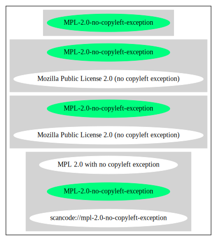

Mozilla Public License 2.0 (no copyleft exception) (MPL-2.0-no-copyleft-exception)
==================================================================================

[TABLE]

**Other Names:**

-   `scancode://mpl-2.0-no-copyleft-exception`

-   `MPL 2.0 with no copyleft exception`

Comments on (easy) usability
----------------------------

-   **↑**“Is OSI Approved” (source:
    [SPDX](https://spdx.org/licenses/MPL-2.0-no-copyleft-exception.html "SPDX"))

-   **↑**“This license is compatible with the
    DebianFreeSoftwareGuidelines (DFSG-free)” (source: [Debian Free
    Software
    Guidelines](https://wiki.debian.org/DFSGLicenses "Debian Free Software Guidelines"))

General Comments
----------------

-   “Weak copyleft licenses require sharing changes and additions to the
    licensed software when you give copies to others.” (source: [BlueOak
    License
    List](https://blueoakcouncil.org/copyleft "BlueOak License List"))

-   “Per SPDX.org, this license was released in January 2012. This
    license list entry is for use when the MPL's Exhibit B, which
    removes the Sec 3.3 copyleft exception. ” (source:
    [Scancode](https://github.com/nexB/scancode-toolkit/blob/develop/src/licensedcode/data/licenses/mpl-2.0-no-copyleft-exception.yml "Scancode"))

URLs
----

-   **Homepage:** http://www.mozilla.org/MPL/2.0/

-   **OSI Page:** http://opensource.org/licenses/MPL-2.0

-   **SPDX:**
    http://spdx.org/licenses/MPL-2.0-no-copyleft-exception.json

-   https://spdx.org/licenses/MPL-2.0-no-copyleft-exception.html

OSADL Rule
----------

    USE CASE Source code delivery
    	YOU MUST Provide License notice
    	YOU MUST Reference License text
    	YOU MUST NOT Modify Legal notices
    	IF Service offerings
    		ATTRIBUTE NOT Transferable
    		YOU MUST Indemnify Other contributors
    	IF Software modification
    		YOU MUST Grant License
    			ATTRIBUTE Original license
    	YOU MUST NOT Restrict Granted rights
    USE CASE Binary delivery
    	YOU MUST Inform Recipients
    		ATTRIBUTE Delayed source code delivery
    			ATTRIBUTE Reasonable
    			ATTRIBUTE Timely
    			ATTRIBUTE No profit
    	USE CASE License change
    		YOU MUST NOT Restrict Granted rights
    	IF Service offerings
    		ATTRIBUTE NOT Transferable
    		YOU MUST Indemnify Other contributors
    COMPATIBILITY BSD-2-Clause
    COMPATIBILITY BSD-2-Clause-Patent
    COMPATIBILITY BSD-3-Clause
    COMPATIBILITY bzip2-1.0.5
    COMPATIBILITY bzip2-1.0.6
    COMPATIBILITY CC0-1.0
    COMPATIBILITY curl
    COMPATIBILITY EFL-2.0
    COMPATIBILITY IBM-pibs
    COMPATIBILITY ICU
    COMPATIBILITY ISC
    COMPATIBILITY Libpng
    COMPATIBILITY MIT
    COMPATIBILITY MPL-2.0
    COMPATIBILITY NTP
    COMPATIBILITY UPL-1.0
    COMPATIBILITY WTFPL
    COMPATIBILITY X11
    COMPATIBILITY Zlib
    COPYLEFT CLAUSE Yes
    PATENT HINTS

(source: OSADL License Checklist)

Text
----

    This Source Code Form is "Incompatible With Secondary Licenses", as
    defined by the Mozilla Public License, v. 2.0.

------------------------------------------------------------------------

Raw Data
--------

### Facts

-   [SPDX](https://spdx.org/licenses/MPL-2.0-no-copyleft-exception.html "SPDX")

-   [BlueOak License
    List](https://blueoakcouncil.org/copyleft "BlueOak License List")

-   [Scancode](https://github.com/nexB/scancode-toolkit/blob/develop/src/licensedcode/data/licenses/mpl-2.0-no-copyleft-exception.yml "Scancode")

-   [OSADL License
    Checklist](https://www.osadl.org/fileadmin/checklists/unreflicenses/MPL-2.0-no-copyleft-exception.txt "OSADL License Checklist")

-   [Debian Free Software
    Guidelines](https://wiki.debian.org/DFSGLicenses "Debian Free Software Guidelines")

### Raw JSON

    {
        "__impliedNames": [
            "MPL-2.0-no-copyleft-exception",
            "Mozilla Public License 2.0 (no copyleft exception)",
            "scancode://mpl-2.0-no-copyleft-exception",
            "MPL 2.0 with no copyleft exception"
        ],
        "__impliedId": "MPL-2.0-no-copyleft-exception",
        "__impliedAmbiguousNames": [
            "Mozilla Public License",
            "Mozilla Public License (MPL)"
        ],
        "__impliedComments": [
            [
                "BlueOak License List",
                [
                    "Weak copyleft licenses require sharing changes and additions to the licensed software when you give copies to others."
                ]
            ],
            [
                "Scancode",
                [
                    "Per SPDX.org, this license was released in January 2012. This license list\nentry is for use when the MPL's Exhibit B, which removes the Sec 3.3\ncopyleft exception.\n"
                ]
            ]
        ],
        "facts": {
            "SPDX": {
                "isSPDXLicenseDeprecated": false,
                "spdxFullName": "Mozilla Public License 2.0 (no copyleft exception)",
                "spdxDetailsURL": "http://spdx.org/licenses/MPL-2.0-no-copyleft-exception.json",
                "_sourceURL": "https://spdx.org/licenses/MPL-2.0-no-copyleft-exception.html",
                "spdxLicIsOSIApproved": true,
                "spdxSeeAlso": [
                    "http://www.mozilla.org/MPL/2.0/",
                    "https://opensource.org/licenses/MPL-2.0"
                ],
                "_implications": {
                    "__impliedNames": [
                        "MPL-2.0-no-copyleft-exception",
                        "Mozilla Public License 2.0 (no copyleft exception)"
                    ],
                    "__impliedId": "MPL-2.0-no-copyleft-exception",
                    "__impliedJudgement": [
                        [
                            "SPDX",
                            {
                                "tag": "PositiveJudgement",
                                "contents": "Is OSI Approved"
                            }
                        ]
                    ],
                    "__isOsiApproved": true,
                    "__impliedURLs": [
                        [
                            "SPDX",
                            "http://spdx.org/licenses/MPL-2.0-no-copyleft-exception.json"
                        ],
                        [
                            null,
                            "http://www.mozilla.org/MPL/2.0/"
                        ],
                        [
                            null,
                            "https://opensource.org/licenses/MPL-2.0"
                        ]
                    ]
                },
                "spdxLicenseId": "MPL-2.0-no-copyleft-exception"
            },
            "OSADL License Checklist": {
                "_sourceURL": "https://www.osadl.org/fileadmin/checklists/unreflicenses/MPL-2.0-no-copyleft-exception.txt",
                "spdxId": "MPL-2.0-no-copyleft-exception",
                "osadlRule": "USE CASE Source code delivery\n\tYOU MUST Provide License notice\n\tYOU MUST Reference License text\n\tYOU MUST NOT Modify Legal notices\n\tIF Service offerings\n\t\tATTRIBUTE NOT Transferable\n\t\tYOU MUST Indemnify Other contributors\n\tIF Software modification\n\t\tYOU MUST Grant License\n\t\t\tATTRIBUTE Original license\n\tYOU MUST NOT Restrict Granted rights\nUSE CASE Binary delivery\n\tYOU MUST Inform Recipients\n\t\tATTRIBUTE Delayed source code delivery\n\t\t\tATTRIBUTE Reasonable\n\t\t\tATTRIBUTE Timely\n\t\t\tATTRIBUTE No profit\n\tUSE CASE License change\n\t\tYOU MUST NOT Restrict Granted rights\n\tIF Service offerings\n\t\tATTRIBUTE NOT Transferable\n\t\tYOU MUST Indemnify Other contributors\nCOMPATIBILITY BSD-2-Clause\nCOMPATIBILITY BSD-2-Clause-Patent\nCOMPATIBILITY BSD-3-Clause\nCOMPATIBILITY bzip2-1.0.5\nCOMPATIBILITY bzip2-1.0.6\nCOMPATIBILITY CC0-1.0\nCOMPATIBILITY curl\nCOMPATIBILITY EFL-2.0\nCOMPATIBILITY IBM-pibs\nCOMPATIBILITY ICU\nCOMPATIBILITY ISC\nCOMPATIBILITY Libpng\nCOMPATIBILITY MIT\nCOMPATIBILITY MPL-2.0\nCOMPATIBILITY NTP\nCOMPATIBILITY UPL-1.0\nCOMPATIBILITY WTFPL\nCOMPATIBILITY X11\nCOMPATIBILITY Zlib\nCOPYLEFT CLAUSE Yes\nPATENT HINTS\n",
                "_implications": {
                    "__impliedNames": [
                        "MPL-2.0-no-copyleft-exception"
                    ],
                    "__impliedCopyleft": [
                        [
                            "OSADL License Checklist",
                            "Copyleft"
                        ]
                    ],
                    "__calculatedCopyleft": "Copyleft"
                }
            },
            "Scancode": {
                "otherUrls": [
                    "https://opensource.org/licenses/MPL-2.0"
                ],
                "homepageUrl": "http://www.mozilla.org/MPL/2.0/",
                "shortName": "MPL 2.0 with no copyleft exception",
                "textUrls": null,
                "text": "This Source Code Form is \"Incompatible With Secondary Licenses\", as\ndefined by the Mozilla Public License, v. 2.0.\n",
                "category": "Copyleft Limited",
                "osiUrl": "http://opensource.org/licenses/MPL-2.0",
                "owner": "Mozilla",
                "_sourceURL": "https://github.com/nexB/scancode-toolkit/blob/develop/src/licensedcode/data/licenses/mpl-2.0-no-copyleft-exception.yml",
                "key": "mpl-2.0-no-copyleft-exception",
                "name": "Mozilla Public License 2.0 (no copyleft exception)",
                "spdxId": "MPL-2.0-no-copyleft-exception",
                "notes": "Per SPDX.org, this license was released in January 2012. This license list\nentry is for use when the MPL's Exhibit B, which removes the Sec 3.3\ncopyleft exception.\n",
                "_implications": {
                    "__impliedNames": [
                        "scancode://mpl-2.0-no-copyleft-exception",
                        "MPL 2.0 with no copyleft exception",
                        "MPL-2.0-no-copyleft-exception"
                    ],
                    "__impliedId": "MPL-2.0-no-copyleft-exception",
                    "__impliedComments": [
                        [
                            "Scancode",
                            [
                                "Per SPDX.org, this license was released in January 2012. This license list\nentry is for use when the MPL's Exhibit B, which removes the Sec 3.3\ncopyleft exception.\n"
                            ]
                        ]
                    ],
                    "__impliedCopyleft": [
                        [
                            "Scancode",
                            "WeakCopyleft"
                        ]
                    ],
                    "__calculatedCopyleft": "WeakCopyleft",
                    "__impliedText": "This Source Code Form is \"Incompatible With Secondary Licenses\", as\ndefined by the Mozilla Public License, v. 2.0.\n",
                    "__impliedURLs": [
                        [
                            "Homepage",
                            "http://www.mozilla.org/MPL/2.0/"
                        ],
                        [
                            "OSI Page",
                            "http://opensource.org/licenses/MPL-2.0"
                        ],
                        [
                            null,
                            "https://opensource.org/licenses/MPL-2.0"
                        ]
                    ]
                }
            },
            "Debian Free Software Guidelines": {
                "LicenseName": "Mozilla Public License (MPL)",
                "State": "DFSGCompatible",
                "_sourceURL": "https://wiki.debian.org/DFSGLicenses",
                "_implications": {
                    "__impliedNames": [
                        "MPL-2.0-no-copyleft-exception"
                    ],
                    "__impliedAmbiguousNames": [
                        "Mozilla Public License (MPL)"
                    ],
                    "__impliedJudgement": [
                        [
                            "Debian Free Software Guidelines",
                            {
                                "tag": "PositiveJudgement",
                                "contents": "This license is compatible with the DebianFreeSoftwareGuidelines (DFSG-free)"
                            }
                        ]
                    ]
                },
                "Comment": null,
                "LicenseId": "MPL-2.0-no-copyleft-exception"
            },
            "BlueOak License List": {
                "url": "https://spdx.org/licenses/MPL-2.0-no-copyleft-exception.html",
                "familyName": "Mozilla Public License",
                "_sourceURL": "https://blueoakcouncil.org/copyleft",
                "name": "Mozilla Public License 2.0 (no copyleft exception)",
                "id": "MPL-2.0-no-copyleft-exception",
                "_implications": {
                    "__impliedNames": [
                        "MPL-2.0-no-copyleft-exception",
                        "Mozilla Public License 2.0 (no copyleft exception)"
                    ],
                    "__impliedAmbiguousNames": [
                        "Mozilla Public License"
                    ],
                    "__impliedComments": [
                        [
                            "BlueOak License List",
                            [
                                "Weak copyleft licenses require sharing changes and additions to the licensed software when you give copies to others."
                            ]
                        ]
                    ],
                    "__impliedCopyleft": [
                        [
                            "BlueOak License List",
                            "WeakCopyleft"
                        ]
                    ],
                    "__calculatedCopyleft": "WeakCopyleft",
                    "__impliedURLs": [
                        [
                            null,
                            "https://spdx.org/licenses/MPL-2.0-no-copyleft-exception.html"
                        ]
                    ]
                },
                "CopyleftKind": "WeakCopyleft"
            }
        },
        "__impliedJudgement": [
            [
                "Debian Free Software Guidelines",
                {
                    "tag": "PositiveJudgement",
                    "contents": "This license is compatible with the DebianFreeSoftwareGuidelines (DFSG-free)"
                }
            ],
            [
                "SPDX",
                {
                    "tag": "PositiveJudgement",
                    "contents": "Is OSI Approved"
                }
            ]
        ],
        "__impliedCopyleft": [
            [
                "BlueOak License List",
                "WeakCopyleft"
            ],
            [
                "OSADL License Checklist",
                "Copyleft"
            ],
            [
                "Scancode",
                "WeakCopyleft"
            ]
        ],
        "__calculatedCopyleft": "WeakCopyleft",
        "__isOsiApproved": true,
        "__impliedText": "This Source Code Form is \"Incompatible With Secondary Licenses\", as\ndefined by the Mozilla Public License, v. 2.0.\n",
        "__impliedURLs": [
            [
                "SPDX",
                "http://spdx.org/licenses/MPL-2.0-no-copyleft-exception.json"
            ],
            [
                null,
                "http://www.mozilla.org/MPL/2.0/"
            ],
            [
                null,
                "https://opensource.org/licenses/MPL-2.0"
            ],
            [
                null,
                "https://spdx.org/licenses/MPL-2.0-no-copyleft-exception.html"
            ],
            [
                "Homepage",
                "http://www.mozilla.org/MPL/2.0/"
            ],
            [
                "OSI Page",
                "http://opensource.org/licenses/MPL-2.0"
            ]
        ]
    }

------------------------------------------------------------------------

Dot Cluster Graph
-----------------

