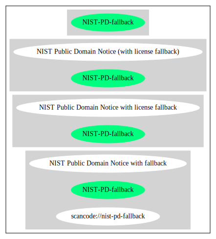

NIST Public Domain Notice with license fallback (NIST-PD-fallback)
==================================================================

[TABLE]

Comments on (easy) usability
----------------------------

General Comments
----------------

URLs
----

-   **SPDX:** http://spdx.org/licenses/NIST-PD-fallback.json

-   https://github.com/usnistgov/jsip/blob/59700e6926cbe96c5cdae897d9a7d2656b42abe3/LICENSE

-   https://github.com/usnistgov/fipy/blob/86aaa5c2ba2c6f1be19593c5986071cf6568cc34/LICENSE.rst

------------------------------------------------------------------------

Raw Data
--------

-   [SPDX](https://spdx.org/licenses/NIST-PD-fallback.html "SPDX")

&nbsp;

    {
        "__impliedNames": [
            "NIST-PD-fallback",
            "NIST Public Domain Notice with license fallback"
        ],
        "__impliedId": "NIST-PD-fallback",
        "facts": {
            "SPDX": {
                "isSPDXLicenseDeprecated": false,
                "spdxFullName": "NIST Public Domain Notice with license fallback",
                "spdxDetailsURL": "http://spdx.org/licenses/NIST-PD-fallback.json",
                "_sourceURL": "https://spdx.org/licenses/NIST-PD-fallback.html",
                "spdxLicIsOSIApproved": false,
                "spdxSeeAlso": [
                    "https://github.com/usnistgov/jsip/blob/59700e6926cbe96c5cdae897d9a7d2656b42abe3/LICENSE",
                    "https://github.com/usnistgov/fipy/blob/86aaa5c2ba2c6f1be19593c5986071cf6568cc34/LICENSE.rst"
                ],
                "_implications": {
                    "__impliedNames": [
                        "NIST-PD-fallback",
                        "NIST Public Domain Notice with license fallback"
                    ],
                    "__impliedId": "NIST-PD-fallback",
                    "__isOsiApproved": false,
                    "__impliedURLs": [
                        [
                            "SPDX",
                            "http://spdx.org/licenses/NIST-PD-fallback.json"
                        ],
                        [
                            null,
                            "https://github.com/usnistgov/jsip/blob/59700e6926cbe96c5cdae897d9a7d2656b42abe3/LICENSE"
                        ],
                        [
                            null,
                            "https://github.com/usnistgov/fipy/blob/86aaa5c2ba2c6f1be19593c5986071cf6568cc34/LICENSE.rst"
                        ]
                    ]
                },
                "spdxLicenseId": "NIST-PD-fallback"
            }
        },
        "__isOsiApproved": false,
        "__impliedURLs": [
            [
                "SPDX",
                "http://spdx.org/licenses/NIST-PD-fallback.json"
            ],
            [
                null,
                "https://github.com/usnistgov/jsip/blob/59700e6926cbe96c5cdae897d9a7d2656b42abe3/LICENSE"
            ],
            [
                null,
                "https://github.com/usnistgov/fipy/blob/86aaa5c2ba2c6f1be19593c5986071cf6568cc34/LICENSE.rst"
            ]
        ]
    }

------------------------------------------------------------------------

Dot Cluster Graph
-----------------

