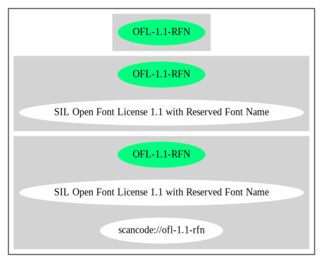

SIL Open Font License 1.1 with Reserved Font Name (OFL-1.1-RFN)
===============================================================

[TABLE]

Comments on (easy) usability
----------------------------

-   **↑**“Is OSI Approved” (source:
    [SPDX](https://spdx.org/licenses/OFL-1.1-RFN.html "SPDX"))

General Comments
----------------

URLs
----

-   **SPDX:** http://spdx.org/licenses/OFL-1.1-RFN.json

-   http://scripts.sil.org/cms/scripts/page.php?item\_id=OFL\_web

-   https://opensource.org/licenses/OFL-1.1

------------------------------------------------------------------------

Raw Data
--------

    {
        "__impliedNames": [
            "OFL-1.1-RFN",
            "SIL Open Font License 1.1 with Reserved Font Name"
        ],
        "__impliedId": "OFL-1.1-RFN",
        "facts": {
            "SPDX": {
                "isSPDXLicenseDeprecated": false,
                "spdxFullName": "SIL Open Font License 1.1 with Reserved Font Name",
                "spdxDetailsURL": "http://spdx.org/licenses/OFL-1.1-RFN.json",
                "_sourceURL": "https://spdx.org/licenses/OFL-1.1-RFN.html",
                "spdxLicIsOSIApproved": true,
                "spdxSeeAlso": [
                    "http://scripts.sil.org/cms/scripts/page.php?item_id=OFL_web",
                    "https://opensource.org/licenses/OFL-1.1"
                ],
                "_implications": {
                    "__impliedNames": [
                        "OFL-1.1-RFN",
                        "SIL Open Font License 1.1 with Reserved Font Name"
                    ],
                    "__impliedId": "OFL-1.1-RFN",
                    "__impliedJudgement": [
                        [
                            "SPDX",
                            {
                                "tag": "PositiveJudgement",
                                "contents": "Is OSI Approved"
                            }
                        ]
                    ],
                    "__isOsiApproved": true,
                    "__impliedURLs": [
                        [
                            "SPDX",
                            "http://spdx.org/licenses/OFL-1.1-RFN.json"
                        ],
                        [
                            null,
                            "http://scripts.sil.org/cms/scripts/page.php?item_id=OFL_web"
                        ],
                        [
                            null,
                            "https://opensource.org/licenses/OFL-1.1"
                        ]
                    ]
                },
                "spdxLicenseId": "OFL-1.1-RFN"
            }
        },
        "__impliedJudgement": [
            [
                "SPDX",
                {
                    "tag": "PositiveJudgement",
                    "contents": "Is OSI Approved"
                }
            ]
        ],
        "__isOsiApproved": true,
        "__impliedURLs": [
            [
                "SPDX",
                "http://spdx.org/licenses/OFL-1.1-RFN.json"
            ],
            [
                null,
                "http://scripts.sil.org/cms/scripts/page.php?item_id=OFL_web"
            ],
            [
                null,
                "https://opensource.org/licenses/OFL-1.1"
            ]
        ]
    }

------------------------------------------------------------------------

Dot Cluster Graph
-----------------

