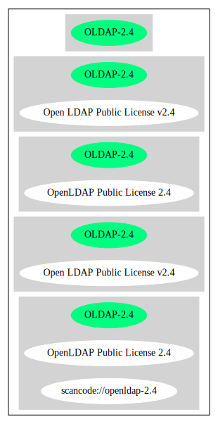

Open LDAP Public License v2.4 (OLDAP-2.4)
=========================================

[TABLE]

**Other Names:**

-   `scancode://openldap-2.4`

-   `OpenLDAP Public License 2.4`

Comments on (easy) usability
----------------------------

-   **↑**Rating is: Bronze (source: [BlueOak License
    List](https://blueoakcouncil.org/list "BlueOak License List"))

-   Per SPDX.org, this license was released 8 December 2000. (source:
    [Scancode](https://github.com/nexB/scancode-toolkit/blob/develop/src/licensedcode/data/licenses/openldap-2.4.yml "Scancode"))

URLs
----

-   **Homepage:**
    http://www.openldap.org/devel/gitweb.cgi?p=openldap.git;a=blob;f=LICENSE;hb=cd1284c4a91a8a380d904eee68d1583f989ed386

-   **SPDX:** http://spdx.org/licenses/OLDAP-2.4.json

-   **SPDX:** https://spdx.org/licenses/OLDAP-2.4.html

Text
----

    The OpenLDAP Public License 
    Version 2.4, 8 December 2000 

    Redistribution and use of this software and associated documentation 
    ("Software"), with or without modification, are permitted provided 
    that the following conditions are met: 

    1. Redistributions of source code must retain copyright statements 
    and notices. 

    2. Redistributions in binary form must reproduce applicable copyright 
    statements and notices, this list of conditions, and the following 
    disclaimer in the documentation and/or other materials provided 
    with the distribution. 

    3. Redistributions must contain a verbatim copy of this document. 

    4. The names and trademarks of the authors and copyright holders 
    must not be used in advertising or otherwise to promote the sale, 
    use or other dealing in this Software without specific, written 
    prior permission. 

    5. Due credit should be given to the OpenLDAP Project. 

    6. The OpenLDAP Foundation may revise this license from time to 
    time. Each revision is distinguished by a version number. You 
    may use the Software under terms of this license revision or under 
    the terms of any subsequent revision of the license. 

    THIS SOFTWARE IS PROVIDED BY THE OPENLDAP FOUNDATION AND CONTRIBUTORS 
    ``AS IS'' AND ANY EXPRESSED OR IMPLIED WARRANTIES, INCLUDING, BUT 
    NOT LIMITED TO, THE IMPLIED WARRANTIES OF MERCHANTABILITY AND 
    FITNESS FOR A PARTICULAR PURPOSE ARE DISCLAIMED. IN NO EVENT SHALL 
    THE OPENLDAP FOUNDATION OR ITS CONTRIBUTORS BE LIABLE FOR ANY 
    DIRECT, INDIRECT, INCIDENTAL, SPECIAL, EXEMPLARY, OR CONSEQUENTIAL 
    DAMAGES (INCLUDING, BUT NOT LIMITED TO, PROCUREMENT OF SUBSTITUTE 
    GOODS OR SERVICES; LOSS OF USE, DATA, OR PROFITS; OR BUSINESS 
    INTERRUPTION) HOWEVER CAUSED AND ON ANY THEORY OF LIABILITY, WHETHER 
    IN CONTRACT, STRICT LIABILITY, OR TORT (INCLUDING NEGLIGENCE OR 
    OTHERWISE) ARISING IN ANY WAY OUT OF THE USE OF THIS SOFTWARE, EVEN 
    IF ADVISED OF THE POSSIBILITY OF SUCH DAMAGE. 

    OpenLDAP is a trademark of the OpenLDAP Foundation. 

    Copyright 1999-2000 The OpenLDAP Foundation, Redwood City, 
    California, USA. All Rights Reserved. Permission to copy and 
    distributed verbatim copies of this document is granted.

------------------------------------------------------------------------

Raw Data
--------

    {
        "__impliedNames": [
            "OLDAP-2.4",
            "Open LDAP Public License v2.4",
            "scancode://openldap-2.4",
            "OpenLDAP Public License 2.4"
        ],
        "__impliedId": "OLDAP-2.4",
        "facts": {
            "SPDX": {
                "isSPDXLicenseDeprecated": false,
                "spdxFullName": "Open LDAP Public License v2.4",
                "spdxDetailsURL": "http://spdx.org/licenses/OLDAP-2.4.json",
                "_sourceURL": "https://spdx.org/licenses/OLDAP-2.4.html",
                "spdxLicIsOSIApproved": false,
                "spdxSeeAlso": [
                    "http://www.openldap.org/devel/gitweb.cgi?p=openldap.git;a=blob;f=LICENSE;hb=cd1284c4a91a8a380d904eee68d1583f989ed386"
                ],
                "_implications": {
                    "__impliedNames": [
                        "OLDAP-2.4",
                        "Open LDAP Public License v2.4"
                    ],
                    "__impliedId": "OLDAP-2.4",
                    "__isOsiApproved": false,
                    "__impliedURLs": [
                        [
                            "SPDX",
                            "http://spdx.org/licenses/OLDAP-2.4.json"
                        ],
                        [
                            null,
                            "http://www.openldap.org/devel/gitweb.cgi?p=openldap.git;a=blob;f=LICENSE;hb=cd1284c4a91a8a380d904eee68d1583f989ed386"
                        ]
                    ]
                },
                "spdxLicenseId": "OLDAP-2.4"
            },
            "Scancode": {
                "otherUrls": null,
                "homepageUrl": "http://www.openldap.org/devel/gitweb.cgi?p=openldap.git;a=blob;f=LICENSE;hb=cd1284c4a91a8a380d904eee68d1583f989ed386",
                "shortName": "OpenLDAP Public License 2.4",
                "textUrls": null,
                "text": "The OpenLDAP Public License \nVersion 2.4, 8 December 2000 \n\nRedistribution and use of this software and associated documentation \n(\"Software\"), with or without modification, are permitted provided \nthat the following conditions are met: \n\n1. Redistributions of source code must retain copyright statements \nand notices. \n\n2. Redistributions in binary form must reproduce applicable copyright \nstatements and notices, this list of conditions, and the following \ndisclaimer in the documentation and/or other materials provided \nwith the distribution. \n\n3. Redistributions must contain a verbatim copy of this document. \n\n4. The names and trademarks of the authors and copyright holders \nmust not be used in advertising or otherwise to promote the sale, \nuse or other dealing in this Software without specific, written \nprior permission. \n\n5. Due credit should be given to the OpenLDAP Project. \n\n6. The OpenLDAP Foundation may revise this license from time to \ntime. Each revision is distinguished by a version number. You \nmay use the Software under terms of this license revision or under \nthe terms of any subsequent revision of the license. \n\nTHIS SOFTWARE IS PROVIDED BY THE OPENLDAP FOUNDATION AND CONTRIBUTORS \n``AS IS'' AND ANY EXPRESSED OR IMPLIED WARRANTIES, INCLUDING, BUT \nNOT LIMITED TO, THE IMPLIED WARRANTIES OF MERCHANTABILITY AND \nFITNESS FOR A PARTICULAR PURPOSE ARE DISCLAIMED. IN NO EVENT SHALL \nTHE OPENLDAP FOUNDATION OR ITS CONTRIBUTORS BE LIABLE FOR ANY \nDIRECT, INDIRECT, INCIDENTAL, SPECIAL, EXEMPLARY, OR CONSEQUENTIAL \nDAMAGES (INCLUDING, BUT NOT LIMITED TO, PROCUREMENT OF SUBSTITUTE \nGOODS OR SERVICES; LOSS OF USE, DATA, OR PROFITS; OR BUSINESS \nINTERRUPTION) HOWEVER CAUSED AND ON ANY THEORY OF LIABILITY, WHETHER \nIN CONTRACT, STRICT LIABILITY, OR TORT (INCLUDING NEGLIGENCE OR \nOTHERWISE) ARISING IN ANY WAY OUT OF THE USE OF THIS SOFTWARE, EVEN \nIF ADVISED OF THE POSSIBILITY OF SUCH DAMAGE. \n\nOpenLDAP is a trademark of the OpenLDAP Foundation. \n\nCopyright 1999-2000 The OpenLDAP Foundation, Redwood City, \nCalifornia, USA. All Rights Reserved. Permission to copy and \ndistributed verbatim copies of this document is granted.",
                "category": "Permissive",
                "osiUrl": null,
                "owner": "OpenLDAP Foundation",
                "_sourceURL": "https://github.com/nexB/scancode-toolkit/blob/develop/src/licensedcode/data/licenses/openldap-2.4.yml",
                "key": "openldap-2.4",
                "name": "OpenLDAP Public License 2.4",
                "spdxId": "OLDAP-2.4",
                "notes": "Per SPDX.org, this license was released 8 December 2000.",
                "_implications": {
                    "__impliedNames": [
                        "scancode://openldap-2.4",
                        "OpenLDAP Public License 2.4",
                        "OLDAP-2.4"
                    ],
                    "__impliedId": "OLDAP-2.4",
                    "__impliedJudgement": [
                        [
                            "Scancode",
                            {
                                "tag": "NeutralJudgement",
                                "contents": "Per SPDX.org, this license was released 8 December 2000."
                            }
                        ]
                    ],
                    "__impliedCopyleft": [
                        [
                            "Scancode",
                            "NoCopyleft"
                        ]
                    ],
                    "__calculatedCopyleft": "NoCopyleft",
                    "__impliedText": "The OpenLDAP Public License \nVersion 2.4, 8 December 2000 \n\nRedistribution and use of this software and associated documentation \n(\"Software\"), with or without modification, are permitted provided \nthat the following conditions are met: \n\n1. Redistributions of source code must retain copyright statements \nand notices. \n\n2. Redistributions in binary form must reproduce applicable copyright \nstatements and notices, this list of conditions, and the following \ndisclaimer in the documentation and/or other materials provided \nwith the distribution. \n\n3. Redistributions must contain a verbatim copy of this document. \n\n4. The names and trademarks of the authors and copyright holders \nmust not be used in advertising or otherwise to promote the sale, \nuse or other dealing in this Software without specific, written \nprior permission. \n\n5. Due credit should be given to the OpenLDAP Project. \n\n6. The OpenLDAP Foundation may revise this license from time to \ntime. Each revision is distinguished by a version number. You \nmay use the Software under terms of this license revision or under \nthe terms of any subsequent revision of the license. \n\nTHIS SOFTWARE IS PROVIDED BY THE OPENLDAP FOUNDATION AND CONTRIBUTORS \n``AS IS'' AND ANY EXPRESSED OR IMPLIED WARRANTIES, INCLUDING, BUT \nNOT LIMITED TO, THE IMPLIED WARRANTIES OF MERCHANTABILITY AND \nFITNESS FOR A PARTICULAR PURPOSE ARE DISCLAIMED. IN NO EVENT SHALL \nTHE OPENLDAP FOUNDATION OR ITS CONTRIBUTORS BE LIABLE FOR ANY \nDIRECT, INDIRECT, INCIDENTAL, SPECIAL, EXEMPLARY, OR CONSEQUENTIAL \nDAMAGES (INCLUDING, BUT NOT LIMITED TO, PROCUREMENT OF SUBSTITUTE \nGOODS OR SERVICES; LOSS OF USE, DATA, OR PROFITS; OR BUSINESS \nINTERRUPTION) HOWEVER CAUSED AND ON ANY THEORY OF LIABILITY, WHETHER \nIN CONTRACT, STRICT LIABILITY, OR TORT (INCLUDING NEGLIGENCE OR \nOTHERWISE) ARISING IN ANY WAY OUT OF THE USE OF THIS SOFTWARE, EVEN \nIF ADVISED OF THE POSSIBILITY OF SUCH DAMAGE. \n\nOpenLDAP is a trademark of the OpenLDAP Foundation. \n\nCopyright 1999-2000 The OpenLDAP Foundation, Redwood City, \nCalifornia, USA. All Rights Reserved. Permission to copy and \ndistributed verbatim copies of this document is granted.",
                    "__impliedURLs": [
                        [
                            "Homepage",
                            "http://www.openldap.org/devel/gitweb.cgi?p=openldap.git;a=blob;f=LICENSE;hb=cd1284c4a91a8a380d904eee68d1583f989ed386"
                        ]
                    ]
                }
            },
            "BlueOak License List": {
                "BlueOakRating": "Bronze",
                "url": "https://spdx.org/licenses/OLDAP-2.4.html",
                "isPermissive": true,
                "_sourceURL": "https://blueoakcouncil.org/list",
                "name": "Open LDAP Public License v2.4",
                "id": "OLDAP-2.4",
                "_implications": {
                    "__impliedNames": [
                        "OLDAP-2.4"
                    ],
                    "__impliedJudgement": [
                        [
                            "BlueOak License List",
                            {
                                "tag": "PositiveJudgement",
                                "contents": "Rating is: Bronze"
                            }
                        ]
                    ],
                    "__impliedCopyleft": [
                        [
                            "BlueOak License List",
                            "NoCopyleft"
                        ]
                    ],
                    "__calculatedCopyleft": "NoCopyleft",
                    "__impliedURLs": [
                        [
                            "SPDX",
                            "https://spdx.org/licenses/OLDAP-2.4.html"
                        ]
                    ]
                }
            }
        },
        "__impliedJudgement": [
            [
                "BlueOak License List",
                {
                    "tag": "PositiveJudgement",
                    "contents": "Rating is: Bronze"
                }
            ],
            [
                "Scancode",
                {
                    "tag": "NeutralJudgement",
                    "contents": "Per SPDX.org, this license was released 8 December 2000."
                }
            ]
        ],
        "__impliedCopyleft": [
            [
                "BlueOak License List",
                "NoCopyleft"
            ],
            [
                "Scancode",
                "NoCopyleft"
            ]
        ],
        "__calculatedCopyleft": "NoCopyleft",
        "__isOsiApproved": false,
        "__impliedText": "The OpenLDAP Public License \nVersion 2.4, 8 December 2000 \n\nRedistribution and use of this software and associated documentation \n(\"Software\"), with or without modification, are permitted provided \nthat the following conditions are met: \n\n1. Redistributions of source code must retain copyright statements \nand notices. \n\n2. Redistributions in binary form must reproduce applicable copyright \nstatements and notices, this list of conditions, and the following \ndisclaimer in the documentation and/or other materials provided \nwith the distribution. \n\n3. Redistributions must contain a verbatim copy of this document. \n\n4. The names and trademarks of the authors and copyright holders \nmust not be used in advertising or otherwise to promote the sale, \nuse or other dealing in this Software without specific, written \nprior permission. \n\n5. Due credit should be given to the OpenLDAP Project. \n\n6. The OpenLDAP Foundation may revise this license from time to \ntime. Each revision is distinguished by a version number. You \nmay use the Software under terms of this license revision or under \nthe terms of any subsequent revision of the license. \n\nTHIS SOFTWARE IS PROVIDED BY THE OPENLDAP FOUNDATION AND CONTRIBUTORS \n``AS IS'' AND ANY EXPRESSED OR IMPLIED WARRANTIES, INCLUDING, BUT \nNOT LIMITED TO, THE IMPLIED WARRANTIES OF MERCHANTABILITY AND \nFITNESS FOR A PARTICULAR PURPOSE ARE DISCLAIMED. IN NO EVENT SHALL \nTHE OPENLDAP FOUNDATION OR ITS CONTRIBUTORS BE LIABLE FOR ANY \nDIRECT, INDIRECT, INCIDENTAL, SPECIAL, EXEMPLARY, OR CONSEQUENTIAL \nDAMAGES (INCLUDING, BUT NOT LIMITED TO, PROCUREMENT OF SUBSTITUTE \nGOODS OR SERVICES; LOSS OF USE, DATA, OR PROFITS; OR BUSINESS \nINTERRUPTION) HOWEVER CAUSED AND ON ANY THEORY OF LIABILITY, WHETHER \nIN CONTRACT, STRICT LIABILITY, OR TORT (INCLUDING NEGLIGENCE OR \nOTHERWISE) ARISING IN ANY WAY OUT OF THE USE OF THIS SOFTWARE, EVEN \nIF ADVISED OF THE POSSIBILITY OF SUCH DAMAGE. \n\nOpenLDAP is a trademark of the OpenLDAP Foundation. \n\nCopyright 1999-2000 The OpenLDAP Foundation, Redwood City, \nCalifornia, USA. All Rights Reserved. Permission to copy and \ndistributed verbatim copies of this document is granted.",
        "__impliedURLs": [
            [
                "SPDX",
                "http://spdx.org/licenses/OLDAP-2.4.json"
            ],
            [
                null,
                "http://www.openldap.org/devel/gitweb.cgi?p=openldap.git;a=blob;f=LICENSE;hb=cd1284c4a91a8a380d904eee68d1583f989ed386"
            ],
            [
                "SPDX",
                "https://spdx.org/licenses/OLDAP-2.4.html"
            ],
            [
                "Homepage",
                "http://www.openldap.org/devel/gitweb.cgi?p=openldap.git;a=blob;f=LICENSE;hb=cd1284c4a91a8a380d904eee68d1583f989ed386"
            ]
        ]
    }

------------------------------------------------------------------------

Dot Cluster Graph
-----------------

