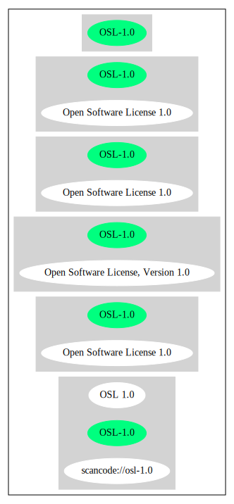

Open Software License 1.0 (OSL-1.0)
===================================

[TABLE]

**Other Names:**

-   `scancode://osl-1.0`

-   `OSL 1.0`

-   `Open Software License, Version 1.0`

Comments on (easy) usability
----------------------------

-   **↑**“Is OSI Approved” (source:
    [SPDX](https://spdx.org/licenses/OSL-1.0.html "SPDX"))

-   **↓**“Google Classification is RESTRICTED” (source: [Google OSS
    Policy](https://opensource.google.com/docs/thirdparty/licenses/ "Google OSS Policy"))

General Comments
----------------

-   “Per SPDX.org, this license was OSI certified. This license has been
    superseded. ” (source:
    [Scancode](https://github.com/nexB/scancode-toolkit/blob/develop/src/licensedcode/data/licenses/osl-1.0.yml "Scancode"))

URLs
----

-   **Homepage:** http://www.opensource.org/licenses/osl-1.0.txt

-   **OSI Page:** https://opensource.org/licenses/OSL-1.0

-   **SPDX:** http://spdx.org/licenses/OSL-1.0.json

-   http://www.gnu.org/licenses/license-list.html\#OSL

Text
----

    Open Software License, v 1.0

    The Open Software License
    v. 1.0

    This Open Software License (the "License") applies to any original
    work of authorship (the "Original Work") whose owner (the "Licensor")
    has placed the following notice immediately following the copyright
    notice for the Original Work: "Licensed under the Open Software
    License version 1.0"

    License Terms

    1) Grant of Copyright License. Licensor hereby grants You a
    world-wide, royalty-free, non-exclusive, perpetual, non-sublicenseable
    license to do the following:

    a) to reproduce the Original Work in copies;

    b) to prepare derivative works ("Derivative Works") based upon the
    Original Work;

    c) to distribute copies of the Original Work and Derivative Works
    to the public, with the proviso that copies of Original Work or
    Derivative Works that You distribute shall be licensed under the
    Open Software License;

    d) to perform the Original Work publicly; and

    e) to display the Original Work publicly.

    2) Grant of Patent License. Licensor hereby grants You a world-wide,
    royalty-free, non-exclusive, perpetual, non-sublicenseable license,
    under patent claims owned or controlled by the Licensor that are
    embodied in the Original Work as furnished by the Licensor ("Licensed
    Claims") to make, use, sell and offer for sale the Original Work.
    Licensor hereby grants You a world-wide, royalty-free, non-exclusive,
    perpetual, non-sublicenseable license under the Licensed Claims to
    make, use, sell and offer for sale Derivative Works.

    3) Grant of Source Code License. The term "Source Code" means the
    preferred form of the Original Work for making modifications to it and
    all available documentation describing how to access and modify the
    Original Work. Licensor hereby agrees to provide a machine-readable
    copy of the Source Code of the Original Work along with each copy of
    the Original Work that Licensor distributes. Licensor reserves the
    right to satisfy this obligation by placing a machine-readable copy of
    the Source Code in an information repository reasonably calculated to
    permit inexpensive and convenient access by You for as long as
    Licensor continues to distribute the Original Work, and by publishing
    the address of that information repository in a notice immediately
    following the copyright notice that applies to the Original Work.

    4) Exclusions From License Grant. Nothing in this License shall be
    deemed to grant any rights to trademarks, copyrights, patents, trade
    secrets or any other intellectual property of Licensor except as
    expressly stated herein. No patent license is granted to make, use,
    sell or offer to sell embodiments of any patent claims other than the
    Licensed Claims defined in Section 2. No right is granted to the
    trademarks of Licensor even if such marks are included in the Original
    Work. Nothing in this License shall be interpreted to prohibit
    Licensor from licensing under different terms from this License any
    Original Work that Licensor otherwise would have a right to license.

    5) External Deployment. The term "External Deployment" means the use
    or distribution of the Original Work or Derivative Works in any way
    such that the Original Work or Derivative Works may be accessed or
    used by anyone other than You, whether the Original Work or Derivative
    Works are distributed to those persons, made available as an
    application intended for use over a computer network, or used to
    provide services or otherwise deliver content to anyone other than
    You. As an express condition for the grants of license hereunder, You
    agree that any External Deployment by You shall be deemed a
    distribution and shall be licensed to all under the terms of this
    License, as prescribed in section 1(c) herein.

    6) Warranty and Disclaimer of Warranty. LICENSOR WARRANTS THAT THE
    COPYRIGHT IN AND TO THE ORIGINAL WORK IS OWNED BY THE LICENSOR OR THAT
    THE ORIGINAL WORK IS DISTRIBUTED BY LICENSOR UNDER A VALID CURRENT
    LICENSE FROM THE COPYRIGHT OWNER. EXCEPT AS EXPRESSLY STATED IN THE
    IMMEDIATELY PRECEEDING SENTENCE, THE ORIGINAL WORK IS PROVIDED UNDER
    THIS LICENSE ON AN "AS IS" BASIS, WITHOUT WARRANTY, EITHER EXPRESS OR
    IMPLIED, INCLUDING, WITHOUT LIMITATION, THE WARRANTY OF
    NON-INFRINGEMENT AND WARRANTIES THAT THE ORIGINAL WORK IS MERCHANTABLE
    OR FIT FOR A PARTICULAR PURPOSE. THE ENTIRE RISK AS TO THE QUALITY OF
    THE ORIGINAL WORK IS WITH YOU. THIS DISCLAIMER OF WARRANTY CONSTITUTES
    AN ESSENTIAL PART OF THIS LICENSE. NO LICENSE TO ORIGINAL WORK IS
    GRANTED HEREUNDER EXCEPT UNDER THIS DISCLAIMER.

    7) Limitation of Liability. UNDER NO CIRCUMSTANCES AND UNDER NO LEGAL
    THEORY, WHETHER TORT (INCLUDING NEGLIGENCE), CONTRACT, OR OTHERWISE,
    SHALL THE LICENSOR BE LIABLE TO ANY PERSON FOR ANY DIRECT, INDIRECT,
    SPECIAL, INCIDENTAL, OR CONSEQUENTIAL DAMAGES OF ANY CHARACTER ARISING
    AS A RESULT OF THIS LICENSE OR THE USE OF THE ORIGINAL WORK INCLUDING,
    WITHOUT LIMITATION, DAMAGES FOR LOSS OF GOODWILL, WORK STOPPAGE,
    COMPUTER FAILURE OR MALFUNCTION, OR ANY AND ALL OTHER COMMERCIAL
    DAMAGES OR LOSSES, EVEN IF SUCH PERSON SHALL HAVE BEEN INFORMED OF THE
    POSSIBILITY OF SUCH DAMAGES. THIS LIMITATION OF LIABILITY SHALL NOT
    APPLY TO LIABILITY FOR DEATH OR PERSONAL INJURY RESULTING FROM SUCH
    PARTY'S NEGLIGENCE TO THE EXTENT APPLICABLE LAW PROHIBITS SUCH
    LIMITATION. SOME JURISDICTIONS DO NOT ALLOW THE EXCLUSION OR
    LIMITATION OF INCIDENTAL OR CONSEQUENTIAL DAMAGES, SO THIS EXCLUSION
    AND LIMITATION MAY NOT APPLY TO YOU.

    8) Acceptance and Termination. Nothing else but this License (or
    another written agreement between Licensor and You) grants You
    permission to create Derivative Works based upon the Original Work,
    and any attempt to do so except under the terms of this License (or
    another written agreement between Licensor and You) is expressly
    prohibited by U.S. copyright law, the equivalent laws of other
    countries, and by international treaty. Therefore, by exercising any
    of the rights granted to You in Sections 1 and 2 herein, You indicate
    Your acceptance of this License and all of its terms and conditions.
    This license shall terminate immediately and you may no longer
    exercise any of the rights granted to You by this License upon Your
    failure to honor the proviso in Section 1(c) herein.

    9) Mutual Termination for Patent Action. This License shall terminate
    automatically and You may no longer exercise any of the rights granted
    to You by this License if You file a lawsuit in any court alleging
    that any OSI Certified open source software that is licensed under any
    license containing this "Mutual Termination for Patent Action" clause
    infringes any patent claims that are essential to use that software.

    10) Jurisdiction, Venue and Governing Law. You agree that any lawsuit
    arising under or relating to this License shall be maintained in the
    courts of the jurisdiction wherein the Licensor resides or in which
    Licensor conducts its primary business, and under the laws of that
    jurisdiction excluding its conflict-of-law provisions. The application
    of the United Nations Convention on Contracts for the International
    Sale of Goods is expressly excluded. Any use of the Original Work
    outside the scope of this License or after its termination shall be
    subject to the requirements and penalties of the U.S. Copyright Act,
    17 U.S.C. § 101 et seq., the equivalent laws of other countries, and
    international treaty. This section shall survive the termination of
    this License.

    11) Attorneys Fees. In any action to enforce the terms of this License
    or seeking damages relating thereto, the prevailing party shall be
    entitled to recover its costs and expenses, including, without
    limitation, reasonable attorneys' fees and costs incurred in
    connection with such action, including any appeal of such action. This
    section shall survive the termination of this License.

    12) Miscellaneous. This License represents the complete agreement
    concerning the subject matter hereof. If any provision of this License
    is held to be unenforceable, such provision shall be reformed only to
    the extent necessary to make it enforceable.

    13) Definition of "You" in This License. "You" throughout this
    License, whether in upper or lower case, means an individual or a
    legal entity exercising rights under, and complying with all of the
    terms of, this License. For legal entities, "You" includes any entity
    that controls, is controlled by, or is under common control with you.
    For purposes of this definition, "control" means (i) the power, direct
    or indirect, to cause the direction or management of such entity,
    whether by contract or otherwise, or (ii) ownership of fifty percent
    (50%) or more of the outstanding shares, or (iii) beneficial ownership
    of such entity.

    This license is Copyright (C) 2002 Lawrence E. Rosen. All rights
    reserved. Permission is hereby granted to copy and distribute this
    license without modification. This license may not be modified without
    the express written permission of its copyright owner.

------------------------------------------------------------------------

Raw Data
--------

    {
        "__impliedNames": [
            "OSL-1.0",
            "Open Software License 1.0",
            "scancode://osl-1.0",
            "OSL 1.0",
            "Open Software License, Version 1.0"
        ],
        "__impliedId": "OSL-1.0",
        "__impliedComments": [
            [
                "Scancode",
                [
                    "Per SPDX.org, this license was OSI certified. This license has been\nsuperseded.\n"
                ]
            ]
        ],
        "facts": {
            "SPDX": {
                "isSPDXLicenseDeprecated": false,
                "spdxFullName": "Open Software License 1.0",
                "spdxDetailsURL": "http://spdx.org/licenses/OSL-1.0.json",
                "_sourceURL": "https://spdx.org/licenses/OSL-1.0.html",
                "spdxLicIsOSIApproved": true,
                "spdxSeeAlso": [
                    "https://opensource.org/licenses/OSL-1.0"
                ],
                "_implications": {
                    "__impliedNames": [
                        "OSL-1.0",
                        "Open Software License 1.0"
                    ],
                    "__impliedId": "OSL-1.0",
                    "__impliedJudgement": [
                        [
                            "SPDX",
                            {
                                "tag": "PositiveJudgement",
                                "contents": "Is OSI Approved"
                            }
                        ]
                    ],
                    "__isOsiApproved": true,
                    "__impliedURLs": [
                        [
                            "SPDX",
                            "http://spdx.org/licenses/OSL-1.0.json"
                        ],
                        [
                            null,
                            "https://opensource.org/licenses/OSL-1.0"
                        ]
                    ]
                },
                "spdxLicenseId": "OSL-1.0"
            },
            "Scancode": {
                "otherUrls": [
                    "http://opensource.org/licenses/OSL-1.0",
                    "http://www.gnu.org/licenses/license-list.html#OSL",
                    "https://opensource.org/licenses/OSL-1.0"
                ],
                "homepageUrl": "http://www.opensource.org/licenses/osl-1.0.txt",
                "shortName": "OSL 1.0",
                "textUrls": null,
                "text": "Open Software License, v 1.0\n\nThe Open Software License\nv. 1.0\n\nThis Open Software License (the \"License\") applies to any original\nwork of authorship (the \"Original Work\") whose owner (the \"Licensor\")\nhas placed the following notice immediately following the copyright\nnotice for the Original Work: \"Licensed under the Open Software\nLicense version 1.0\"\n\nLicense Terms\n\n1) Grant of Copyright License. Licensor hereby grants You a\nworld-wide, royalty-free, non-exclusive, perpetual, non-sublicenseable\nlicense to do the following:\n\na) to reproduce the Original Work in copies;\n\nb) to prepare derivative works (\"Derivative Works\") based upon the\nOriginal Work;\n\nc) to distribute copies of the Original Work and Derivative Works\nto the public, with the proviso that copies of Original Work or\nDerivative Works that You distribute shall be licensed under the\nOpen Software License;\n\nd) to perform the Original Work publicly; and\n\ne) to display the Original Work publicly.\n\n2) Grant of Patent License. Licensor hereby grants You a world-wide,\nroyalty-free, non-exclusive, perpetual, non-sublicenseable license,\nunder patent claims owned or controlled by the Licensor that are\nembodied in the Original Work as furnished by the Licensor (\"Licensed\nClaims\") to make, use, sell and offer for sale the Original Work.\nLicensor hereby grants You a world-wide, royalty-free, non-exclusive,\nperpetual, non-sublicenseable license under the Licensed Claims to\nmake, use, sell and offer for sale Derivative Works.\n\n3) Grant of Source Code License. The term \"Source Code\" means the\npreferred form of the Original Work for making modifications to it and\nall available documentation describing how to access and modify the\nOriginal Work. Licensor hereby agrees to provide a machine-readable\ncopy of the Source Code of the Original Work along with each copy of\nthe Original Work that Licensor distributes. Licensor reserves the\nright to satisfy this obligation by placing a machine-readable copy of\nthe Source Code in an information repository reasonably calculated to\npermit inexpensive and convenient access by You for as long as\nLicensor continues to distribute the Original Work, and by publishing\nthe address of that information repository in a notice immediately\nfollowing the copyright notice that applies to the Original Work.\n\n4) Exclusions From License Grant. Nothing in this License shall be\ndeemed to grant any rights to trademarks, copyrights, patents, trade\nsecrets or any other intellectual property of Licensor except as\nexpressly stated herein. No patent license is granted to make, use,\nsell or offer to sell embodiments of any patent claims other than the\nLicensed Claims defined in Section 2. No right is granted to the\ntrademarks of Licensor even if such marks are included in the Original\nWork. Nothing in this License shall be interpreted to prohibit\nLicensor from licensing under different terms from this License any\nOriginal Work that Licensor otherwise would have a right to license.\n\n5) External Deployment. The term \"External Deployment\" means the use\nor distribution of the Original Work or Derivative Works in any way\nsuch that the Original Work or Derivative Works may be accessed or\nused by anyone other than You, whether the Original Work or Derivative\nWorks are distributed to those persons, made available as an\napplication intended for use over a computer network, or used to\nprovide services or otherwise deliver content to anyone other than\nYou. As an express condition for the grants of license hereunder, You\nagree that any External Deployment by You shall be deemed a\ndistribution and shall be licensed to all under the terms of this\nLicense, as prescribed in section 1(c) herein.\n\n6) Warranty and Disclaimer of Warranty. LICENSOR WARRANTS THAT THE\nCOPYRIGHT IN AND TO THE ORIGINAL WORK IS OWNED BY THE LICENSOR OR THAT\nTHE ORIGINAL WORK IS DISTRIBUTED BY LICENSOR UNDER A VALID CURRENT\nLICENSE FROM THE COPYRIGHT OWNER. EXCEPT AS EXPRESSLY STATED IN THE\nIMMEDIATELY PRECEEDING SENTENCE, THE ORIGINAL WORK IS PROVIDED UNDER\nTHIS LICENSE ON AN \"AS IS\" BASIS, WITHOUT WARRANTY, EITHER EXPRESS OR\nIMPLIED, INCLUDING, WITHOUT LIMITATION, THE WARRANTY OF\nNON-INFRINGEMENT AND WARRANTIES THAT THE ORIGINAL WORK IS MERCHANTABLE\nOR FIT FOR A PARTICULAR PURPOSE. THE ENTIRE RISK AS TO THE QUALITY OF\nTHE ORIGINAL WORK IS WITH YOU. THIS DISCLAIMER OF WARRANTY CONSTITUTES\nAN ESSENTIAL PART OF THIS LICENSE. NO LICENSE TO ORIGINAL WORK IS\nGRANTED HEREUNDER EXCEPT UNDER THIS DISCLAIMER.\n\n7) Limitation of Liability. UNDER NO CIRCUMSTANCES AND UNDER NO LEGAL\nTHEORY, WHETHER TORT (INCLUDING NEGLIGENCE), CONTRACT, OR OTHERWISE,\nSHALL THE LICENSOR BE LIABLE TO ANY PERSON FOR ANY DIRECT, INDIRECT,\nSPECIAL, INCIDENTAL, OR CONSEQUENTIAL DAMAGES OF ANY CHARACTER ARISING\nAS A RESULT OF THIS LICENSE OR THE USE OF THE ORIGINAL WORK INCLUDING,\nWITHOUT LIMITATION, DAMAGES FOR LOSS OF GOODWILL, WORK STOPPAGE,\nCOMPUTER FAILURE OR MALFUNCTION, OR ANY AND ALL OTHER COMMERCIAL\nDAMAGES OR LOSSES, EVEN IF SUCH PERSON SHALL HAVE BEEN INFORMED OF THE\nPOSSIBILITY OF SUCH DAMAGES. THIS LIMITATION OF LIABILITY SHALL NOT\nAPPLY TO LIABILITY FOR DEATH OR PERSONAL INJURY RESULTING FROM SUCH\nPARTY'S NEGLIGENCE TO THE EXTENT APPLICABLE LAW PROHIBITS SUCH\nLIMITATION. SOME JURISDICTIONS DO NOT ALLOW THE EXCLUSION OR\nLIMITATION OF INCIDENTAL OR CONSEQUENTIAL DAMAGES, SO THIS EXCLUSION\nAND LIMITATION MAY NOT APPLY TO YOU.\n\n8) Acceptance and Termination. Nothing else but this License (or\nanother written agreement between Licensor and You) grants You\npermission to create Derivative Works based upon the Original Work,\nand any attempt to do so except under the terms of this License (or\nanother written agreement between Licensor and You) is expressly\nprohibited by U.S. copyright law, the equivalent laws of other\ncountries, and by international treaty. Therefore, by exercising any\nof the rights granted to You in Sections 1 and 2 herein, You indicate\nYour acceptance of this License and all of its terms and conditions.\nThis license shall terminate immediately and you may no longer\nexercise any of the rights granted to You by this License upon Your\nfailure to honor the proviso in Section 1(c) herein.\n\n9) Mutual Termination for Patent Action. This License shall terminate\nautomatically and You may no longer exercise any of the rights granted\nto You by this License if You file a lawsuit in any court alleging\nthat any OSI Certified open source software that is licensed under any\nlicense containing this \"Mutual Termination for Patent Action\" clause\ninfringes any patent claims that are essential to use that software.\n\n10) Jurisdiction, Venue and Governing Law. You agree that any lawsuit\narising under or relating to this License shall be maintained in the\ncourts of the jurisdiction wherein the Licensor resides or in which\nLicensor conducts its primary business, and under the laws of that\njurisdiction excluding its conflict-of-law provisions. The application\nof the United Nations Convention on Contracts for the International\nSale of Goods is expressly excluded. Any use of the Original Work\noutside the scope of this License or after its termination shall be\nsubject to the requirements and penalties of the U.S. Copyright Act,\n17 U.S.C. § 101 et seq., the equivalent laws of other countries, and\ninternational treaty. This section shall survive the termination of\nthis License.\n\n11) Attorneys Fees. In any action to enforce the terms of this License\nor seeking damages relating thereto, the prevailing party shall be\nentitled to recover its costs and expenses, including, without\nlimitation, reasonable attorneys' fees and costs incurred in\nconnection with such action, including any appeal of such action. This\nsection shall survive the termination of this License.\n\n12) Miscellaneous. This License represents the complete agreement\nconcerning the subject matter hereof. If any provision of this License\nis held to be unenforceable, such provision shall be reformed only to\nthe extent necessary to make it enforceable.\n\n13) Definition of \"You\" in This License. \"You\" throughout this\nLicense, whether in upper or lower case, means an individual or a\nlegal entity exercising rights under, and complying with all of the\nterms of, this License. For legal entities, \"You\" includes any entity\nthat controls, is controlled by, or is under common control with you.\nFor purposes of this definition, \"control\" means (i) the power, direct\nor indirect, to cause the direction or management of such entity,\nwhether by contract or otherwise, or (ii) ownership of fifty percent\n(50%) or more of the outstanding shares, or (iii) beneficial ownership\nof such entity.\n\nThis license is Copyright (C) 2002 Lawrence E. Rosen. All rights\nreserved. Permission is hereby granted to copy and distribute this\nlicense without modification. This license may not be modified without\nthe express written permission of its copyright owner.",
                "category": "Copyleft",
                "osiUrl": "http://www.opensource.org/licenses/osl-1.0.txt",
                "owner": "Lawrence Rosen",
                "_sourceURL": "https://github.com/nexB/scancode-toolkit/blob/develop/src/licensedcode/data/licenses/osl-1.0.yml",
                "key": "osl-1.0",
                "name": "Open Software License 1.0",
                "spdxId": "OSL-1.0",
                "notes": "Per SPDX.org, this license was OSI certified. This license has been\nsuperseded.\n",
                "_implications": {
                    "__impliedNames": [
                        "scancode://osl-1.0",
                        "OSL 1.0",
                        "OSL-1.0"
                    ],
                    "__impliedId": "OSL-1.0",
                    "__impliedComments": [
                        [
                            "Scancode",
                            [
                                "Per SPDX.org, this license was OSI certified. This license has been\nsuperseded.\n"
                            ]
                        ]
                    ],
                    "__impliedCopyleft": [
                        [
                            "Scancode",
                            "Copyleft"
                        ]
                    ],
                    "__calculatedCopyleft": "Copyleft",
                    "__impliedText": "Open Software License, v 1.0\n\nThe Open Software License\nv. 1.0\n\nThis Open Software License (the \"License\") applies to any original\nwork of authorship (the \"Original Work\") whose owner (the \"Licensor\")\nhas placed the following notice immediately following the copyright\nnotice for the Original Work: \"Licensed under the Open Software\nLicense version 1.0\"\n\nLicense Terms\n\n1) Grant of Copyright License. Licensor hereby grants You a\nworld-wide, royalty-free, non-exclusive, perpetual, non-sublicenseable\nlicense to do the following:\n\na) to reproduce the Original Work in copies;\n\nb) to prepare derivative works (\"Derivative Works\") based upon the\nOriginal Work;\n\nc) to distribute copies of the Original Work and Derivative Works\nto the public, with the proviso that copies of Original Work or\nDerivative Works that You distribute shall be licensed under the\nOpen Software License;\n\nd) to perform the Original Work publicly; and\n\ne) to display the Original Work publicly.\n\n2) Grant of Patent License. Licensor hereby grants You a world-wide,\nroyalty-free, non-exclusive, perpetual, non-sublicenseable license,\nunder patent claims owned or controlled by the Licensor that are\nembodied in the Original Work as furnished by the Licensor (\"Licensed\nClaims\") to make, use, sell and offer for sale the Original Work.\nLicensor hereby grants You a world-wide, royalty-free, non-exclusive,\nperpetual, non-sublicenseable license under the Licensed Claims to\nmake, use, sell and offer for sale Derivative Works.\n\n3) Grant of Source Code License. The term \"Source Code\" means the\npreferred form of the Original Work for making modifications to it and\nall available documentation describing how to access and modify the\nOriginal Work. Licensor hereby agrees to provide a machine-readable\ncopy of the Source Code of the Original Work along with each copy of\nthe Original Work that Licensor distributes. Licensor reserves the\nright to satisfy this obligation by placing a machine-readable copy of\nthe Source Code in an information repository reasonably calculated to\npermit inexpensive and convenient access by You for as long as\nLicensor continues to distribute the Original Work, and by publishing\nthe address of that information repository in a notice immediately\nfollowing the copyright notice that applies to the Original Work.\n\n4) Exclusions From License Grant. Nothing in this License shall be\ndeemed to grant any rights to trademarks, copyrights, patents, trade\nsecrets or any other intellectual property of Licensor except as\nexpressly stated herein. No patent license is granted to make, use,\nsell or offer to sell embodiments of any patent claims other than the\nLicensed Claims defined in Section 2. No right is granted to the\ntrademarks of Licensor even if such marks are included in the Original\nWork. Nothing in this License shall be interpreted to prohibit\nLicensor from licensing under different terms from this License any\nOriginal Work that Licensor otherwise would have a right to license.\n\n5) External Deployment. The term \"External Deployment\" means the use\nor distribution of the Original Work or Derivative Works in any way\nsuch that the Original Work or Derivative Works may be accessed or\nused by anyone other than You, whether the Original Work or Derivative\nWorks are distributed to those persons, made available as an\napplication intended for use over a computer network, or used to\nprovide services or otherwise deliver content to anyone other than\nYou. As an express condition for the grants of license hereunder, You\nagree that any External Deployment by You shall be deemed a\ndistribution and shall be licensed to all under the terms of this\nLicense, as prescribed in section 1(c) herein.\n\n6) Warranty and Disclaimer of Warranty. LICENSOR WARRANTS THAT THE\nCOPYRIGHT IN AND TO THE ORIGINAL WORK IS OWNED BY THE LICENSOR OR THAT\nTHE ORIGINAL WORK IS DISTRIBUTED BY LICENSOR UNDER A VALID CURRENT\nLICENSE FROM THE COPYRIGHT OWNER. EXCEPT AS EXPRESSLY STATED IN THE\nIMMEDIATELY PRECEEDING SENTENCE, THE ORIGINAL WORK IS PROVIDED UNDER\nTHIS LICENSE ON AN \"AS IS\" BASIS, WITHOUT WARRANTY, EITHER EXPRESS OR\nIMPLIED, INCLUDING, WITHOUT LIMITATION, THE WARRANTY OF\nNON-INFRINGEMENT AND WARRANTIES THAT THE ORIGINAL WORK IS MERCHANTABLE\nOR FIT FOR A PARTICULAR PURPOSE. THE ENTIRE RISK AS TO THE QUALITY OF\nTHE ORIGINAL WORK IS WITH YOU. THIS DISCLAIMER OF WARRANTY CONSTITUTES\nAN ESSENTIAL PART OF THIS LICENSE. NO LICENSE TO ORIGINAL WORK IS\nGRANTED HEREUNDER EXCEPT UNDER THIS DISCLAIMER.\n\n7) Limitation of Liability. UNDER NO CIRCUMSTANCES AND UNDER NO LEGAL\nTHEORY, WHETHER TORT (INCLUDING NEGLIGENCE), CONTRACT, OR OTHERWISE,\nSHALL THE LICENSOR BE LIABLE TO ANY PERSON FOR ANY DIRECT, INDIRECT,\nSPECIAL, INCIDENTAL, OR CONSEQUENTIAL DAMAGES OF ANY CHARACTER ARISING\nAS A RESULT OF THIS LICENSE OR THE USE OF THE ORIGINAL WORK INCLUDING,\nWITHOUT LIMITATION, DAMAGES FOR LOSS OF GOODWILL, WORK STOPPAGE,\nCOMPUTER FAILURE OR MALFUNCTION, OR ANY AND ALL OTHER COMMERCIAL\nDAMAGES OR LOSSES, EVEN IF SUCH PERSON SHALL HAVE BEEN INFORMED OF THE\nPOSSIBILITY OF SUCH DAMAGES. THIS LIMITATION OF LIABILITY SHALL NOT\nAPPLY TO LIABILITY FOR DEATH OR PERSONAL INJURY RESULTING FROM SUCH\nPARTY'S NEGLIGENCE TO THE EXTENT APPLICABLE LAW PROHIBITS SUCH\nLIMITATION. SOME JURISDICTIONS DO NOT ALLOW THE EXCLUSION OR\nLIMITATION OF INCIDENTAL OR CONSEQUENTIAL DAMAGES, SO THIS EXCLUSION\nAND LIMITATION MAY NOT APPLY TO YOU.\n\n8) Acceptance and Termination. Nothing else but this License (or\nanother written agreement between Licensor and You) grants You\npermission to create Derivative Works based upon the Original Work,\nand any attempt to do so except under the terms of this License (or\nanother written agreement between Licensor and You) is expressly\nprohibited by U.S. copyright law, the equivalent laws of other\ncountries, and by international treaty. Therefore, by exercising any\nof the rights granted to You in Sections 1 and 2 herein, You indicate\nYour acceptance of this License and all of its terms and conditions.\nThis license shall terminate immediately and you may no longer\nexercise any of the rights granted to You by this License upon Your\nfailure to honor the proviso in Section 1(c) herein.\n\n9) Mutual Termination for Patent Action. This License shall terminate\nautomatically and You may no longer exercise any of the rights granted\nto You by this License if You file a lawsuit in any court alleging\nthat any OSI Certified open source software that is licensed under any\nlicense containing this \"Mutual Termination for Patent Action\" clause\ninfringes any patent claims that are essential to use that software.\n\n10) Jurisdiction, Venue and Governing Law. You agree that any lawsuit\narising under or relating to this License shall be maintained in the\ncourts of the jurisdiction wherein the Licensor resides or in which\nLicensor conducts its primary business, and under the laws of that\njurisdiction excluding its conflict-of-law provisions. The application\nof the United Nations Convention on Contracts for the International\nSale of Goods is expressly excluded. Any use of the Original Work\noutside the scope of this License or after its termination shall be\nsubject to the requirements and penalties of the U.S. Copyright Act,\n17 U.S.C. § 101 et seq., the equivalent laws of other countries, and\ninternational treaty. This section shall survive the termination of\nthis License.\n\n11) Attorneys Fees. In any action to enforce the terms of this License\nor seeking damages relating thereto, the prevailing party shall be\nentitled to recover its costs and expenses, including, without\nlimitation, reasonable attorneys' fees and costs incurred in\nconnection with such action, including any appeal of such action. This\nsection shall survive the termination of this License.\n\n12) Miscellaneous. This License represents the complete agreement\nconcerning the subject matter hereof. If any provision of this License\nis held to be unenforceable, such provision shall be reformed only to\nthe extent necessary to make it enforceable.\n\n13) Definition of \"You\" in This License. \"You\" throughout this\nLicense, whether in upper or lower case, means an individual or a\nlegal entity exercising rights under, and complying with all of the\nterms of, this License. For legal entities, \"You\" includes any entity\nthat controls, is controlled by, or is under common control with you.\nFor purposes of this definition, \"control\" means (i) the power, direct\nor indirect, to cause the direction or management of such entity,\nwhether by contract or otherwise, or (ii) ownership of fifty percent\n(50%) or more of the outstanding shares, or (iii) beneficial ownership\nof such entity.\n\nThis license is Copyright (C) 2002 Lawrence E. Rosen. All rights\nreserved. Permission is hereby granted to copy and distribute this\nlicense without modification. This license may not be modified without\nthe express written permission of its copyright owner.",
                    "__impliedURLs": [
                        [
                            "Homepage",
                            "http://www.opensource.org/licenses/osl-1.0.txt"
                        ],
                        [
                            "OSI Page",
                            "http://www.opensource.org/licenses/osl-1.0.txt"
                        ],
                        [
                            null,
                            "http://opensource.org/licenses/OSL-1.0"
                        ],
                        [
                            null,
                            "http://www.gnu.org/licenses/license-list.html#OSL"
                        ],
                        [
                            null,
                            "https://opensource.org/licenses/OSL-1.0"
                        ]
                    ]
                }
            },
            "OpenSourceInitiative": {
                "text": [
                    {
                        "url": "https://opensource.org/licenses/OSL-1.0",
                        "title": "HTML",
                        "media_type": "text/html"
                    }
                ],
                "identifiers": [
                    {
                        "identifier": "OSL-1.0",
                        "scheme": "SPDX"
                    }
                ],
                "superseded_by": "OLS-3.0",
                "_sourceURL": "https://opensource.org/licenses/",
                "name": "Open Software License, Version 1.0",
                "other_names": [],
                "keywords": [
                    "osi-approved",
                    "discouraged",
                    "redundant"
                ],
                "id": "OSL-1.0",
                "links": [
                    {
                        "note": "OSI Page",
                        "url": "https://opensource.org/licenses/OSL-1.0"
                    }
                ],
                "_implications": {
                    "__impliedNames": [
                        "OSL-1.0",
                        "Open Software License, Version 1.0",
                        "OSL-1.0"
                    ],
                    "__impliedURLs": [
                        [
                            "OSI Page",
                            "https://opensource.org/licenses/OSL-1.0"
                        ]
                    ]
                }
            },
            "Google OSS Policy": {
                "rating": "RESTRICTED",
                "_sourceURL": "https://opensource.google.com/docs/thirdparty/licenses/",
                "id": "OSL-1.0",
                "_implications": {
                    "__impliedNames": [
                        "OSL-1.0"
                    ],
                    "__impliedJudgement": [
                        [
                            "Google OSS Policy",
                            {
                                "tag": "NegativeJudgement",
                                "contents": "Google Classification is RESTRICTED"
                            }
                        ]
                    ]
                }
            }
        },
        "__impliedJudgement": [
            [
                "Google OSS Policy",
                {
                    "tag": "NegativeJudgement",
                    "contents": "Google Classification is RESTRICTED"
                }
            ],
            [
                "SPDX",
                {
                    "tag": "PositiveJudgement",
                    "contents": "Is OSI Approved"
                }
            ]
        ],
        "__impliedCopyleft": [
            [
                "Scancode",
                "Copyleft"
            ]
        ],
        "__calculatedCopyleft": "Copyleft",
        "__isOsiApproved": true,
        "__impliedText": "Open Software License, v 1.0\n\nThe Open Software License\nv. 1.0\n\nThis Open Software License (the \"License\") applies to any original\nwork of authorship (the \"Original Work\") whose owner (the \"Licensor\")\nhas placed the following notice immediately following the copyright\nnotice for the Original Work: \"Licensed under the Open Software\nLicense version 1.0\"\n\nLicense Terms\n\n1) Grant of Copyright License. Licensor hereby grants You a\nworld-wide, royalty-free, non-exclusive, perpetual, non-sublicenseable\nlicense to do the following:\n\na) to reproduce the Original Work in copies;\n\nb) to prepare derivative works (\"Derivative Works\") based upon the\nOriginal Work;\n\nc) to distribute copies of the Original Work and Derivative Works\nto the public, with the proviso that copies of Original Work or\nDerivative Works that You distribute shall be licensed under the\nOpen Software License;\n\nd) to perform the Original Work publicly; and\n\ne) to display the Original Work publicly.\n\n2) Grant of Patent License. Licensor hereby grants You a world-wide,\nroyalty-free, non-exclusive, perpetual, non-sublicenseable license,\nunder patent claims owned or controlled by the Licensor that are\nembodied in the Original Work as furnished by the Licensor (\"Licensed\nClaims\") to make, use, sell and offer for sale the Original Work.\nLicensor hereby grants You a world-wide, royalty-free, non-exclusive,\nperpetual, non-sublicenseable license under the Licensed Claims to\nmake, use, sell and offer for sale Derivative Works.\n\n3) Grant of Source Code License. The term \"Source Code\" means the\npreferred form of the Original Work for making modifications to it and\nall available documentation describing how to access and modify the\nOriginal Work. Licensor hereby agrees to provide a machine-readable\ncopy of the Source Code of the Original Work along with each copy of\nthe Original Work that Licensor distributes. Licensor reserves the\nright to satisfy this obligation by placing a machine-readable copy of\nthe Source Code in an information repository reasonably calculated to\npermit inexpensive and convenient access by You for as long as\nLicensor continues to distribute the Original Work, and by publishing\nthe address of that information repository in a notice immediately\nfollowing the copyright notice that applies to the Original Work.\n\n4) Exclusions From License Grant. Nothing in this License shall be\ndeemed to grant any rights to trademarks, copyrights, patents, trade\nsecrets or any other intellectual property of Licensor except as\nexpressly stated herein. No patent license is granted to make, use,\nsell or offer to sell embodiments of any patent claims other than the\nLicensed Claims defined in Section 2. No right is granted to the\ntrademarks of Licensor even if such marks are included in the Original\nWork. Nothing in this License shall be interpreted to prohibit\nLicensor from licensing under different terms from this License any\nOriginal Work that Licensor otherwise would have a right to license.\n\n5) External Deployment. The term \"External Deployment\" means the use\nor distribution of the Original Work or Derivative Works in any way\nsuch that the Original Work or Derivative Works may be accessed or\nused by anyone other than You, whether the Original Work or Derivative\nWorks are distributed to those persons, made available as an\napplication intended for use over a computer network, or used to\nprovide services or otherwise deliver content to anyone other than\nYou. As an express condition for the grants of license hereunder, You\nagree that any External Deployment by You shall be deemed a\ndistribution and shall be licensed to all under the terms of this\nLicense, as prescribed in section 1(c) herein.\n\n6) Warranty and Disclaimer of Warranty. LICENSOR WARRANTS THAT THE\nCOPYRIGHT IN AND TO THE ORIGINAL WORK IS OWNED BY THE LICENSOR OR THAT\nTHE ORIGINAL WORK IS DISTRIBUTED BY LICENSOR UNDER A VALID CURRENT\nLICENSE FROM THE COPYRIGHT OWNER. EXCEPT AS EXPRESSLY STATED IN THE\nIMMEDIATELY PRECEEDING SENTENCE, THE ORIGINAL WORK IS PROVIDED UNDER\nTHIS LICENSE ON AN \"AS IS\" BASIS, WITHOUT WARRANTY, EITHER EXPRESS OR\nIMPLIED, INCLUDING, WITHOUT LIMITATION, THE WARRANTY OF\nNON-INFRINGEMENT AND WARRANTIES THAT THE ORIGINAL WORK IS MERCHANTABLE\nOR FIT FOR A PARTICULAR PURPOSE. THE ENTIRE RISK AS TO THE QUALITY OF\nTHE ORIGINAL WORK IS WITH YOU. THIS DISCLAIMER OF WARRANTY CONSTITUTES\nAN ESSENTIAL PART OF THIS LICENSE. NO LICENSE TO ORIGINAL WORK IS\nGRANTED HEREUNDER EXCEPT UNDER THIS DISCLAIMER.\n\n7) Limitation of Liability. UNDER NO CIRCUMSTANCES AND UNDER NO LEGAL\nTHEORY, WHETHER TORT (INCLUDING NEGLIGENCE), CONTRACT, OR OTHERWISE,\nSHALL THE LICENSOR BE LIABLE TO ANY PERSON FOR ANY DIRECT, INDIRECT,\nSPECIAL, INCIDENTAL, OR CONSEQUENTIAL DAMAGES OF ANY CHARACTER ARISING\nAS A RESULT OF THIS LICENSE OR THE USE OF THE ORIGINAL WORK INCLUDING,\nWITHOUT LIMITATION, DAMAGES FOR LOSS OF GOODWILL, WORK STOPPAGE,\nCOMPUTER FAILURE OR MALFUNCTION, OR ANY AND ALL OTHER COMMERCIAL\nDAMAGES OR LOSSES, EVEN IF SUCH PERSON SHALL HAVE BEEN INFORMED OF THE\nPOSSIBILITY OF SUCH DAMAGES. THIS LIMITATION OF LIABILITY SHALL NOT\nAPPLY TO LIABILITY FOR DEATH OR PERSONAL INJURY RESULTING FROM SUCH\nPARTY'S NEGLIGENCE TO THE EXTENT APPLICABLE LAW PROHIBITS SUCH\nLIMITATION. SOME JURISDICTIONS DO NOT ALLOW THE EXCLUSION OR\nLIMITATION OF INCIDENTAL OR CONSEQUENTIAL DAMAGES, SO THIS EXCLUSION\nAND LIMITATION MAY NOT APPLY TO YOU.\n\n8) Acceptance and Termination. Nothing else but this License (or\nanother written agreement between Licensor and You) grants You\npermission to create Derivative Works based upon the Original Work,\nand any attempt to do so except under the terms of this License (or\nanother written agreement between Licensor and You) is expressly\nprohibited by U.S. copyright law, the equivalent laws of other\ncountries, and by international treaty. Therefore, by exercising any\nof the rights granted to You in Sections 1 and 2 herein, You indicate\nYour acceptance of this License and all of its terms and conditions.\nThis license shall terminate immediately and you may no longer\nexercise any of the rights granted to You by this License upon Your\nfailure to honor the proviso in Section 1(c) herein.\n\n9) Mutual Termination for Patent Action. This License shall terminate\nautomatically and You may no longer exercise any of the rights granted\nto You by this License if You file a lawsuit in any court alleging\nthat any OSI Certified open source software that is licensed under any\nlicense containing this \"Mutual Termination for Patent Action\" clause\ninfringes any patent claims that are essential to use that software.\n\n10) Jurisdiction, Venue and Governing Law. You agree that any lawsuit\narising under or relating to this License shall be maintained in the\ncourts of the jurisdiction wherein the Licensor resides or in which\nLicensor conducts its primary business, and under the laws of that\njurisdiction excluding its conflict-of-law provisions. The application\nof the United Nations Convention on Contracts for the International\nSale of Goods is expressly excluded. Any use of the Original Work\noutside the scope of this License or after its termination shall be\nsubject to the requirements and penalties of the U.S. Copyright Act,\n17 U.S.C. § 101 et seq., the equivalent laws of other countries, and\ninternational treaty. This section shall survive the termination of\nthis License.\n\n11) Attorneys Fees. In any action to enforce the terms of this License\nor seeking damages relating thereto, the prevailing party shall be\nentitled to recover its costs and expenses, including, without\nlimitation, reasonable attorneys' fees and costs incurred in\nconnection with such action, including any appeal of such action. This\nsection shall survive the termination of this License.\n\n12) Miscellaneous. This License represents the complete agreement\nconcerning the subject matter hereof. If any provision of this License\nis held to be unenforceable, such provision shall be reformed only to\nthe extent necessary to make it enforceable.\n\n13) Definition of \"You\" in This License. \"You\" throughout this\nLicense, whether in upper or lower case, means an individual or a\nlegal entity exercising rights under, and complying with all of the\nterms of, this License. For legal entities, \"You\" includes any entity\nthat controls, is controlled by, or is under common control with you.\nFor purposes of this definition, \"control\" means (i) the power, direct\nor indirect, to cause the direction or management of such entity,\nwhether by contract or otherwise, or (ii) ownership of fifty percent\n(50%) or more of the outstanding shares, or (iii) beneficial ownership\nof such entity.\n\nThis license is Copyright (C) 2002 Lawrence E. Rosen. All rights\nreserved. Permission is hereby granted to copy and distribute this\nlicense without modification. This license may not be modified without\nthe express written permission of its copyright owner.",
        "__impliedURLs": [
            [
                "SPDX",
                "http://spdx.org/licenses/OSL-1.0.json"
            ],
            [
                null,
                "https://opensource.org/licenses/OSL-1.0"
            ],
            [
                "Homepage",
                "http://www.opensource.org/licenses/osl-1.0.txt"
            ],
            [
                "OSI Page",
                "http://www.opensource.org/licenses/osl-1.0.txt"
            ],
            [
                null,
                "http://opensource.org/licenses/OSL-1.0"
            ],
            [
                null,
                "http://www.gnu.org/licenses/license-list.html#OSL"
            ],
            [
                "OSI Page",
                "https://opensource.org/licenses/OSL-1.0"
            ]
        ]
    }

------------------------------------------------------------------------

Dot Cluster Graph
-----------------

