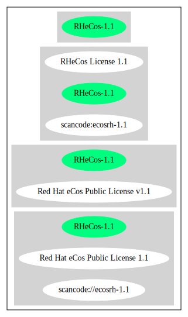

Red Hat eCos Public License v1.1 (RHeCos-1.1)
=============================================

[TABLE]

**Other Names:**

-   `scancode://ecosrh-1.1`

-   `Red Hat eCos Public License 1.1`

Comments on (easy) usability
----------------------------

General Comments
----------------

URLs
----

-   **Homepage:** http://ecos.sourceware.org/old-license.html

-   **SPDX:** http://spdx.org/licenses/RHeCos-1.1.json

Text
----

    Red Hat eCos Public License v1.1

    1. DEFINITIONS

    1.1. "Contributor" means each entity that creates or contributes to the
    creation of Modifications.

    1.2. "Contributor Version" means the combination of the Original Code,
    prior Modifications used by a Contributor, and the Modifications made by
    that particular Contributor.

    1.3. "Covered Code" means the Original Code or Modifications or the
    combination of the Original Code and Modifications, in each case
    including portions thereof.

    1.4. "Electronic Distribution Mechanism" means a mechanism generally
    accepted in the software development community for the electronic
    transfer of data.

    1.5. "Executable" means Covered Code in any form other than Source Code.

    1.6. "Initial Developer" means the individual or entity identified as
    the Initial Developer in the Source Code notice required by Exhibit A.

    1.7. "Larger Work" means a work which combines Covered Code or portions
    thereof with code not governed by the terms of this License.

    1.8. "License" means this document.

    1.9. "Modifications" means any addition to or deletion from the
    substance or structure of either the Original Code or any previous
    Modifications. When Covered Code is released as a series of files, a
    Modification is:

        A. Any addition to or deletion from the contents of a file
        containing Original Code or previous Modifications.

        B. Any new file that contains any part of the Original Code or
        previous Modifications.

    1.10. "Original Code" means Source Code of computer software code which
    is described in the Source Code notice required by Exhibit A as Original
    Code, and which, at the time of its release under this License is not
    already Covered Code governed by this License.

    1.11. "Source Code" means the preferred form of the Covered Code for
    making modifications to it, including all modules it contains, plus any
    associated interface definition files, scripts used to control
    compilation and installation of an Executable, or a list of source code
    differential comparisons against either the Original Code or another
    well known, available Covered Code of the Contributor's choice. The
    Source Code can be in a compressed or archival form, provided the
    appropriate decompression or de-archiving software is widely available
    for no charge.

    1.12. "You" means an individual or a legal entity exercising rights
    under, and complying with all of the terms of, this License or a future
    version of this License issued under Section 6.1. For legal entities,
    "You" includes any entity which controls, is controlled by, or is under
    common control with You. For purposes of this definition, "control"
    means (a) the power, direct or indirect, to cause the direction or
    management of such entity, whether by contract or otherwise, or (b)
    ownership of fifty percent (50%) or more of the outstanding shares or
    beneficial ownership of such entity.

    1.13. "Red Hat Branded Code" is code that Red Hat distributes and/or
    permits others to distribute under different terms than the Red Hat eCos
    Public License. Red Hat's Branded Code may contain part or all of the
    Covered Code.

    2. SOURCE CODE LICENSE

    2.1. The Initial Developer Grant.

        The Initial Developer hereby grants You a world-wide, royalty-free,
        non-exclusive license, subject to third party intellectual property
        claims:

            (a) to use, reproduce, modify, display, perform, sublicense and
            distribute the Original Code (or portions thereof) with or
            without Modifications, or as part of a Larger Work; and

            (b) under patents now or hereafter owned or controlled by
            Initial Developer, to make, have made, use and sell ("Utilize")
            the Original Code (or portions thereof), but solely to the
            extent that any such patent is reasonably necessary to enable
            You to Utilize the Original Code (or portions thereof) and not
            to any greater extent that may be necessary to Utilize further
            Modifications or combinations.

    2.2. Contributor Grant.

        Each Contributor hereby grants You a world-wide, royalty-free, non-
        exclusive license, subject to third party intellectual property
        claims:

            (a) to use, reproduce, modify, display, perform, sublicense and
            distribute the Modifications created by such Contributor (or
            portions thereof) either on an unmodified basis, with other
            Modifications, as Covered Code or as part of a Larger Work; and

            (b) under patents now or hereafter owned or controlled by
            Contributor, to Utilize the Contributor Version (or portions
            thereof), but solely to the extent that any such patent is
            reasonably necessary to enable You to Utilize the Contributor
            Version (or portions thereof), and not to any greater extent
            that may be necessary to Utilize further Modifications or
            combinations.

    3. DISTRIBUTION OBLIGATIONS

    3.1. Application of License.

        The Modifications which You create or to which You contribute are
        governed by the terms of this License, including without limitation
        Section 2.2. The Source Code version of Covered Code may be
        distributed only under the terms of this License or a future version
        of this License released under Section 6.1, and You must include a
        copy of this License with every copy of the Source Code You
        distribute. You may not offer or impose any terms on any Source Code
        version that alters or restricts the applicable version of this
        License or the recipients' rights hereunder. However, You may
        include an additional document offering the additional rights
        described in Section 3.5.

    3.2. Availability of Source Code.
        
        Any Modification which You create or to which You contribute must be
        made available in Source Code form under the terms of this License
        via an accepted Electronic Distribution Mechanism to anyone to whom
        you made an Executable version available and to the Initial
        Developer; and if made available via Electronic Distribution
        Mechanism, must remain available for at least twelve (12) months
        after the date it initially became available, or at least six (6)
        months after a subsequent version of that particular Modification
        has been made available to such recipients. You are responsible for
        ensuring that the Source Code version remains available even if the
        Electronic Distribution Mechanism is maintained by a third party.
        You are responsible for notifying the Initial Developer of the
        Modification and the location of the Source if a contact means is
        provided. Red Hat will be acting as maintainer of the Source and may
        provide an Electronic Distribution mechanism for the Modification to
        be made available. You can contact Red Hat to make the Modification
        available and to notify the Initial Developer.
        (http://sourceware.cygnus.com/ecos/)

    3.3. Description of Modifications.

        You must cause all Covered Code to which you contribute to contain a
        file documenting the changes You made to create that Covered Code
        and the date of any change. You must include a prominent statement
        that the Modification is derived, directly or indirectly, from
        Original Code provided by the Initial Developer and including the
        name of the Initial Developer in (a) the Source Code, and (b) in any
        notice in an Executable version or related documentation in which
        You describe the origin or ownership of the Covered Code.

    3.4. Intellectual Property Matters
            (a) Third Party Claims.

            If You have knowledge that a party claims an intellectual
            property right in particular functionality or code (or its
            utilization under this License), you must include a text file
            with the source code distribution titled "LEGAL" which describes
            the claim and the party making the claim in sufficient detail
            that a recipient will know whom to contact. If you obtain such
            knowledge after You make Your Modification available as
            described in Section 3.2, You shall promptly modify the LEGAL
            file in all copies You make available thereafter and shall take
            other steps (such as notifying appropriate mailing lists or
            newsgroups) reasonably calculated to inform those who received
            the Covered Code that new knowledge has been obtained.

            (b) Contributor APIs.

            If Your Modification is an application programming interface and
            You own or control patents which are reasonably necessary to
            implement that API, you must also include this information in
            the LEGAL file.

    3.5. Required Notices.

        You must duplicate the notice in Exhibit A in each file of the
        Source Code, and this License in any documentation for the Source
        Code, where You describe recipients' rights relating to Covered
        Code. If You created one or more Modification(s), You may add your
        name as a Contributor to the Source Code. If it is not possible to
        put such notice in a particular Source Code file due to its
        structure, then you must include such notice in a location (such as
        a relevant directory file) where a user would be likely to look for
        such a notice. You may choose to offer, and to charge a fee for,
        warranty, support, indemnity or liability obligations to one or more
        recipients of Covered Code.

        However, You may do so only on Your own behalf, and not on behalf of
        the Initial Developer or any Contributor. You must make it
        absolutely clear that any such warranty, support, indemnity or
        liability obligation is offered by You alone, and You hereby agree
        to indemnify the Initial Developer and every Contributor for any
        liability incurred by the Initial Developer or such Contributor as a
        result of warranty, support, indemnity or liability terms You offer.

    3.6. Distribution of Executable Versions.

        You may distribute Covered Code in Executable form only if the
        requirements of Section 3.1-3.5 have been met for that Covered Code,
        and if You include a notice stating that the Source Code version of
        the Covered Code is available under the terms of this License,
        including a description of how and where You have fulfilled the
        obligations of Section 3.2. The notice must be conspicuously
        included in any notice in an Executable version, related
        documentation or collateral in which You describe recipients' rights
        relating to the Covered Code. You may distribute the Executable
        version of Covered Code under a license of Your choice, which may
        contain terms different from this License, provided that You are in
        compliance with the terms of this License and that the license for
        the Executable version does not attempt to limit or alter the
        recipient's rights in the Source Code version from the rights set
        forth in this License. If You distribute the Executable version
        under a different license You must make it absolutely clear that any
        terms which differ from this License are offered by You alone, not
        by the Initial Developer or any Contributor. You hereby agree to
        indemnify the Initial Developer and every Contributor for any
        liability incurred by the Initial Developer or such Contributor as a
        result of any such terms You offer.

        If you distribute executable versions containing Covered Code, you
        must reproduce the notice in Exhibit B in the documentation and/or
        other materials provided with the product.

    3.7. Larger Works.

        You may create a Larger Work by combining Covered Code with other
        code not governed by the terms of this License and distribute the
        Larger Work as a single product. In such a case, You must make sure
        the requirements of this License are fulfilled for the Covered Code.

    4. INABILITY TO COMPLY DUE TO STATUTE OR REGULATION

    If it is impossible for You to comply with any of the terms of this
    License with respect to some or all of the Covered Code due to statute
    or regulation then You must: (a) comply with the terms of this License
    to the maximum extent possible; (b) cite the statute or regulation that
    prohibits you from adhering to the license; and (c) describe the
    limitations and the code they affect. Such description must be included
    in the LEGAL file described in Section 3.4 and must be included with all
    distributions of the Source Code. Except to the extent prohibited by
    statute or regulation, such description must be sufficiently detailed
    for a recipient of ordinary skill to be able to understand it. You must
    submit this LEGAL file to Red Hat for review, and You will not be able
    use the covered code in any means until permission is granted from Red
    Hat to allow for the inability to comply due to statute or regulation.

    5. APPLICATION OF THIS LICENSE

    This License applies to code to which the Initial Developer has attached
    the notice in Exhibit A, and to related Covered Code.

    Red Hat may include Covered Code in products without such additional
    products becoming subject to the terms of this License, and may license
    such additional products on different terms from those contained in this
    License.

    Red Hat may license the Source Code of Red Hat Branded Code without Red
    Hat Branded Code becoming subject to the terms of this License, and may
    license Red Hat Branded Code on different terms from those contained in
    this License. Contact Red Hat for details of alternate licensing terms
    available.

    6. VERSIONS OF THE LICENSE

    6.1. New Versions.

        Red Hat may publish revised and/or new versions of the License from
        time to time. Each version will be given a distinguishing version
        number.

    6.2. Effect of New Versions.

        Once Covered Code has been published under a particular version of
        the License, You may always continue to use it under the terms of
        that version. You may also choose to use such Covered Code under the
        terms of any subsequent version of the License published by Red Hat.
        No one other than Red Hat has the right to modify the terms
        applicable to Covered Code beyond what is granted under this and
        subsequent Licenses.

    6.3. Derivative Works.

        If you create or use a modified version of this License (which you
        may only do in order to apply it to code which is not already
        Covered Code governed by this License), you must (a) rename Your
        license so that the phrases "ECOS", "eCos", "Red Hat", "RHEPL" or
        any confusingly similar phrase do not appear anywhere in your
        license and (b) otherwise make it clear that your version of the
        license contains terms which differ from the Red Hat eCos Public
        License. (Filling in the name of the Initial Developer, Original
        Code or Contributor in the notice described in Exhibit A shall not
        of themselves be deemed to be modifications of this License.)

    7. DISCLAIMER OF WARRANTY

    COVERED CODE IS PROVIDED UNDER THIS LICENSE ON AN "AS IS" BASIS, WITHOUT
    WARRANTY OF ANY KIND, EITHER EXPRESSED OR IMPLIED, INCLUDING, WITHOUT
    LIMITATION, WARRANTIES THAT THE COVERED CODE IS FREE OF DEFECTS,
    MERCHANTABLE, FIT FOR A PARTICULAR PURPOSE OR NON-INFRINGING. THE ENTIRE
    RISK AS TO THE QUALITY AND PERFORMANCE OF THE COVERED CODE IS WITH YOU.
    SHOULD ANY COVERED CODE PROVE DEFECTIVE IN ANY RESPECT, YOU (NOT THE
    INITIAL DEVELOPER OR ANY OTHER CONTRIBUTOR) ASSUME THE COST OF ANY
    NECESSARY SERVICING, REPAIR OR CORRECTION. THIS DISCLAIMER OF WARRANTY
    CONSTITUTES AN ESSENTIAL PART OF THIS LICENSE. NO USE OF ANY COVERED
    CODE IS AUTHORIZED HEREUNDER EXCEPT UNDER THIS DISCLAIMER.

    8. TERMINATION

    This License and the rights granted hereunder will terminate
    automatically if You fail to comply with terms herein and fail to cure
    such breach within 30 days of becoming aware of the breach. All
    sublicenses to the Covered Code which are properly granted shall survive
    any termination of this License. Provisions which, by their nature, must
    remain in effect beyond the termination of this License shall survive.

    9. LIMITATION OF LIABILITY

    UNDER NO CIRCUMSTANCES AND UNDER NO LEGAL THEORY, WHETHER TORT
    (INCLUDING NEGLIGENCE), CONTRACT, OR OTHERWISE, SHALL THE INITIAL
    DEVELOPER, ANY OTHER CONTRIBUTOR, OR ANY DISTRIBUTOR OF COVERED CODE, OR
    ANY SUPPLIER OF ANY OF SUCH PARTIES, BE LIABLE TO YOU OR ANY OTHER
    PERSON FOR ANY INDIRECT, SPECIAL, INCIDENTAL, OR CONSEQUENTIAL DAMAGES
    OF ANY CHARACTER INCLUDING, WITHOUT LIMITATION, DAMAGES FOR LOSS OF
    GOODWILL, WORK STOPPAGE, COMPUTER FAILURE OR MALFUNCTION, OR ANY AND ALL
    OTHER COMMERCIAL DAMAGES OR LOSSES, EVEN IF SUCH PARTY SHALL HAVE BEEN
    INFORMED OF THE POSSIBILITY OF SUCH DAMAGES. THIS LIMITATION OF
    LIABILITY SHALL NOT APPLY TO LIABILITY FOR DEATH OR PERSONAL INJURY
    RESULTING FROM SUCH PARTY'S NEGLIGENCE TO THE EXTENT APPLICABLE LAW
    PROHIBITS SUCH LIMITATION. SOME JURISDICTIONS DO NOT ALLOW THE EXCLUSION
    OR LIMITATION OF INCIDENTAL OR CONSEQUENTIAL DAMAGES, SO THAT EXCLUSION
    AND LIMITATION MAY NOT APPLY TO YOU.

    10. U.S. GOVERNMENT END USERS

    The Covered Code is a "commercial item," as that term is defined in 48
    C.F.R. 2.101 (Oct. 1995), consisting of "commercial computer software"
    and "commercial computer software documentation," as such terms are used
    in 48 C.F.R. 12.212 (Sept. 1995). Consistent with 48 C.F.R. 12.212 and
    48 C.F.R. 227.7202-1 through 227.7202-4 (June 1995), all U.S. Government
    End Users acquire Covered Code with only those rights set forth herein.

    11. MISCELLANEOUS

    This License represents the complete agreement concerning subject matter
    hereof. If any provision of this License is held to be unenforceable,
    such provision shall be reformed only to the extent necessary to make it
    enforceable. This License shall be governed by California law provisions
    (except to the extent applicable law, if any, provides otherwise),
    excluding its conflict-of-law provisions. With respect to disputes in
    which at least one party is a citizen of, or an entity chartered or
    registered to do business in, the United States of America: (a) unless
    otherwise agreed in writing, all disputes relating to this License
    (excepting any dispute relating to intellectual property rights) shall
    be subject to final and binding arbitration, with the losing party
    paying all costs of arbitration; (b) any arbitration relating to this
    Agreement shall be held in Santa Clara County, California, under the
    auspices of JAMS/EndDispute; and (c) any litigation relating to this
    Agreement shall be subject to the jurisdiction of the Federal Courts of
    the Northern District of California, with venue lying in Santa Clara
    County, California, with the losing party responsible for costs,
    including without limitation, court costs and reasonable attorneys fees
    and expenses. The application of the United Nations Convention on
    Contracts for the International Sale of Goods is expressly excluded. Any
    law or regulation which provides that the language of a contract shall
    be construed against the drafter shall not apply to this License.

    12. RESPONSIBILITY FOR CLAIMS

    Except in cases where another Contributor has failed to comply with
    Section 3.4, You are responsible for damages arising, directly or
    indirectly, out of Your utilization of rights under this License, based
    on the number of copies of Covered Code you made available, the revenues
    you received from utilizing such rights, and other relevant factors. You
    agree to work with affected parties to distribute responsibility on an
    equitable basis.

    13. ADDITIONAL TERMS APPLICABLE TO THE RED HAT ECOS PUBLIC LICENSE

    Nothing in this License shall be interpreted to prohibit Red Hat from
    licensing under different terms than this License any code which Red Hat
    otherwise would have a right to license.

    Red Hat and logo - This License does not grant any rights to use the
    trademark Red Hat, the Red Hat logo, eCos logo, even if such marks are
    included in the Original Code. You may contact Red Hat for permission to
    display the Red Hat and eCos marks in either the documentation or the
    Executable version beyond that required in Exhibit B.

    Inability to Comply Due to Contractual Obligation - To the extent that
    Red Hat is limited contractually from making third party code available
    under this License, Red Hat may choose to integrate such third party
    code into Covered Code without being required to distribute such third
    party code in Source Code form, even if such third party code would
    otherwise be considered "Modifications" under this License.

    EXHIBIT A

    "The contents of this file are subject to the Red Hat eCos Public 
    License Version 1.1 (the "License"); you may not use this file except in
    compliance with the License. You may obtain a copy of the License at
    http://www.redhat.com/

    Software distributed under the License is distributed on an "AS IS"
    basis, WITHOUT WARRANTY OF ANY KIND, either express or implied. See the
    License for the specific language governing rights and limitations under
    the License.

    The Original Code is eCos - Embedded Configurable Operating System,
    released September 30, 1998. The Initial Developer of the Original Code
    is Red Hat. Portions created by Red Hat are Copyright (C) 1998, 1999,
    2000 Red Hat, Inc. All Rights Reserved."

    EXHIBIT B

    Part of the software embedded in this product is eCos - Embedded
    Configurable Operating System, a trademark of Red Hat. Portions created
    by Red Hat are Copyright (C) 1998, 1999, 2000 Red Hat, Inc.
    (http://www.redhat.com/). All Rights Reserved.

    THE SOFTWARE IN THIS PRODUCT WAS IN PART PROVIDED BY RED HAT AND ANY
    EXPRESS OR IMPLIED WARRANTIES, INCLUDING, BUT NOT LIMITED TO, THE
    IMPLIED WARRANTIES OF MERCHANTABILITY AND FITNESS FOR A PARTICULAR
    PURPOSE ARE DISCLAIMED. IN NO EVENT SHALL THE AUTHOR BE LIABLE FOR ANY
    DIRECT, INDIRECT, INCIDENTAL, SPECIAL, EXEMPLARY, OR CONSEQUENTIAL
    DAMAGES (INCLUDING, BUT NOT LIMITED TO, PROCUREMENT OF SUBSTITUTE GOODS
    OR SERVICES; LOSS OF USE, DATA, OR PROFITS; OR BUSINESS INTERRUPTION)
    HOWEVER CAUSED AND ON ANY THEORY OF LIABILITY, WHETHER IN CONTRACT,
    STRICT LIABILITY, OR TORT (INCLUDING NEGLIGENCE OR OTHERWISE) ARISING IN
    ANY WAY OUT OF THE USE OF THIS SOFTWARE, EVEN IF ADVISED OF THE
    POSSIBILITY OF SUCH DAMAGE.

    eCos and the eCos logo are registered trademarks of eCosCentric Limited.

------------------------------------------------------------------------

Raw Data
--------

-   SPDX

-   Scancode

&nbsp;

    {
        "__impliedNames": [
            "RHeCos-1.1",
            "Red Hat eCos Public License v1.1",
            "scancode://ecosrh-1.1",
            "Red Hat eCos Public License 1.1"
        ],
        "__impliedId": "RHeCos-1.1",
        "facts": {
            "SPDX": {
                "isSPDXLicenseDeprecated": false,
                "spdxFullName": "Red Hat eCos Public License v1.1",
                "spdxDetailsURL": "http://spdx.org/licenses/RHeCos-1.1.json",
                "_sourceURL": "https://spdx.org/licenses/RHeCos-1.1.html",
                "spdxLicIsOSIApproved": false,
                "spdxSeeAlso": [
                    "http://ecos.sourceware.org/old-license.html"
                ],
                "_implications": {
                    "__impliedNames": [
                        "RHeCos-1.1",
                        "Red Hat eCos Public License v1.1"
                    ],
                    "__impliedId": "RHeCos-1.1",
                    "__isOsiApproved": false,
                    "__impliedURLs": [
                        [
                            "SPDX",
                            "http://spdx.org/licenses/RHeCos-1.1.json"
                        ],
                        [
                            null,
                            "http://ecos.sourceware.org/old-license.html"
                        ]
                    ]
                },
                "spdxLicenseId": "RHeCos-1.1"
            },
            "Scancode": {
                "otherUrls": null,
                "homepageUrl": "http://ecos.sourceware.org/old-license.html",
                "shortName": "Red Hat eCos Public License 1.1",
                "textUrls": null,
                "text": "Red Hat eCos Public License v1.1\n\n1. DEFINITIONS\n\n1.1. \"Contributor\" means each entity that creates or contributes to the\ncreation of Modifications.\n\n1.2. \"Contributor Version\" means the combination of the Original Code,\nprior Modifications used by a Contributor, and the Modifications made by\nthat particular Contributor.\n\n1.3. \"Covered Code\" means the Original Code or Modifications or the\ncombination of the Original Code and Modifications, in each case\nincluding portions thereof.\n\n1.4. \"Electronic Distribution Mechanism\" means a mechanism generally\naccepted in the software development community for the electronic\ntransfer of data.\n\n1.5. \"Executable\" means Covered Code in any form other than Source Code.\n\n1.6. \"Initial Developer\" means the individual or entity identified as\nthe Initial Developer in the Source Code notice required by Exhibit A.\n\n1.7. \"Larger Work\" means a work which combines Covered Code or portions\nthereof with code not governed by the terms of this License.\n\n1.8. \"License\" means this document.\n\n1.9. \"Modifications\" means any addition to or deletion from the\nsubstance or structure of either the Original Code or any previous\nModifications. When Covered Code is released as a series of files, a\nModification is:\n\n    A. Any addition to or deletion from the contents of a file\n    containing Original Code or previous Modifications.\n\n    B. Any new file that contains any part of the Original Code or\n    previous Modifications.\n\n1.10. \"Original Code\" means Source Code of computer software code which\nis described in the Source Code notice required by Exhibit A as Original\nCode, and which, at the time of its release under this License is not\nalready Covered Code governed by this License.\n\n1.11. \"Source Code\" means the preferred form of the Covered Code for\nmaking modifications to it, including all modules it contains, plus any\nassociated interface definition files, scripts used to control\ncompilation and installation of an Executable, or a list of source code\ndifferential comparisons against either the Original Code or another\nwell known, available Covered Code of the Contributor's choice. The\nSource Code can be in a compressed or archival form, provided the\nappropriate decompression or de-archiving software is widely available\nfor no charge.\n\n1.12. \"You\" means an individual or a legal entity exercising rights\nunder, and complying with all of the terms of, this License or a future\nversion of this License issued under Section 6.1. For legal entities,\n\"You\" includes any entity which controls, is controlled by, or is under\ncommon control with You. For purposes of this definition, \"control\"\nmeans (a) the power, direct or indirect, to cause the direction or\nmanagement of such entity, whether by contract or otherwise, or (b)\nownership of fifty percent (50%) or more of the outstanding shares or\nbeneficial ownership of such entity.\n\n1.13. \"Red Hat Branded Code\" is code that Red Hat distributes and/or\npermits others to distribute under different terms than the Red Hat eCos\nPublic License. Red Hat's Branded Code may contain part or all of the\nCovered Code.\n\n2. SOURCE CODE LICENSE\n\n2.1. The Initial Developer Grant.\n\n    The Initial Developer hereby grants You a world-wide, royalty-free,\n    non-exclusive license, subject to third party intellectual property\n    claims:\n\n        (a) to use, reproduce, modify, display, perform, sublicense and\n        distribute the Original Code (or portions thereof) with or\n        without Modifications, or as part of a Larger Work; and\n\n        (b) under patents now or hereafter owned or controlled by\n        Initial Developer, to make, have made, use and sell (\"Utilize\")\n        the Original Code (or portions thereof), but solely to the\n        extent that any such patent is reasonably necessary to enable\n        You to Utilize the Original Code (or portions thereof) and not\n        to any greater extent that may be necessary to Utilize further\n        Modifications or combinations.\n\n2.2. Contributor Grant.\n\n    Each Contributor hereby grants You a world-wide, royalty-free, non-\n    exclusive license, subject to third party intellectual property\n    claims:\n\n        (a) to use, reproduce, modify, display, perform, sublicense and\n        distribute the Modifications created by such Contributor (or\n        portions thereof) either on an unmodified basis, with other\n        Modifications, as Covered Code or as part of a Larger Work; and\n\n        (b) under patents now or hereafter owned or controlled by\n        Contributor, to Utilize the Contributor Version (or portions\n        thereof), but solely to the extent that any such patent is\n        reasonably necessary to enable You to Utilize the Contributor\n        Version (or portions thereof), and not to any greater extent\n        that may be necessary to Utilize further Modifications or\n        combinations.\n\n3. DISTRIBUTION OBLIGATIONS\n\n3.1. Application of License.\n\n    The Modifications which You create or to which You contribute are\n    governed by the terms of this License, including without limitation\n    Section 2.2. The Source Code version of Covered Code may be\n    distributed only under the terms of this License or a future version\n    of this License released under Section 6.1, and You must include a\n    copy of this License with every copy of the Source Code You\n    distribute. You may not offer or impose any terms on any Source Code\n    version that alters or restricts the applicable version of this\n    License or the recipients' rights hereunder. However, You may\n    include an additional document offering the additional rights\n    described in Section 3.5.\n\n3.2. Availability of Source Code.\n    \n    Any Modification which You create or to which You contribute must be\n    made available in Source Code form under the terms of this License\n    via an accepted Electronic Distribution Mechanism to anyone to whom\n    you made an Executable version available and to the Initial\n    Developer; and if made available via Electronic Distribution\n    Mechanism, must remain available for at least twelve (12) months\n    after the date it initially became available, or at least six (6)\n    months after a subsequent version of that particular Modification\n    has been made available to such recipients. You are responsible for\n    ensuring that the Source Code version remains available even if the\n    Electronic Distribution Mechanism is maintained by a third party.\n    You are responsible for notifying the Initial Developer of the\n    Modification and the location of the Source if a contact means is\n    provided. Red Hat will be acting as maintainer of the Source and may\n    provide an Electronic Distribution mechanism for the Modification to\n    be made available. You can contact Red Hat to make the Modification\n    available and to notify the Initial Developer.\n    (http://sourceware.cygnus.com/ecos/)\n\n3.3. Description of Modifications.\n\n    You must cause all Covered Code to which you contribute to contain a\n    file documenting the changes You made to create that Covered Code\n    and the date of any change. You must include a prominent statement\n    that the Modification is derived, directly or indirectly, from\n    Original Code provided by the Initial Developer and including the\n    name of the Initial Developer in (a) the Source Code, and (b) in any\n    notice in an Executable version or related documentation in which\n    You describe the origin or ownership of the Covered Code.\n\n3.4. Intellectual Property Matters\n        (a) Third Party Claims.\n\n        If You have knowledge that a party claims an intellectual\n        property right in particular functionality or code (or its\n        utilization under this License), you must include a text file\n        with the source code distribution titled \"LEGAL\" which describes\n        the claim and the party making the claim in sufficient detail\n        that a recipient will know whom to contact. If you obtain such\n        knowledge after You make Your Modification available as\n        described in Section 3.2, You shall promptly modify the LEGAL\n        file in all copies You make available thereafter and shall take\n        other steps (such as notifying appropriate mailing lists or\n        newsgroups) reasonably calculated to inform those who received\n        the Covered Code that new knowledge has been obtained.\n\n        (b) Contributor APIs.\n\n        If Your Modification is an application programming interface and\n        You own or control patents which are reasonably necessary to\n        implement that API, you must also include this information in\n        the LEGAL file.\n\n3.5. Required Notices.\n\n    You must duplicate the notice in Exhibit A in each file of the\n    Source Code, and this License in any documentation for the Source\n    Code, where You describe recipients' rights relating to Covered\n    Code. If You created one or more Modification(s), You may add your\n    name as a Contributor to the Source Code. If it is not possible to\n    put such notice in a particular Source Code file due to its\n    structure, then you must include such notice in a location (such as\n    a relevant directory file) where a user would be likely to look for\n    such a notice. You may choose to offer, and to charge a fee for,\n    warranty, support, indemnity or liability obligations to one or more\n    recipients of Covered Code.\n\n    However, You may do so only on Your own behalf, and not on behalf of\n    the Initial Developer or any Contributor. You must make it\n    absolutely clear that any such warranty, support, indemnity or\n    liability obligation is offered by You alone, and You hereby agree\n    to indemnify the Initial Developer and every Contributor for any\n    liability incurred by the Initial Developer or such Contributor as a\n    result of warranty, support, indemnity or liability terms You offer.\n\n3.6. Distribution of Executable Versions.\n\n    You may distribute Covered Code in Executable form only if the\n    requirements of Section 3.1-3.5 have been met for that Covered Code,\n    and if You include a notice stating that the Source Code version of\n    the Covered Code is available under the terms of this License,\n    including a description of how and where You have fulfilled the\n    obligations of Section 3.2. The notice must be conspicuously\n    included in any notice in an Executable version, related\n    documentation or collateral in which You describe recipients' rights\n    relating to the Covered Code. You may distribute the Executable\n    version of Covered Code under a license of Your choice, which may\n    contain terms different from this License, provided that You are in\n    compliance with the terms of this License and that the license for\n    the Executable version does not attempt to limit or alter the\n    recipient's rights in the Source Code version from the rights set\n    forth in this License. If You distribute the Executable version\n    under a different license You must make it absolutely clear that any\n    terms which differ from this License are offered by You alone, not\n    by the Initial Developer or any Contributor. You hereby agree to\n    indemnify the Initial Developer and every Contributor for any\n    liability incurred by the Initial Developer or such Contributor as a\n    result of any such terms You offer.\n\n    If you distribute executable versions containing Covered Code, you\n    must reproduce the notice in Exhibit B in the documentation and/or\n    other materials provided with the product.\n\n3.7. Larger Works.\n\n    You may create a Larger Work by combining Covered Code with other\n    code not governed by the terms of this License and distribute the\n    Larger Work as a single product. In such a case, You must make sure\n    the requirements of this License are fulfilled for the Covered Code.\n\n4. INABILITY TO COMPLY DUE TO STATUTE OR REGULATION\n\nIf it is impossible for You to comply with any of the terms of this\nLicense with respect to some or all of the Covered Code due to statute\nor regulation then You must: (a) comply with the terms of this License\nto the maximum extent possible; (b) cite the statute or regulation that\nprohibits you from adhering to the license; and (c) describe the\nlimitations and the code they affect. Such description must be included\nin the LEGAL file described in Section 3.4 and must be included with all\ndistributions of the Source Code. Except to the extent prohibited by\nstatute or regulation, such description must be sufficiently detailed\nfor a recipient of ordinary skill to be able to understand it. You must\nsubmit this LEGAL file to Red Hat for review, and You will not be able\nuse the covered code in any means until permission is granted from Red\nHat to allow for the inability to comply due to statute or regulation.\n\n5. APPLICATION OF THIS LICENSE\n\nThis License applies to code to which the Initial Developer has attached\nthe notice in Exhibit A, and to related Covered Code.\n\nRed Hat may include Covered Code in products without such additional\nproducts becoming subject to the terms of this License, and may license\nsuch additional products on different terms from those contained in this\nLicense.\n\nRed Hat may license the Source Code of Red Hat Branded Code without Red\nHat Branded Code becoming subject to the terms of this License, and may\nlicense Red Hat Branded Code on different terms from those contained in\nthis License. Contact Red Hat for details of alternate licensing terms\navailable.\n\n6. VERSIONS OF THE LICENSE\n\n6.1. New Versions.\n\n    Red Hat may publish revised and/or new versions of the License from\n    time to time. Each version will be given a distinguishing version\n    number.\n\n6.2. Effect of New Versions.\n\n    Once Covered Code has been published under a particular version of\n    the License, You may always continue to use it under the terms of\n    that version. You may also choose to use such Covered Code under the\n    terms of any subsequent version of the License published by Red Hat.\n    No one other than Red Hat has the right to modify the terms\n    applicable to Covered Code beyond what is granted under this and\n    subsequent Licenses.\n\n6.3. Derivative Works.\n\n    If you create or use a modified version of this License (which you\n    may only do in order to apply it to code which is not already\n    Covered Code governed by this License), you must (a) rename Your\n    license so that the phrases \"ECOS\", \"eCos\", \"Red Hat\", \"RHEPL\" or\n    any confusingly similar phrase do not appear anywhere in your\n    license and (b) otherwise make it clear that your version of the\n    license contains terms which differ from the Red Hat eCos Public\n    License. (Filling in the name of the Initial Developer, Original\n    Code or Contributor in the notice described in Exhibit A shall not\n    of themselves be deemed to be modifications of this License.)\n\n7. DISCLAIMER OF WARRANTY\n\nCOVERED CODE IS PROVIDED UNDER THIS LICENSE ON AN \"AS IS\" BASIS, WITHOUT\nWARRANTY OF ANY KIND, EITHER EXPRESSED OR IMPLIED, INCLUDING, WITHOUT\nLIMITATION, WARRANTIES THAT THE COVERED CODE IS FREE OF DEFECTS,\nMERCHANTABLE, FIT FOR A PARTICULAR PURPOSE OR NON-INFRINGING. THE ENTIRE\nRISK AS TO THE QUALITY AND PERFORMANCE OF THE COVERED CODE IS WITH YOU.\nSHOULD ANY COVERED CODE PROVE DEFECTIVE IN ANY RESPECT, YOU (NOT THE\nINITIAL DEVELOPER OR ANY OTHER CONTRIBUTOR) ASSUME THE COST OF ANY\nNECESSARY SERVICING, REPAIR OR CORRECTION. THIS DISCLAIMER OF WARRANTY\nCONSTITUTES AN ESSENTIAL PART OF THIS LICENSE. NO USE OF ANY COVERED\nCODE IS AUTHORIZED HEREUNDER EXCEPT UNDER THIS DISCLAIMER.\n\n8. TERMINATION\n\nThis License and the rights granted hereunder will terminate\nautomatically if You fail to comply with terms herein and fail to cure\nsuch breach within 30 days of becoming aware of the breach. All\nsublicenses to the Covered Code which are properly granted shall survive\nany termination of this License. Provisions which, by their nature, must\nremain in effect beyond the termination of this License shall survive.\n\n9. LIMITATION OF LIABILITY\n\nUNDER NO CIRCUMSTANCES AND UNDER NO LEGAL THEORY, WHETHER TORT\n(INCLUDING NEGLIGENCE), CONTRACT, OR OTHERWISE, SHALL THE INITIAL\nDEVELOPER, ANY OTHER CONTRIBUTOR, OR ANY DISTRIBUTOR OF COVERED CODE, OR\nANY SUPPLIER OF ANY OF SUCH PARTIES, BE LIABLE TO YOU OR ANY OTHER\nPERSON FOR ANY INDIRECT, SPECIAL, INCIDENTAL, OR CONSEQUENTIAL DAMAGES\nOF ANY CHARACTER INCLUDING, WITHOUT LIMITATION, DAMAGES FOR LOSS OF\nGOODWILL, WORK STOPPAGE, COMPUTER FAILURE OR MALFUNCTION, OR ANY AND ALL\nOTHER COMMERCIAL DAMAGES OR LOSSES, EVEN IF SUCH PARTY SHALL HAVE BEEN\nINFORMED OF THE POSSIBILITY OF SUCH DAMAGES. THIS LIMITATION OF\nLIABILITY SHALL NOT APPLY TO LIABILITY FOR DEATH OR PERSONAL INJURY\nRESULTING FROM SUCH PARTY'S NEGLIGENCE TO THE EXTENT APPLICABLE LAW\nPROHIBITS SUCH LIMITATION. SOME JURISDICTIONS DO NOT ALLOW THE EXCLUSION\nOR LIMITATION OF INCIDENTAL OR CONSEQUENTIAL DAMAGES, SO THAT EXCLUSION\nAND LIMITATION MAY NOT APPLY TO YOU.\n\n10. U.S. GOVERNMENT END USERS\n\nThe Covered Code is a \"commercial item,\" as that term is defined in 48\nC.F.R. 2.101 (Oct. 1995), consisting of \"commercial computer software\"\nand \"commercial computer software documentation,\" as such terms are used\nin 48 C.F.R. 12.212 (Sept. 1995). Consistent with 48 C.F.R. 12.212 and\n48 C.F.R. 227.7202-1 through 227.7202-4 (June 1995), all U.S. Government\nEnd Users acquire Covered Code with only those rights set forth herein.\n\n11. MISCELLANEOUS\n\nThis License represents the complete agreement concerning subject matter\nhereof. If any provision of this License is held to be unenforceable,\nsuch provision shall be reformed only to the extent necessary to make it\nenforceable. This License shall be governed by California law provisions\n(except to the extent applicable law, if any, provides otherwise),\nexcluding its conflict-of-law provisions. With respect to disputes in\nwhich at least one party is a citizen of, or an entity chartered or\nregistered to do business in, the United States of America: (a) unless\notherwise agreed in writing, all disputes relating to this License\n(excepting any dispute relating to intellectual property rights) shall\nbe subject to final and binding arbitration, with the losing party\npaying all costs of arbitration; (b) any arbitration relating to this\nAgreement shall be held in Santa Clara County, California, under the\nauspices of JAMS/EndDispute; and (c) any litigation relating to this\nAgreement shall be subject to the jurisdiction of the Federal Courts of\nthe Northern District of California, with venue lying in Santa Clara\nCounty, California, with the losing party responsible for costs,\nincluding without limitation, court costs and reasonable attorneys fees\nand expenses. The application of the United Nations Convention on\nContracts for the International Sale of Goods is expressly excluded. Any\nlaw or regulation which provides that the language of a contract shall\nbe construed against the drafter shall not apply to this License.\n\n12. RESPONSIBILITY FOR CLAIMS\n\nExcept in cases where another Contributor has failed to comply with\nSection 3.4, You are responsible for damages arising, directly or\nindirectly, out of Your utilization of rights under this License, based\non the number of copies of Covered Code you made available, the revenues\nyou received from utilizing such rights, and other relevant factors. You\nagree to work with affected parties to distribute responsibility on an\nequitable basis.\n\n13. ADDITIONAL TERMS APPLICABLE TO THE RED HAT ECOS PUBLIC LICENSE\n\nNothing in this License shall be interpreted to prohibit Red Hat from\nlicensing under different terms than this License any code which Red Hat\notherwise would have a right to license.\n\nRed Hat and logo - This License does not grant any rights to use the\ntrademark Red Hat, the Red Hat logo, eCos logo, even if such marks are\nincluded in the Original Code. You may contact Red Hat for permission to\ndisplay the Red Hat and eCos marks in either the documentation or the\nExecutable version beyond that required in Exhibit B.\n\nInability to Comply Due to Contractual Obligation - To the extent that\nRed Hat is limited contractually from making third party code available\nunder this License, Red Hat may choose to integrate such third party\ncode into Covered Code without being required to distribute such third\nparty code in Source Code form, even if such third party code would\notherwise be considered \"Modifications\" under this License.\n\nEXHIBIT A\n\n\"The contents of this file are subject to the Red Hat eCos Public \nLicense Version 1.1 (the \"License\"); you may not use this file except in\ncompliance with the License. You may obtain a copy of the License at\nhttp://www.redhat.com/\n\nSoftware distributed under the License is distributed on an \"AS IS\"\nbasis, WITHOUT WARRANTY OF ANY KIND, either express or implied. See the\nLicense for the specific language governing rights and limitations under\nthe License.\n\nThe Original Code is eCos - Embedded Configurable Operating System,\nreleased September 30, 1998. The Initial Developer of the Original Code\nis Red Hat. Portions created by Red Hat are Copyright (C) 1998, 1999,\n2000 Red Hat, Inc. All Rights Reserved.\"\n\nEXHIBIT B\n\nPart of the software embedded in this product is eCos - Embedded\nConfigurable Operating System, a trademark of Red Hat. Portions created\nby Red Hat are Copyright (C) 1998, 1999, 2000 Red Hat, Inc.\n(http://www.redhat.com/). All Rights Reserved.\n\nTHE SOFTWARE IN THIS PRODUCT WAS IN PART PROVIDED BY RED HAT AND ANY\nEXPRESS OR IMPLIED WARRANTIES, INCLUDING, BUT NOT LIMITED TO, THE\nIMPLIED WARRANTIES OF MERCHANTABILITY AND FITNESS FOR A PARTICULAR\nPURPOSE ARE DISCLAIMED. IN NO EVENT SHALL THE AUTHOR BE LIABLE FOR ANY\nDIRECT, INDIRECT, INCIDENTAL, SPECIAL, EXEMPLARY, OR CONSEQUENTIAL\nDAMAGES (INCLUDING, BUT NOT LIMITED TO, PROCUREMENT OF SUBSTITUTE GOODS\nOR SERVICES; LOSS OF USE, DATA, OR PROFITS; OR BUSINESS INTERRUPTION)\nHOWEVER CAUSED AND ON ANY THEORY OF LIABILITY, WHETHER IN CONTRACT,\nSTRICT LIABILITY, OR TORT (INCLUDING NEGLIGENCE OR OTHERWISE) ARISING IN\nANY WAY OUT OF THE USE OF THIS SOFTWARE, EVEN IF ADVISED OF THE\nPOSSIBILITY OF SUCH DAMAGE.\n\neCos and the eCos logo are registered trademarks of eCosCentric Limited.",
                "category": "Copyleft",
                "osiUrl": null,
                "owner": "Red Hat",
                "_sourceURL": "https://github.com/nexB/scancode-toolkit/blob/develop/src/licensedcode/data/licenses/ecosrh-1.1.yml",
                "key": "ecosrh-1.1",
                "name": "Red Hat eCos Public License 1.1",
                "spdxId": "RHeCos-1.1",
                "notes": null,
                "_implications": {
                    "__impliedNames": [
                        "scancode://ecosrh-1.1",
                        "Red Hat eCos Public License 1.1",
                        "RHeCos-1.1"
                    ],
                    "__impliedId": "RHeCos-1.1",
                    "__impliedCopyleft": [
                        [
                            "Scancode",
                            "Copyleft"
                        ]
                    ],
                    "__calculatedCopyleft": "Copyleft",
                    "__impliedText": "Red Hat eCos Public License v1.1\n\n1. DEFINITIONS\n\n1.1. \"Contributor\" means each entity that creates or contributes to the\ncreation of Modifications.\n\n1.2. \"Contributor Version\" means the combination of the Original Code,\nprior Modifications used by a Contributor, and the Modifications made by\nthat particular Contributor.\n\n1.3. \"Covered Code\" means the Original Code or Modifications or the\ncombination of the Original Code and Modifications, in each case\nincluding portions thereof.\n\n1.4. \"Electronic Distribution Mechanism\" means a mechanism generally\naccepted in the software development community for the electronic\ntransfer of data.\n\n1.5. \"Executable\" means Covered Code in any form other than Source Code.\n\n1.6. \"Initial Developer\" means the individual or entity identified as\nthe Initial Developer in the Source Code notice required by Exhibit A.\n\n1.7. \"Larger Work\" means a work which combines Covered Code or portions\nthereof with code not governed by the terms of this License.\n\n1.8. \"License\" means this document.\n\n1.9. \"Modifications\" means any addition to or deletion from the\nsubstance or structure of either the Original Code or any previous\nModifications. When Covered Code is released as a series of files, a\nModification is:\n\n    A. Any addition to or deletion from the contents of a file\n    containing Original Code or previous Modifications.\n\n    B. Any new file that contains any part of the Original Code or\n    previous Modifications.\n\n1.10. \"Original Code\" means Source Code of computer software code which\nis described in the Source Code notice required by Exhibit A as Original\nCode, and which, at the time of its release under this License is not\nalready Covered Code governed by this License.\n\n1.11. \"Source Code\" means the preferred form of the Covered Code for\nmaking modifications to it, including all modules it contains, plus any\nassociated interface definition files, scripts used to control\ncompilation and installation of an Executable, or a list of source code\ndifferential comparisons against either the Original Code or another\nwell known, available Covered Code of the Contributor's choice. The\nSource Code can be in a compressed or archival form, provided the\nappropriate decompression or de-archiving software is widely available\nfor no charge.\n\n1.12. \"You\" means an individual or a legal entity exercising rights\nunder, and complying with all of the terms of, this License or a future\nversion of this License issued under Section 6.1. For legal entities,\n\"You\" includes any entity which controls, is controlled by, or is under\ncommon control with You. For purposes of this definition, \"control\"\nmeans (a) the power, direct or indirect, to cause the direction or\nmanagement of such entity, whether by contract or otherwise, or (b)\nownership of fifty percent (50%) or more of the outstanding shares or\nbeneficial ownership of such entity.\n\n1.13. \"Red Hat Branded Code\" is code that Red Hat distributes and/or\npermits others to distribute under different terms than the Red Hat eCos\nPublic License. Red Hat's Branded Code may contain part or all of the\nCovered Code.\n\n2. SOURCE CODE LICENSE\n\n2.1. The Initial Developer Grant.\n\n    The Initial Developer hereby grants You a world-wide, royalty-free,\n    non-exclusive license, subject to third party intellectual property\n    claims:\n\n        (a) to use, reproduce, modify, display, perform, sublicense and\n        distribute the Original Code (or portions thereof) with or\n        without Modifications, or as part of a Larger Work; and\n\n        (b) under patents now or hereafter owned or controlled by\n        Initial Developer, to make, have made, use and sell (\"Utilize\")\n        the Original Code (or portions thereof), but solely to the\n        extent that any such patent is reasonably necessary to enable\n        You to Utilize the Original Code (or portions thereof) and not\n        to any greater extent that may be necessary to Utilize further\n        Modifications or combinations.\n\n2.2. Contributor Grant.\n\n    Each Contributor hereby grants You a world-wide, royalty-free, non-\n    exclusive license, subject to third party intellectual property\n    claims:\n\n        (a) to use, reproduce, modify, display, perform, sublicense and\n        distribute the Modifications created by such Contributor (or\n        portions thereof) either on an unmodified basis, with other\n        Modifications, as Covered Code or as part of a Larger Work; and\n\n        (b) under patents now or hereafter owned or controlled by\n        Contributor, to Utilize the Contributor Version (or portions\n        thereof), but solely to the extent that any such patent is\n        reasonably necessary to enable You to Utilize the Contributor\n        Version (or portions thereof), and not to any greater extent\n        that may be necessary to Utilize further Modifications or\n        combinations.\n\n3. DISTRIBUTION OBLIGATIONS\n\n3.1. Application of License.\n\n    The Modifications which You create or to which You contribute are\n    governed by the terms of this License, including without limitation\n    Section 2.2. The Source Code version of Covered Code may be\n    distributed only under the terms of this License or a future version\n    of this License released under Section 6.1, and You must include a\n    copy of this License with every copy of the Source Code You\n    distribute. You may not offer or impose any terms on any Source Code\n    version that alters or restricts the applicable version of this\n    License or the recipients' rights hereunder. However, You may\n    include an additional document offering the additional rights\n    described in Section 3.5.\n\n3.2. Availability of Source Code.\n    \n    Any Modification which You create or to which You contribute must be\n    made available in Source Code form under the terms of this License\n    via an accepted Electronic Distribution Mechanism to anyone to whom\n    you made an Executable version available and to the Initial\n    Developer; and if made available via Electronic Distribution\n    Mechanism, must remain available for at least twelve (12) months\n    after the date it initially became available, or at least six (6)\n    months after a subsequent version of that particular Modification\n    has been made available to such recipients. You are responsible for\n    ensuring that the Source Code version remains available even if the\n    Electronic Distribution Mechanism is maintained by a third party.\n    You are responsible for notifying the Initial Developer of the\n    Modification and the location of the Source if a contact means is\n    provided. Red Hat will be acting as maintainer of the Source and may\n    provide an Electronic Distribution mechanism for the Modification to\n    be made available. You can contact Red Hat to make the Modification\n    available and to notify the Initial Developer.\n    (http://sourceware.cygnus.com/ecos/)\n\n3.3. Description of Modifications.\n\n    You must cause all Covered Code to which you contribute to contain a\n    file documenting the changes You made to create that Covered Code\n    and the date of any change. You must include a prominent statement\n    that the Modification is derived, directly or indirectly, from\n    Original Code provided by the Initial Developer and including the\n    name of the Initial Developer in (a) the Source Code, and (b) in any\n    notice in an Executable version or related documentation in which\n    You describe the origin or ownership of the Covered Code.\n\n3.4. Intellectual Property Matters\n        (a) Third Party Claims.\n\n        If You have knowledge that a party claims an intellectual\n        property right in particular functionality or code (or its\n        utilization under this License), you must include a text file\n        with the source code distribution titled \"LEGAL\" which describes\n        the claim and the party making the claim in sufficient detail\n        that a recipient will know whom to contact. If you obtain such\n        knowledge after You make Your Modification available as\n        described in Section 3.2, You shall promptly modify the LEGAL\n        file in all copies You make available thereafter and shall take\n        other steps (such as notifying appropriate mailing lists or\n        newsgroups) reasonably calculated to inform those who received\n        the Covered Code that new knowledge has been obtained.\n\n        (b) Contributor APIs.\n\n        If Your Modification is an application programming interface and\n        You own or control patents which are reasonably necessary to\n        implement that API, you must also include this information in\n        the LEGAL file.\n\n3.5. Required Notices.\n\n    You must duplicate the notice in Exhibit A in each file of the\n    Source Code, and this License in any documentation for the Source\n    Code, where You describe recipients' rights relating to Covered\n    Code. If You created one or more Modification(s), You may add your\n    name as a Contributor to the Source Code. If it is not possible to\n    put such notice in a particular Source Code file due to its\n    structure, then you must include such notice in a location (such as\n    a relevant directory file) where a user would be likely to look for\n    such a notice. You may choose to offer, and to charge a fee for,\n    warranty, support, indemnity or liability obligations to one or more\n    recipients of Covered Code.\n\n    However, You may do so only on Your own behalf, and not on behalf of\n    the Initial Developer or any Contributor. You must make it\n    absolutely clear that any such warranty, support, indemnity or\n    liability obligation is offered by You alone, and You hereby agree\n    to indemnify the Initial Developer and every Contributor for any\n    liability incurred by the Initial Developer or such Contributor as a\n    result of warranty, support, indemnity or liability terms You offer.\n\n3.6. Distribution of Executable Versions.\n\n    You may distribute Covered Code in Executable form only if the\n    requirements of Section 3.1-3.5 have been met for that Covered Code,\n    and if You include a notice stating that the Source Code version of\n    the Covered Code is available under the terms of this License,\n    including a description of how and where You have fulfilled the\n    obligations of Section 3.2. The notice must be conspicuously\n    included in any notice in an Executable version, related\n    documentation or collateral in which You describe recipients' rights\n    relating to the Covered Code. You may distribute the Executable\n    version of Covered Code under a license of Your choice, which may\n    contain terms different from this License, provided that You are in\n    compliance with the terms of this License and that the license for\n    the Executable version does not attempt to limit or alter the\n    recipient's rights in the Source Code version from the rights set\n    forth in this License. If You distribute the Executable version\n    under a different license You must make it absolutely clear that any\n    terms which differ from this License are offered by You alone, not\n    by the Initial Developer or any Contributor. You hereby agree to\n    indemnify the Initial Developer and every Contributor for any\n    liability incurred by the Initial Developer or such Contributor as a\n    result of any such terms You offer.\n\n    If you distribute executable versions containing Covered Code, you\n    must reproduce the notice in Exhibit B in the documentation and/or\n    other materials provided with the product.\n\n3.7. Larger Works.\n\n    You may create a Larger Work by combining Covered Code with other\n    code not governed by the terms of this License and distribute the\n    Larger Work as a single product. In such a case, You must make sure\n    the requirements of this License are fulfilled for the Covered Code.\n\n4. INABILITY TO COMPLY DUE TO STATUTE OR REGULATION\n\nIf it is impossible for You to comply with any of the terms of this\nLicense with respect to some or all of the Covered Code due to statute\nor regulation then You must: (a) comply with the terms of this License\nto the maximum extent possible; (b) cite the statute or regulation that\nprohibits you from adhering to the license; and (c) describe the\nlimitations and the code they affect. Such description must be included\nin the LEGAL file described in Section 3.4 and must be included with all\ndistributions of the Source Code. Except to the extent prohibited by\nstatute or regulation, such description must be sufficiently detailed\nfor a recipient of ordinary skill to be able to understand it. You must\nsubmit this LEGAL file to Red Hat for review, and You will not be able\nuse the covered code in any means until permission is granted from Red\nHat to allow for the inability to comply due to statute or regulation.\n\n5. APPLICATION OF THIS LICENSE\n\nThis License applies to code to which the Initial Developer has attached\nthe notice in Exhibit A, and to related Covered Code.\n\nRed Hat may include Covered Code in products without such additional\nproducts becoming subject to the terms of this License, and may license\nsuch additional products on different terms from those contained in this\nLicense.\n\nRed Hat may license the Source Code of Red Hat Branded Code without Red\nHat Branded Code becoming subject to the terms of this License, and may\nlicense Red Hat Branded Code on different terms from those contained in\nthis License. Contact Red Hat for details of alternate licensing terms\navailable.\n\n6. VERSIONS OF THE LICENSE\n\n6.1. New Versions.\n\n    Red Hat may publish revised and/or new versions of the License from\n    time to time. Each version will be given a distinguishing version\n    number.\n\n6.2. Effect of New Versions.\n\n    Once Covered Code has been published under a particular version of\n    the License, You may always continue to use it under the terms of\n    that version. You may also choose to use such Covered Code under the\n    terms of any subsequent version of the License published by Red Hat.\n    No one other than Red Hat has the right to modify the terms\n    applicable to Covered Code beyond what is granted under this and\n    subsequent Licenses.\n\n6.3. Derivative Works.\n\n    If you create or use a modified version of this License (which you\n    may only do in order to apply it to code which is not already\n    Covered Code governed by this License), you must (a) rename Your\n    license so that the phrases \"ECOS\", \"eCos\", \"Red Hat\", \"RHEPL\" or\n    any confusingly similar phrase do not appear anywhere in your\n    license and (b) otherwise make it clear that your version of the\n    license contains terms which differ from the Red Hat eCos Public\n    License. (Filling in the name of the Initial Developer, Original\n    Code or Contributor in the notice described in Exhibit A shall not\n    of themselves be deemed to be modifications of this License.)\n\n7. DISCLAIMER OF WARRANTY\n\nCOVERED CODE IS PROVIDED UNDER THIS LICENSE ON AN \"AS IS\" BASIS, WITHOUT\nWARRANTY OF ANY KIND, EITHER EXPRESSED OR IMPLIED, INCLUDING, WITHOUT\nLIMITATION, WARRANTIES THAT THE COVERED CODE IS FREE OF DEFECTS,\nMERCHANTABLE, FIT FOR A PARTICULAR PURPOSE OR NON-INFRINGING. THE ENTIRE\nRISK AS TO THE QUALITY AND PERFORMANCE OF THE COVERED CODE IS WITH YOU.\nSHOULD ANY COVERED CODE PROVE DEFECTIVE IN ANY RESPECT, YOU (NOT THE\nINITIAL DEVELOPER OR ANY OTHER CONTRIBUTOR) ASSUME THE COST OF ANY\nNECESSARY SERVICING, REPAIR OR CORRECTION. THIS DISCLAIMER OF WARRANTY\nCONSTITUTES AN ESSENTIAL PART OF THIS LICENSE. NO USE OF ANY COVERED\nCODE IS AUTHORIZED HEREUNDER EXCEPT UNDER THIS DISCLAIMER.\n\n8. TERMINATION\n\nThis License and the rights granted hereunder will terminate\nautomatically if You fail to comply with terms herein and fail to cure\nsuch breach within 30 days of becoming aware of the breach. All\nsublicenses to the Covered Code which are properly granted shall survive\nany termination of this License. Provisions which, by their nature, must\nremain in effect beyond the termination of this License shall survive.\n\n9. LIMITATION OF LIABILITY\n\nUNDER NO CIRCUMSTANCES AND UNDER NO LEGAL THEORY, WHETHER TORT\n(INCLUDING NEGLIGENCE), CONTRACT, OR OTHERWISE, SHALL THE INITIAL\nDEVELOPER, ANY OTHER CONTRIBUTOR, OR ANY DISTRIBUTOR OF COVERED CODE, OR\nANY SUPPLIER OF ANY OF SUCH PARTIES, BE LIABLE TO YOU OR ANY OTHER\nPERSON FOR ANY INDIRECT, SPECIAL, INCIDENTAL, OR CONSEQUENTIAL DAMAGES\nOF ANY CHARACTER INCLUDING, WITHOUT LIMITATION, DAMAGES FOR LOSS OF\nGOODWILL, WORK STOPPAGE, COMPUTER FAILURE OR MALFUNCTION, OR ANY AND ALL\nOTHER COMMERCIAL DAMAGES OR LOSSES, EVEN IF SUCH PARTY SHALL HAVE BEEN\nINFORMED OF THE POSSIBILITY OF SUCH DAMAGES. THIS LIMITATION OF\nLIABILITY SHALL NOT APPLY TO LIABILITY FOR DEATH OR PERSONAL INJURY\nRESULTING FROM SUCH PARTY'S NEGLIGENCE TO THE EXTENT APPLICABLE LAW\nPROHIBITS SUCH LIMITATION. SOME JURISDICTIONS DO NOT ALLOW THE EXCLUSION\nOR LIMITATION OF INCIDENTAL OR CONSEQUENTIAL DAMAGES, SO THAT EXCLUSION\nAND LIMITATION MAY NOT APPLY TO YOU.\n\n10. U.S. GOVERNMENT END USERS\n\nThe Covered Code is a \"commercial item,\" as that term is defined in 48\nC.F.R. 2.101 (Oct. 1995), consisting of \"commercial computer software\"\nand \"commercial computer software documentation,\" as such terms are used\nin 48 C.F.R. 12.212 (Sept. 1995). Consistent with 48 C.F.R. 12.212 and\n48 C.F.R. 227.7202-1 through 227.7202-4 (June 1995), all U.S. Government\nEnd Users acquire Covered Code with only those rights set forth herein.\n\n11. MISCELLANEOUS\n\nThis License represents the complete agreement concerning subject matter\nhereof. If any provision of this License is held to be unenforceable,\nsuch provision shall be reformed only to the extent necessary to make it\nenforceable. This License shall be governed by California law provisions\n(except to the extent applicable law, if any, provides otherwise),\nexcluding its conflict-of-law provisions. With respect to disputes in\nwhich at least one party is a citizen of, or an entity chartered or\nregistered to do business in, the United States of America: (a) unless\notherwise agreed in writing, all disputes relating to this License\n(excepting any dispute relating to intellectual property rights) shall\nbe subject to final and binding arbitration, with the losing party\npaying all costs of arbitration; (b) any arbitration relating to this\nAgreement shall be held in Santa Clara County, California, under the\nauspices of JAMS/EndDispute; and (c) any litigation relating to this\nAgreement shall be subject to the jurisdiction of the Federal Courts of\nthe Northern District of California, with venue lying in Santa Clara\nCounty, California, with the losing party responsible for costs,\nincluding without limitation, court costs and reasonable attorneys fees\nand expenses. The application of the United Nations Convention on\nContracts for the International Sale of Goods is expressly excluded. Any\nlaw or regulation which provides that the language of a contract shall\nbe construed against the drafter shall not apply to this License.\n\n12. RESPONSIBILITY FOR CLAIMS\n\nExcept in cases where another Contributor has failed to comply with\nSection 3.4, You are responsible for damages arising, directly or\nindirectly, out of Your utilization of rights under this License, based\non the number of copies of Covered Code you made available, the revenues\nyou received from utilizing such rights, and other relevant factors. You\nagree to work with affected parties to distribute responsibility on an\nequitable basis.\n\n13. ADDITIONAL TERMS APPLICABLE TO THE RED HAT ECOS PUBLIC LICENSE\n\nNothing in this License shall be interpreted to prohibit Red Hat from\nlicensing under different terms than this License any code which Red Hat\notherwise would have a right to license.\n\nRed Hat and logo - This License does not grant any rights to use the\ntrademark Red Hat, the Red Hat logo, eCos logo, even if such marks are\nincluded in the Original Code. You may contact Red Hat for permission to\ndisplay the Red Hat and eCos marks in either the documentation or the\nExecutable version beyond that required in Exhibit B.\n\nInability to Comply Due to Contractual Obligation - To the extent that\nRed Hat is limited contractually from making third party code available\nunder this License, Red Hat may choose to integrate such third party\ncode into Covered Code without being required to distribute such third\nparty code in Source Code form, even if such third party code would\notherwise be considered \"Modifications\" under this License.\n\nEXHIBIT A\n\n\"The contents of this file are subject to the Red Hat eCos Public \nLicense Version 1.1 (the \"License\"); you may not use this file except in\ncompliance with the License. You may obtain a copy of the License at\nhttp://www.redhat.com/\n\nSoftware distributed under the License is distributed on an \"AS IS\"\nbasis, WITHOUT WARRANTY OF ANY KIND, either express or implied. See the\nLicense for the specific language governing rights and limitations under\nthe License.\n\nThe Original Code is eCos - Embedded Configurable Operating System,\nreleased September 30, 1998. The Initial Developer of the Original Code\nis Red Hat. Portions created by Red Hat are Copyright (C) 1998, 1999,\n2000 Red Hat, Inc. All Rights Reserved.\"\n\nEXHIBIT B\n\nPart of the software embedded in this product is eCos - Embedded\nConfigurable Operating System, a trademark of Red Hat. Portions created\nby Red Hat are Copyright (C) 1998, 1999, 2000 Red Hat, Inc.\n(http://www.redhat.com/). All Rights Reserved.\n\nTHE SOFTWARE IN THIS PRODUCT WAS IN PART PROVIDED BY RED HAT AND ANY\nEXPRESS OR IMPLIED WARRANTIES, INCLUDING, BUT NOT LIMITED TO, THE\nIMPLIED WARRANTIES OF MERCHANTABILITY AND FITNESS FOR A PARTICULAR\nPURPOSE ARE DISCLAIMED. IN NO EVENT SHALL THE AUTHOR BE LIABLE FOR ANY\nDIRECT, INDIRECT, INCIDENTAL, SPECIAL, EXEMPLARY, OR CONSEQUENTIAL\nDAMAGES (INCLUDING, BUT NOT LIMITED TO, PROCUREMENT OF SUBSTITUTE GOODS\nOR SERVICES; LOSS OF USE, DATA, OR PROFITS; OR BUSINESS INTERRUPTION)\nHOWEVER CAUSED AND ON ANY THEORY OF LIABILITY, WHETHER IN CONTRACT,\nSTRICT LIABILITY, OR TORT (INCLUDING NEGLIGENCE OR OTHERWISE) ARISING IN\nANY WAY OUT OF THE USE OF THIS SOFTWARE, EVEN IF ADVISED OF THE\nPOSSIBILITY OF SUCH DAMAGE.\n\neCos and the eCos logo are registered trademarks of eCosCentric Limited.",
                    "__impliedURLs": [
                        [
                            "Homepage",
                            "http://ecos.sourceware.org/old-license.html"
                        ]
                    ]
                }
            }
        },
        "__impliedCopyleft": [
            [
                "Scancode",
                "Copyleft"
            ]
        ],
        "__calculatedCopyleft": "Copyleft",
        "__isOsiApproved": false,
        "__impliedText": "Red Hat eCos Public License v1.1\n\n1. DEFINITIONS\n\n1.1. \"Contributor\" means each entity that creates or contributes to the\ncreation of Modifications.\n\n1.2. \"Contributor Version\" means the combination of the Original Code,\nprior Modifications used by a Contributor, and the Modifications made by\nthat particular Contributor.\n\n1.3. \"Covered Code\" means the Original Code or Modifications or the\ncombination of the Original Code and Modifications, in each case\nincluding portions thereof.\n\n1.4. \"Electronic Distribution Mechanism\" means a mechanism generally\naccepted in the software development community for the electronic\ntransfer of data.\n\n1.5. \"Executable\" means Covered Code in any form other than Source Code.\n\n1.6. \"Initial Developer\" means the individual or entity identified as\nthe Initial Developer in the Source Code notice required by Exhibit A.\n\n1.7. \"Larger Work\" means a work which combines Covered Code or portions\nthereof with code not governed by the terms of this License.\n\n1.8. \"License\" means this document.\n\n1.9. \"Modifications\" means any addition to or deletion from the\nsubstance or structure of either the Original Code or any previous\nModifications. When Covered Code is released as a series of files, a\nModification is:\n\n    A. Any addition to or deletion from the contents of a file\n    containing Original Code or previous Modifications.\n\n    B. Any new file that contains any part of the Original Code or\n    previous Modifications.\n\n1.10. \"Original Code\" means Source Code of computer software code which\nis described in the Source Code notice required by Exhibit A as Original\nCode, and which, at the time of its release under this License is not\nalready Covered Code governed by this License.\n\n1.11. \"Source Code\" means the preferred form of the Covered Code for\nmaking modifications to it, including all modules it contains, plus any\nassociated interface definition files, scripts used to control\ncompilation and installation of an Executable, or a list of source code\ndifferential comparisons against either the Original Code or another\nwell known, available Covered Code of the Contributor's choice. The\nSource Code can be in a compressed or archival form, provided the\nappropriate decompression or de-archiving software is widely available\nfor no charge.\n\n1.12. \"You\" means an individual or a legal entity exercising rights\nunder, and complying with all of the terms of, this License or a future\nversion of this License issued under Section 6.1. For legal entities,\n\"You\" includes any entity which controls, is controlled by, or is under\ncommon control with You. For purposes of this definition, \"control\"\nmeans (a) the power, direct or indirect, to cause the direction or\nmanagement of such entity, whether by contract or otherwise, or (b)\nownership of fifty percent (50%) or more of the outstanding shares or\nbeneficial ownership of such entity.\n\n1.13. \"Red Hat Branded Code\" is code that Red Hat distributes and/or\npermits others to distribute under different terms than the Red Hat eCos\nPublic License. Red Hat's Branded Code may contain part or all of the\nCovered Code.\n\n2. SOURCE CODE LICENSE\n\n2.1. The Initial Developer Grant.\n\n    The Initial Developer hereby grants You a world-wide, royalty-free,\n    non-exclusive license, subject to third party intellectual property\n    claims:\n\n        (a) to use, reproduce, modify, display, perform, sublicense and\n        distribute the Original Code (or portions thereof) with or\n        without Modifications, or as part of a Larger Work; and\n\n        (b) under patents now or hereafter owned or controlled by\n        Initial Developer, to make, have made, use and sell (\"Utilize\")\n        the Original Code (or portions thereof), but solely to the\n        extent that any such patent is reasonably necessary to enable\n        You to Utilize the Original Code (or portions thereof) and not\n        to any greater extent that may be necessary to Utilize further\n        Modifications or combinations.\n\n2.2. Contributor Grant.\n\n    Each Contributor hereby grants You a world-wide, royalty-free, non-\n    exclusive license, subject to third party intellectual property\n    claims:\n\n        (a) to use, reproduce, modify, display, perform, sublicense and\n        distribute the Modifications created by such Contributor (or\n        portions thereof) either on an unmodified basis, with other\n        Modifications, as Covered Code or as part of a Larger Work; and\n\n        (b) under patents now or hereafter owned or controlled by\n        Contributor, to Utilize the Contributor Version (or portions\n        thereof), but solely to the extent that any such patent is\n        reasonably necessary to enable You to Utilize the Contributor\n        Version (or portions thereof), and not to any greater extent\n        that may be necessary to Utilize further Modifications or\n        combinations.\n\n3. DISTRIBUTION OBLIGATIONS\n\n3.1. Application of License.\n\n    The Modifications which You create or to which You contribute are\n    governed by the terms of this License, including without limitation\n    Section 2.2. The Source Code version of Covered Code may be\n    distributed only under the terms of this License or a future version\n    of this License released under Section 6.1, and You must include a\n    copy of this License with every copy of the Source Code You\n    distribute. You may not offer or impose any terms on any Source Code\n    version that alters or restricts the applicable version of this\n    License or the recipients' rights hereunder. However, You may\n    include an additional document offering the additional rights\n    described in Section 3.5.\n\n3.2. Availability of Source Code.\n    \n    Any Modification which You create or to which You contribute must be\n    made available in Source Code form under the terms of this License\n    via an accepted Electronic Distribution Mechanism to anyone to whom\n    you made an Executable version available and to the Initial\n    Developer; and if made available via Electronic Distribution\n    Mechanism, must remain available for at least twelve (12) months\n    after the date it initially became available, or at least six (6)\n    months after a subsequent version of that particular Modification\n    has been made available to such recipients. You are responsible for\n    ensuring that the Source Code version remains available even if the\n    Electronic Distribution Mechanism is maintained by a third party.\n    You are responsible for notifying the Initial Developer of the\n    Modification and the location of the Source if a contact means is\n    provided. Red Hat will be acting as maintainer of the Source and may\n    provide an Electronic Distribution mechanism for the Modification to\n    be made available. You can contact Red Hat to make the Modification\n    available and to notify the Initial Developer.\n    (http://sourceware.cygnus.com/ecos/)\n\n3.3. Description of Modifications.\n\n    You must cause all Covered Code to which you contribute to contain a\n    file documenting the changes You made to create that Covered Code\n    and the date of any change. You must include a prominent statement\n    that the Modification is derived, directly or indirectly, from\n    Original Code provided by the Initial Developer and including the\n    name of the Initial Developer in (a) the Source Code, and (b) in any\n    notice in an Executable version or related documentation in which\n    You describe the origin or ownership of the Covered Code.\n\n3.4. Intellectual Property Matters\n        (a) Third Party Claims.\n\n        If You have knowledge that a party claims an intellectual\n        property right in particular functionality or code (or its\n        utilization under this License), you must include a text file\n        with the source code distribution titled \"LEGAL\" which describes\n        the claim and the party making the claim in sufficient detail\n        that a recipient will know whom to contact. If you obtain such\n        knowledge after You make Your Modification available as\n        described in Section 3.2, You shall promptly modify the LEGAL\n        file in all copies You make available thereafter and shall take\n        other steps (such as notifying appropriate mailing lists or\n        newsgroups) reasonably calculated to inform those who received\n        the Covered Code that new knowledge has been obtained.\n\n        (b) Contributor APIs.\n\n        If Your Modification is an application programming interface and\n        You own or control patents which are reasonably necessary to\n        implement that API, you must also include this information in\n        the LEGAL file.\n\n3.5. Required Notices.\n\n    You must duplicate the notice in Exhibit A in each file of the\n    Source Code, and this License in any documentation for the Source\n    Code, where You describe recipients' rights relating to Covered\n    Code. If You created one or more Modification(s), You may add your\n    name as a Contributor to the Source Code. If it is not possible to\n    put such notice in a particular Source Code file due to its\n    structure, then you must include such notice in a location (such as\n    a relevant directory file) where a user would be likely to look for\n    such a notice. You may choose to offer, and to charge a fee for,\n    warranty, support, indemnity or liability obligations to one or more\n    recipients of Covered Code.\n\n    However, You may do so only on Your own behalf, and not on behalf of\n    the Initial Developer or any Contributor. You must make it\n    absolutely clear that any such warranty, support, indemnity or\n    liability obligation is offered by You alone, and You hereby agree\n    to indemnify the Initial Developer and every Contributor for any\n    liability incurred by the Initial Developer or such Contributor as a\n    result of warranty, support, indemnity or liability terms You offer.\n\n3.6. Distribution of Executable Versions.\n\n    You may distribute Covered Code in Executable form only if the\n    requirements of Section 3.1-3.5 have been met for that Covered Code,\n    and if You include a notice stating that the Source Code version of\n    the Covered Code is available under the terms of this License,\n    including a description of how and where You have fulfilled the\n    obligations of Section 3.2. The notice must be conspicuously\n    included in any notice in an Executable version, related\n    documentation or collateral in which You describe recipients' rights\n    relating to the Covered Code. You may distribute the Executable\n    version of Covered Code under a license of Your choice, which may\n    contain terms different from this License, provided that You are in\n    compliance with the terms of this License and that the license for\n    the Executable version does not attempt to limit or alter the\n    recipient's rights in the Source Code version from the rights set\n    forth in this License. If You distribute the Executable version\n    under a different license You must make it absolutely clear that any\n    terms which differ from this License are offered by You alone, not\n    by the Initial Developer or any Contributor. You hereby agree to\n    indemnify the Initial Developer and every Contributor for any\n    liability incurred by the Initial Developer or such Contributor as a\n    result of any such terms You offer.\n\n    If you distribute executable versions containing Covered Code, you\n    must reproduce the notice in Exhibit B in the documentation and/or\n    other materials provided with the product.\n\n3.7. Larger Works.\n\n    You may create a Larger Work by combining Covered Code with other\n    code not governed by the terms of this License and distribute the\n    Larger Work as a single product. In such a case, You must make sure\n    the requirements of this License are fulfilled for the Covered Code.\n\n4. INABILITY TO COMPLY DUE TO STATUTE OR REGULATION\n\nIf it is impossible for You to comply with any of the terms of this\nLicense with respect to some or all of the Covered Code due to statute\nor regulation then You must: (a) comply with the terms of this License\nto the maximum extent possible; (b) cite the statute or regulation that\nprohibits you from adhering to the license; and (c) describe the\nlimitations and the code they affect. Such description must be included\nin the LEGAL file described in Section 3.4 and must be included with all\ndistributions of the Source Code. Except to the extent prohibited by\nstatute or regulation, such description must be sufficiently detailed\nfor a recipient of ordinary skill to be able to understand it. You must\nsubmit this LEGAL file to Red Hat for review, and You will not be able\nuse the covered code in any means until permission is granted from Red\nHat to allow for the inability to comply due to statute or regulation.\n\n5. APPLICATION OF THIS LICENSE\n\nThis License applies to code to which the Initial Developer has attached\nthe notice in Exhibit A, and to related Covered Code.\n\nRed Hat may include Covered Code in products without such additional\nproducts becoming subject to the terms of this License, and may license\nsuch additional products on different terms from those contained in this\nLicense.\n\nRed Hat may license the Source Code of Red Hat Branded Code without Red\nHat Branded Code becoming subject to the terms of this License, and may\nlicense Red Hat Branded Code on different terms from those contained in\nthis License. Contact Red Hat for details of alternate licensing terms\navailable.\n\n6. VERSIONS OF THE LICENSE\n\n6.1. New Versions.\n\n    Red Hat may publish revised and/or new versions of the License from\n    time to time. Each version will be given a distinguishing version\n    number.\n\n6.2. Effect of New Versions.\n\n    Once Covered Code has been published under a particular version of\n    the License, You may always continue to use it under the terms of\n    that version. You may also choose to use such Covered Code under the\n    terms of any subsequent version of the License published by Red Hat.\n    No one other than Red Hat has the right to modify the terms\n    applicable to Covered Code beyond what is granted under this and\n    subsequent Licenses.\n\n6.3. Derivative Works.\n\n    If you create or use a modified version of this License (which you\n    may only do in order to apply it to code which is not already\n    Covered Code governed by this License), you must (a) rename Your\n    license so that the phrases \"ECOS\", \"eCos\", \"Red Hat\", \"RHEPL\" or\n    any confusingly similar phrase do not appear anywhere in your\n    license and (b) otherwise make it clear that your version of the\n    license contains terms which differ from the Red Hat eCos Public\n    License. (Filling in the name of the Initial Developer, Original\n    Code or Contributor in the notice described in Exhibit A shall not\n    of themselves be deemed to be modifications of this License.)\n\n7. DISCLAIMER OF WARRANTY\n\nCOVERED CODE IS PROVIDED UNDER THIS LICENSE ON AN \"AS IS\" BASIS, WITHOUT\nWARRANTY OF ANY KIND, EITHER EXPRESSED OR IMPLIED, INCLUDING, WITHOUT\nLIMITATION, WARRANTIES THAT THE COVERED CODE IS FREE OF DEFECTS,\nMERCHANTABLE, FIT FOR A PARTICULAR PURPOSE OR NON-INFRINGING. THE ENTIRE\nRISK AS TO THE QUALITY AND PERFORMANCE OF THE COVERED CODE IS WITH YOU.\nSHOULD ANY COVERED CODE PROVE DEFECTIVE IN ANY RESPECT, YOU (NOT THE\nINITIAL DEVELOPER OR ANY OTHER CONTRIBUTOR) ASSUME THE COST OF ANY\nNECESSARY SERVICING, REPAIR OR CORRECTION. THIS DISCLAIMER OF WARRANTY\nCONSTITUTES AN ESSENTIAL PART OF THIS LICENSE. NO USE OF ANY COVERED\nCODE IS AUTHORIZED HEREUNDER EXCEPT UNDER THIS DISCLAIMER.\n\n8. TERMINATION\n\nThis License and the rights granted hereunder will terminate\nautomatically if You fail to comply with terms herein and fail to cure\nsuch breach within 30 days of becoming aware of the breach. All\nsublicenses to the Covered Code which are properly granted shall survive\nany termination of this License. Provisions which, by their nature, must\nremain in effect beyond the termination of this License shall survive.\n\n9. LIMITATION OF LIABILITY\n\nUNDER NO CIRCUMSTANCES AND UNDER NO LEGAL THEORY, WHETHER TORT\n(INCLUDING NEGLIGENCE), CONTRACT, OR OTHERWISE, SHALL THE INITIAL\nDEVELOPER, ANY OTHER CONTRIBUTOR, OR ANY DISTRIBUTOR OF COVERED CODE, OR\nANY SUPPLIER OF ANY OF SUCH PARTIES, BE LIABLE TO YOU OR ANY OTHER\nPERSON FOR ANY INDIRECT, SPECIAL, INCIDENTAL, OR CONSEQUENTIAL DAMAGES\nOF ANY CHARACTER INCLUDING, WITHOUT LIMITATION, DAMAGES FOR LOSS OF\nGOODWILL, WORK STOPPAGE, COMPUTER FAILURE OR MALFUNCTION, OR ANY AND ALL\nOTHER COMMERCIAL DAMAGES OR LOSSES, EVEN IF SUCH PARTY SHALL HAVE BEEN\nINFORMED OF THE POSSIBILITY OF SUCH DAMAGES. THIS LIMITATION OF\nLIABILITY SHALL NOT APPLY TO LIABILITY FOR DEATH OR PERSONAL INJURY\nRESULTING FROM SUCH PARTY'S NEGLIGENCE TO THE EXTENT APPLICABLE LAW\nPROHIBITS SUCH LIMITATION. SOME JURISDICTIONS DO NOT ALLOW THE EXCLUSION\nOR LIMITATION OF INCIDENTAL OR CONSEQUENTIAL DAMAGES, SO THAT EXCLUSION\nAND LIMITATION MAY NOT APPLY TO YOU.\n\n10. U.S. GOVERNMENT END USERS\n\nThe Covered Code is a \"commercial item,\" as that term is defined in 48\nC.F.R. 2.101 (Oct. 1995), consisting of \"commercial computer software\"\nand \"commercial computer software documentation,\" as such terms are used\nin 48 C.F.R. 12.212 (Sept. 1995). Consistent with 48 C.F.R. 12.212 and\n48 C.F.R. 227.7202-1 through 227.7202-4 (June 1995), all U.S. Government\nEnd Users acquire Covered Code with only those rights set forth herein.\n\n11. MISCELLANEOUS\n\nThis License represents the complete agreement concerning subject matter\nhereof. If any provision of this License is held to be unenforceable,\nsuch provision shall be reformed only to the extent necessary to make it\nenforceable. This License shall be governed by California law provisions\n(except to the extent applicable law, if any, provides otherwise),\nexcluding its conflict-of-law provisions. With respect to disputes in\nwhich at least one party is a citizen of, or an entity chartered or\nregistered to do business in, the United States of America: (a) unless\notherwise agreed in writing, all disputes relating to this License\n(excepting any dispute relating to intellectual property rights) shall\nbe subject to final and binding arbitration, with the losing party\npaying all costs of arbitration; (b) any arbitration relating to this\nAgreement shall be held in Santa Clara County, California, under the\nauspices of JAMS/EndDispute; and (c) any litigation relating to this\nAgreement shall be subject to the jurisdiction of the Federal Courts of\nthe Northern District of California, with venue lying in Santa Clara\nCounty, California, with the losing party responsible for costs,\nincluding without limitation, court costs and reasonable attorneys fees\nand expenses. The application of the United Nations Convention on\nContracts for the International Sale of Goods is expressly excluded. Any\nlaw or regulation which provides that the language of a contract shall\nbe construed against the drafter shall not apply to this License.\n\n12. RESPONSIBILITY FOR CLAIMS\n\nExcept in cases where another Contributor has failed to comply with\nSection 3.4, You are responsible for damages arising, directly or\nindirectly, out of Your utilization of rights under this License, based\non the number of copies of Covered Code you made available, the revenues\nyou received from utilizing such rights, and other relevant factors. You\nagree to work with affected parties to distribute responsibility on an\nequitable basis.\n\n13. ADDITIONAL TERMS APPLICABLE TO THE RED HAT ECOS PUBLIC LICENSE\n\nNothing in this License shall be interpreted to prohibit Red Hat from\nlicensing under different terms than this License any code which Red Hat\notherwise would have a right to license.\n\nRed Hat and logo - This License does not grant any rights to use the\ntrademark Red Hat, the Red Hat logo, eCos logo, even if such marks are\nincluded in the Original Code. You may contact Red Hat for permission to\ndisplay the Red Hat and eCos marks in either the documentation or the\nExecutable version beyond that required in Exhibit B.\n\nInability to Comply Due to Contractual Obligation - To the extent that\nRed Hat is limited contractually from making third party code available\nunder this License, Red Hat may choose to integrate such third party\ncode into Covered Code without being required to distribute such third\nparty code in Source Code form, even if such third party code would\notherwise be considered \"Modifications\" under this License.\n\nEXHIBIT A\n\n\"The contents of this file are subject to the Red Hat eCos Public \nLicense Version 1.1 (the \"License\"); you may not use this file except in\ncompliance with the License. You may obtain a copy of the License at\nhttp://www.redhat.com/\n\nSoftware distributed under the License is distributed on an \"AS IS\"\nbasis, WITHOUT WARRANTY OF ANY KIND, either express or implied. See the\nLicense for the specific language governing rights and limitations under\nthe License.\n\nThe Original Code is eCos - Embedded Configurable Operating System,\nreleased September 30, 1998. The Initial Developer of the Original Code\nis Red Hat. Portions created by Red Hat are Copyright (C) 1998, 1999,\n2000 Red Hat, Inc. All Rights Reserved.\"\n\nEXHIBIT B\n\nPart of the software embedded in this product is eCos - Embedded\nConfigurable Operating System, a trademark of Red Hat. Portions created\nby Red Hat are Copyright (C) 1998, 1999, 2000 Red Hat, Inc.\n(http://www.redhat.com/). All Rights Reserved.\n\nTHE SOFTWARE IN THIS PRODUCT WAS IN PART PROVIDED BY RED HAT AND ANY\nEXPRESS OR IMPLIED WARRANTIES, INCLUDING, BUT NOT LIMITED TO, THE\nIMPLIED WARRANTIES OF MERCHANTABILITY AND FITNESS FOR A PARTICULAR\nPURPOSE ARE DISCLAIMED. IN NO EVENT SHALL THE AUTHOR BE LIABLE FOR ANY\nDIRECT, INDIRECT, INCIDENTAL, SPECIAL, EXEMPLARY, OR CONSEQUENTIAL\nDAMAGES (INCLUDING, BUT NOT LIMITED TO, PROCUREMENT OF SUBSTITUTE GOODS\nOR SERVICES; LOSS OF USE, DATA, OR PROFITS; OR BUSINESS INTERRUPTION)\nHOWEVER CAUSED AND ON ANY THEORY OF LIABILITY, WHETHER IN CONTRACT,\nSTRICT LIABILITY, OR TORT (INCLUDING NEGLIGENCE OR OTHERWISE) ARISING IN\nANY WAY OUT OF THE USE OF THIS SOFTWARE, EVEN IF ADVISED OF THE\nPOSSIBILITY OF SUCH DAMAGE.\n\neCos and the eCos logo are registered trademarks of eCosCentric Limited.",
        "__impliedURLs": [
            [
                "SPDX",
                "http://spdx.org/licenses/RHeCos-1.1.json"
            ],
            [
                null,
                "http://ecos.sourceware.org/old-license.html"
            ],
            [
                "Homepage",
                "http://ecos.sourceware.org/old-license.html"
            ]
        ]
    }

------------------------------------------------------------------------

Dot Cluster Graph
-----------------

