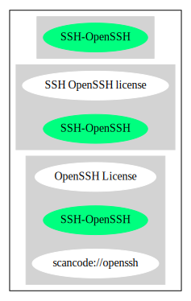

SSH OpenSSH license (SSH-OpenSSH)
=================================

[TABLE]

Comments on (easy) usability
----------------------------

General Comments
----------------

URLs
----

-   **SPDX:** http://spdx.org/licenses/SSH-OpenSSH.json

-   https://github.com/openssh/openssh-portable/blob/1b11ea7c58cd5c59838b5fa574cd456d6047b2d4/LICENCE\#L10

------------------------------------------------------------------------

Raw Data
--------

### Facts

-   [SPDX](https://spdx.org/licenses/SSH-OpenSSH.html "SPDX")

### Raw JSON

    {
        "__impliedNames": [
            "SSH-OpenSSH",
            "SSH OpenSSH license"
        ],
        "__impliedId": "SSH-OpenSSH",
        "facts": {
            "SPDX": {
                "isSPDXLicenseDeprecated": false,
                "spdxFullName": "SSH OpenSSH license",
                "spdxDetailsURL": "http://spdx.org/licenses/SSH-OpenSSH.json",
                "_sourceURL": "https://spdx.org/licenses/SSH-OpenSSH.html",
                "spdxLicIsOSIApproved": false,
                "spdxSeeAlso": [
                    "https://github.com/openssh/openssh-portable/blob/1b11ea7c58cd5c59838b5fa574cd456d6047b2d4/LICENCE#L10"
                ],
                "_implications": {
                    "__impliedNames": [
                        "SSH-OpenSSH",
                        "SSH OpenSSH license"
                    ],
                    "__impliedId": "SSH-OpenSSH",
                    "__isOsiApproved": false,
                    "__impliedURLs": [
                        [
                            "SPDX",
                            "http://spdx.org/licenses/SSH-OpenSSH.json"
                        ],
                        [
                            null,
                            "https://github.com/openssh/openssh-portable/blob/1b11ea7c58cd5c59838b5fa574cd456d6047b2d4/LICENCE#L10"
                        ]
                    ]
                },
                "spdxLicenseId": "SSH-OpenSSH"
            }
        },
        "__isOsiApproved": false,
        "__impliedURLs": [
            [
                "SPDX",
                "http://spdx.org/licenses/SSH-OpenSSH.json"
            ],
            [
                null,
                "https://github.com/openssh/openssh-portable/blob/1b11ea7c58cd5c59838b5fa574cd456d6047b2d4/LICENCE#L10"
            ]
        ]
    }

------------------------------------------------------------------------

Dot Cluster Graph
-----------------

