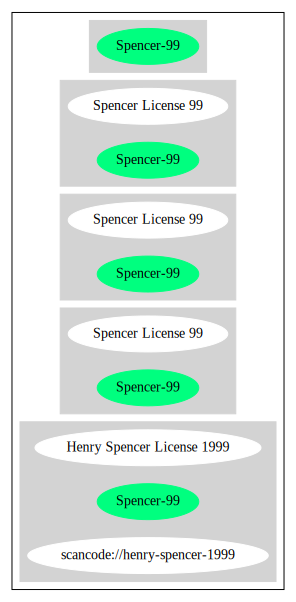

Spencer License 99 (Spencer-99)
===============================

[TABLE]

**Other Names:**

-   `scancode://henry-spencer-1999`

-   `Henry Spencer License 1999`

Comments on (easy) usability
----------------------------

-   **↑**“Rating is: Silver” (source: [BlueOak License
    List](https://blueoakcouncil.org/list "BlueOak License List"))

General Comments
----------------

URLs
----

-   **Homepage:**
    http://www.opensource.apple.com/source/tcl/tcl-5/tcl/generic/regfronts.c

-   **SPDX:** http://spdx.org/licenses/Spencer-99.json

-   **SPDX:** https://spdx.org/licenses/Spencer-99.html

Text
----

    Development of this software was funded, in part, by Cray Research Inc.,
    UUNET Communications Services Inc., Sun Microsystems Inc., and Scriptics
    Corporation, none of whom are responsible for the results. The author
    thanks all of them.

    Redistribution and use in source and binary forms - with or without
    modification - are permitted for any purpose, provided that redistributions
    in source form retain this entire copyright notice and indicate the origin
    and nature of any modifications.

    I'd appreciate being given credit for this package in the documentation of
    software which uses it, but that is not a requirement.

    THIS SOFTWARE IS PROVIDED ``AS IS'' AND ANY EXPRESS OR IMPLIED WARRANTIES,
    INCLUDING, BUT NOT LIMITED TO, THE IMPLIED WARRANTIES OF MERCHANTABILITY
    AND FITNESS FOR A PARTICULAR PURPOSE ARE DISCLAIMED. IN NO EVENT SHALL
    HENRY SPENCER BE LIABLE FOR ANY DIRECT, INDIRECT, INCIDENTAL, SPECIAL,
    EXEMPLARY, OR CONSEQUENTIAL DAMAGES (INCLUDING, BUT NOT LIMITED TO,
    PROCUREMENT OF SUBSTITUTE GOODS OR SERVICES; LOSS OF USE, DATA, OR PROFITS;
    OR BUSINESS INTERRUPTION) HOWEVER CAUSED AND ON ANY THEORY OF LIABILITY,
    WHETHER IN CONTRACT, STRICT LIABILITY, OR TORT (INCLUDING NEGLIGENCE OR
    OTHERWISE) ARISING IN ANY WAY OUT OF THE USE OF THIS SOFTWARE, EVEN IF
    ADVISED OF THE POSSIBILITY OF SUCH DAMAGE.

------------------------------------------------------------------------

Raw Data
--------

    {
        "__impliedNames": [
            "Spencer-99",
            "Spencer License 99",
            "scancode://henry-spencer-1999",
            "Henry Spencer License 1999"
        ],
        "__impliedId": "Spencer-99",
        "facts": {
            "SPDX": {
                "isSPDXLicenseDeprecated": false,
                "spdxFullName": "Spencer License 99",
                "spdxDetailsURL": "http://spdx.org/licenses/Spencer-99.json",
                "_sourceURL": "https://spdx.org/licenses/Spencer-99.html",
                "spdxLicIsOSIApproved": false,
                "spdxSeeAlso": [
                    "http://www.opensource.apple.com/source/tcl/tcl-5/tcl/generic/regfronts.c"
                ],
                "_implications": {
                    "__impliedNames": [
                        "Spencer-99",
                        "Spencer License 99"
                    ],
                    "__impliedId": "Spencer-99",
                    "__isOsiApproved": false,
                    "__impliedURLs": [
                        [
                            "SPDX",
                            "http://spdx.org/licenses/Spencer-99.json"
                        ],
                        [
                            null,
                            "http://www.opensource.apple.com/source/tcl/tcl-5/tcl/generic/regfronts.c"
                        ]
                    ]
                },
                "spdxLicenseId": "Spencer-99"
            },
            "Scancode": {
                "otherUrls": null,
                "homepageUrl": "http://www.opensource.apple.com/source/tcl/tcl-5/tcl/generic/regfronts.c",
                "shortName": "Henry Spencer License 1999",
                "textUrls": null,
                "text": "Development of this software was funded, in part, by Cray Research Inc.,\nUUNET Communications Services Inc., Sun Microsystems Inc., and Scriptics\nCorporation, none of whom are responsible for the results. The author\nthanks all of them.\n\nRedistribution and use in source and binary forms - with or without\nmodification - are permitted for any purpose, provided that redistributions\nin source form retain this entire copyright notice and indicate the origin\nand nature of any modifications.\n\nI'd appreciate being given credit for this package in the documentation of\nsoftware which uses it, but that is not a requirement.\n\nTHIS SOFTWARE IS PROVIDED ``AS IS'' AND ANY EXPRESS OR IMPLIED WARRANTIES,\nINCLUDING, BUT NOT LIMITED TO, THE IMPLIED WARRANTIES OF MERCHANTABILITY\nAND FITNESS FOR A PARTICULAR PURPOSE ARE DISCLAIMED. IN NO EVENT SHALL\nHENRY SPENCER BE LIABLE FOR ANY DIRECT, INDIRECT, INCIDENTAL, SPECIAL,\nEXEMPLARY, OR CONSEQUENTIAL DAMAGES (INCLUDING, BUT NOT LIMITED TO,\nPROCUREMENT OF SUBSTITUTE GOODS OR SERVICES; LOSS OF USE, DATA, OR PROFITS;\nOR BUSINESS INTERRUPTION) HOWEVER CAUSED AND ON ANY THEORY OF LIABILITY,\nWHETHER IN CONTRACT, STRICT LIABILITY, OR TORT (INCLUDING NEGLIGENCE OR\nOTHERWISE) ARISING IN ANY WAY OUT OF THE USE OF THIS SOFTWARE, EVEN IF\nADVISED OF THE POSSIBILITY OF SUCH DAMAGE.\n",
                "category": "Permissive",
                "osiUrl": null,
                "owner": "Henry Spencer",
                "_sourceURL": "https://github.com/nexB/scancode-toolkit/blob/develop/src/licensedcode/data/licenses/henry-spencer-1999.yml",
                "key": "henry-spencer-1999",
                "name": "Henry Spencer License 1999",
                "spdxId": "Spencer-99",
                "notes": null,
                "_implications": {
                    "__impliedNames": [
                        "scancode://henry-spencer-1999",
                        "Henry Spencer License 1999",
                        "Spencer-99"
                    ],
                    "__impliedId": "Spencer-99",
                    "__impliedCopyleft": [
                        [
                            "Scancode",
                            "NoCopyleft"
                        ]
                    ],
                    "__calculatedCopyleft": "NoCopyleft",
                    "__impliedText": "Development of this software was funded, in part, by Cray Research Inc.,\nUUNET Communications Services Inc., Sun Microsystems Inc., and Scriptics\nCorporation, none of whom are responsible for the results. The author\nthanks all of them.\n\nRedistribution and use in source and binary forms - with or without\nmodification - are permitted for any purpose, provided that redistributions\nin source form retain this entire copyright notice and indicate the origin\nand nature of any modifications.\n\nI'd appreciate being given credit for this package in the documentation of\nsoftware which uses it, but that is not a requirement.\n\nTHIS SOFTWARE IS PROVIDED ``AS IS'' AND ANY EXPRESS OR IMPLIED WARRANTIES,\nINCLUDING, BUT NOT LIMITED TO, THE IMPLIED WARRANTIES OF MERCHANTABILITY\nAND FITNESS FOR A PARTICULAR PURPOSE ARE DISCLAIMED. IN NO EVENT SHALL\nHENRY SPENCER BE LIABLE FOR ANY DIRECT, INDIRECT, INCIDENTAL, SPECIAL,\nEXEMPLARY, OR CONSEQUENTIAL DAMAGES (INCLUDING, BUT NOT LIMITED TO,\nPROCUREMENT OF SUBSTITUTE GOODS OR SERVICES; LOSS OF USE, DATA, OR PROFITS;\nOR BUSINESS INTERRUPTION) HOWEVER CAUSED AND ON ANY THEORY OF LIABILITY,\nWHETHER IN CONTRACT, STRICT LIABILITY, OR TORT (INCLUDING NEGLIGENCE OR\nOTHERWISE) ARISING IN ANY WAY OUT OF THE USE OF THIS SOFTWARE, EVEN IF\nADVISED OF THE POSSIBILITY OF SUCH DAMAGE.\n",
                    "__impliedURLs": [
                        [
                            "Homepage",
                            "http://www.opensource.apple.com/source/tcl/tcl-5/tcl/generic/regfronts.c"
                        ]
                    ]
                }
            },
            "Cavil": {
                "implications": {
                    "__impliedNames": [
                        "Spencer-99",
                        "Spencer-99"
                    ],
                    "__impliedId": "Spencer-99"
                },
                "shortname": "Spencer-99",
                "riskInt": 5,
                "trademarkInt": 0,
                "opinionInt": 0,
                "otherNames": [
                    "Spencer-99"
                ],
                "patentInt": 0
            },
            "BlueOak License List": {
                "BlueOakRating": "Silver",
                "url": "https://spdx.org/licenses/Spencer-99.html",
                "isPermissive": true,
                "_sourceURL": "https://blueoakcouncil.org/list",
                "name": "Spencer License 99",
                "id": "Spencer-99",
                "_implications": {
                    "__impliedNames": [
                        "Spencer-99",
                        "Spencer License 99"
                    ],
                    "__impliedJudgement": [
                        [
                            "BlueOak License List",
                            {
                                "tag": "PositiveJudgement",
                                "contents": "Rating is: Silver"
                            }
                        ]
                    ],
                    "__impliedCopyleft": [
                        [
                            "BlueOak License List",
                            "NoCopyleft"
                        ]
                    ],
                    "__calculatedCopyleft": "NoCopyleft",
                    "__impliedURLs": [
                        [
                            "SPDX",
                            "https://spdx.org/licenses/Spencer-99.html"
                        ]
                    ]
                }
            }
        },
        "__impliedJudgement": [
            [
                "BlueOak License List",
                {
                    "tag": "PositiveJudgement",
                    "contents": "Rating is: Silver"
                }
            ]
        ],
        "__impliedCopyleft": [
            [
                "BlueOak License List",
                "NoCopyleft"
            ],
            [
                "Scancode",
                "NoCopyleft"
            ]
        ],
        "__calculatedCopyleft": "NoCopyleft",
        "__isOsiApproved": false,
        "__impliedText": "Development of this software was funded, in part, by Cray Research Inc.,\nUUNET Communications Services Inc., Sun Microsystems Inc., and Scriptics\nCorporation, none of whom are responsible for the results. The author\nthanks all of them.\n\nRedistribution and use in source and binary forms - with or without\nmodification - are permitted for any purpose, provided that redistributions\nin source form retain this entire copyright notice and indicate the origin\nand nature of any modifications.\n\nI'd appreciate being given credit for this package in the documentation of\nsoftware which uses it, but that is not a requirement.\n\nTHIS SOFTWARE IS PROVIDED ``AS IS'' AND ANY EXPRESS OR IMPLIED WARRANTIES,\nINCLUDING, BUT NOT LIMITED TO, THE IMPLIED WARRANTIES OF MERCHANTABILITY\nAND FITNESS FOR A PARTICULAR PURPOSE ARE DISCLAIMED. IN NO EVENT SHALL\nHENRY SPENCER BE LIABLE FOR ANY DIRECT, INDIRECT, INCIDENTAL, SPECIAL,\nEXEMPLARY, OR CONSEQUENTIAL DAMAGES (INCLUDING, BUT NOT LIMITED TO,\nPROCUREMENT OF SUBSTITUTE GOODS OR SERVICES; LOSS OF USE, DATA, OR PROFITS;\nOR BUSINESS INTERRUPTION) HOWEVER CAUSED AND ON ANY THEORY OF LIABILITY,\nWHETHER IN CONTRACT, STRICT LIABILITY, OR TORT (INCLUDING NEGLIGENCE OR\nOTHERWISE) ARISING IN ANY WAY OUT OF THE USE OF THIS SOFTWARE, EVEN IF\nADVISED OF THE POSSIBILITY OF SUCH DAMAGE.\n",
        "__impliedURLs": [
            [
                "SPDX",
                "http://spdx.org/licenses/Spencer-99.json"
            ],
            [
                null,
                "http://www.opensource.apple.com/source/tcl/tcl-5/tcl/generic/regfronts.c"
            ],
            [
                "SPDX",
                "https://spdx.org/licenses/Spencer-99.html"
            ],
            [
                "Homepage",
                "http://www.opensource.apple.com/source/tcl/tcl-5/tcl/generic/regfronts.c"
            ]
        ]
    }

------------------------------------------------------------------------

Dot Cluster Graph
-----------------

