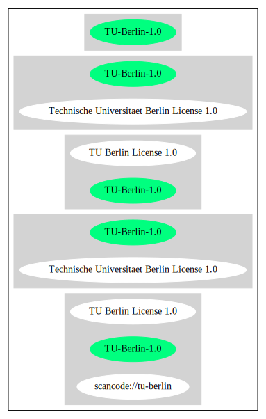

Technische Universitaet Berlin License 1.0 (TU-Berlin-1.0)
==========================================================

[TABLE]

**Other Names:**

-   `scancode://tu-berlin`

-   `TU Berlin License 1.0`

Comments on (easy) usability
----------------------------

-   **↓**“Rating is: Lead” (source: [BlueOak License
    List](https://blueoakcouncil.org/list "BlueOak License List"))

General Comments
----------------

URLs
----

-   **Homepage:**
    https://github.com/swh/ladspa/blob/7bf6f3799fdba70fda297c2d8fd9f526803d9680/gsm/COPYRIGHT

-   **SPDX:** http://spdx.org/licenses/TU-Berlin-1.0.json

-   **SPDX:** https://spdx.org/licenses/TU-Berlin-1.0.html

-   ftp://svr-ftp.eng.cam.ac.uk/pub/comp.speech/coding/gsm-1.0.6.tar.gz

Text
----

    Any use of this software is permitted provided that this notice is not
    removed and that neither the authors nor the Technische Universitaet Berlin
    are deemed to have made any representations as to the suitability of this
    software for any purpose nor are held responsible for any defects of
    this software.  THERE IS ABSOLUTELY NO WARRANTY FOR THIS SOFTWARE.

    As a matter of courtesy, the authors request to be informed about uses
    this software has found, about bugs in this software, and about any
    improvements that may be of general interest.

------------------------------------------------------------------------

Raw Data
--------

-   SPDX

-   BlueOak License List

-   Scancode

&nbsp;

    {
        "__impliedNames": [
            "TU-Berlin-1.0",
            "Technische Universitaet Berlin License 1.0",
            "scancode://tu-berlin",
            "TU Berlin License 1.0"
        ],
        "__impliedId": "TU-Berlin-1.0",
        "facts": {
            "SPDX": {
                "isSPDXLicenseDeprecated": false,
                "spdxFullName": "Technische Universitaet Berlin License 1.0",
                "spdxDetailsURL": "http://spdx.org/licenses/TU-Berlin-1.0.json",
                "_sourceURL": "https://spdx.org/licenses/TU-Berlin-1.0.html",
                "spdxLicIsOSIApproved": false,
                "spdxSeeAlso": [
                    "https://github.com/swh/ladspa/blob/7bf6f3799fdba70fda297c2d8fd9f526803d9680/gsm/COPYRIGHT"
                ],
                "_implications": {
                    "__impliedNames": [
                        "TU-Berlin-1.0",
                        "Technische Universitaet Berlin License 1.0"
                    ],
                    "__impliedId": "TU-Berlin-1.0",
                    "__isOsiApproved": false,
                    "__impliedURLs": [
                        [
                            "SPDX",
                            "http://spdx.org/licenses/TU-Berlin-1.0.json"
                        ],
                        [
                            null,
                            "https://github.com/swh/ladspa/blob/7bf6f3799fdba70fda297c2d8fd9f526803d9680/gsm/COPYRIGHT"
                        ]
                    ]
                },
                "spdxLicenseId": "TU-Berlin-1.0"
            },
            "Scancode": {
                "otherUrls": [
                    "ftp://svr-ftp.eng.cam.ac.uk/pub/comp.speech/coding/gsm-1.0.6.tar.gz",
                    "https://github.com/swh/ladspa/blob/7bf6f3799fdba70fda297c2d8fd9f526803d9680/gsm/COPYRIGHT"
                ],
                "homepageUrl": "https://github.com/swh/ladspa/blob/7bf6f3799fdba70fda297c2d8fd9f526803d9680/gsm/COPYRIGHT",
                "shortName": "TU Berlin License 1.0",
                "textUrls": null,
                "text": "Any use of this software is permitted provided that this notice is not\nremoved and that neither the authors nor the Technische Universitaet Berlin\nare deemed to have made any representations as to the suitability of this\nsoftware for any purpose nor are held responsible for any defects of\nthis software.  THERE IS ABSOLUTELY NO WARRANTY FOR THIS SOFTWARE.\n\nAs a matter of courtesy, the authors request to be informed about uses\nthis software has found, about bugs in this software, and about any\nimprovements that may be of general interest.\n",
                "category": "Permissive",
                "osiUrl": null,
                "owner": "Technische Universitaet Berlin",
                "_sourceURL": "https://github.com/nexB/scancode-toolkit/blob/develop/src/licensedcode/data/licenses/tu-berlin.yml",
                "key": "tu-berlin",
                "name": "Technische Universitaet Berlin Attribution License 1.0",
                "spdxId": "TU-Berlin-1.0",
                "notes": null,
                "_implications": {
                    "__impliedNames": [
                        "scancode://tu-berlin",
                        "TU Berlin License 1.0",
                        "TU-Berlin-1.0"
                    ],
                    "__impliedId": "TU-Berlin-1.0",
                    "__impliedCopyleft": [
                        [
                            "Scancode",
                            "NoCopyleft"
                        ]
                    ],
                    "__calculatedCopyleft": "NoCopyleft",
                    "__impliedText": "Any use of this software is permitted provided that this notice is not\nremoved and that neither the authors nor the Technische Universitaet Berlin\nare deemed to have made any representations as to the suitability of this\nsoftware for any purpose nor are held responsible for any defects of\nthis software.  THERE IS ABSOLUTELY NO WARRANTY FOR THIS SOFTWARE.\n\nAs a matter of courtesy, the authors request to be informed about uses\nthis software has found, about bugs in this software, and about any\nimprovements that may be of general interest.\n",
                    "__impliedURLs": [
                        [
                            "Homepage",
                            "https://github.com/swh/ladspa/blob/7bf6f3799fdba70fda297c2d8fd9f526803d9680/gsm/COPYRIGHT"
                        ],
                        [
                            null,
                            "ftp://svr-ftp.eng.cam.ac.uk/pub/comp.speech/coding/gsm-1.0.6.tar.gz"
                        ],
                        [
                            null,
                            "https://github.com/swh/ladspa/blob/7bf6f3799fdba70fda297c2d8fd9f526803d9680/gsm/COPYRIGHT"
                        ]
                    ]
                }
            },
            "BlueOak License List": {
                "BlueOakRating": "Lead",
                "url": "https://spdx.org/licenses/TU-Berlin-1.0.html",
                "isPermissive": true,
                "_sourceURL": "https://blueoakcouncil.org/list",
                "name": "Technische Universitaet Berlin License 1.0",
                "id": "TU-Berlin-1.0",
                "_implications": {
                    "__impliedNames": [
                        "TU-Berlin-1.0",
                        "Technische Universitaet Berlin License 1.0"
                    ],
                    "__impliedJudgement": [
                        [
                            "BlueOak License List",
                            {
                                "tag": "NegativeJudgement",
                                "contents": "Rating is: Lead"
                            }
                        ]
                    ],
                    "__impliedCopyleft": [
                        [
                            "BlueOak License List",
                            "NoCopyleft"
                        ]
                    ],
                    "__calculatedCopyleft": "NoCopyleft",
                    "__impliedURLs": [
                        [
                            "SPDX",
                            "https://spdx.org/licenses/TU-Berlin-1.0.html"
                        ]
                    ]
                }
            }
        },
        "__impliedJudgement": [
            [
                "BlueOak License List",
                {
                    "tag": "NegativeJudgement",
                    "contents": "Rating is: Lead"
                }
            ]
        ],
        "__impliedCopyleft": [
            [
                "BlueOak License List",
                "NoCopyleft"
            ],
            [
                "Scancode",
                "NoCopyleft"
            ]
        ],
        "__calculatedCopyleft": "NoCopyleft",
        "__isOsiApproved": false,
        "__impliedText": "Any use of this software is permitted provided that this notice is not\nremoved and that neither the authors nor the Technische Universitaet Berlin\nare deemed to have made any representations as to the suitability of this\nsoftware for any purpose nor are held responsible for any defects of\nthis software.  THERE IS ABSOLUTELY NO WARRANTY FOR THIS SOFTWARE.\n\nAs a matter of courtesy, the authors request to be informed about uses\nthis software has found, about bugs in this software, and about any\nimprovements that may be of general interest.\n",
        "__impliedURLs": [
            [
                "SPDX",
                "http://spdx.org/licenses/TU-Berlin-1.0.json"
            ],
            [
                null,
                "https://github.com/swh/ladspa/blob/7bf6f3799fdba70fda297c2d8fd9f526803d9680/gsm/COPYRIGHT"
            ],
            [
                "SPDX",
                "https://spdx.org/licenses/TU-Berlin-1.0.html"
            ],
            [
                "Homepage",
                "https://github.com/swh/ladspa/blob/7bf6f3799fdba70fda297c2d8fd9f526803d9680/gsm/COPYRIGHT"
            ],
            [
                null,
                "ftp://svr-ftp.eng.cam.ac.uk/pub/comp.speech/coding/gsm-1.0.6.tar.gz"
            ]
        ]
    }

------------------------------------------------------------------------

Dot Cluster Graph
-----------------

