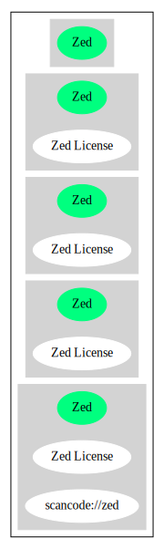

Zed License (Zed)
=================

[TABLE]

**Other Names:**

-   `scancode://zed`

Comments on (easy) usability
----------------------------

-   **↓**“Rating is: Lead” (source: [BlueOak License
    List](https://blueoakcouncil.org/list "BlueOak License List"))

General Comments
----------------

URLs
----

-   **Homepage:** https://fedoraproject.org/wiki/Licensing/Zed

-   **SPDX:** http://spdx.org/licenses/Zed.json

-   **SPDX:** https://spdx.org/licenses/Zed.html

Text
----

    You may copy and distribute this file freely. Any queries and complaints should
    be forwarded to Jim.Davies@comlab.ox.ac.uk. If you make any changes to this
    file, please do not distribute the results under the name `zed-csp.sty'.

------------------------------------------------------------------------

Raw Data
--------

    {
        "__impliedNames": [
            "Zed",
            "Zed License",
            "scancode://zed"
        ],
        "__impliedId": "Zed",
        "facts": {
            "SPDX": {
                "isSPDXLicenseDeprecated": false,
                "spdxFullName": "Zed License",
                "spdxDetailsURL": "http://spdx.org/licenses/Zed.json",
                "_sourceURL": "https://spdx.org/licenses/Zed.html",
                "spdxLicIsOSIApproved": false,
                "spdxSeeAlso": [
                    "https://fedoraproject.org/wiki/Licensing/Zed"
                ],
                "_implications": {
                    "__impliedNames": [
                        "Zed",
                        "Zed License"
                    ],
                    "__impliedId": "Zed",
                    "__isOsiApproved": false,
                    "__impliedURLs": [
                        [
                            "SPDX",
                            "http://spdx.org/licenses/Zed.json"
                        ],
                        [
                            null,
                            "https://fedoraproject.org/wiki/Licensing/Zed"
                        ]
                    ]
                },
                "spdxLicenseId": "Zed"
            },
            "Scancode": {
                "otherUrls": null,
                "homepageUrl": "https://fedoraproject.org/wiki/Licensing/Zed",
                "shortName": "Zed License",
                "textUrls": null,
                "text": "You may copy and distribute this file freely. Any queries and complaints should\nbe forwarded to Jim.Davies@comlab.ox.ac.uk. If you make any changes to this\nfile, please do not distribute the results under the name `zed-csp.sty'.",
                "category": "Permissive",
                "osiUrl": null,
                "owner": "Jim Davies",
                "_sourceURL": "https://github.com/nexB/scancode-toolkit/blob/develop/src/licensedcode/data/licenses/zed.yml",
                "key": "zed",
                "name": "Zed License",
                "spdxId": "Zed",
                "notes": null,
                "_implications": {
                    "__impliedNames": [
                        "scancode://zed",
                        "Zed License",
                        "Zed"
                    ],
                    "__impliedId": "Zed",
                    "__impliedCopyleft": [
                        [
                            "Scancode",
                            "NoCopyleft"
                        ]
                    ],
                    "__calculatedCopyleft": "NoCopyleft",
                    "__impliedText": "You may copy and distribute this file freely. Any queries and complaints should\nbe forwarded to Jim.Davies@comlab.ox.ac.uk. If you make any changes to this\nfile, please do not distribute the results under the name `zed-csp.sty'.",
                    "__impliedURLs": [
                        [
                            "Homepage",
                            "https://fedoraproject.org/wiki/Licensing/Zed"
                        ]
                    ]
                }
            },
            "BlueOak License List": {
                "BlueOakRating": "Lead",
                "url": "https://spdx.org/licenses/Zed.html",
                "isPermissive": true,
                "_sourceURL": "https://blueoakcouncil.org/list",
                "name": "Zed License",
                "id": "Zed",
                "_implications": {
                    "__impliedNames": [
                        "Zed",
                        "Zed License"
                    ],
                    "__impliedJudgement": [
                        [
                            "BlueOak License List",
                            {
                                "tag": "NegativeJudgement",
                                "contents": "Rating is: Lead"
                            }
                        ]
                    ],
                    "__impliedCopyleft": [
                        [
                            "BlueOak License List",
                            "NoCopyleft"
                        ]
                    ],
                    "__calculatedCopyleft": "NoCopyleft",
                    "__impliedURLs": [
                        [
                            "SPDX",
                            "https://spdx.org/licenses/Zed.html"
                        ]
                    ]
                }
            }
        },
        "__impliedJudgement": [
            [
                "BlueOak License List",
                {
                    "tag": "NegativeJudgement",
                    "contents": "Rating is: Lead"
                }
            ]
        ],
        "__impliedCopyleft": [
            [
                "BlueOak License List",
                "NoCopyleft"
            ],
            [
                "Scancode",
                "NoCopyleft"
            ]
        ],
        "__calculatedCopyleft": "NoCopyleft",
        "__isOsiApproved": false,
        "__impliedText": "You may copy and distribute this file freely. Any queries and complaints should\nbe forwarded to Jim.Davies@comlab.ox.ac.uk. If you make any changes to this\nfile, please do not distribute the results under the name `zed-csp.sty'.",
        "__impliedURLs": [
            [
                "SPDX",
                "http://spdx.org/licenses/Zed.json"
            ],
            [
                null,
                "https://fedoraproject.org/wiki/Licensing/Zed"
            ],
            [
                "SPDX",
                "https://spdx.org/licenses/Zed.html"
            ],
            [
                "Homepage",
                "https://fedoraproject.org/wiki/Licensing/Zed"
            ]
        ]
    }

------------------------------------------------------------------------

Dot Cluster Graph
-----------------

