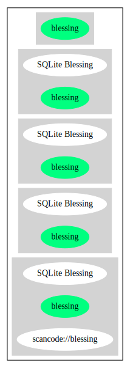

SQLite Blessing (blessing)
==========================

[TABLE]

**Other Names:**

-   `scancode://blessing`

Comments on (easy) usability
----------------------------

General Comments
----------------

URLs
----

-   **Homepage:** https://sqlite.org/src/artifact/df5091916dbb40e6

-   **SPDX:** http://spdx.org/licenses/blessing.json

-   https://www.sqlite.org/src/artifact/e33a4df7e32d742a?ln=4-9

Text
----

    The author disclaims copyright to this source code.
    In place of a legal notice, here is a blessing:
       May you do good and not evil.
       May you find forgiveness for yourself and forgive others.
       May you share freely, never taking more than you give.

------------------------------------------------------------------------

Raw Data
--------

-   SPDX

-   Scancode

&nbsp;

    {
        "__impliedNames": [
            "blessing",
            "SQLite Blessing",
            "scancode://blessing"
        ],
        "__impliedId": "blessing",
        "facts": {
            "SPDX": {
                "isSPDXLicenseDeprecated": false,
                "spdxFullName": "SQLite Blessing",
                "spdxDetailsURL": "http://spdx.org/licenses/blessing.json",
                "_sourceURL": "https://spdx.org/licenses/blessing.html",
                "spdxLicIsOSIApproved": false,
                "spdxSeeAlso": [
                    "https://www.sqlite.org/src/artifact/e33a4df7e32d742a?ln=4-9",
                    "https://sqlite.org/src/artifact/df5091916dbb40e6"
                ],
                "_implications": {
                    "__impliedNames": [
                        "blessing",
                        "SQLite Blessing"
                    ],
                    "__impliedId": "blessing",
                    "__isOsiApproved": false,
                    "__impliedURLs": [
                        [
                            "SPDX",
                            "http://spdx.org/licenses/blessing.json"
                        ],
                        [
                            null,
                            "https://www.sqlite.org/src/artifact/e33a4df7e32d742a?ln=4-9"
                        ],
                        [
                            null,
                            "https://sqlite.org/src/artifact/df5091916dbb40e6"
                        ]
                    ]
                },
                "spdxLicenseId": "blessing"
            },
            "Scancode": {
                "otherUrls": [
                    "https://www.sqlite.org/src/artifact/e33a4df7e32d742a?ln=4-9",
                    "https://sqlite.org/src/artifact/df5091916dbb40e6"
                ],
                "homepageUrl": "https://sqlite.org/src/artifact/df5091916dbb40e6",
                "shortName": "SQLite Blessing",
                "textUrls": null,
                "text": "The author disclaims copyright to this source code.\nIn place of a legal notice, here is a blessing:\n   May you do good and not evil.\n   May you find forgiveness for yourself and forgive others.\n   May you share freely, never taking more than you give.",
                "category": "Public Domain",
                "osiUrl": null,
                "owner": "SQLite",
                "_sourceURL": "https://github.com/nexB/scancode-toolkit/blob/develop/src/licensedcode/data/licenses/blessing.yml",
                "key": "blessing",
                "name": "SQLite Blessing",
                "spdxId": "blessing",
                "notes": null,
                "_implications": {
                    "__impliedNames": [
                        "scancode://blessing",
                        "SQLite Blessing",
                        "blessing"
                    ],
                    "__impliedId": "blessing",
                    "__impliedCopyleft": [
                        [
                            "Scancode",
                            "NoCopyleft"
                        ]
                    ],
                    "__calculatedCopyleft": "NoCopyleft",
                    "__impliedText": "The author disclaims copyright to this source code.\nIn place of a legal notice, here is a blessing:\n   May you do good and not evil.\n   May you find forgiveness for yourself and forgive others.\n   May you share freely, never taking more than you give.",
                    "__impliedURLs": [
                        [
                            "Homepage",
                            "https://sqlite.org/src/artifact/df5091916dbb40e6"
                        ],
                        [
                            null,
                            "https://www.sqlite.org/src/artifact/e33a4df7e32d742a?ln=4-9"
                        ],
                        [
                            null,
                            "https://sqlite.org/src/artifact/df5091916dbb40e6"
                        ]
                    ]
                }
            }
        },
        "__impliedCopyleft": [
            [
                "Scancode",
                "NoCopyleft"
            ]
        ],
        "__calculatedCopyleft": "NoCopyleft",
        "__isOsiApproved": false,
        "__impliedText": "The author disclaims copyright to this source code.\nIn place of a legal notice, here is a blessing:\n   May you do good and not evil.\n   May you find forgiveness for yourself and forgive others.\n   May you share freely, never taking more than you give.",
        "__impliedURLs": [
            [
                "SPDX",
                "http://spdx.org/licenses/blessing.json"
            ],
            [
                null,
                "https://www.sqlite.org/src/artifact/e33a4df7e32d742a?ln=4-9"
            ],
            [
                null,
                "https://sqlite.org/src/artifact/df5091916dbb40e6"
            ],
            [
                "Homepage",
                "https://sqlite.org/src/artifact/df5091916dbb40e6"
            ]
        ]
    }

------------------------------------------------------------------------

Dot Cluster Graph
-----------------

