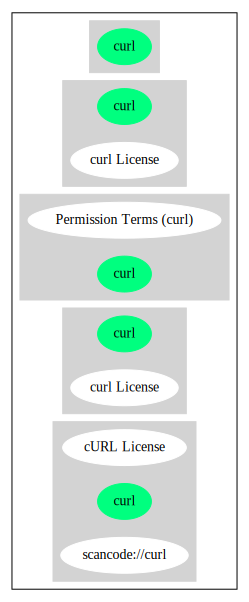

curl License (curl)
===================

[TABLE]

**Other Names:**

-   `scancode://curl`

Comments on (easy) usability
----------------------------

-   **↑**“Rating is: Bronze” (source: [BlueOak License
    List](https://blueoakcouncil.org/list "BlueOak License List"))

General Comments
----------------

-   “Lizenzen ohne Copyleft-Effekt zeichnen sich dadurch aus, dass sie
    dem Lizenznehmer alle Freiheiten einer Open Source Lizenz einräumen
    und für Veränderungen der Software keine Bedingungen hinsichtlich
    des zu verwendenden Lizenztyps enthalten. Damit kann der
    Lizenznehmer veränderte Versionen der Software unter beliebigen
    Lizenzbedingungen weiterverbreiten, also auch in proprietäre
    Software überführen.” (source:
    [ifrOSS](https://ifross.github.io/ifrOSS/Lizenzcenter "ifrOSS"))

URLs
----

-   **Homepage:** http://curl.haxx.se/

-   **SPDX:** http://spdx.org/licenses/curl.json

-   **SPDX:** https://spdx.org/licenses/curl.html

-   https://github.com/bagder/curl/blob/master/COPYING

-   http://curl.haxx.se/legal/licmix.html

-   https://github.com/curl/curl/blob/master/COPYING

OSADL Rule
----------

    USE CASE Source code delivery OR Binary delivery
    	YOU MUST Forward Copyright notices
    	YOU MUST Forward License text
    	YOU MUST NOT Promote

(source: OSADL License Checklist)

Text
----

    Permission to use, copy, modify, and distribute this software for any purpose
    with or without fee is hereby granted, provided that the above copyright
    notice and this permission notice appear in all copies.
     
    THE SOFTWARE IS PROVIDED "AS IS", WITHOUT WARRANTY OF ANY KIND, EXPRESS OR
    IMPLIED, INCLUDING BUT NOT LIMITED TO THE WARRANTIES OF MERCHANTABILITY,
    FITNESS FOR A PARTICULAR PURPOSE AND NONINFRINGEMENT OF THIRD PARTY RIGHTS. IN
    NO EVENT SHALL THE AUTHORS OR COPYRIGHT HOLDERS BE LIABLE FOR ANY CLAIM,
    DAMAGES OR OTHER LIABILITY, WHETHER IN AN ACTION OF CONTRACT, TORT OR
    OTHERWISE, ARISING FROM, OUT OF OR IN CONNECTION WITH THE SOFTWARE OR THE USE
    OR OTHER DEALINGS IN THE SOFTWARE.
     
    Except as contained in this notice, the name of a copyright holder shall not
    be used in advertising or otherwise to promote the sale, use or other dealings
    in this Software without prior written authorization of the copyright holder.

------------------------------------------------------------------------

Raw Data
--------

    {
        "__impliedNames": [
            "curl",
            "curl License",
            "scancode://curl",
            "cURL License",
            "Curl License"
        ],
        "__impliedId": "curl",
        "__impliedComments": [
            [
                "ifrOSS",
                [
                    "Lizenzen ohne Copyleft-Effekt zeichnen sich dadurch aus, dass sie dem Lizenznehmer alle Freiheiten einer Open Source Lizenz einräumen und für Veränderungen der Software keine Bedingungen hinsichtlich des zu verwendenden Lizenztyps enthalten. Damit kann der Lizenznehmer veränderte Versionen der Software unter beliebigen Lizenzbedingungen weiterverbreiten, also auch in proprietäre Software überführen."
                ]
            ]
        ],
        "facts": {
            "SPDX": {
                "isSPDXLicenseDeprecated": false,
                "spdxFullName": "curl License",
                "spdxDetailsURL": "http://spdx.org/licenses/curl.json",
                "_sourceURL": "https://spdx.org/licenses/curl.html",
                "spdxLicIsOSIApproved": false,
                "spdxSeeAlso": [
                    "https://github.com/bagder/curl/blob/master/COPYING"
                ],
                "_implications": {
                    "__impliedNames": [
                        "curl",
                        "curl License"
                    ],
                    "__impliedId": "curl",
                    "__isOsiApproved": false,
                    "__impliedURLs": [
                        [
                            "SPDX",
                            "http://spdx.org/licenses/curl.json"
                        ],
                        [
                            null,
                            "https://github.com/bagder/curl/blob/master/COPYING"
                        ]
                    ]
                },
                "spdxLicenseId": "curl"
            },
            "OSADL License Checklist": {
                "_sourceURL": "https://www.osadl.org/fileadmin/checklists/unreflicenses/curl.txt",
                "spdxId": "curl",
                "osadlRule": "USE CASE Source code delivery OR Binary delivery\r\n\tYOU MUST Forward Copyright notices\n\tYOU MUST Forward License text\n\tYOU MUST NOT Promote\n",
                "_implications": {
                    "__impliedNames": [
                        "curl"
                    ]
                }
            },
            "Scancode": {
                "otherUrls": [
                    "http://curl.haxx.se/legal/licmix.html",
                    "https://github.com/bagder/curl/blob/master/COPYING"
                ],
                "homepageUrl": "http://curl.haxx.se/",
                "shortName": "cURL License",
                "textUrls": null,
                "text": "Permission to use, copy, modify, and distribute this software for any purpose\nwith or without fee is hereby granted, provided that the above copyright\nnotice and this permission notice appear in all copies.\n \nTHE SOFTWARE IS PROVIDED \"AS IS\", WITHOUT WARRANTY OF ANY KIND, EXPRESS OR\nIMPLIED, INCLUDING BUT NOT LIMITED TO THE WARRANTIES OF MERCHANTABILITY,\nFITNESS FOR A PARTICULAR PURPOSE AND NONINFRINGEMENT OF THIRD PARTY RIGHTS. IN\nNO EVENT SHALL THE AUTHORS OR COPYRIGHT HOLDERS BE LIABLE FOR ANY CLAIM,\nDAMAGES OR OTHER LIABILITY, WHETHER IN AN ACTION OF CONTRACT, TORT OR\nOTHERWISE, ARISING FROM, OUT OF OR IN CONNECTION WITH THE SOFTWARE OR THE USE\nOR OTHER DEALINGS IN THE SOFTWARE.\n \nExcept as contained in this notice, the name of a copyright holder shall not\nbe used in advertising or otherwise to promote the sale, use or other dealings\nin this Software without prior written authorization of the copyright holder.",
                "category": "Permissive",
                "osiUrl": null,
                "owner": "cURL",
                "_sourceURL": "https://github.com/nexB/scancode-toolkit/blob/develop/src/licensedcode/data/licenses/curl.yml",
                "key": "curl",
                "name": "cURL License",
                "spdxId": "curl",
                "notes": null,
                "_implications": {
                    "__impliedNames": [
                        "scancode://curl",
                        "cURL License",
                        "curl"
                    ],
                    "__impliedId": "curl",
                    "__impliedCopyleft": [
                        [
                            "Scancode",
                            "NoCopyleft"
                        ]
                    ],
                    "__calculatedCopyleft": "NoCopyleft",
                    "__impliedText": "Permission to use, copy, modify, and distribute this software for any purpose\nwith or without fee is hereby granted, provided that the above copyright\nnotice and this permission notice appear in all copies.\n \nTHE SOFTWARE IS PROVIDED \"AS IS\", WITHOUT WARRANTY OF ANY KIND, EXPRESS OR\nIMPLIED, INCLUDING BUT NOT LIMITED TO THE WARRANTIES OF MERCHANTABILITY,\nFITNESS FOR A PARTICULAR PURPOSE AND NONINFRINGEMENT OF THIRD PARTY RIGHTS. IN\nNO EVENT SHALL THE AUTHORS OR COPYRIGHT HOLDERS BE LIABLE FOR ANY CLAIM,\nDAMAGES OR OTHER LIABILITY, WHETHER IN AN ACTION OF CONTRACT, TORT OR\nOTHERWISE, ARISING FROM, OUT OF OR IN CONNECTION WITH THE SOFTWARE OR THE USE\nOR OTHER DEALINGS IN THE SOFTWARE.\n \nExcept as contained in this notice, the name of a copyright holder shall not\nbe used in advertising or otherwise to promote the sale, use or other dealings\nin this Software without prior written authorization of the copyright holder.",
                    "__impliedURLs": [
                        [
                            "Homepage",
                            "http://curl.haxx.se/"
                        ],
                        [
                            null,
                            "http://curl.haxx.se/legal/licmix.html"
                        ],
                        [
                            null,
                            "https://github.com/bagder/curl/blob/master/COPYING"
                        ]
                    ]
                }
            },
            "Cavil": {
                "implications": {
                    "__impliedNames": [
                        "curl"
                    ],
                    "__impliedId": "curl"
                },
                "shortname": "curl",
                "riskInt": 1,
                "trademarkInt": 0,
                "opinionInt": 0,
                "otherNames": [],
                "patentInt": 0
            },
            "BlueOak License List": {
                "BlueOakRating": "Bronze",
                "url": "https://spdx.org/licenses/curl.html",
                "isPermissive": true,
                "_sourceURL": "https://blueoakcouncil.org/list",
                "name": "curl License",
                "id": "curl",
                "_implications": {
                    "__impliedNames": [
                        "curl",
                        "curl License"
                    ],
                    "__impliedJudgement": [
                        [
                            "BlueOak License List",
                            {
                                "tag": "PositiveJudgement",
                                "contents": "Rating is: Bronze"
                            }
                        ]
                    ],
                    "__impliedCopyleft": [
                        [
                            "BlueOak License List",
                            "NoCopyleft"
                        ]
                    ],
                    "__calculatedCopyleft": "NoCopyleft",
                    "__impliedURLs": [
                        [
                            "SPDX",
                            "https://spdx.org/licenses/curl.html"
                        ]
                    ]
                }
            },
            "ifrOSS": {
                "ifrKind": "IfrNoCopyleft",
                "ifrURL": "https://github.com/curl/curl/blob/master/COPYING",
                "_sourceURL": "https://ifross.github.io/ifrOSS/Lizenzcenter",
                "ifrName": "Curl License",
                "ifrId": null,
                "_implications": {
                    "__impliedNames": [
                        "Curl License"
                    ],
                    "__impliedComments": [
                        [
                            "ifrOSS",
                            [
                                "Lizenzen ohne Copyleft-Effekt zeichnen sich dadurch aus, dass sie dem Lizenznehmer alle Freiheiten einer Open Source Lizenz einräumen und für Veränderungen der Software keine Bedingungen hinsichtlich des zu verwendenden Lizenztyps enthalten. Damit kann der Lizenznehmer veränderte Versionen der Software unter beliebigen Lizenzbedingungen weiterverbreiten, also auch in proprietäre Software überführen."
                            ]
                        ]
                    ],
                    "__impliedCopyleft": [
                        [
                            "ifrOSS",
                            "NoCopyleft"
                        ]
                    ],
                    "__calculatedCopyleft": "NoCopyleft",
                    "__impliedURLs": [
                        [
                            null,
                            "https://github.com/curl/curl/blob/master/COPYING"
                        ]
                    ]
                }
            }
        },
        "__impliedJudgement": [
            [
                "BlueOak License List",
                {
                    "tag": "PositiveJudgement",
                    "contents": "Rating is: Bronze"
                }
            ]
        ],
        "__impliedCopyleft": [
            [
                "BlueOak License List",
                "NoCopyleft"
            ],
            [
                "Scancode",
                "NoCopyleft"
            ],
            [
                "ifrOSS",
                "NoCopyleft"
            ]
        ],
        "__calculatedCopyleft": "NoCopyleft",
        "__isOsiApproved": false,
        "__impliedText": "Permission to use, copy, modify, and distribute this software for any purpose\nwith or without fee is hereby granted, provided that the above copyright\nnotice and this permission notice appear in all copies.\n \nTHE SOFTWARE IS PROVIDED \"AS IS\", WITHOUT WARRANTY OF ANY KIND, EXPRESS OR\nIMPLIED, INCLUDING BUT NOT LIMITED TO THE WARRANTIES OF MERCHANTABILITY,\nFITNESS FOR A PARTICULAR PURPOSE AND NONINFRINGEMENT OF THIRD PARTY RIGHTS. IN\nNO EVENT SHALL THE AUTHORS OR COPYRIGHT HOLDERS BE LIABLE FOR ANY CLAIM,\nDAMAGES OR OTHER LIABILITY, WHETHER IN AN ACTION OF CONTRACT, TORT OR\nOTHERWISE, ARISING FROM, OUT OF OR IN CONNECTION WITH THE SOFTWARE OR THE USE\nOR OTHER DEALINGS IN THE SOFTWARE.\n \nExcept as contained in this notice, the name of a copyright holder shall not\nbe used in advertising or otherwise to promote the sale, use or other dealings\nin this Software without prior written authorization of the copyright holder.",
        "__impliedURLs": [
            [
                "SPDX",
                "http://spdx.org/licenses/curl.json"
            ],
            [
                null,
                "https://github.com/bagder/curl/blob/master/COPYING"
            ],
            [
                "SPDX",
                "https://spdx.org/licenses/curl.html"
            ],
            [
                "Homepage",
                "http://curl.haxx.se/"
            ],
            [
                null,
                "http://curl.haxx.se/legal/licmix.html"
            ],
            [
                null,
                "https://github.com/curl/curl/blob/master/COPYING"
            ]
        ]
    }

------------------------------------------------------------------------

Dot Cluster Graph
-----------------

