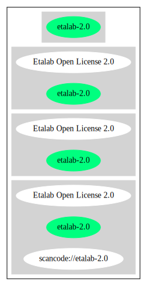

Etalab Open License 2.0 (etalab-2.0)
====================================

[TABLE]

Comments on (easy) usability
----------------------------

General Comments
----------------

URLs
----

-   **SPDX:** http://spdx.org/licenses/etalab-2.0.json

-   https://github.com/DISIC/politique-de-contribution-open-source/blob/master/LICENSE.pdf

-   https://raw.githubusercontent.com/DISIC/politique-de-contribution-open-source/master/LICENSE

------------------------------------------------------------------------

Raw Data
--------

### Facts

-   [SPDX](https://spdx.org/licenses/etalab-2.0.html "SPDX")

### Raw JSON

    {
        "__impliedNames": [
            "etalab-2.0",
            "Etalab Open License 2.0"
        ],
        "__impliedId": "etalab-2.0",
        "facts": {
            "SPDX": {
                "isSPDXLicenseDeprecated": false,
                "spdxFullName": "Etalab Open License 2.0",
                "spdxDetailsURL": "http://spdx.org/licenses/etalab-2.0.json",
                "_sourceURL": "https://spdx.org/licenses/etalab-2.0.html",
                "spdxLicIsOSIApproved": false,
                "spdxSeeAlso": [
                    "https://github.com/DISIC/politique-de-contribution-open-source/blob/master/LICENSE.pdf",
                    "https://raw.githubusercontent.com/DISIC/politique-de-contribution-open-source/master/LICENSE"
                ],
                "_implications": {
                    "__impliedNames": [
                        "etalab-2.0",
                        "Etalab Open License 2.0"
                    ],
                    "__impliedId": "etalab-2.0",
                    "__isOsiApproved": false,
                    "__impliedURLs": [
                        [
                            "SPDX",
                            "http://spdx.org/licenses/etalab-2.0.json"
                        ],
                        [
                            null,
                            "https://github.com/DISIC/politique-de-contribution-open-source/blob/master/LICENSE.pdf"
                        ],
                        [
                            null,
                            "https://raw.githubusercontent.com/DISIC/politique-de-contribution-open-source/master/LICENSE"
                        ]
                    ]
                },
                "spdxLicenseId": "etalab-2.0"
            }
        },
        "__isOsiApproved": false,
        "__impliedURLs": [
            [
                "SPDX",
                "http://spdx.org/licenses/etalab-2.0.json"
            ],
            [
                null,
                "https://github.com/DISIC/politique-de-contribution-open-source/blob/master/LICENSE.pdf"
            ],
            [
                null,
                "https://raw.githubusercontent.com/DISIC/politique-de-contribution-open-source/master/LICENSE"
            ]
        ]
    }

------------------------------------------------------------------------

Dot Cluster Graph
-----------------

