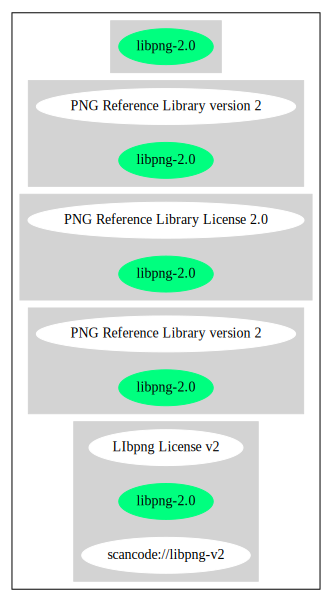

PNG Reference Library version 2 (libpng-2.0)
============================================

[TABLE]

**Other Names:**

-   `scancode://libpng-v2`

-   `LIbpng License v2`

Comments on (easy) usability
----------------------------

URLs
----

-   **Homepage:** http://www.libpng.org/pub/png/src/libpng-LICENSE.txt

-   **SPDX:** http://spdx.org/licenses/libpng-2.0.json

-   http://www.libpng.org/pub/png/src/libpng-LICENSE.txt

Text
----

    COPYRIGHT NOTICE, DISCLAIMER, and LICENSE
    =========================================

    PNG Reference Library License version 2
    ---------------------------------------

     * Copyright (c) 1995-2018 The PNG Reference Library Authors.
     * Copyright (c) 2018 Cosmin Truta.
     * Copyright (c) 2000-2002, 2004, 2006-2018 Glenn Randers-Pehrson.
     * Copyright (c) 1996-1997 Andreas Dilger.
     * Copyright (c) 1995-1996 Guy Eric Schalnat, Group 42, Inc.

    The software is supplied "as is", without warranty of any kind,
    express or implied, including, without limitation, the warranties
    of merchantability, fitness for a particular purpose, title, and
    non-infringement.  In no even shall the Copyright owners, or
    anyone distributing the software, be liable for any damages or
    other liability, whether in contract, tort or otherwise, arising
    from, out of, or in connection with the software, or the use or
    other dealings in the software, even if advised of the possibility
    of such damage.

    Permission is hereby granted to use, copy, modify, and distribute
    this software, or portions hereof, for any purpose, without fee,
    subject to the following restrictions:

     1. The origin of this software must not be misrepresented; you
        must not claim that you wrote the original software.  If you
        use this software in a product, an acknowledgment in the product
        documentation would be appreciated, but is not required.

     2. Altered source versions must be plainly marked as such, and must
        not be misrepresented as being the original software.

     3. This Copyright notice may not be removed or altered from any
        source or altered source distribution.

------------------------------------------------------------------------

Raw Data
--------

    {
        "__impliedNames": [
            "libpng-2.0",
            "PNG Reference Library version 2",
            "scancode://libpng-v2",
            "LIbpng License v2"
        ],
        "__impliedId": "libpng-2.0",
        "facts": {
            "SPDX": {
                "isSPDXLicenseDeprecated": false,
                "spdxFullName": "PNG Reference Library version 2",
                "spdxDetailsURL": "http://spdx.org/licenses/libpng-2.0.json",
                "_sourceURL": "https://spdx.org/licenses/libpng-2.0.html",
                "spdxLicIsOSIApproved": false,
                "spdxSeeAlso": [
                    "http://www.libpng.org/pub/png/src/libpng-LICENSE.txt\n         "
                ],
                "_implications": {
                    "__impliedNames": [
                        "libpng-2.0",
                        "PNG Reference Library version 2"
                    ],
                    "__impliedId": "libpng-2.0",
                    "__isOsiApproved": false,
                    "__impliedURLs": [
                        [
                            "SPDX",
                            "http://spdx.org/licenses/libpng-2.0.json"
                        ],
                        [
                            null,
                            "http://www.libpng.org/pub/png/src/libpng-LICENSE.txt\n         "
                        ]
                    ]
                },
                "spdxLicenseId": "libpng-2.0"
            },
            "Scancode": {
                "otherUrls": null,
                "homepageUrl": "http://www.libpng.org/pub/png/src/libpng-LICENSE.txt",
                "shortName": "LIbpng License v2",
                "textUrls": null,
                "text": "COPYRIGHT NOTICE, DISCLAIMER, and LICENSE\n=========================================\n\nPNG Reference Library License version 2\n---------------------------------------\n\n * Copyright (c) 1995-2018 The PNG Reference Library Authors.\n * Copyright (c) 2018 Cosmin Truta.\n * Copyright (c) 2000-2002, 2004, 2006-2018 Glenn Randers-Pehrson.\n * Copyright (c) 1996-1997 Andreas Dilger.\n * Copyright (c) 1995-1996 Guy Eric Schalnat, Group 42, Inc.\n\nThe software is supplied \"as is\", without warranty of any kind,\nexpress or implied, including, without limitation, the warranties\nof merchantability, fitness for a particular purpose, title, and\nnon-infringement.  In no even shall the Copyright owners, or\nanyone distributing the software, be liable for any damages or\nother liability, whether in contract, tort or otherwise, arising\nfrom, out of, or in connection with the software, or the use or\nother dealings in the software, even if advised of the possibility\nof such damage.\n\nPermission is hereby granted to use, copy, modify, and distribute\nthis software, or portions hereof, for any purpose, without fee,\nsubject to the following restrictions:\n\n 1. The origin of this software must not be misrepresented; you\n    must not claim that you wrote the original software.  If you\n    use this software in a product, an acknowledgment in the product\n    documentation would be appreciated, but is not required.\n\n 2. Altered source versions must be plainly marked as such, and must\n    not be misrepresented as being the original software.\n\n 3. This Copyright notice may not be removed or altered from any\n    source or altered source distribution.\n\n",
                "category": "Permissive",
                "osiUrl": null,
                "owner": "libpng",
                "_sourceURL": "https://github.com/nexB/scancode-toolkit/blob/develop/src/licensedcode/data/licenses/libpng-v2.yml",
                "key": "libpng-v2",
                "name": "PNG Reference Library License version 2",
                "spdxId": "libpng-2.0",
                "_implications": {
                    "__impliedNames": [
                        "scancode://libpng-v2",
                        "LIbpng License v2",
                        "libpng-2.0"
                    ],
                    "__impliedId": "libpng-2.0",
                    "__impliedCopyleft": [
                        [
                            "Scancode",
                            "NoCopyleft"
                        ]
                    ],
                    "__calculatedCopyleft": "NoCopyleft",
                    "__impliedText": "COPYRIGHT NOTICE, DISCLAIMER, and LICENSE\n=========================================\n\nPNG Reference Library License version 2\n---------------------------------------\n\n * Copyright (c) 1995-2018 The PNG Reference Library Authors.\n * Copyright (c) 2018 Cosmin Truta.\n * Copyright (c) 2000-2002, 2004, 2006-2018 Glenn Randers-Pehrson.\n * Copyright (c) 1996-1997 Andreas Dilger.\n * Copyright (c) 1995-1996 Guy Eric Schalnat, Group 42, Inc.\n\nThe software is supplied \"as is\", without warranty of any kind,\nexpress or implied, including, without limitation, the warranties\nof merchantability, fitness for a particular purpose, title, and\nnon-infringement.  In no even shall the Copyright owners, or\nanyone distributing the software, be liable for any damages or\nother liability, whether in contract, tort or otherwise, arising\nfrom, out of, or in connection with the software, or the use or\nother dealings in the software, even if advised of the possibility\nof such damage.\n\nPermission is hereby granted to use, copy, modify, and distribute\nthis software, or portions hereof, for any purpose, without fee,\nsubject to the following restrictions:\n\n 1. The origin of this software must not be misrepresented; you\n    must not claim that you wrote the original software.  If you\n    use this software in a product, an acknowledgment in the product\n    documentation would be appreciated, but is not required.\n\n 2. Altered source versions must be plainly marked as such, and must\n    not be misrepresented as being the original software.\n\n 3. This Copyright notice may not be removed or altered from any\n    source or altered source distribution.\n\n",
                    "__impliedURLs": [
                        [
                            "Homepage",
                            "http://www.libpng.org/pub/png/src/libpng-LICENSE.txt"
                        ]
                    ]
                }
            }
        },
        "__impliedCopyleft": [
            [
                "Scancode",
                "NoCopyleft"
            ]
        ],
        "__calculatedCopyleft": "NoCopyleft",
        "__isOsiApproved": false,
        "__impliedText": "COPYRIGHT NOTICE, DISCLAIMER, and LICENSE\n=========================================\n\nPNG Reference Library License version 2\n---------------------------------------\n\n * Copyright (c) 1995-2018 The PNG Reference Library Authors.\n * Copyright (c) 2018 Cosmin Truta.\n * Copyright (c) 2000-2002, 2004, 2006-2018 Glenn Randers-Pehrson.\n * Copyright (c) 1996-1997 Andreas Dilger.\n * Copyright (c) 1995-1996 Guy Eric Schalnat, Group 42, Inc.\n\nThe software is supplied \"as is\", without warranty of any kind,\nexpress or implied, including, without limitation, the warranties\nof merchantability, fitness for a particular purpose, title, and\nnon-infringement.  In no even shall the Copyright owners, or\nanyone distributing the software, be liable for any damages or\nother liability, whether in contract, tort or otherwise, arising\nfrom, out of, or in connection with the software, or the use or\nother dealings in the software, even if advised of the possibility\nof such damage.\n\nPermission is hereby granted to use, copy, modify, and distribute\nthis software, or portions hereof, for any purpose, without fee,\nsubject to the following restrictions:\n\n 1. The origin of this software must not be misrepresented; you\n    must not claim that you wrote the original software.  If you\n    use this software in a product, an acknowledgment in the product\n    documentation would be appreciated, but is not required.\n\n 2. Altered source versions must be plainly marked as such, and must\n    not be misrepresented as being the original software.\n\n 3. This Copyright notice may not be removed or altered from any\n    source or altered source distribution.\n\n",
        "__impliedURLs": [
            [
                "SPDX",
                "http://spdx.org/licenses/libpng-2.0.json"
            ],
            [
                null,
                "http://www.libpng.org/pub/png/src/libpng-LICENSE.txt\n         "
            ],
            [
                "Homepage",
                "http://www.libpng.org/pub/png/src/libpng-LICENSE.txt"
            ]
        ]
    }

------------------------------------------------------------------------

Dot Cluster Graph
-----------------

