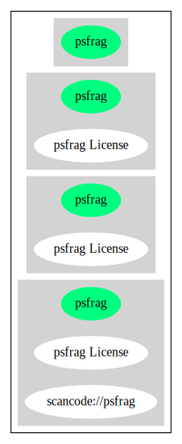

psfrag License (psfrag)
=======================

[TABLE]

**Other Names:**

-   `scancode://psfrag`

Comments on (easy) usability
----------------------------

-   “Per Fedora, this license is considered Free, but GPL-incompatible
    only when used for TeX files. In all other use cases, this may not
    be true. ” (source:
    [Scancode](https://github.com/nexB/scancode-toolkit/blob/develop/src/licensedcode/data/licenses/psfrag.yml "Scancode"))

URLs
----

-   **Homepage:** https://fedoraproject.org/wiki/Licensing/psfrag

-   **SPDX:** http://spdx.org/licenses/psfrag.json

Text
----

    This system is distributed in the hope that it will be useful, but WITHOUT ANY
    WARRANTY; without even the implied warranty of MERCHANTABILITY or FITNESS FOR
    A PARTICULAR PURPOSE. Don't come complaining to us if you modify this file and
    it doesn't work! If this file is modified by anyone but the authors, those
    changes and their authors must be explicitly stated HERE.

------------------------------------------------------------------------

Raw Data
--------

    {
        "__impliedNames": [
            "psfrag",
            "psfrag License",
            "scancode://psfrag"
        ],
        "__impliedId": "psfrag",
        "facts": {
            "SPDX": {
                "isSPDXLicenseDeprecated": false,
                "spdxFullName": "psfrag License",
                "spdxDetailsURL": "http://spdx.org/licenses/psfrag.json",
                "_sourceURL": "https://spdx.org/licenses/psfrag.html",
                "spdxLicIsOSIApproved": false,
                "spdxSeeAlso": [
                    "https://fedoraproject.org/wiki/Licensing/psfrag"
                ],
                "_implications": {
                    "__impliedNames": [
                        "psfrag",
                        "psfrag License"
                    ],
                    "__impliedId": "psfrag",
                    "__isOsiApproved": false,
                    "__impliedURLs": [
                        [
                            "SPDX",
                            "http://spdx.org/licenses/psfrag.json"
                        ],
                        [
                            null,
                            "https://fedoraproject.org/wiki/Licensing/psfrag"
                        ]
                    ]
                },
                "spdxLicenseId": "psfrag"
            },
            "Scancode": {
                "otherUrls": null,
                "homepageUrl": "https://fedoraproject.org/wiki/Licensing/psfrag",
                "shortName": "psfrag License",
                "textUrls": null,
                "text": "This system is distributed in the hope that it will be useful, but WITHOUT ANY\nWARRANTY; without even the implied warranty of MERCHANTABILITY or FITNESS FOR\nA PARTICULAR PURPOSE. Don't come complaining to us if you modify this file and\nit doesn't work! If this file is modified by anyone but the authors, those\nchanges and their authors must be explicitly stated HERE.",
                "category": "Permissive",
                "osiUrl": null,
                "owner": "Craig Barratt",
                "_sourceURL": "https://github.com/nexB/scancode-toolkit/blob/develop/src/licensedcode/data/licenses/psfrag.yml",
                "key": "psfrag",
                "name": "psfrag License",
                "spdxId": "psfrag",
                "notes": "Per Fedora, this license is considered Free, but GPL-incompatible only when\nused for TeX files. In all other use cases, this may not be true.\n",
                "_implications": {
                    "__impliedNames": [
                        "scancode://psfrag",
                        "psfrag License",
                        "psfrag"
                    ],
                    "__impliedId": "psfrag",
                    "__impliedJudgement": [
                        [
                            "Scancode",
                            {
                                "tag": "NeutralJudgement",
                                "contents": "Per Fedora, this license is considered Free, but GPL-incompatible only when\nused for TeX files. In all other use cases, this may not be true.\n"
                            }
                        ]
                    ],
                    "__impliedCopyleft": [
                        [
                            "Scancode",
                            "NoCopyleft"
                        ]
                    ],
                    "__calculatedCopyleft": "NoCopyleft",
                    "__impliedText": "This system is distributed in the hope that it will be useful, but WITHOUT ANY\nWARRANTY; without even the implied warranty of MERCHANTABILITY or FITNESS FOR\nA PARTICULAR PURPOSE. Don't come complaining to us if you modify this file and\nit doesn't work! If this file is modified by anyone but the authors, those\nchanges and their authors must be explicitly stated HERE.",
                    "__impliedURLs": [
                        [
                            "Homepage",
                            "https://fedoraproject.org/wiki/Licensing/psfrag"
                        ]
                    ]
                }
            }
        },
        "__impliedJudgement": [
            [
                "Scancode",
                {
                    "tag": "NeutralJudgement",
                    "contents": "Per Fedora, this license is considered Free, but GPL-incompatible only when\nused for TeX files. In all other use cases, this may not be true.\n"
                }
            ]
        ],
        "__impliedCopyleft": [
            [
                "Scancode",
                "NoCopyleft"
            ]
        ],
        "__calculatedCopyleft": "NoCopyleft",
        "__isOsiApproved": false,
        "__impliedText": "This system is distributed in the hope that it will be useful, but WITHOUT ANY\nWARRANTY; without even the implied warranty of MERCHANTABILITY or FITNESS FOR\nA PARTICULAR PURPOSE. Don't come complaining to us if you modify this file and\nit doesn't work! If this file is modified by anyone but the authors, those\nchanges and their authors must be explicitly stated HERE.",
        "__impliedURLs": [
            [
                "SPDX",
                "http://spdx.org/licenses/psfrag.json"
            ],
            [
                null,
                "https://fedoraproject.org/wiki/Licensing/psfrag"
            ],
            [
                "Homepage",
                "https://fedoraproject.org/wiki/Licensing/psfrag"
            ]
        ]
    }

------------------------------------------------------------------------

Dot Cluster Graph
-----------------

